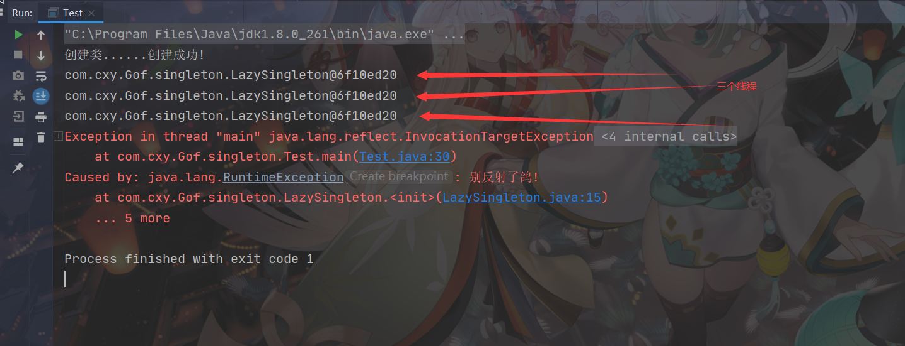

[toc]

# 单例模式

> 定义的类只有一个实例,不可以通过new关键字来获取对象,只可以通过公共的某个方法获取对象

## 应用举例

- 操作系统的文件系统
- 线程池
- 数据库连接池
- web应用的配置对象
- 缓存
- spring

在spring中 , 大部分的bean都需要将尝使用,重复的创建会造成内存的浪费 , 也消耗性能 , 所以spring的bean可以使用单例去减少GC

## 单例模式的特点

- 单例类只有一个实例对象；

- 该单例对象必须由单例类自行创建；

- 单例类对外提供一个访问该单例的全局访问点。

## 单例模式的优点和缺点

单例模式的优点：

- 单例模式可以保证内存里只有一个实例，减少了内存的开销。
- 可以避免对资源的多重占用。
- 单例模式设置全局访问点，可以优化和共享资源的访问。


单例模式的缺点：

- 单例模式一般没有接口，扩展困难。如果要扩展，则除了修改原来的代码，没有第二种途径，违背开闭原则。
- 在并发测试中，单例模式不利于代码调试。在调试过程中，如果单例中的代码没有执行完，也不能模拟生成一个新的对象。
- 单例模式的功能代码通常写在一个类中，如果功能设计不合理，则很容易违背单一职责原则。

## java实现单例模式

### 懒汉式单例

> 类加载时生成单例 , 不调用不生成

配合双重检测的锁 , 更好的防止反射 , 或者多并发的对单例影响

```java
package com.cxy.Gof.singleton;
/**
 * @ClassName LazySingleton
 * @Author 陈新予(blank)
 * @Date 2021/6/1
 * @Version 1.0
 */
public class LazySingleton {
    private static volatile LazySingleton instance;
    private static volatile boolean lock = true;
    private LazySingleton(){
        synchronized (LazySingleton.class){
            if(!lock){
                throw new RuntimeException("别反射了鸽!");
            }
            if(instance!=null){
                throw new RuntimeException("别反射了鸽!");
            }else{
                System.out.println("创建类......创建成功!");
            }
        }
    }
    public synchronized static LazySingleton getInstance(){
        if(instance==null){
            instance = new LazySingleton();
            lock = false;
        }
        return instance;
    }
}
```

### 饿汉式单例

调用前 , 单例就已经存在了

```java
package com.cxy.Gof.singleton;
/**
 * @ClassName HungrySingleton
 * @Author 陈新予(blank)
 * @Date 2021/6/1
 * @Version 1.0
 */
public class HungrySingleton {
    private static volatile HungrySingleton instance = new HungrySingleton();
    private HungrySingleton(){
        System.out.println("创建类......创建成功!");
    }
    public synchronized static HungrySingleton getInstance(){
        return instance;
    }
}
```

### 测试



# 原型模式

通过原来的对象 , 快速的生成一个新的对象 , 复制期间 , 类的实现细节不会暴露

## 原型模式的优缺点

原型模式的优点：

- Java自带的原型模式基于内存二进制流的复制，在性能上比直接 new 一个对象更加优良。
- 可以使用深克隆方式保存对象的状态，使用原型模式将对象复制一份，并将其状态保存起来，简化了创建对象的过程，以便在需要的时候使用（例如恢复到历史某一状态），可辅助实现撤销操作。

原型模式的缺点：

- 需要为每一个类都配置一个 clone 方法
- clone 方法位于类的内部，当对已有类进行改造的时候，需要修改代码，违背了开闭原则。
- 当实现深克隆时，需要编写较为复杂的代码，而且当对象之间存在多重嵌套引用时，为了实现深克隆，每一层对象对应的类都必须支持深克隆，实现起来会比较麻烦。因此，深克隆、浅克隆需要运用得当。

## java实现原型模式

```java
package com.cxy.Gof.prototype;
/**
 * @ClassName Student
 * @Author 陈新予(blank)
 * @Date 2021/6/1
 * @Version 1.0
 */
public class Student implements Cloneable{
    public String name;
    public Student(){
        System.out.println("创建中......创建成功!");
    }
    public Student setName(String name){
        this.name = name;
        return this;
    }
    public Student clone() throws CloneNotSupportedException {
        return (Student)super.clone();
    }
}
```

### 测试


> 两个对象不相同 , 但无参构造只调用了一次

# 工厂模式

> 把对象的创建交给工厂 , 抽象出工厂接口 , 多用于生成复杂对象

## 简单工厂模式优缺点

优点：

- 工厂类包含必要的逻辑判断，可以决定在什么时候创建哪一个产品的实例。客户端可以免除直接创建产品对象的职责，很方便的创建出相应的产品。工厂和产品的职责区分明确。

- 客户端无需知道所创建具体产品的类名，只需知道参数即可。

- 也可以引入配置文件，在不修改客户端代码的情况下更换和添加新的具体产品类。

缺点：

- 简单工厂模式的工厂类单一，负责所有产品的创建，职责过重，一旦异常，整个系统将受影响。且工厂类代码会非常臃肿，违背高聚合原则。

- 使用简单工厂模式会增加系统中类的个数（引入新的工厂类），增加系统的复杂度和理解难度

- 系统扩展困难，一旦增加新产品不得不修改工厂逻辑，在产品类型较多时，可能造成逻辑过于复杂

- 简单工厂模式使用了 static 工厂方法，造成工厂角色无法形成基于继承的等级结构。

## 工厂方法模式

优点：

- 用户只需要知道具体工厂的名称就可得到所要的产品，无须知道产品的具体创建过程。
- 灵活性增强，对于新产品的创建，只需多写一个相应的工厂类。
- 典型的解耦框架。高层模块只需要知道产品的抽象类，无须关心其他实现类，满足迪米特法则、依赖倒置原则和里氏替换原则。

缺点：

- 类的个数容易过多，增加复杂度
- 增加了系统的抽象性和理解难度
- 抽象产品只能生产一种产品，此弊端可使用抽象工厂模式解决。

## 抽象方法模式

优点:

- 可以在类的内部对产品族中相关联的多等级产品共同管理，而不必专门引入多个新的类来进行管理。
- 当需要产品族时，抽象工厂可以保证客户端始终只使用同一个产品的产品组。
- 抽象工厂增强了程序的可扩展性，当增加一个新的产品族时，不需要修改原代码，满足开闭原则。


缺点：

- 当产品族中需要增加一个新的产品时，所有的工厂类都需要进行修改。增加了系统的抽象性和理解难度。

## java实现工厂模式

### 简单工厂模式

```java
/*****************************工厂接口*****************************/
public interface Product {
    void show();
}
/*****************************产品1*****************************/
public class ProductImpl1 implements Product{
    @Override
    public void show() {
        System.out.println("产品一号......");
    }
}
/*****************************产品2*****************************/
public class ProductImpl2 implements Product{
    @Override
    public void show() {
        System.out.println("产品二号......");
    }
}
/*****************************测试类*****************************/
public class Test {
    public static void main(String[] args) {
        Scanner sc = new Scanner(System.in);
        boolean li = true;
        while (li){
            System.out.println("请输入你要建立的对象:1 2 3");
            int case1 = sc.nextInt();
            switch (case1){
                case 1:
                    System.out.println(new ProductImpl1());
                    break;
                case 2:
                    System.out.println(new ProductImpl1());
                    break;
                case 3:
                    System.out.println("退出了哦~");
                    li = false;
                    break;
            }
        }
    }
}
```


### 工厂方法模式

```java
/*****************************工厂接口*****************************/
public interface Prodect {
    void show();
}
/*****************************新增工厂接口*****************************/
public interface AbstructFactory {
    Prodect newProdect();
}
/*****************************产品1*****************************/
public class Con1 implements Prodect{
    @Override
    public void show() {
        System.out.println("产品1........");
    }
}
/*****************************产品2*****************************/
public class Con2 implements Prodect {
    @Override
    public void show() {
        System.out.println("产品2........");
    }
}
/*****************************工厂1*****************************/
public class ConFactory1 implements AbstructFactory{
    @Override
    public Prodect newProdect() {
        System.out.println("这里是工厂1-->生成产品1:");
        return new Con1();
    }
}
/*****************************工厂2*****************************/
public class ConFactory2 implements AbstructFactory{
    @Override
    public Prodect newProdect() {
        System.out.println("这里是工厂2-->生成产品2:");
        return new Con2();
    }
}
/*****************************测试类*****************************/
public class Test {
    public static void main(String[] args) {
        ConFactory1 factory1 = new ConFactory1();
        ConFactory2 factory2 = new ConFactory2();
        factory1.newProdect().show();
        factory2.newProdect().show();
    }
}
```


### 抽象工厂模式

```java

```

# 建造者模式

> 将一个复杂对象的构造和他的表示分离 , 使得同样的构建过程可以创建不同的表示形式 , 被称为建造者模式

## 优缺点

优点:

- 封装性好 , 构建和表示分离
- 拓展性好 , 有利于系统的解耦
- 客户端不必知道细节 , 由建造者不断地细化

缺点:

- 产品的组成部分必须要相同
- 产品一旦修改 , 则建造者也需要修改

## java实现建造者模式

```java
/*****************************产品类*****************************/
public class Prodect {
    private String name;
    private int age;
    private String sex;
    public void setName(String name) {
        this.name = name;
    }
    public void setAge(int age) {
        this.age = age;
    }
    public void setSex(String sex) {
        this.sex = sex;
    }
    public void show(){
        System.out.println("我是:"+name+",今年"+age+"岁了,是个"+sex+"人");
    }
}
/*****************************建造者抽象类*****************************/
public abstract class Builder {
    protected Prodect prodect = new Prodect();
    public abstract void buildName(String name);
    public abstract void buildAge(int age);
    public abstract void buildSex(String sex);
    public Prodect getProdect(){
        return prodect;
    }
}
/*****************************建造者实现类*****************************/
public class BuilderImpl extends Builder {
    @Override
    public void buildName(String name) {
        prodect.setName(name);
    }
    @Override
    public void buildAge(int age) {
        prodect.setAge(age);
    }
    @Override
    public void buildSex(String sex) {
        prodect.setSex(sex);
    }
}
/*****************************实施者*****************************/
public class Director {
    private Builder builder;
    public Director(Builder builder){
        this.builder = builder;
    }
    public Prodect build(String name,int age,String sex){
        builder.buildName(name);
        builder.buildAge(age);
        builder.buildSex(sex);
        return builder.getProdect();
    }
}
/*****************************客户*****************************/
public class Client {
    public static void main(String[] args) {
        Director director = new Director(new BuilderImpl());
        Prodect prodect = director.build("李华", 18, "男");
        prodect.show();
    }
}
```


## 应用

链式编程

set方法返回this


