[toc]

# Hadoop

## Hadoop简介

-   适合
    -   大规模数据
    -   流式数据（少写入，多读取）
    -   商用硬件
-   不适合
    -   低延迟的数据访问
    -   大量的小文件
    -   频繁修改文件

### Hadoop架构

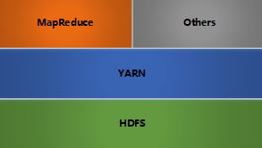

-   HDFS：分布式文件存储
-   YARN：分布式资源管理
-   MapReduce：分布式计算
-   Others：利用YARN的资源管理功能实现其他的数据处理方式

>   **注**：*内部的所有节点都是采用Master-Woker架构*

## Hadoop HDFS

### HDFS基本概念

>   **注**：*Hadoop Distributed File System*, 分布式文件系统

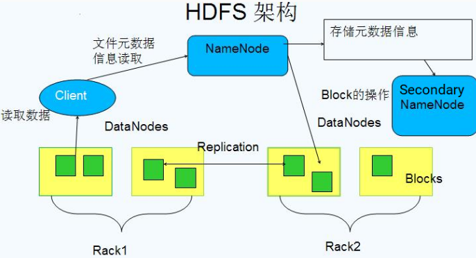

-   **Block**
    -   基本的存储单位，大小为64M（HDFS2.x版本以后，默认128M）
        -   减少搜寻时间
        -   减少管理块的数据开销
        -   对数据库读写，减少建立网络连接的成本
    -   将大文件拆分为一个个的小块，存储在不同的机器。如果一个文件少于Block大小，那么实际占用空间为其文件的大小
    -   基本的读写单位，类似于磁盘的页，每次读写都是一个块
    -   每个块都会被复制到多台机器（默认3份）
-   **NameNode**
    -   存储文件的元数据（metadata），运行时所有数据都保存到内存，可存储文件数量和NameNode内存大小有关
    -   每个Block在NameNode中对应一条记录
    -   数据会定时保存到磁盘中，Block位置信息不会保存，而是由DateNode注册时上报和运行时维护
    -   NameNode失效则整个HDFS都失效了，所以要保证NameNode的可用性
-   **Secondary NameNode**
    -   定时与NameNode进行同步，NameNode如果失效，需要手动将其设置为主机
-   **DataNode**
    -   保存具体的Block数据
    -   负责数据的读写操作和复制操作
    -   DataNode启动时会向NameNode报告当前存储的数据块信息，后续定时报告修改信息
    -   DataNode之间会进行通信，复制数据块，保证数据的冗余性

### Hadoop 写文件

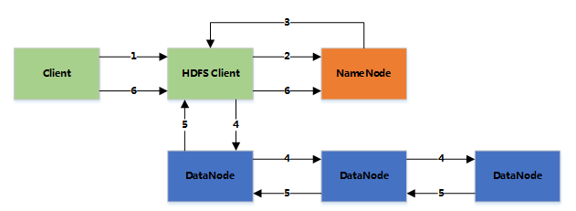

1.客户端将文件写入本地磁盘的 HDFS Client 文件中

2.当临时文件大小达到一个 block 大小时，HDFS client 通知 NameNode，申请写入文件

3.NameNode 在 HDFS 的文件系统中创建一个文件，并把该 block id 和要写入的 DataNode 的列表返回给客户端

4.客户端收到这些信息后，将临时文件写入 DataNodes

-   4.1 客户端将文件内容写入第一个 DataNode（一般以 4kb 为单位进行传输）
-   4.2 第一个 DataNode 接收后，将数据写入本地磁盘，同时也传输给第二个 DataNode
-   4.3 依此类推到最后一个 DataNode，数据在 DataNode 之间是通过 pipeline 的方式进行复制的
-   4.4 后面的 DataNode 接收完数据后，都会发送一个确认给前一个 DataNode，最终第一个 DataNode 返回确认给客户端
-   4.5 当客户端接收到整个 block 的确认后，会向 NameNode 发送一个最终的确认信息
-   4.6 如果写入某个 DataNode 失败，数据会继续写入其他的 DataNode。然后 NameNode 会找另外一个好的 DataNode 继续复制，以保证冗余性
-   4.7 每个 block 都会有一个校验码，并存放到独立的文件中，以便读的时候来验证其完整性

5.文件写完后（客户端关闭），NameNode 提交文件（这时文件才可见，如果提交前，NameNode 垮掉，那文件也就丢失了。fsync：只保证数据的信息写到 NameNode 上，但并不保证数据已经被写到DataNode 中）

**Rack aware（机架感知）**

通过配置文件指定的机架名和DNS对应关系

假设复制参数是3，在写文件时，会在本地机架保存一份数据，然后在另外一个机架内保存两份数据（同机架的传输速度快，从而提高性能）

整个HDFS集群，最好是负载均衡的。

### Hadoop 读文件

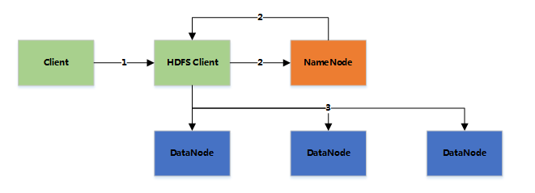

1.  客户端向NameNode发送读取请求
2.  NameNode返回文件的所有block和这些block所在的DataNodes（包括复制节点）
3.  客户端直接从DataNode中读取数据，如果该DataNode读取失败（DataNode失效或校验码不对），则从复制节点中读取（如果读取的数据就在本机，则直接读取，否则通过网络读取）

### Hadoop可靠性

#### HDFS 可靠性

-   冗余副本策略

>   可以在 hdfs-site.xml 中设置复制因子指定副本数量。所有的数据块都可副本。DataNode启动时，遍历本地文件系统，产生一份HDFS数据块和本地文件的对应关系列表（blockreport）汇报给NameNode

-   机架策略

>   HDFS的“机架感知”，通过节点之间发送一个数据包，来感应他们是否在同一个机架。
>   一般在本机架放一个副本，在其他机架在存放一个副本，这样可以防止机架失效造成数据丢失，可以提高贷款利用率。

-   心跳机制

>   NameNode周期性从DataNode接受心跳信息和块报告
>   NameNode根据块报告验证元数据
>   如果没有按时发送的DateNode会被标记为宕机，不会再给他任何I/O请求机会
>   如果DataNode失效造成副本数量下降，并且低于优先设置的值，NameNode会检测出这些数据库，并且在合适的时机重新复制
>   引发重新复制的原因还包括数据副本本身损坏，磁盘错误，复制因子被增大等。

-   安全模式

>   NameNode启动时会先经历一个“安全模式”阶段
>   安全模式阶段不会产生数据写
>   在此阶段的NameNode收集DataNode的报告，当数据块达到最小副本数以上时，会被认为是“安全”
>   在一定比例的数据库被确定为“安全”后，在若干时间以后，安全模式结束
>   当检测到副本数据不足的数据块时，该块会被复制，知道达到最小副本数

-   校验和

>   在文件创立时，每个数据块都产生校验和
>   校验和会作为一个隐藏文件保存在命名空间之下
>   客户端湖区数据时可以检查校验和是否相同，从而发现数据块是否损坏
>   如果正在读取的数据库损坏，则可以继续读取其他副本

-   回收站

>   删除文件时，其实是先放入 /trash（回收站）
>
>   回收站里的文件都是可以快速恢复的
>
>   可以设置一个是兼职，当回收站里的文件超过了这个值，就被彻底删除，并且释放占用的数据块

-   元数据保护

>   映像文件和事务日志时 NameNode 的核心数据 ， 合约配置为拥有多个副本
>
>   副本会降低 NameNode 的处理速度，但增加安全性
>
>   NameNode 依然是单点，如果发生故障，需要手工切换

-   快照机制

>   定时快照

### Hadoop 命令工具

#### HDFS - 命令工具

fsck: 检查文件的完整性

start-balancer.sh: 重新平衡HDFS

hdfs dfs -copyFromLocal 从本地磁盘复制文件到HDFS

## Hadoop YARN

### 旧的MapReduce架构

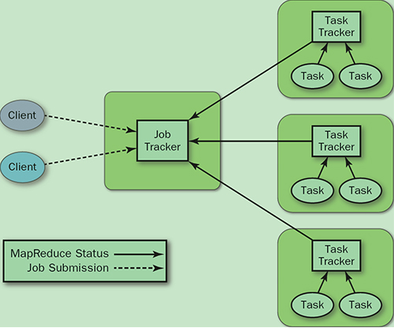

-   JobTracker：负责资源管理，跟踪资源消耗和可用性，作业生命周期管理（调度作业任务，跟踪进度，为任务提供容错）
-   TaskTracker：加载或者关闭任务，定时报告任务状态

>   架构出现的问题：
>
>   1.  JobTracker 是 MapReduce 的集中处理点，存在单点故障
>   2.  JobTracker 完成了太多的任务，造成了过多的资源消耗，当 MapReduce job 非常多的时候，会造成很大的内存开销。这也是业界普遍总结出老 Hadoop 的 MapReduce 只能支持 4000 节点主机的上限
>   3.  在 TaskTracker 端，以 map/reduce task 的数目作为资源的表示过于简单，没有考虑到 cpu/ 内存的占用情况，如果两个大内存消耗的 task 被调度到了一块，很容易出现 OOM
>   4.  在 TaskTracker 端，把资源强制划分为 map task slot 和 reduce task slot , 如果当系统中只有 map task 或者只有 reduce task 的时候，会造成资源的浪费，也就集群资源利用的问题

### YARN架构

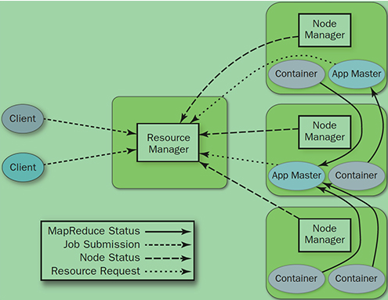

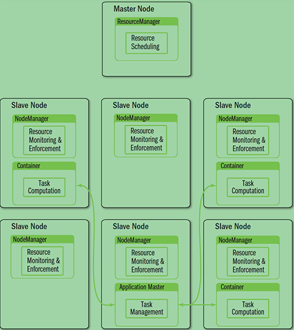

>   YARN就是将 JobTracker 的职责进行拆分，将资源管理和任务调度监控查分成独立的进程：一个全局的资源管理和每一个作业的管理 ResourceManager 和 NodeManager 提供了计算资源的分配和管理，而 ApplicationMaster 则完成应用程序的运行

-   **ResourceManager:** 全局资源管理和任务调度
-   **NodeManager:** 单个节点的资源管理和监控
-   **ApplicationMaster:** 单个作业的资源管理和任务监控
-   **Container:** 资源申请的单位和任务运行的容器

#### 架构对比

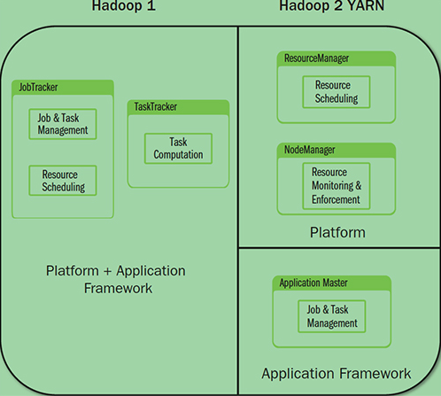

YARN架构下形成了一个通用的资源管理平台和一个通用的应用计算平台，避免了旧架构的单点问题和资源利用率问题，同时也让在其上运行的应用不再局限于 MapReduce 形式

### YARN基本流程

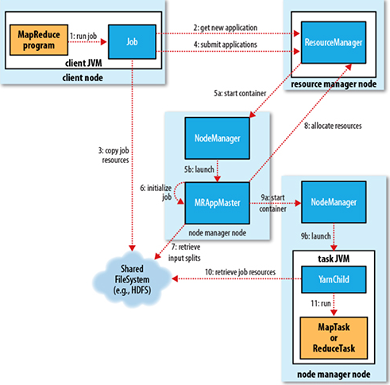

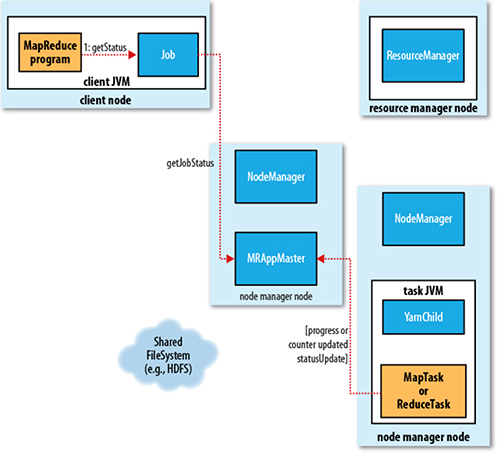

**1. Job submission**

从ResourceManager 中获取一个Application ID 检查作业输出配置，计算输入分片 拷贝作业资源（job jar、配置文件、分片信息）到 HDFS，以便后面任务的执行

**2. Job initialization**

ResourceManager 将作业递交给 Scheduler（有很多调度算法，一般是根据优先级）Scheduler 为作业分配一个 Container，ResourceManager 就加载一个 application master process 并交给 NodeManager。

管理 ApplicationMaster 主要是创建一系列的监控进程来跟踪作业的进度，同时获取输入分片，为每一个分片创建一个 Map task 和相应的 reduce task Application Master 还决定如何运行作业，如果作业很小（可配置），则直接在同一个 JVM 下运行

**3. Task assignment**

ApplicationMaster 向 Resource Manager 申请资源（一个个的Container，指定任务分配的资源要求）一般是根据 data locality 来分配资源

**4. Task execution**

ApplicationMaster 根据 ResourceManager 的分配情况，在对应的 NodeManager 中启动 Container 从 HDFS 中读取任务所需资源（job jar，配置文件等），然后执行该任务

**5. Progress and status update**

定时将任务的进度和状态报告给 ApplicationMaster Client 定时向 ApplicationMaster 获取整个任务的进度和状态

**6. Job completion**

Client定时检查整个作业是否完成 作业完成后，会清空临时文件、目录等

### Hadoop ResourceManager

>   负责全局的资源管理和任务调度，把整个集群当成计算资源池，只关注分配，不管应用，且不负责容错

#### 资源管理

1.  以前资源是每个节点分成一个个的Map slot和Reduce slot，现在是一个个Container，每个Container可以根据需要运行ApplicationMaster、Map、Reduce或者任意的程序
2.  以前的资源分配是静态的，目前是动态的，资源利用率更高
3.  Container是资源申请的单位，一个资源申请格式：<resource-name, priority, resource-requirement, number-of-containers>, resource-name：主机名、机架名或*（代表任意机器）, resource-requirement：目前只支持CPU和内存
4.  用户提交作业到ResourceManager，然后在某个NodeManager上分配一个Container来运行ApplicationMaster，ApplicationMaster再根据自身程序需要向ResourceManager申请资源
5.  YARN有一套Container的生命周期管理机制，而ApplicationMaster和其Container之间的管理是应用程序自己定义的

#### 任务调度

1.  只关注资源的使用情况，根据需求合理分配资源
2.  Scheluer可以根据申请的需要，在特定的机器上申请特定的资源（ApplicationMaster负责申请资源时的数据本地化的考虑，ResourceManager将尽量满足其申请需求，在指定的机器上分配Container，从而减少数据移动）

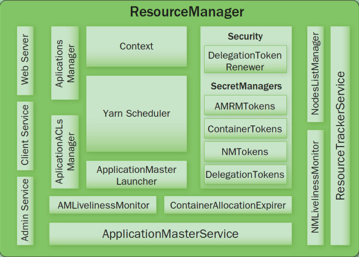

-   Client Service: 应用提交、终止、输出信息（应用、队列、集群等的状态信息）
-   Adaminstration Service: 队列、节点、Client权限管理
-   ApplicationMasterService: 注册、终止ApplicationMaster, 获取ApplicationMaster的资源申请或取消的请求，并将其异步地传给Scheduler, 单线程处理
-   ApplicationMaster Liveliness Monitor: 接收ApplicationMaster的心跳消息，如果某个ApplicationMaster在一定时间内没有发送心跳，则被任务失效，其资源将会被回收，然后ResourceManager会重新分配一个ApplicationMaster运行该应用（默认尝试2次）
-   Resource Tracker Service: 注册节点, 接收各注册节点的心跳消息
-   NodeManagers Liveliness Monitor: 监控每个节点的心跳消息，如果长时间没有收到心跳消息，则认为该节点无效, 同时所有在该节点上的Container都标记成无效，也不会调度任务到该节点运行
-   ApplicationManager: 管理应用程序，记录和管理已完成的应用
-   ApplicationMaster Launcher: 一个应用提交后，负责与NodeManager交互，分配Container并加载ApplicationMaster，也负责终止或销毁
-   YarnScheduler: 资源调度分配， 有FIFO(with Priority)，Fair，Capacity方式
-   ContainerAllocationExpirer: 管理已分配但没有启用的Container，超过一定时间则将其回收

### Hadoop NodeManager

Node节点下的Container管理

1.  启动时向ResourceManager注册并定时发送心跳消息，等待ResourceManager的指令
2.  监控Container的运行，维护Container的生命周期，监控Container的资源使用情况
3.  启动或停止Container，管理任务运行时的依赖包（根据ApplicationMaster的需要，启动Container之前将需要的程序及其依赖包、配置文件等拷贝到本地）

#### 内部结构

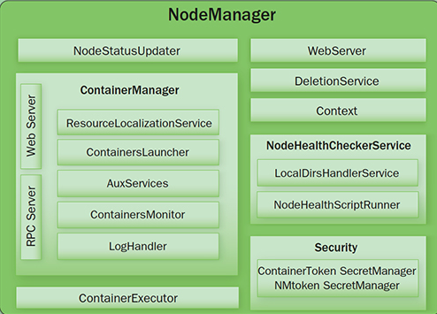

-   NodeStatusUpdater: 启动向ResourceManager注册，报告该节点的可用资源情况，通信的端口和后续状态的维护

-   ContainerManager: 接收RPC请求（启动、停止），资源本地化（下载应用需要的资源到本地，根据需要共享这些资源）

    PUBLIC: /filecache

    PRIVATE: /usercache//filecache

    APPLICATION: /usercache//appcache//（在程序完成后会被删除）

-   ContainersLauncher: 加载或终止Container

-   ContainerMonitor: 监控Container的运行和资源使用情况

-   ContainerExecutor: 和底层操作系统交互，加载要运行的程序

### Hadoop ApplicationMaster

单个作业的资源管理和任务监控

具体功能描述：

1.  计算应用的资源需求，资源可以是静态或动态计算的，静态的一般是Client申请时就指定了，动态则需要ApplicationMaster根据应用的运行状态来决定
2.  根据数据来申请对应位置的资源（Data Locality）
3.  向ResourceManager申请资源，与NodeManager交互进行程序的运行和监控，监控申请的资源的使用情况，监控作业进度
4.  跟踪任务状态和进度，定时向ResourceManager发送心跳消息，报告资源的使用情况和应用的进度信息
5.  负责本作业内的任务的容错

ApplicationMaster可以是用任何语言编写的程序，它和ResourceManager和NodeManager之间是通过ProtocolBuf交互，以前是一个全局的JobTracker负责的，现在每个作业都一个，可伸缩性更强，至少不会因为作业太多，造成JobTracker瓶颈。同时将作业的逻辑放到一个独立的ApplicationMaster中，使得灵活性更加高，每个作业都可以有自己的处理方式，不用绑定到MapReduce的处理模式上

**如何计算资源需求**

一般的MapReduce是根据block数量来定Map和Reduce的计算数量，然后一般的Map或Reduce就占用一个Container

**如何发现数据的本地化**

数据本地化是通过HDFS的block分片信息获取的

### Hadoop Container

1.  基本的资源单位（CPU、内存等）
2.  Container可以加载任意程序，而且不限于Java
3.  一个Node可以包含多个Container，也可以是一个大的Container
4.  ApplicationMaster可以根据需要，动态申请和释放Container

### Hadoop Failover

#### 失败类型

1.  程序问题
2.  进程崩溃
3.  硬件问题

#### 失败处理

#### 任务失败

1.  运行时异常或者JVM退出都会报告给ApplicationMaster
2.  通过心跳来检查挂住的任务(timeout)，会检查多次（可配置）才判断该任务是否失效
3.  一个作业的任务失败率超过配置，则认为该作业失败
4.  失败的任务或作业都会有ApplicationMaster重新运行

#### ApplicationMaster失败

1.  ApplicationMaster定时发送心跳信号到ResourceManager，通常一旦ApplicationMaster失败，则认为失败，但也可以通过配置多次后才失败
2.  一旦ApplicationMaster失败，ResourceManager会启动一个新的ApplicationMaster
3.  新的ApplicationMaster负责恢复之前错误的ApplicationMaster的状态(yarn.app.mapreduce.am.job.recovery.enable=true)，这一步是通过将应用运行状态保存到共享的存储上来实现的，ResourceManager不会负责任务状态的保存和恢复
4.  Client也会定时向ApplicationMaster查询进度和状态，一旦发现其失败，则向ResouceManager询问新的ApplicationMaster

#### NodeManager失败

1.  NodeManager定时发送心跳到ResourceManager，如果超过一段时间没有收到心跳消息，ResourceManager就会将其移除
2.  任何运行在该NodeManager上的任务和ApplicationMaster都会在其他NodeManager上进行恢复
3.  如果某个NodeManager失败的次数太多，ApplicationMaster会将其加入黑名单（ResourceManager没有），任务调度时不在其上运行任务

#### ResourceManager失败

1.  通过checkpoint机制，定时将其状态保存到磁盘，然后失败的时候，重新运行
2.  通过zookeeper同步状态和实现透明的HA

可以看出，**一般的错误处理都是由当前模块的父模块进行监控（心跳）和恢复。而最顶端的模块则通过定时保存、同步状态和zookeeper来ֹ实现HA**

## Hadoop MapReduce

### 简介

一种分布式的计算方式指定一个Map（映#x5C04;）函数，用来把一组键值对映射成一组新的键值对，指定并发的Reduce（归约）函数，用来保证所有映射的键值对中的每一个共享相同的键组

### Pattern

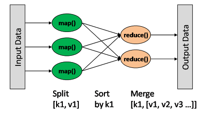

map: (K1, V1) → list(K2, V2) combine: (K2, list(V2)) → list(K2, V2) reduce: (K2, list(V2)) → list(K3, V3)

Map输出格式和Reduce输入格式一定是相同的

### 基本流程

MapReduce主要是先读取文件数据，然后进行Map处理，接着Reduce处理，最后把处理结果写到文件中

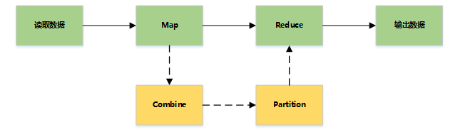

### 详细流程

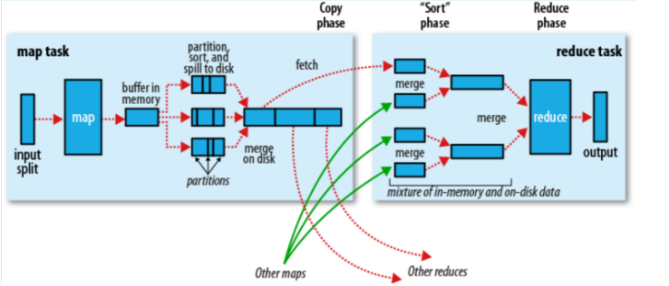

### Map Side

#### Record reader

记录阅读器会翻译由输入格式生成的记录，记录阅读器用于将数据解析给记录，并不分析记录自身。记录读取器的目的是将数据解析成记录，但不分析记录本身。它将数据以键值对的形式传输给mapper。通常键是位置信息，值是构成记录的数据存储块.自定义记录不在本文讨论范围之内.

#### Map

在映射器中用户提供的代码称为中间对。对于键值的具体定义是慎重的，因为定义对于分布式任务的完成具有重要意义.键决定了数据分类的依据，而值决定了处理器中的分析信息.本书的设计模式将会展示大量细节来解释特定键值如何选择.

#### Shuffle and Sort

ruduce任务以随机和排序步骤开始。此步骤写入输出文件并下载到本地计算机。这些数据采用键进行排序以把等价密钥组合到一起。

#### Reduce

reduce采用分组数据作为输入。该功能传递键和此键相关值的迭代器。可以采用多种方式来汇总、过滤或者合并数据。当reduce功能完成，就会发送0个或多个键值对。

#### 输出格式

输出格式会转换最终的键值对并写入文件。默认情况下键和值以tab分割，各记录以换行符分割。因此可以自定义更多输出格式，最终数据会写入HDFS。类似记录读取，自定义输出格式不在本书范围。

## 安装

...

### 启动进入Hadoop

```shell
# 进入容器
docker exec -it hadoop_single bash
# 查看版本号
[root@2e698f540853 hadoop]# hadoop version
Hadoop 3.3.2
Source code repository git@github.com:apache/hadoop.git -r 0bcb014209e219273cb6fd4152df7df713cbac61
Compiled by chao on 2022-02-21T18:39Z
Compiled with protoc 3.7.1
From source with checksum 4b40fff8bb27201ba07b6fa5651217fb
This command was run using /usr/local/hadoop/share/hadoop/common/hadoop-common-3.3.2.jar

```

### 启动进入HDFS

```bash
# 进入容器
[hadoop@4b881d297d15 hadoop]$ docker exec -it hdfs_single su hadoop
# 启动hdfs
[hadoop@4b881d297d15 hadoop]$ start-dfs.sh
# jps命令查看java进程
[hadoop@4b881d297d15 hadoop]$ jps
946 NameNode
340 DataNode
1326 Jps
527 SecondaryNameNode
```

## HDFS使用

#### HDFS shell

```shell
# 显示根目录 / 下的文件和子目录
[root@2e698f540853 /]# hadoop fs -ls /
Found 20 items
-rwxr-xr-x   1 root root          0 2022-04-21 03:06 /.dockerenv
dr-xr-xr-x   - root root       4096 2022-04-21 03:36 /bin
drwxr-xr-x   - root root       2800 2022-05-07 05:45 /dev
drwxr-xr-x   - root root       4096 2022-04-21 03:41 /etc
drwxr-xr-x   - root root       4096 2022-04-21 03:36 /home
dr-xr-xr-x   - root root       4096 2022-04-20 11:37 /lib
dr-xr-xr-x   - root root       4096 2022-04-21 03:36 /lib64
drwx------   - root root       4096 2021-09-15 14:25 /lost+found
drwxr-xr-x   - root root       4096 2020-11-03 15:23 /media
drwxr-xr-x   - root root       4096 2020-11-03 15:23 /mnt
drwxr-xr-x   - root root       4096 2020-11-03 15:23 /opt
dr-xr-xr-x   - root root          0 2022-05-07 05:45 /proc
dr-xr-x---   - root root       4096 2022-04-21 03:10 /root
drwxr-xr-x   - root root        360 2022-05-07 05:45 /run
dr-xr-xr-x   - root root       4096 2022-04-21 03:36 /sbin
drwxr-xr-x   - root root       4096 2020-11-03 15:23 /srv
dr-xr-xr-x   - root root          0 2022-05-07 05:45 /sys
drwxrwxrwt   - root root       4096 2022-04-21 03:36 /tmp
drwxr-xr-x   - root root       4096 2021-09-15 14:25 /usr
drwxr-xr-x   - root root       4096 2022-04-20 11:29 /var
```

```shell
# 新建文件夹，绝对路径
[root@2e698f540853 /]#  hadoop fs -mkdir /hello
2022-05-07 06:02:27,692 WARN util.NativeCodeLoader: Unable to load native-hadoop library for your platform... using builtin-java classes where applicable
# 查看文件夹
[root@2e698f540853 /]# hadoop fs -ls /
drwxr-xr-x   - root root       4096 2022-05-07 06:02 /hello
```

```shell
# 上传文件
[root@2e698f540853 cxy]# vi hello.txt
[root@2e698f540853 cxy]# hadoop fs -put hello.txt /hello/
2022-05-07 06:05:47,683 WARN util.NativeCodeLoader: Unable to load native-hadoop library for your platform... using builtin-java classes where applicable
[root@2e698f540853 cxy]# cd /hello
[root@2e698f540853 hello]# ls
hello.txt
[root@2e698f540853 hello]# 
# 下载文件
[root@2e698f540853 cxy]# hadoop fs -get /hello/hello.txt
# 输出文件内容
[root@2e698f540853 cxy]# hadoop fs -cat /hello/hello.txt
```

#### HDFS API

**Maven**:

```xml
<dependency>
    <groupId>org.apache.hadoop</groupId>
    <artifactId>hadoop-client</artifactId>
    <version>3.1.4</version>
</dependency>
```

**NPM**:

```shell
npm i webhdfs 
```

**pip**：

```bash
pip install hdfs
```

# mac m1 安装hadoop

```bash
brew install hadoop
#===============================================================#
Warning: hadoop 3.3.2 is already installed and up-to-date.
```

**我的安装目录**

```shell
/opt/homebrew/Cellar/hadoop/3.3.2
```

### 运行样例wordcout

-   **进入安装目录**

```shell
# 创建文件夹
$ mkdir input
# 复制配置文件
$ cp libexec/etc/hadoop/*.xml input/
# 启动
$ bin/hadoop jar libexec/share/hadoop/mapreduce/hadoop-mapreduce-examples-3.3.2.jar grep input/ output 'dfs[a-z.]+'
# 查看一下
$ cat output/*
```

-   **官方wordcout案例**

    -   创建wcinput目录
        ```shell
        $ cd /usr/local/Cellar/hadoop/3.3.0
        $ mkdir wcinput 
        ```
    -   在wcinput文件夹下创建wc.input文件
        ```shell
        $ cd wcinput
        $ touch wc.input
        ```
    -   编辑wc.input文件
        ```shell
        $ vim wc.input
        ```
        
    -   在文件中键入如下内容(可输入任意单词)
        ```shell
        hadoop yarn
        hadoop mapreduce
        atguigu
        atguigu
        ```
    -   保存退出
        
        `wq`
        
    -   回到3.3.2目录
    
        ```shell
        $ hadoop jar libexec/share/hadoop/mapreduce/hadoop-mapreduce-examples-3.3.2.jar wordcount wcinput/ wcoutput
        ```
    
    -   查看结果
    
        ```shell
        $ cd wcoutput
        $ cat part-r-00000
        atguigu 2
        hadoop 2
        mapreduce 1
        yarn 1
        ```

### 启动namenode等

```shell
# 格式化文件系统
$ bin/hdfs namenode -format
# 启动NameNode和DataNode的守护进程
$ sbin/start-dfs.sh
# 启动ResourceManager和NodeManager的守护进程。
$ sbin/start-yarn.sh
```

### 访问localhost:50070 和localhost:8088

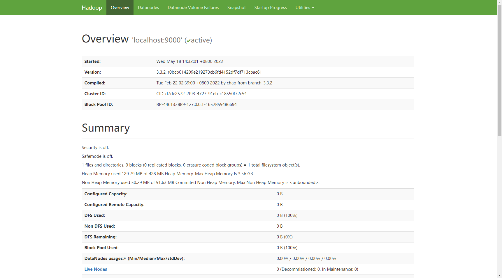

# mac m1 安装hbase

## Homebrew

-   brew安装

```shell
➜  ~ brew install hbase
```

-   配置JAVA_HOME`conf/hbase-env.sh`

```shell
➜  ~ cd /opt/homebrew/Cellar/hbase/2.4.10/libexec/conf
➜  conf vim hbase-env.sh

export JAVA_HOME="/自己的java环境目录"
```

-   配置核心配置`conf/hbase-site.xml`

```shell
➜ conf vim hbase-site.xml

<configuration>
  <property>
    <name>hbase.rootdir</name>
    //这里设置让HBase存储文件的地方
    <value>file:///Users/andrew_liu/Downloads/hbase</value>
  </property>
  <property>
    <name>hbase.zookeeper.property.dataDir</name>
    //这里设置让HBase存储内建zookeeper文件的地方
    <value>/Users/andrew_liu/Downloads/zookeeper</value>
  </property>
</configuration
```

-   启动HBase

```shell
➜  bin git:(stable) ./start-hbase.sh   
# 使用jps命令查看是否启动成功
➜  bin git:(stable) jps
33456 Launcher
42066 NameNode
42310 SecondaryNameNode
33399 RemoteMavenServer36
62633 Jps
62506 HMaster
12059 QuorumPeerMain
33309 
6207 Elasticsearch
```

-   启动Hbase shell

```shell
➜  ~ hbase shell

HBase Shell
Use "help" to get list of supported commands.
Use "exit" to quit this interactive shell.
For Reference, please visit: http://hbase.apache.org/2.0/book.html#shell
Version 2.4.10, r3e5359c73d1a96dd7d2ac5bc8f987e9a89ef90ea, Mon Feb 28 10:03:15 PST 2022
Took 0.0118 seconds                                                                                      
hbase:001:0> 
```

