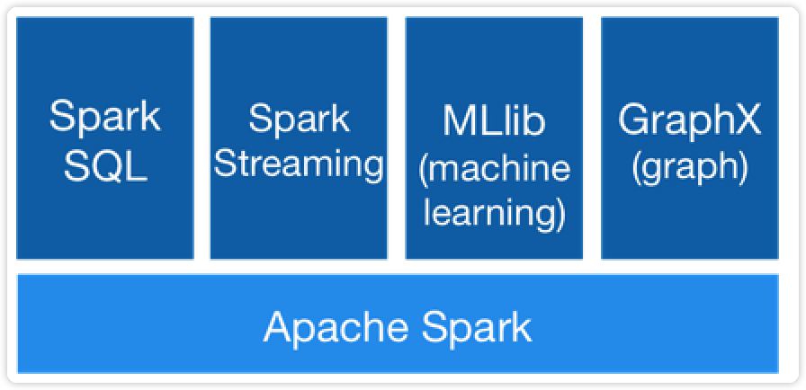
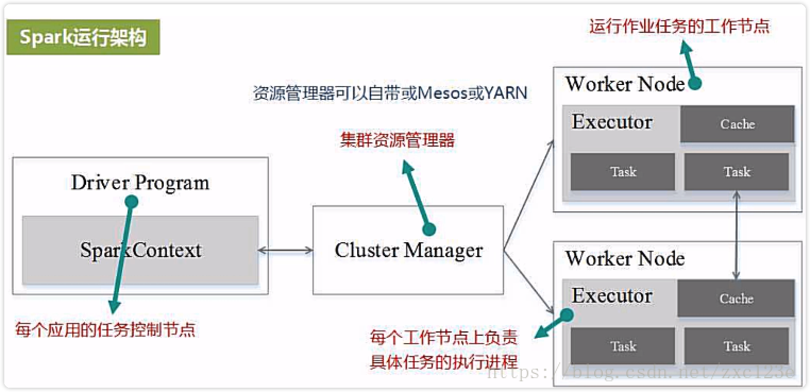
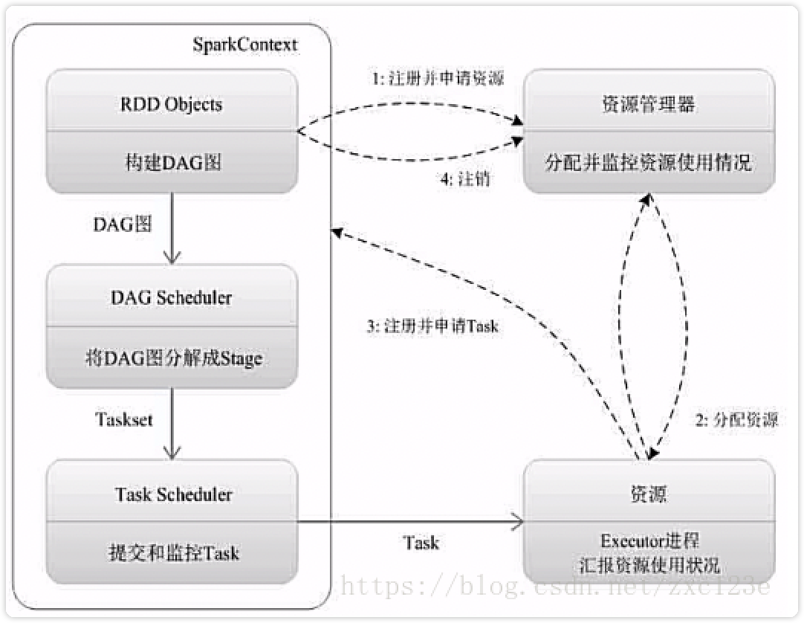
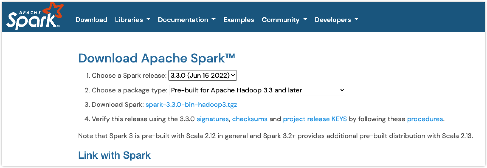

# spark

## spark是什么

Spark是一种高效的多用途的集群计算平台。一种开源的、大规模数据处理引擎。它提供了一整套开发API，包括流计算、机器学习或者SQL。Spark支持批处理和流处理。

Spark集成了许多的大数据工具，例如Spark可以处理任何Hadoop数据源，也能在Hadoop集群上执行。Spark并不需要依赖于 Hadoop，它有自己的集群管理系统。更重要的是，同样数据量，同样集群配置，Spark 的数据处理速度要比 Hadoop MapReduce 快10倍左右。

Spark 的一个关键的特性是数据可以在内存中迭代计算，提高数据处理的速度。虽然Spark是用 Scala开发的，但是它对 Java、Scala、Python 和 R 等高级编程语言提供了开发接口。

## Spark演变历史

- 2009年，Spark 诞生于伯克利大学的AMPLab实验室。最初 Spark 只是一个实验性的项目，代码量非常少，属于轻量级的框架。

- 2010年，伯克利大学正式开源了 Spark 项目。

- 2013年，Spark 成为了 Apache 基金会下的项目，进入高速发展期。第三方开发者贡献了大量的代码，活跃度非常高。

- 2014年，Spark 以飞快的速度称为了 Apache 的顶级项目。

- 2015年至今，Spark 在国内IT行业变得愈发火爆，大量的公司开始重点部署或者使用 Spark 来替代MapReduce、Hive、Storm 等传统的大数据计算框架。

## 为什么使用Spark

Spark 诞生之前，在大数据处理领域，并没有一个通用的计算引擎。

> 离线批处理使用 Hadoop MapReduce
> 流处理需要使用 Apache Storm
> 即时查询使用 Impala 或者 Tez
> 执行图计算使用 Neo4j 或者 Apache Giraph
> 而Spark囊括了离线批处理、流处理、即时查询和图计算4大功能。

## Spark组件

Spark提供了6大组件：

- Spark Core
- Spark SQL
- Spark Streaming
- Spark MLlib
- Spark GraphX
- SparkR



### Spark Core

将分布式数据抽象为弹性分布式数据集（RDD），实现了应用任务调度、RPC、序列化和压缩，并为运行在其上的上层组件提供API。所有Spark的上层组件（如：Spark SQL、Spark Streaming、MLlib、GraphX）都建立在Spark Core的基础之上，它提供了内存计算的能力，因此，Spark Core是分布式处理大数据集的基础。

### Spark SQL

Spark Sql 是Spark来操作结构化数据的程序包，可以让我使用SQL语句的方式来查询数据，Spark支持 多种数据源，包含 Hive 表，parquest以及JSON等内容。

### Spark Streaming

除了处理动态数据流，Spark Streaming 还能开发出强大的交互和数据查询程序。事实上，在处理动态数据流时，流数据会被分割成微小的批处理，这些微小批处理将会在Spark Core上按时间一个一个执行，且速度非常快。

### Spark MLlib

Spark MLlib 封装了很多高效的机器学习算法。它是数据科学最热门的选择，因为它是在内存处理数据的，非常有效的提高数据迭代算法的性能。

### Spark GraphX

Spark GraphX一个建立在Spark之上大规模处理图数据的计算引擎。

### SparkR

SparkR 是一个 R 语言包，它提供了轻量级的方式使得可以在 R 语言中使用 Apache Spark。在Spark 1.4中，SparkR 实现了分布式的 data frame，支持类似查询、过滤以及聚合的操作（类似于R中的data frames：dplyr)，但是这个可以操作大规模的数据集。

# Spark 架构及运行原理

## Spark运行架构及流程



### 概念

#### Application

用户编写的Spark应用程序，包含了driver程序以及在集群上运行的程序代码，物理机器上涉及了driver，master，worker三个节点。

#### Driver

Spark中的Driver即运行Application的main函数并创建SparkContext，创建SparkContext的目的是为了准备Spark应用程序的运行环境，在Spark中由SparkContext负责与Cluster Manager通信，进行资源申请、任务的分配和监控等，当Executor部分运行完毕后，Driver同时负责将SparkContext关闭。

#### Worker

集群中任何一个可以运行spark应用代码的节点。Worker就是物理节点，可以在上面启动Executor进程。

#### Executor

在每个Worker上为某应用启动的一个进程，该进程负责运行Task，并且负责将数据存在内存或者磁盘上，每个任务都有各自独立的Executor。Executor是一个执行Task的容器。它的主要职责是：

- 初始化程序要执行的上下文SparkEnv，解决应用程序需要运行时的jar包的依赖，加载类。
- 向cluster manager汇报当前的任务状态。

Executor是一个应用程序运行的监控和执行容器。

#### RDD

**RDD（Resilient Distributed Dataset）叫做弹性分布式数据集**，是Spark中最基本的数据抽象，它代表一个不可变、可分区、里面的元素可并行计算的集合。RDD具有数据流模型的特点：自动容错、位置感知性调度和可伸缩性。RDD允许用户在执行多个查询时显式地将工作集缓存在内存中，后续的查询能够重用工作集，这极大地提升了查询速度。

##### RDD的属性

- **一组分片（Partition）**，即数据集的基本组成单位。对于RDD来说，每个分片都会被一个计算任务处理，并决定并行计算的粒度。用户可以在创建RDD时指定RDD的分片个数，如果没有指定，那么就会采用默认值。默认值就是程序所分配到的CPUCore的数目。
- **一个计算每个分区的函数**。Spark中RDD的计算是以分片为单位的，每个RDD都会实现compute函数以达到这个目的。compute函数会对迭代器进行复合，不需要保存每次计算的结果。
- RDD之间的依赖关系。RDD的每次转换都会生成一个新的RDD，所以RDD之间就会形成类似于流水线一样的前后依赖关系。在部分分区数据丢失时，Spark可以通过这个依赖关系重新计算丢失的分区数据，而不是对RDD的所有分区进行重新计算。
- **一个Partitioner，即RDD的分片函数**。当前Spark中实现了两种类型的分片函数，一个是基于哈希的HashPartitioner，另外一个是基于范围的RangePartitioner。只有对于于key-value的RDD，才会有Partitioner，非key-value的RDD的Parititioner的值是None。Partitioner函数不但决定了RDD本身的分片数量，也决定了parentRDDShuffle输出时的分片数量。
- **一个列表，存储存取每个Partition的优先位置（preferredlocation）**。对于一个HDFS文件来说，这个列表保存的就是每个Partition所在的块的位置。按照“移动数据不如移动计算”的理念，Spark在进行任务调度的时候，会尽可能地将计算任务分配到其所要处理数据块的存储位置。

#### DAG

有向无环图，反映RDD之间的依赖关系。

#### Task

被发送到executor上的工作单元。每个Task负责计算一个分区的数据。

在Spark中有两类task：

##### shuffleMapTask

输出是shuffle所需数据,stage的划分也以此为依据，shuffle之前的所有变换是一个stage，shuffle之后的操作是另一个stage。

##### resultTask

输出是计算结果，比如：
`rdd.parallize(1 to 10).foreach(println)`
这个操作没有shuffle，直接就输出了，那么只有它的task是resultTask，stage也只有一个。

`rdd.map(x=>(x,1)).reduceByKey(_+_).foreach(println)`
上面这个job因为有reduce，所以有一个shuffle过程，那么reduceByKey之前的是一个stage，执行shuffleMapTask，输出shuffle所需的数据，reduceByKey到最后是一个stage，直接就输出结果了。如果job中有多次shuffle，那么每个shuffle之前都是一个stage。

#### Job

一个Job包含多个RDD及作用于相应RDD上的各种操作，它包含很多task的并行计算，可以认为是SparkRDD里面的action，每个action的触发会生成一个job。用户提交的Job会提交给DAGScheduler，Job会被分解成Stage，Stage会被细化成Task，Task简单的说就是在一个数据partition上的单个数据处理流程。

#### Stage

是Job的基本调度单位，一个Job会分为多组Task，每组Task被称为一个Stage就像MapStage，ReduceStage，或者也被称为TaskSet，代表一组关联的，相互之间没有Shuffle依赖关系的任务组成的任务集。

#### Partition

Partition类似hadoop的Split，计算是以partition为单位进行的，当然partition的划分依据有很多，这是可以自己定义的，像HDFS文件，划分的方式就和MapReduce一样，以文件的block来划分不同的partition。总而言之，Spark的partition在概念上与hadoop中的split是相似的，提供了一种划分数据的方式。

#### Block与Partition之间区别

hdfs中的block是分布式存储的最小单元，类似于盛放文件的盒子，一个文件可能要占多个盒子，但一个盒子里的内容只可能来自同一份文件。假设block设置为128M，你的文件是250M，那么这份文件占3个block（128+128+2）。这样的设计虽然会有一部分磁盘空间的浪费，但是整齐的block大小，便于快速找到、读取对应的内容。

注意：考虑到hdfs冗余设计，默认三份拷贝，实际上3*3=9个block的物理空间。

spark中的partition是弹性分布式数据集RDD的最小单元，RDD是由分布在各个节点上的partition组成的。partition是指的spark在计算过程中，生成的数据在计算空间内最小单元，同一份数据（RDD）的partition大小不一，数量不定，是根据application里的算子和最初读入的数据分块数量决定的，这也是为什么叫“弹性分布式”数据集的原因之一。

block位于存储空间、partition位于计算空间，block的大小是固定的、partition大小是不固定的，block是有冗余的、不会轻易丢失，partition（RDD）没有冗余设计、丢失之后重新计算得到。

#### Cluter Manager

指的是在集群上获取资源的外部服务。目前有三种类型：

- Standalon : spark原生的资源管理，由Master负责资源的分配。
- Apache Mesos:与hadoop MR兼容性良好的一种资源调度框架。
- Hadoop Yarn: 主要是指Yarn中的Resource Manager。

在Yarn模式下，客户端程序会向Yarn申请计算我这个任务需要多少的memory，多少CPU等等。然后Cluster Manager会通过调度告诉客户端可以使用，客户端就可以把程序送到每个Worker上面去执行了。

一个Application由一个Driver和若干个Job构成，一个Job由多个Stage构成，一个Stage由多个没有Shuffle关系的Task组成。

当执行一个Application时，Driver会向集群管理器申请资源，启动Executor，并向Executor发送应用程序代码和文件，然后在Executor上执行Task，运行结束后，执行结果会返回给Driver，或者写到HDFS或者其它数据库中。

与Hadoop MapReduce计算框架相比，Spark所采用的Executor有两个优点：

- 利用多线程来执行具体的任务减少任务的启动开销。
- Executor中有一个BlockManager存储模块，会将内存和磁盘共同作为存储设备，有效减少IO开销。

### Spark运行基本流程



>1. 为应用构建起基本的运行环境，即由Driver创建一个SparkContext进行资源的申请、任务的分配和监控。
>2. 资源管理器为Executor分配资源，并启动Executor进程
>3. SparkContext根据RDD的依赖关系构建DAG图，DAG图提交给DAGScheduler解析成Stage，然后把一个个TaskSet提交给底层调度器TaskScheduler处理。
>4. Executor向SparkContext申请Task，TaskScheduler将Task发放给Executor运行并提供应用程序代码。
>5. Task在Executor上运行把执行结果反馈给TaskScheduler，然后反馈给DAGScheduler，运行完毕后写入数据并释放所有资源。

### Spark运行架构特点

1. 每个Application都有自己专属的Executor进程，并且该进程在Application运行期间一直驻留。Executor进程以多线程的方式运行Task。
2. Spark运行过程与资源管理器无关，只要能够获取Executor进程并保存通信即可。
3. Task采用数据本地性和推测执行等优化机制。

# 安装Spark（MAC本地）

- 下载免Hadoop版本

[Spark官网](https://spark.apache.org/)



- 移动Spark到想安装的目录

```shell
sudo mv spark-3.3.0-bin-hadoop3.3.tgz ~/app/
```

- 解压缩文件

```shell
sudo tar -zvxf spark-3.3.0-bin-hadoop3.3.tgz
```

- 配置环境变量

```shell
sudo vim ~/.bash_profile
```

- 添加环境变量并保存

```shell
export SPARK_HOME=/Users/chenxinyu/app/spark-3.3.0-bin-hadoop3.3
export PATH=$PATH:$SPARK_HOME/bin
export PYSPARK_PYTHON=python3
```

- 刷新配置文件

```shell
source ~/.bash_profile
```

- 安装pyspark

```py
pip3 install pyspark
```


