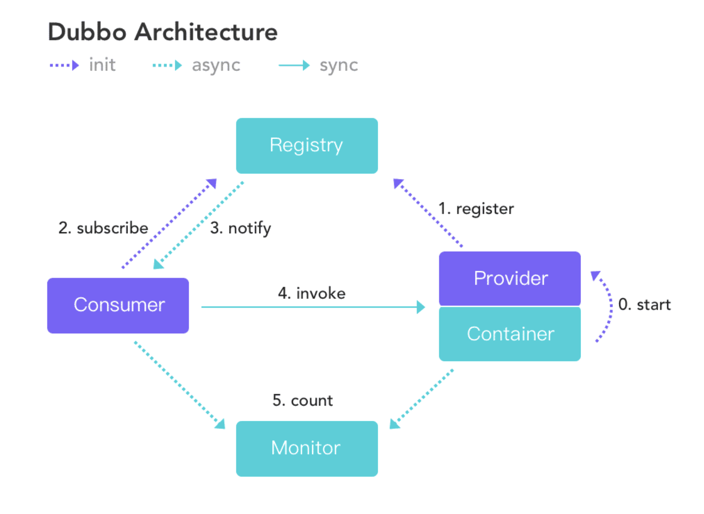
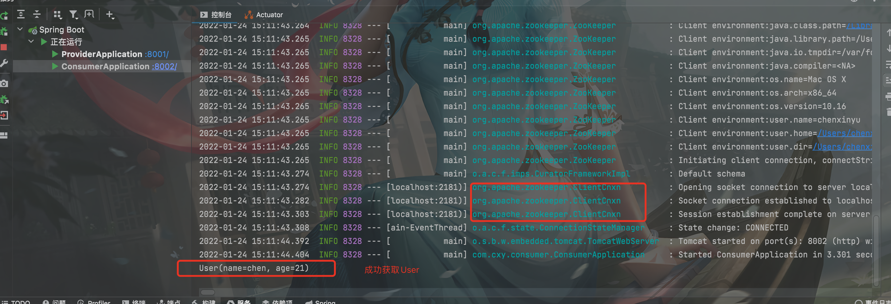

[toc]

# Dubbo

## 概要

### 场景

​		主要场景是，单台服务器无法完成过大用户量的模式，所以采用分布式架构，dubbo的模式恰好是我们需要的，而且非常经典。

> 架构演变发展
>
> - 单一架构
> - 垂直应用架构
>   - 大应用拆分，区分访问量来使用服务器
> - 分布式架构(基于RPC：远程过程调用)

### 性能

​		Dubbo是RPC框架，主要干的事远程过程调用，所以，提升性能是从两个方面

- 序列化

> XML，JSON，二进制流，Dubbo采用的是二进制流

- 网络通信

> Dubbo采用Socket通信机制，提升了通行效率，建立长连接，提升了速度

### 题外话

#### 比的RPC框架

- gRPC
- Thrift
- HSF…..

#### 历史

。。。

#### 官方文档：

https://dubbo.apache.org/zh/docs/

## 架构

### 服务发现

> 服务发现，即消费端自动发现服务地址列表的能力，是微服务框架需要具备的关键能力

Dubbo 提供的是一种 Client-Based 的服务发现机制，通常还需要部署额外的第三方注册中心组件来协调服务发现过程，如常用的 Nacos、Consul、Zookeeper 等，Dubbo 自身也提供了对多种注册中心组件的对接，用户可以灵活选择。

Dubbo原理图如下



服务发现的一个核心组件是注册中心，Provider 注册地址到注册中心，Consumer 从注册中心读取和订阅 Provider 地址列表。 因此，要启用服务发现，需要为 Dubbo 增加注册中心配置：

以 dubbo-spring-boot-starter 使用方式为例，增加 registry 配置

## springboot整合

### zookeeper安装

下载地址：https://zookeeper.apache.org/releases.html#download

配置：

```bash
cd ~
mkdir zookeeper
tar -zxvf apache-zookeeper-3.6.3-bin.tar.gz
rm -rf apache-zookeeper-3.6.3-bin.tar.gz
mkdir data
mkdir logs
cd apache-zookeeper-3.6.3-bin/conf #进入配置文件夹
mv zoo_sample.cfg zoo.cfg #更改默认配置文件名称
```


启动zookeeper服务

```bash
cd apache-zookeeper-3.6.3-bin/bin
./zkServer start
#查看是否启动成功
./zkServer status
```

### 整合springboot

#### 父项目pom依赖

```xml
<?xml version="1.0" encoding="UTF-8"?>
<project xmlns="http://maven.apache.org/POM/4.0.0"
         xmlns:xsi="http://www.w3.org/2001/XMLSchema-instance"
         xsi:schemaLocation="http://maven.apache.org/POM/4.0.0 http://maven.apache.org/xsd/maven-4.0.0.xsd">
    <modelVersion>4.0.0</modelVersion>
    <groupId>org.cxy</groupId>
    <artifactId>Dubbo-demo</artifactId>
    <packaging>pom</packaging>
    <version>1.0-SNAPSHOT</version>
    <modules>
        <module>dubbo-api</module>
        <module>dubbo-consumer</module>
        <module>dubbo-provider</module>
    </modules>
    <name>Dubbo-demo</name>
    <properties>
        <java.version>1.8</java.version>
        <dubbo.version>2.7.3</dubbo.version>
    </properties>
    <parent>
        <groupId>org.springframework.boot</groupId>
        <artifactId>spring-boot-starter-parent</artifactId>
        <version>2.6.3</version>
        <relativePath/> <!-- lookup parent from repository -->
    </parent>


    <dependencyManagement>
        <dependencies>
            <!-- dubbo -->
            <dependency>
                <groupId>org.apache.dubbo</groupId>
                <artifactId>dubbo-spring-boot-starter</artifactId>
                <version>${dubbo.version}</version>
            </dependency>
            <!-- zookeeper -->
            <!-- https://mvnrepository.com/artifact/org.apache.dubbo/dubbo-dependencies-zookeeper -->
            <dependency>
                <groupId>org.apache.dubbo</groupId>
                <artifactId>dubbo-dependencies-zookeeper</artifactId>
                <version>${dubbo.version}</version>
                <type>pom</type>
            </dependency>

        </dependencies>
    </dependencyManagement>

    <build>
        <plugins>
            <plugin>
                <groupId>org.springframework.boot</groupId>
                <artifactId>spring-boot-maven-plugin</artifactId>
                <configuration>
                    <excludes>
                        <exclude>
                            <groupId>org.projectlombok</groupId>
                            <artifactId>lombok</artifactId>
                        </exclude>
                    </excludes>
                </configuration>
            </plugin>
        </plugins>
    </build>

</project>
```

#### 子项目api配置pom文件

```xml
<?xml version="1.0" encoding="UTF-8"?>
<project xmlns="http://maven.apache.org/POM/4.0.0"
         xmlns:xsi="http://www.w3.org/2001/XMLSchema-instance"
         xsi:schemaLocation="http://maven.apache.org/POM/4.0.0 http://maven.apache.org/xsd/maven-4.0.0.xsd">
    <parent>
        <artifactId>Dubbo-demo</artifactId>
        <groupId>org.cxy</groupId>
        <version>1.0-SNAPSHOT</version>
    </parent>
    <modelVersion>4.0.0</modelVersion>

    <artifactId>dubbo-api</artifactId>

    <properties>
        <maven.compiler.source>8</maven.compiler.source>
        <maven.compiler.target>8</maven.compiler.target>
    </properties>
    <dependencies>
        <!--     springboot       -->
        <dependency>
            <groupId>org.springframework.boot</groupId>
            <artifactId>spring-boot-starter-web</artifactId>
        </dependency>
        <dependency>
            <groupId>org.projectlombok</groupId>
            <artifactId>lombok</artifactId>
        </dependency>
        <dependency>
            <groupId>org.apache.dubbo</groupId>
            <artifactId>dubbo-spring-boot-starter</artifactId>
        </dependency>
        <dependency>
            <groupId>org.apache.dubbo</groupId>
            <artifactId>dubbo-dependencies-zookeeper</artifactId>
            <type>pom</type>
        </dependency>
    </dependencies>

</project>
```

#### 生产者和消费者pom文件

```xml
<?xml version="1.0" encoding="UTF-8"?>
<project xmlns="http://maven.apache.org/POM/4.0.0"
         xmlns:xsi="http://www.w3.org/2001/XMLSchema-instance"
         xsi:schemaLocation="http://maven.apache.org/POM/4.0.0 http://maven.apache.org/xsd/maven-4.0.0.xsd">
    <parent>
        <artifactId>Dubbo-demo</artifactId>
        <groupId>org.cxy</groupId>
        <version>1.0-SNAPSHOT</version>
    </parent>
    <modelVersion>4.0.0</modelVersion>

    <artifactId>dubbo-consumer</artifactId>

    <properties>
        <maven.compiler.source>8</maven.compiler.source>
        <maven.compiler.target>8</maven.compiler.target>
    </properties>
    <dependencies>
        <dependency>
            <groupId>org.cxy</groupId>
            <artifactId>dubbo-api</artifactId>
            <version>1.0-SNAPSHOT</version>
        </dependency>
    </dependencies>

</project
```

#### spring配置dubbo

使用zookeeper注册中心

consumer

```yml
server:
  port: 8002

dubbo:
  application:
    # 应用名称
    name: consumer
  registry:
    # 注册中心地址
    address: zookeeper://localhost:2181
```

provider

```yml
server:
  port: 8001

dubbo:
  # 应用名称
  application:
    name: provider
  registry:
    # 注册中心地址
    address: zookeeper://localhost:2181
    # 超市时间
    timeout: 6000
  # 元中心地址
  metadata-report:
    address: zookeeper://localhost:2181
  protocol:
    # 协议名称
    name: dubbo
    # 端口
    port: 20880
  scan:
    # 扫描包地址
    base-packages: com.cxy.provider.service
```

启动项目：

Consumer成功获取Provider暴露的user




