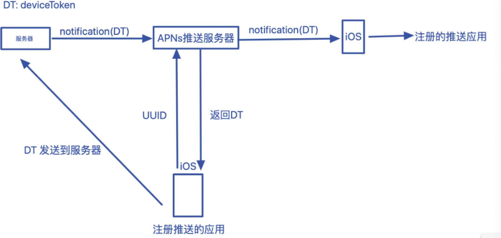

[toc]

## APP推送原理

### IOS推送原理

>苹果的推送服务通知由苹果的推送服务器`APNs(Apple Push Notification server)`来完成的。APNs服务器收到我们发送的消息，然后将这条消息推送到指定的IOS设备上，然后再由IOS设备通过通知或者声音的形式推到到我们的应用。
>iOS要实现远程推送需要安装具有推送的应用，首次打开应用后询问请求推送权限之后会向APNs服务器进行注册。注册成功之后APNs服务器会返回一个`deviceToken`, 拿到这个`deviceToken` 我们就可以发消息到这台iOS设备了。当注册成功之后，我们的应用会和APNs服务器维持一个TCP链接。我们将`deviceToken`会传到自己的服务器，通过具体的业务需求服务器发送消息到APNs服务器，APNs会将消息推送到iOS设备上。

#### IOS设备注册APNs的过程

- 设备连接APNs服务器并携带设备序列化(UUID)
- 连接成功，APNs经过打包和处理后生成deviceToken并返回给注册设备
- 设备获取的deviceToken通过自己的程序把它发送到自己的服务器
- 设备在APNs服务器与自己的服务器进行注册

#### IOS推送过程

- 设备安装了推送功能的应用，设备在有网下有连接APNs推送的服务器，连接过程中，APNs服务器会验证deviceToken，成功后维持一个基于TCP的长连接
- 服务器把要推送的消息(含有deviceToken)一起发送给APNs服务器
- APNs服务器将接收到的信息推送给指定的deviceToken设备
- 设备收到推送后通知到应用程序

### Android推送原理

> Android推送服务是采用GCM(Google Clond Message)来实现的(国内需要自备梯子)，系统级别的消息推送服务

App从服务器获取最新消息的基本方式有3种：Push、Pull 和 SMS

- Push 是服务器主送发送到客户端，客户端被动接受
- Pull 客户端定期主动拉取服务端的消息，也叫做**轮询**。 缺点是要消耗设备的CPU，电量，流量等。
- SMS 通过发送信令的方式发给客户端，客户端收到后向服务器拉取消息。缺点就是收费问题。

#### 推送方案

##### C2DM（Cloudto Device Messaging）

Google 操作系统有自身的消息推送功能（系统级别）

基于Push方式，C2DM服务负责处理诸如消息排队等事务，并向运行于目标设备上的应用程序分发这些消息。

注册设备、消息推送流程、出发流程同IOS。

这种C2DM方式是Google官方提供的。国内使用Google需要FQ，国内的手机需要安装Google。

##### 轮询

基于Pull的方式。客户端定期主动拉取服务端的消息。 成本是要消耗设备的CPU，电量，流量等。

##### SMS

短信发送，基于Push方式。原理是通过拦截SMS消息并且解析消息内容来了解服务器的意图，并获取其显示内容进行处理。成本就是通过运营商缴纳短信费用。

##### MQTT协议

国内很多企业都广泛使用MQTT作为Android手机客户端与服务器端推送消息的协议。
MQTT(消息队列遥测传输)是ISO 标准(ISO/IEC PRF 20922)下基于发布/订阅范式的消息协议。工作在 TCP/IP协议族上。基于Push的方式轻量级的消息发布/订阅协议。

##### XMPP协议

Extensible Messaging And Presence protocol,可扩展通讯和表示协议,是基于可扩展标记语言（XML）的协议。

> XMPP中定义了三个角色，客户端，服务器，网关。通信能够在这三者的任意两个之间双向发生。服务器同时承担了客户端信息记录，连接管理和信息的路由功能。网关承担着与异构即时通信系统的互联互通，异构系统可以包括SMS（短信），MSN，ICQ等。基本的网络形式是单客户端通过TCP/IP连接到单服务器，然后在之上传输XML。

#### 其他的第三方推送平台

友盟、极光等

