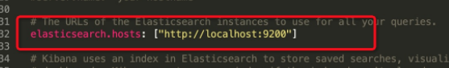
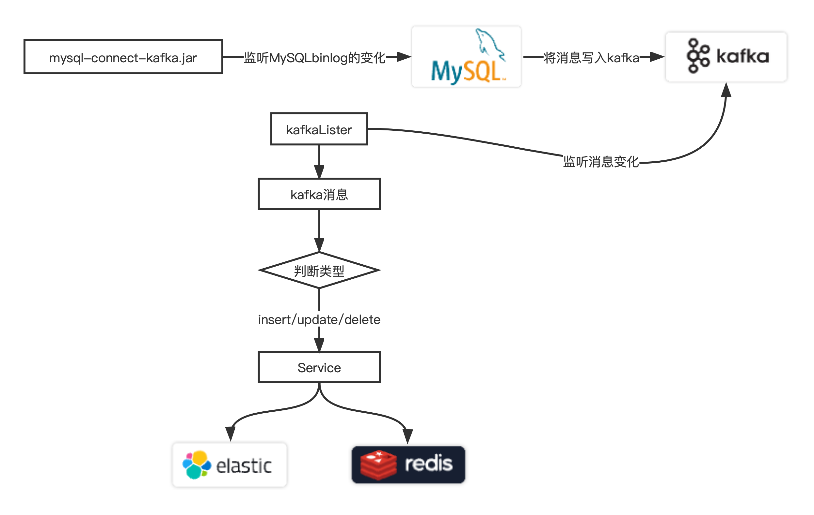
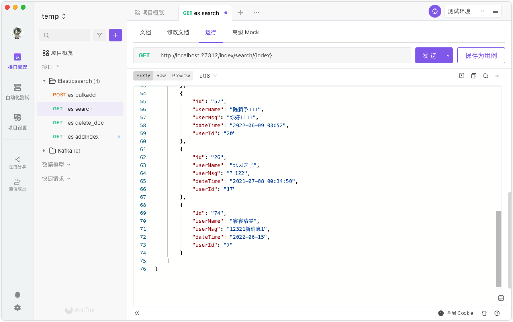

[toc]

# Elaticsearch

## 安装

### **Mac安卓es**

mac直接通过命令行下载

```shell
➜  ~ brew install elastic/tap/elasticsearch-full
```

通过`elasticsearch --version`查看版本号

```shell
➜  ~ elasticsearch --version
Version: 7.17.3, Build: default/tar/5ad023604c8d7416c9eb6c0eadb62b14e766caff/2022-04-19T08:11:19.070913226Z, JVM: 18
```

### Mac安装Kibana

官网下载，解压

修改conf中的yml文件

开放本地路径



### Mac安装Logstash

官网下载，解压


## 基础

### 使用

可以使用REST API与Sense访问

当ES实例运行的时候，可以使用`localhost:9200`，基于JSON的REST API与ES进行通信。使用任何HTTP客户端都可以进行通信。也可以使用图形化客户端进行访问。

Chorme插件`Sense`更加方便。Sense 提供了一个专门用于ES的REST API简单界面，功能方便。

初次访问查询不到示例，因为没有任何索引。返回结构如下：

```json
{
   "took": 1,
   "timed_out": false,
   "_shards": {
      "total": 0,
      "successful": 0,
      "failed": 0
   },
   "hits": {
      "total": 0,
      "max_score": 0,
      "hits": []
   }
}
```

### 文档管理

#### 创建索引

在创建的时候，如果要插入原先不存在的ID，则新增索引，如果相同类型和ID的文档已经存在，则会被覆盖。

REST格式的PUT请求如下：

`http://localhost:9200/<index>/<type>/[<id>]`

索引和类型是必须条件，id部分是可选条件，如果不指定id，ES会帮助我们生成一个ID，但是，不指定ID应该使用`POST`请求而不是`PUT`请求

索引名称是任意的。如果没有此名称的索引，会使用默认配置来创建一个索引。

**例：**以下信息是一个任意的电影对象的JSON格式。

```json
{
    "title": "The GodFather",
    "director": "Francis Ford Coppola",
    "year": 1972
}
```

可以使用以下命令创建：

==使用索引名称为：“movies”，类型名称“movie”，id“1”==

```shell
curl -XPUT "http://localhost:9200/movies/movie/1" -d
{
    "title": "The GodFather",
    "director": "Francis Ford Coppola",
    "year": 1972
}
```

也可以使用Sense。

#### 修改索引

`指定已存在的id就是修改`

```http
GET /movies/movie/2
{
  "name" : "间谍过家家2",
  "type" : "日常",
  "level" : 5
}
```

#### 删除索引

`按照id删除`

```http
DELETE /movies/movie/lW6ny4ABv6rm8wVssc2R
```

#### 索引搜索

**查询movies组下的所有**

```http
GET /movies/_search
{
  "query": {
    "match_all": {}
  }
}
>>>>>>[结果]>>>>>>>>>>>>>>>>>>>>>>>>>>>>>>>
{
  "took" : 6,
  "timed_out" : false,
  "_shards" : {
    "total" : 1,
    "successful" : 1,
    "skipped" : 0,
    "failed" : 0
  },
  "hits" : {
    "total" : {
      "value" : 5,
      "relation" : "eq"
    },
    "max_score" : 1.0,
    "hits" : [
      {
        "_index" : "movies",
        "_type" : "movie",
        "_id" : "3cs9rYABgRJ95K6fOYci",
        "_score" : 1.0,
        "_source" : {
          "name" : "movie1"
        }
      },
      {
        "_index" : "movies",
        "_type" : "movie",
        "_id" : "2",
        "_score" : 1.0,
        "_source" : {
          "name" : "间谍过家家",
          "type" : "日常",
          "level" : 5
        }
      },
      {
        "_index" : "movies",
        "_type" : "movie",
        "_id" : "3",
        "_score" : 1.0,
        "_source" : {
          "name" : "间谍大战",
          "type" : "格斗",
          "level" : 3
        }
      },
      {
        "_index" : "movies",
        "_type" : "movie",
        "_id" : "4",
        "_score" : 1.0,
        "_source" : {
          "name" : "可可西里的间谍",
          "type" : "未知",
          "level" : 1
        }
      },
      {
        "_index" : "movies",
        "_type" : "movie",
        "_id" : "5",
        "_score" : 1.0,
        "_source" : {
          "name" : "谍影重重",
          "type" : "未知",
          "level" : 5
        }
      }
    ]
  }
}
```

**按条件查询**

```http
GET /movies/_search
{
  "query": {
    "match": {
        "name" : "家家"
    }
  }
}
>>>>>>>>[结果]>>>>>>>>>>>>>>>>>>>>>>>>
{
  "took" : 7,
  "timed_out" : false,
  "_shards" : {
    "total" : 1,
    "successful" : 1,
    "skipped" : 0,
    "failed" : 0
  },
  "hits" : {
    "total" : {
      "value" : 1,
      "relation" : "eq"
    },
    "max_score" : 4.1527967,
    "hits" : [
      {
        "_index" : "movies",
        "_type" : "movie",
        "_id" : "2",
        "_score" : 4.1527967,
        "_source" : {
          "name" : "间谍过家家",
          "type" : "日常",
          "level" : 5
        }
      }
    ]
  }
}
```


## 问题

### 配置所有ip地址访问

```shell
# 查看elasticsearch安装位置
brew info elasticsearch
# config目录下修改elasticsearch.yml配置文件
cd /opt/homebrew/etc/elasticsearch/
vim elasticsearch.yml
# 配置
```

```yml
network.host: 0.0.0.0
```

### es启动报错

>   **[error] At least one of [discovery.seed_hosts, discovery.seed_providers, cluster.initial_master_nodes] must be configured**

**解决方法1**

单机运行es可以配置以下，避免生产检查，以正常启动

```yml
discovery.type: single-node
```

## Java API

**maven依赖**

```xml
<dependency>
  <groupId>co.elastic.clients</groupId>
  <artifactId>elasticsearch-java</artifactId>
  <version>${es-version}</version>
</dependency>

<dependency>
  <groupId>com.fasterxml.jackson.core</groupId>
  <artifactId>jackson-databind</artifactId>
  <version>2.12.3</version>
</dependency>
<dependency>
  <groupId>jakarta.json</groupId>
  <artifactId>jakarta.json-api</artifactId>
  <version>2.1.0</version>
</dependency>
<dependency>
  <groupId>com.fasterxml.jackson.core</groupId>
  <artifactId>jackson-core</artifactId>
  <version>2.13.0</version>
</dependency>
```

**构建java es client**

```java
	private ElasticsearchClient getClient(){
        RestClient restClient = RestClient.builder(new HttpHost("localhost", 9200)).build();
        ElasticsearchTransport transport = new RestClientTransport(restClient, new JacksonJsonpMapper());
        return new ElasticsearchClient(transport);
    }
```

- 创建index
  - `index`索引名称

```java
    public void createIndex(String index){
        try {
            getClient().indices().create(c -> c.index(index));
        } catch (IOException e) {
            e.printStackTrace();
        }
    }
```

- 创建document
  - `index`索引名称
  - `userDTO`存储的对象，结构可以自己定义

```java
	 public void createDocument(String index, UserDTO object){
        CreateRequest<Object> dataStreamResponse = CreateRequest.of(e -> e
                .index(index)
                .id(String.valueOf(object.getId()))
                .type("_doc")
                .document(object));
        try {
            getClient().create(dataStreamResponse);
        } catch (IOException e) {
            e.printStackTrace();
        }
    }
```

- 批量创建document

```java
public void bulkDocument(String index, UserBulkVO vo){
    BulkRequest.Builder br = new BulkRequest.Builder();
    for (UserDTO dto : vo.getList()) {
        br.operations(op -> op
                .index(idx -> idx
                        .index(index)
                        .id(String.valueOf(dto.getId()))
                        .document(dto))
        );
    }
    BulkResponse bulk = null;
    try {
        bulk = getClient().bulk(br.build());
    } catch (IOException e) {
        log.error("Bulk had errors:" + e.getMessage());
        for (BulkResponseItem item: bulk.items()) {
            if (item.error() != null) {
                log.error(item.error().reason());
            }
        }
    }
}
```

- 删除Index或删除document
  - `index`索引名称
  - `id`删除的id名

```java
    public void deleteDocument(String index, String id){
        try {
            getClient().delete(c -> c.index(index).id(id));
        } catch (IOException e) {
            e.printStackTrace();
        }
    }

    public void deleteIndex(String index){
        try {
            getClient().delete(c -> c.index(index));
        } catch (IOException e) {
            e.printStackTrace();
        }
    }
```

- 查询index
  - `index` index的名称
  - `val`搜索词，es支持模糊搜索

```java
    public List<Object> searchIndex(String index, String val){
        List<Object> resultList = new ArrayList<>();
        SearchRequest searchRequest = SearchRequest.of(s -> s.index(index).q(val));
        SearchResponse<Object> response = null;
        try {
            response = getClient().search(searchRequest, Object.class);
        } catch (IOException e) {
            e.printStackTrace();
        }
        if (Objects.requireNonNull(response).hits() != null) {
            List<Hit<Object>> list = response.hits().hits();
            for (Hit<Object> hit : list) {
                resultList.add(hit.source());
            }
        }
        return resultList;
    }
```

## Elasticsearch SQL

ES支持sql查询，以下是普通SQL中对应和ES的关系对比

| SQL                     | Elasticsearch     | 描述                                                         |
| ----------------------- | ----------------- | ------------------------------------------------------------ |
| `column`                | `field`           | 在这两种情况下，在最低级别，数据都存储在*命名*条目中，具有多种[数据类型](https://www.elastic.co/guide/en/elasticsearch/reference/7.17/sql-data-types.html)，包含*一个*值。SQL 将此类条目称为*列*，而 Elasticsearch 称为*字段*。请注意，在 Elasticsearch 中，一个字段可以包含*多个*相同类型的值（本质上是一个列表），而在 SQL 中，一个*列*可以只包含*一个*所述类型的值。Elasticsearch SQL 将尽最大努力保留 SQL 语义，并根据查询拒绝那些返回具有多个值的字段的查询。 |
| `row`                   | `document`        | `Column`s 和`field`s本身*不*存在；它们是 a`row`或 a的一部分`document`。两者的语义略有不同：a`row`趋于*严格*（并且有更多的强制执行），而 a`document`趋于更加灵活或松散（同时仍然具有结构）。 |
| `table`                 | `index`           | 执行查询的目标，无论是 SQL 还是 Elasticsearch。              |
| `schema`                | *隐含的*          | 在 RDBMS 中，`schema`主要是表的命名空间，通常用作安全边界。Elasticsearch 没有为它提供等效的概念。但是，当启用安全性时，Elasticsearch 会自动应用安全性强制，以便角色只能看到它被允许访问的数据（在 SQL 术语中，它的*schema*）。 |
| `catalog`或者`database` | `cluster`实例     | 在 SQL 中，`catalog`or`database`可以互换使用并表示一组模式，即多个表。在 Elasticsearch 中，可用的索引集被分组在一个`cluster`. 语义也有所不同。a`database`本质上是另一个命名空间（可能对数据的存储方式有一些影响），而 Elasticsearch`cluster`是一个运行时实例，或者更确切地说是一组至少一个 Elasticsearch 实例（通常是分布式运行）。在实践中，这意味着虽然在 SQL 中，一个实例中可能有多个目录，但在 Elasticsearch 中，一个目录仅限于*一个*。 |
| `cluster`               | `cluster`（联合） | 传统上，在 SQL 中，*集群*是指包含多个`catalog`s 或`database`s 的单个 RDMBS 实例（见上文）。同一个词也可以在 Elasticsearch 中重复使用，但是它的语义更加清晰。虽然 RDBMS 往往只有一个运行实例，但在单台机器上（*非*分布式），Elasticsearch 则相反，默认情况下是分布式和多实例。此外，Elasticsearch`cluster`可以以*联合*`cluster`方式连接到其他s，因此意味着：`cluster`单个集群:: 多个 Elasticsearch 实例通常分布在机器上，在同一个命名空间中运行。多个集群:: 多个集群，每个集群都有自己的命名空间，在联合设置中相互连接（请参阅[跨集群搜索](https://www.elastic.co/guide/en/elasticsearch/reference/7.17/modules-cross-cluster-search.html)）。 |

### SQL-CLI

**举例**

```sql
sql> show tables;
        catalog        |             name              |     type      |     kind      
-----------------------+-------------------------------+---------------+---------------
elasticsearch_chenxinyu|.apm-agent-configuration       |TABLE          |INDEX          
elasticsearch_chenxinyu|.apm-custom-link               |TABLE          |INDEX          
elasticsearch_chenxinyu|.async-search                  |TABLE          |INDEX          
elasticsearch_chenxinyu|.kibana                        |VIEW           |ALIAS          
elasticsearch_chenxinyu|.kibana_7.17.3                 |VIEW           |ALIAS          
elasticsearch_chenxinyu|.kibana_7.17.3_001             |TABLE          |INDEX          
elasticsearch_chenxinyu|.kibana_task_manager           |VIEW           |ALIAS          
elasticsearch_chenxinyu|.kibana_task_manager_7.17.3    |VIEW           |ALIAS          
elasticsearch_chenxinyu|.kibana_task_manager_7.17.3_001|TABLE          |INDEX          
elasticsearch_chenxinyu|.tasks                         |TABLE          |INDEX          
elasticsearch_chenxinyu|kibana_sample_data_ecommerce   |TABLE          |INDEX          
elasticsearch_chenxinyu|users                          |TABLE          |INDEX  

sql> select * from users;
      age      |      id       |     name      |     phone     |      sex      
---------------+---------------+---------------+---------------+---------------
22             |1              |陈新予          |15667650616    |男              
22             |2              |blanker        |18891142571    |男              
```

### SQL-REST

**返回值格式验证**

|    **格式**    |    **`Accept`HTTP 标头**    |                           **描述**                           |
| :------------: | :-------------------------: | :----------------------------------------------------------: |
| `csv`可读格式  |         `text/csv`          | [逗号分隔值](https://en.wikipedia.org/wiki/Comma-separated_values) |
| `json`可读格式 |     `application/json`      | [JSON](https://www.json.org/)（JavaScript Object Notation）人类可读格式 |
| `tsv`可读格式  | `text/tab-separated-values` | [制表符分隔值](https://en.wikipedia.org/wiki/Tab-separated_values) |
| `txt`可读格式  |        `text/plain`         |                         类 CLI 表示                          |
| `yaml`可读格式 |     `application/yaml`      | [YAML](https://en.wikipedia.org/wiki/YAML)（YAML Ain't Markup Language）人类可读格式 |
|  `cbor`二进制  |     `application/cbor`      |           [简洁的二进制对象表示](https://cbor.io/)           |
| `smile`二进制  |     `application/smile`     | 类似于 CBOR 的[微笑二进制数据格式](https://en.wikipedia.org/wiki/Smile_(data_interchange_format)) |

```shell
POST /_sql?format=txt
{
  "query": "select * from users"
}
```

**结果过滤器**

```shell
POST /_sql?format=txt
{
  "query": "SELECT * FROM library ORDER BY page_count DESC",
  "filter": {
    "range": {
      "page_count": {
        "gte" : 100,
        "lte" : 200
      }
    }
  },
  "fetch_size": 5
}
    author   |                name                |page_count| release_date
-------------+------------------------------------+----------+------------------------
Douglas Adams|The Hitchhiker's Guide to the Galaxy|180       |1979-10-12T00:00:00.000Z
```

**预编译SQL**

常用mybatis的小伙伴肯定熟悉这查询模式,也就是`#{}` 和`${}`的区别

```sql
SELECT * from table_name where id = ? 
```

ES SQL同样支持

```shell
POST /_sql?format=json
{
	"query": "SELECT * AS year FROM table_name WHERE page_count > ? AND author = ? ",
	"params": [300, "Frank Herbert"]
}
```


## kafka同步binlog消息到Elasticsearch

Kafka教程中，实时同步了`mysql-binlog`日志到kafka的topic：binlog下，所以现在的目标是实现一个自动消费消息到ES的功能

基本思路



### maven依赖

```xml
<!-- springboot -->
<dependency>
  <groupId>org.springframework.boot</groupId>
  <artifactId>spring-boot-starter-web</artifactId>
</dependency>
<!-- kafka -->
<dependency>
  <groupId>org.springframework.kafka</groupId>
  <artifactId>spring-kafka</artifactId>
</dependency>
<!-- elasticsearch -->
<dependency>
  <groupId>co.elastic.clients</groupId>
  <artifactId>elasticsearch-java</artifactId>
  <version>7.17.3</version>
</dependency>

<!--json-->
<dependency>
  <groupId>com.fasterxml.jackson.core</groupId>
  <artifactId>jackson-databind</artifactId>
  <version>2.12.3</version>
</dependency>
<dependency>
  <groupId>com.fasterxml.jackson.core</groupId>
  <artifactId>jackson-core</artifactId>
  <version>2.13.0</version>
</dependency>
<dependency>
  <groupId>com.fasterxml.jackson.core</groupId>
  <artifactId>jackson-annotations</artifactId>
  <version>2.13.0</version>
</dependency>
<!-- jakarta.json-api -->
<dependency>
  <groupId>jakarta.json</groupId>
  <artifactId>jakarta.json-api</artifactId>
  <version>2.1.0</version>
</dependency>
<!-- 格式化驼峰命名所用得依赖 -->
<dependency>
  <groupId>com.google.guava</groupId>
  <artifactId>guava</artifactId>
  <version>21.0</version>
</dependency>
<!-- log4j -->
<dependency>
  <groupId>log4j</groupId>
  <artifactId>log4j</artifactId>
  <version>1.2.17</version>
</dependency>
<!-- lombok -->
<dependency>
  <groupId>org.projectlombok</groupId>
  <artifactId>lombok</artifactId>
  <optional>true</optional>
</dependency>
```

### 配置文件

```yaml
spring:
    kafka:
        # kafka
        bootstrap-servers: localhost:9092
        template:
            # topic
            default-topic: binlog
        # producer
        producer:
            key-serializer: org.apache.kafka.common.serialization.StringSerializer
            value-serializer: org.apache.kafka.common.serialization.StringSerializer
            retries: 3
        # consumer
        consumer:
            group-id: kafka-consumer
            auto-offset-reset: latest
            key-deserializer: org.apache.kafka.common.serialization.StringDeserializer
            value-deserializer: org.apache.kafka.common.serialization.StringDeserializer
            isolation-level: read_committed
            enable-auto-commit: true
        # listener TO @KafkaListener
        listener:
            type: batch
            concurrency: 4
            poll-timeout: 3000
server:
    port: 27312

elasticsearch:
    host: localhost
    port: 9200

```

### 编写代码

#### Kafka配置类

- 使用注解`@EnableKafka`开启kafka访问
- `@RequiredArgsConstructor`lombok注解，通过构造注入来添加类，类似`@Autowired`

> 不使用@Autowired是因为字段注入会带来一些问题，Spring官方现在不推荐使用字段注入

```java
@Configuration
@EnableKafka
@RequiredArgsConstructor
public class KafkaConfig{

    private final KafkaProperties kafkaProperties;

    @Bean
    public AdminClient adminClient() {
        Map<String, Object> configs = new HashMap<>(2);
        configs.put(AdminClientConfig.BOOTSTRAP_SERVERS_CONFIG, kafkaProperties.getBootstrapServers());
        return AdminClient.create(configs);
    }
}
```

#### 对外暴露的接口

- `KafkaController`目的是为了测试的时候方便的操作Kafka

```java
@Log4j2
@RestController
@RequiredArgsConstructor
@RequestMapping("kafka")
public class KafkaController {

    private final KafkaTemplate<String, String> kafkaTemplate;

    private final AdminClient adminClient;

    @PutMapping("topic/add")
    public ResponseMessageT<Object> buildTopic(
            @RequestParam("name") String name, @RequestParam("numPartitions") Integer numPartitions,
            @RequestParam("replicationFactor") Short replicationFactor
    ) {
        NewTopic newTopic = new NewTopic(name, numPartitions, replicationFactor);
        adminClient.createTopics(Collections.singletonList(newTopic));
        return ResponseMessageT.addSuccess();
    }

    @GetMapping("topic/list")
    public ResponseMessageT<Object> getAllTopics() {
        ListTopicsResult listTopicsResult = adminClient.listTopics();
        try {
            Set<String> names = listTopicsResult.names().get();
            return ResponseMessageT.success(names);
        } catch (InterruptedException | ExecutionException e) {
            return ResponseMessageT.fail("新增失败", e.getMessage());
        }
    }

    @DeleteMapping("topic/del/{topic}")
    public ResponseMessageT<Object> deleteTopic(@PathVariable String topic) {
        adminClient.deleteTopics(Collections.singletonList(topic));
        return ResponseMessageT.delSuccess();
    }

    @GetMapping("produce")
    public ResponseMessageT<Object> send(@RequestParam("message") String message) {
        // 发送消息至默认topic
        ListenableFuture<SendResult<String, String>> future = kafkaTemplate.sendDefault(message);
        return ResponseMessageT.success(buildCallBack(future, message));
    }

    @GetMapping("produce/{topic}")
    public ResponseMessageT<Object> sendToTopic(@PathVariable String topic, @RequestParam("message") String message) {
        ListenableFuture<SendResult<String, String>> future = kafkaTemplate.send(topic, message);
        return ResponseMessageT.success(buildCallBack(future, message));
    }
    @SuppressWarnings("NullableProblems")
    private String buildCallBack(ListenableFuture<SendResult<String, String>> future, String message) {
        future.addCallback(new ListenableFutureCallback<SendResult<String, String>>() {
            @Override
            public void onFailure(Throwable throwable) {
                log.info("消息 [" + message + "] 发送失败，错误原因: {" + throwable.getMessage() + "}");
            }
            @Override
            public void onSuccess(SendResult<String, String> result) {
                log.info("消息 [{" + message + "}] 发送成功，当前 partition: {"
                                 + result.getRecordMetadata().partition()
                                 + "}，当前 offset: {" + result.getRecordMetadata().offset() + "}");
            }
        });
        return message;
    }
}
```

- ES操作接口

  - `EsController`目的是为了方便测试时对Es进行操作

  ```java
  @RestController
  @RequiredArgsConstructor
  public class EsController {
  
      private final BinlogEsService esService;
  
      @GetMapping("index/search/{index}")
      public ResponseMessageT<Object> searchIndex(@PathVariable String index, String value){
          if ("".equals(value)){
              value = null;
          }
          return ResponseMessageT.success(esService.searchIndex(index, value));
      }
      @PostMapping("index/document/bulk/{index}")
      public ResponseMessageT<Object> bulkDocument(@PathVariable String index, @RequestBody List<Object> list){
          esService.bulkDocument(index, list);
          return ResponseMessageT.addSuccess();
      }
  
      @GetMapping("index/create/{index}")
      public ResponseMessageT<Object> createIndex(@PathVariable String index){
          esService.createIndex(index);
          return ResponseMessageT.addSuccess();
      }
  
      @GetMapping("index/delete/{index}")
      public ResponseMessageT<Object> deleteIndex(@PathVariable String index){
          esService.deleteIndex(index);
          return ResponseMessageT.delSuccess();
      }
  
      @GetMapping("index/document/delete/{index}/{id}")
      public ResponseMessageT<Object> deleteDocument(@PathVariable String index, @PathVariable String id){
          esService.deleteDocument(index, id);
          return ResponseMessageT.delSuccess();
      }
  }
  ```

  - `EsBaseService`编写Es操作的基础service

  > 为了增加类的可扩展性，设计时编写`EsBaseService`作为es操作的基础service，在扩展时直接继承该类即可。

  ```java
  @Service
  @Log4j
  public class EsBaseService {
  
      @Value("${elasticsearch.host}")
      private String host;
      @Value("${elasticsearch.port}")
      private Integer port;
  
      /**
       * 获取ESClient对象
       *
       * @return esClient
       */
      public ElasticsearchClient getClient() {
          RestClient restClient = RestClient.builder(new HttpHost(host, port)).build();
          ElasticsearchTransport transport = new RestClientTransport(restClient, new JacksonJsonpMapper());
          return new ElasticsearchClient(transport);
      }
  
      /**
       * 创建索引
       *
       * @param index 索引名
       */
      public void createIndex(String index) {
          try {
              getClient().indices().create(c -> c.index(index));
          } catch (IOException e) {
              log.error("createIndexError:" + e.getMessage());
          }
      }
  
      /**
       * 删除索引
       *
       * @param index 索引名
       */
      public void deleteIndex(String index) {
          try {
              getClient().delete(c -> c.index(index));
          } catch (IOException e) {
              log.error("deleteDocumentError:" + e.getMessage());
          }
      }
  
      /**
       * 删除文档
       * @param index 索引名
       * @param id 文档id
       */
      public void deleteDocument(String index, String id){
          try {
              getClient().delete(c -> c.index(index).id(id));
          } catch (IOException e) {
              log.error("deleteIndexError:" + e.getMessage());
          }
      }
  
      /**
       * 查询索引
       * @param index 索引名
       * @param val 查询值
       * @return 对象集合
       */
      public List<Object> searchIndex(String index, String val){
          List<Object> resultList = new ArrayList<>();
          SearchRequest searchRequest = SearchRequest.of(s -> s
                  .index(index).q(val)
          );
          SearchResponse<Object> response = null;
          try {
              response = getClient().search(searchRequest, Object.class);
          } catch (IOException e) {
              log.error("searchError:" + e.getMessage());
          }
          if (Objects.requireNonNull(response).hits() != null) {
              List<Hit<Object>> list = response.hits().hits();
              for (Hit<Object> hit : list) {
                  resultList.add(hit.source());
              }
          }
          return resultList;
      }
  
      /**
       * 批量创建文档
       * @param index 索引名
       * @param list 文档list
       */
      public void bulkDocument(String index, List<Object> list){
          BulkRequest.Builder br = new BulkRequest.Builder();
          for (Object dto : list) {
              br.operations(op -> op
                      .index(idx -> idx
                              .index(index)
                              .id(String.valueOf(dto.toString().split(",")[0].split("id=")[1]))
                              .document(dto))
              );
          }
          BulkResponse bulk = null;
          try {
              bulk = getClient().bulk(br.build());
          } catch (IOException e) {
              log.error("Bulk had errors:" + e.getMessage());
              for (BulkResponseItem item: bulk.items()) {
                  if (item.error() != null) {
                      log.error(item.error().reason());
                  }
              }
          }
      }
  }
  ```

  - `BinlogEsService`继承基础service扩展出binlog使用的方法

  使用`BulkRequest`类可以在我们新增Es文档的时候，不存在即新增，存在即更新，不需要单独编写更新的方法。

  ```java
  @Service
  @Log4j
  public class BinlogEsService extends EsBaseService{
      public void createDocument(String index, Object object){
          BulkRequest.Builder br = new BulkRequest.Builder();
          br.operations(op -> op
                  .index(idx -> idx
                          .index(index)
                          .id(String.valueOf(object.toString().split(",")[0].split("id=")[1]))
                          .document(object))
          );
          try {
              BulkResponse bulk = getClient().bulk(br.build());
          } catch (IOException e) {
              log.error("Bulk had errors:" + e.getMessage());
          }
      }
  }
  ```

#### Java对象模型

- 这里只给出一个例子，增加了监控的表之后，需要增加新的DTO
- 注解：注解为Lombok注解，简化实体类编写
- `setToElastic`:如果这个类需要被同步更新到ES中，那么必须要包含该方法，并且对象的属性的设置顺序必须和MySQL表中对应顺序，因为kafka中得到的消息不包含字段，所以通过该方法确认顺序正确。

> 思考：如何才能摆脱list中的顺序，进行便捷的属性设置？

```java
@Data
@NoArgsConstructor
@AllArgsConstructor
@Builder
public class ComChatDTO {
    private String id;
    private String userName;
    private String userMsg;
    private String dateTime;
    private String userId;

    public static ComChatDTO setToElastic(List<String> list) {
        return ComChatDTO.builder()
                         .id(list.get(0))
                         .userName(list.get(1))
                         .userMsg(list.get(2))
                         .dateTime(DateUtil.dateTimeToString(new Date(Long.parseLong(list.get(3)))))
                         .userId(list.get(4))
                         .build();
    }
}
```

> 为了适应不同的对象，使用反射创建对象并返回。

```java
/**
 * 根据对象的类名和value值列表创建对象
 * @param valueList list
 * @param name name
 * @return object
 */
public static Object esGetObjForName(List<String> valueList, String name) throws ClassNotFoundException, InstantiationException, IllegalAccessException, NoSuchMethodException, InvocationTargetException {
    Class<?> beanClass = Class.forName("com.cxy.kafkaspring.pojo.esdto." + name);
    Object o = beanClass.newInstance();
    //利用反射
    Method method = o.getClass().getDeclaredMethod("setToElastic" , List.class);
    return method.invoke(o , valueList);
}
```

#### 编写Kafka消费类

消费者主要通过`@KafkaListener`这个注解实现

先来了解一下这个方法

```java
@Component
@Log4j2
@RequiredArgsConstructor
public class KafkaMessageListener {

    @KafkaListener(topics = "binlog", groupId = "kafka-consumer")
    public void listen(String message) {
        log.info("收到消息： {" + message + "}");
    }
}
```

**原理剖析**

那么`@KafkaListener` 是如何工作的： 通过 application.yml 配置，Spring Boot 会帮助我们创建一个 `DefaultConsumerFactory` 对象：

```java
public class DefaultKafkaConsumerFactory<K, V> implements ConsumerFactory<K, V> {
 
	private static final LogAccessor LOGGER = new LogAccessor(LogFactory.getLog(DefaultKafkaConsumerFactory.class));
 
	private final Map<String, Object> configs;
 
	private Supplier<Deserializer<K>> keyDeserializerSupplier;
 
	private Supplier<Deserializer<V>> valueDeserializerSupplier;
  
  // ......
}
```

而后将该 `DefaultConsumerFactory` 对象作为参数传递给`` ConcurrentKafkaListenerContainerFactory` ，以此创建消息监听容器：

```java
public class ConcurrentKafkaListenerContainerFactory<K, V>
		extends AbstractKafkaListenerContainerFactory<ConcurrentMessageListenerContainer<K, V>, K, V> {
	// ......
 
	@Override
	protected ConcurrentMessageListenerContainer<K, V> createContainerInstance(KafkaListenerEndpoint endpoint) {
		TopicPartitionOffset[] topicPartitions = endpoint.getTopicPartitionsToAssign();
		if (topicPartitions != null && topicPartitions.length > 0) {
			ContainerProperties properties = new ContainerProperties(topicPartitions);
			return new ConcurrentMessageListenerContainer<>(getConsumerFactory(), properties);
		}
		else {
			Collection<String> topics = endpoint.getTopics();
			if (!topics.isEmpty()) {
				ContainerProperties properties = new ContainerProperties(topics.toArray(new String[0]));
				return new ConcurrentMessageListenerContainer<>(getConsumerFactory(), properties);
			}
			else {
				ContainerProperties properties = new ContainerProperties(endpoint.getTopicPattern());
				return new ConcurrentMessageListenerContainer<>(getConsumerFactory(), properties);
			}
		}
	}
 
	// ......
 
}
```

回到正题，接受到消息以后怎么办？

来看一下完整的监听:

- `@Header`注解可以帮助我们从Header中获取topic的名称

```java
@Component
@Log4j2
@RequiredArgsConstructor
public class KafkaMessageListener {

    private final BinlogEsService esService;

    @KafkaListener(topics = "binlog", groupId = "kafka-consumer")
    public void listen(@Payload String message,
                       @Header(KafkaHeaders.RECEIVED_TOPIC) String topic,
                       @Header(KafkaHeaders.RECEIVED_PARTITION_ID) int partition
    ) {
        log.info("收到消息： {" + message + "}");
        ObjectMapper jackson = new ObjectMapper();
        JsonNode jsonNode = null;
        try {
            jsonNode = jackson.readTree(message);
            String[] events = String.valueOf(jsonNode.get("event")).split("\\.");
            String event = events[2].substring(0, 6);
            String index = events[1];
            String value = String.valueOf(jsonNode.get("value"));
            List<String> valueList;
            if ("update".equals(event)) {
                valueList = jackson.readValue(value.split(":")[1], new TypeReference<List<String>>() {});
            } else {
                valueList = jackson.readValue(value, new TypeReference<List<String>>() {});
            }
            sendToElasticsearch(event, index, valueList);
        } catch (Exception e) {
            log.error("SendESError:"+e.getMessage());
        }
    }

    private void sendToElasticsearch(String event, String index, List<String> valueList)  {
        Object object = null;
        String nameDTO = CaseFormat.LOWER_UNDERSCORE.to(CaseFormat.UPPER_CAMEL, index) + "DTO";
        try {
            esService.createIndex(index);
            log.error("indexNotFind: create it -> " + index);
        } catch (Exception ignored) {}
        switch (event) {
            // insert和update相同，合并选项，后期有需求了可以再添加;
            case "insert":
            case "update":
                try {
                    object = ClassUtil.esGetObjForName(valueList, nameDTO);
                } catch (ClassNotFoundException | InstantiationException | IllegalAccessException | NoSuchMethodException | InvocationTargetException e) {
                    log.error("esGetObjForNameError:" + e.getMessage());
                }
                esService.createDocument(index, object);
                break;
            case "delete":
                String delId = valueList.get(0);
                esService.deleteDocument(index, delId);
                break;
            default:
                log.error("ToElasticsearchError:UnKnowCase");
                break;
        }
        log.info("ES:[" + index + "] 更新document:" + object);
    }
}

```

到此，启动项目就可以实时同步数据到ES中了

测试一下，当发生了修改或者新增等，消息会被实时同步到ES中。




