[toc]

# 

#  基础

## 消息系统

消息系统是负责将数据从一个应用程序传输到另一个应用程序，因此应用程序可以专注于数据，不用担心如何共享。分布式消息传递基于可靠的消息队列概念。消息在客户端应用程序和消息传递系统之间异步排队。有两种类型的消息模式可用

-   点对点
-   发布订阅

**大多数的消息模式遵循发布订阅模式**

### 点对点消息系统

在点对点消息系统中，消息被保留在队列中。一个或多个消费者可以小号队列中的消息，但是特定的消息只能由最多一个消费者消费。类似邮件发送的1对1发送。

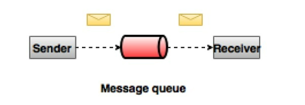

### 发布订阅消息系统

在该模式中，消息被保留在主题中。与点对点系统不同，消费者可以订阅一个或多个主题并使用，使用者被称为订阅者。类似于广播，如果你关注了该频道，那么他的消息随时可以读取

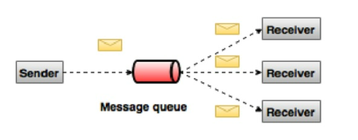

# kafka

## 概念

### 什么是kafka

kafka是一个分布式发布订阅消息系统和一个强大的队列，可以处理大量的数据，并且可以使用它将消息从一个端点传递到另一个端点。kafka适合离线和在线消息消费。kafka消息保留在磁盘上，并在集群里复制用以防止数据丢失。kafka构建在zookeeper同步服务之上。和storm和Spark很好的集成，用于实时流式数据分析。

#### 优点

-   可靠性 
    -   kafka是分布式，分区，复制，容错的。
-   可扩展性
    -   kafka消息传递系统无需停机扩展
-   耐用性
    -   kafka使用分布式提交日志，这意味着消息会尽可能快速的保存在磁盘上，因此它是持久的。
-   性能
    -   kafka对于发布和订阅消息都具有高吞吐量。即使存储了许多的TB消息，他也保持稳定的性能。

#### 用途

-   指标
    -   通常用于操作监控数据。这涉及集合来自分布式应用程序的统计信息，以产生操作数据的集中馈送。
-   日志聚合解决方案
    -   kafka可用于跨组织从多个服务收集日志，并使它们以标准格式提供给多个服务器
-   流处理
    -   流行的框架（Storm和Spark Streaming）从主题中读取数据，对其进行处理，并将处理后的数据写入新的主题，共给用户和应用程序使用。

## 简介

1）生产者消费者模型

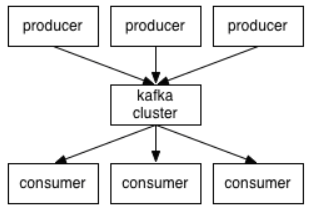

2）broker：Kafka集群中有很多台Server，其中每一台Server都可以存储消息，将一台Server称为一个Kafka实例，也叫做broker。

3）topic：一个topic里保存的是同一类消息，相对于消息的分类，每个producer将消息发送到kafka中，都需要指名要存档的topic。

4）partition：每个topic都可以分成多个partition，每个partition在存储层面都是append log 文件。任何发布到此 partition 的消息都会被直接追加到 log 文件的尾部。

>为什么要进行分区呢？最根本的原因就是：kafka基于文件进行存储，当文件内容大到一定程度时，很容易达到单个磁盘的上限，因此，采用分区的办法，一个分区对应一个文件，这样就可以将数据分别存储到不同的server上去，另外这样做也可以负载均衡，容纳更多的消费者。

5）Offset：一个分区对应一个磁盘上的文件，而消息在文件中的位置就称为 offset（偏移量），offset 为一个 long 型数字，它可以唯一标记一条消息。由于kafka 并没有提供其他额外的索引机制来存储 offset，文件只能顺序的读写，所以在kafka中几乎不允许对消息进行“随机读写”。

#### 整体数据流程


#### 数据生产过程

​		  对于生产者要写入的一条记录，可以指定四个参数：分别是 topic、partition、key 和 value，其中 topic 和 value（要写入的数据）是必须要指定的，而 key 和 partition 是可选的。

  对于一条记录，先对其进行序列化，然后按照 Topic 和 Partition，放进对应的发送队列中。如果 Partition 没填，那么情况会是这样的：a、Key 有填。按照 Key 进行哈希，相同 Key 去一个 Partition。b、Key 没填。Round-Robin 来选 Partition。

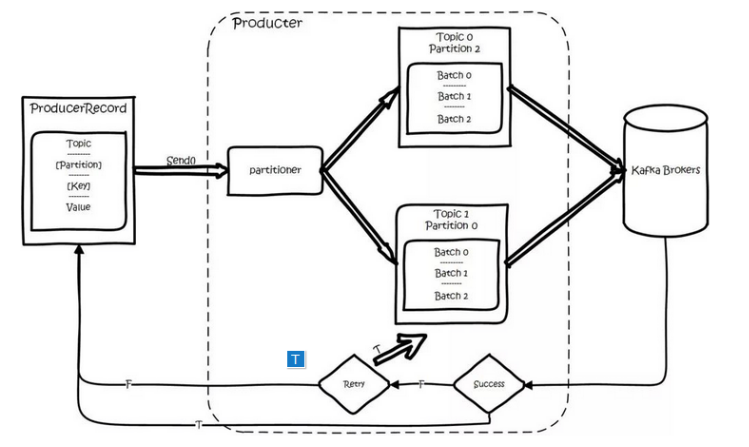

producer 将会和Topic下所有 partition leader 保持 socket 连接，消息由 producer 直接通过 socket 发送到 broker。其中 partition leader 的位置( host : port )注册在 zookeeper 中，producer 作为 zookeeper client，已经注册了 watch 用来监听 partition leader 的变更事件，因此，可以准确的知道谁是当前的 leader。

  producer 端采用异步发送：将多条消息暂且在客户端 buffer 起来，并将他们批量的发送到 broker，小数据 IO 太多，会拖慢整体的网络延迟，批量延迟发送事实上提升了网络效率。

#### 数据消费过程

 对于消费者，不是以单独的形式存在的，每一个消费者属于一个 consumer group，一个 group 包含多个 consumer。特别需要注意的是：订阅 Topic 是以一个消费组来订阅的，发送到 Topic 的消息，只会被订阅此 Topic 的每个 group 中的一个 consumer 消费。

  如果所有的 Consumer 都具有相同的 group，那么就像是一个点对点的消息系统；如果每个 consumer 都具有不同的 group，那么消息会广播给所有的消费者。

  具体说来，这实际上是根据 partition 来分的，一个 Partition，只能被消费组里的一个消费者消费，但是可以同时被多个消费组消费，消费组里的每个消费者是关联到一个 partition 的，因此有这样的说法：对于一个 topic,同一个 group 中不能有多于 partitions 个数的 consumer 同时消费,否则将意味着某些 consumer 将无法得到消息。

  同一个消费组的两个消费者不会同时消费一个 partition。

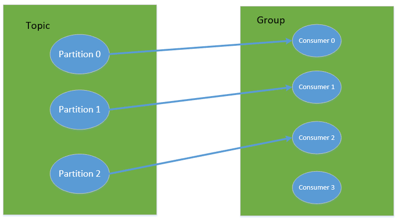

  在 kafka 中，采用了 pull 方式，即 consumer 在和 broker 建立连接之后，主动去 pull(或者说 fetch )消息，首先 consumer 端可以根据自己的消费能力适时的去 fetch 消息并处理，且可以控制消息消费的进度(offset)。

  partition 中的消息只有一个 consumer 在消费，且不存在消息状态的控制，也没有复杂的消息确认机制，可见 kafka broker 端是相当轻量级的。当消息被 consumer 接收之后，需要保存 Offset 记录消费到哪，以前保存在 ZK 中，由于 ZK 的写性能不好，以前的解决方法都是 Consumer 每隔一分钟上报一次，在 0.10 版本后，Kafka 把这个 Offset 的保存，从 ZK 中剥离，保存在一个名叫 consumeroffsets topic 的 Topic 中，由此可见，consumer 客户端也很轻量级。

## 启动

**提前安装好kafka**

```shell
# 启动zookeeper
bin/zookeeper-server-start.sh config/zookeeper.properties
# 启动kafka
bin/kafka-server-start.sh config/server.properties
# 可以使用jps命令查看
821 QuorumPeerMain
928 Kafka
931 Jps
```

### 单节点 - 单代理配置

```shell
# 创建一个名为Hello-Kafka的主题
bin/kafka-topics.sh --create --zookeeper localhost:2181 --replication-factor 1   
--partitions 1 --topic Hello-Kafka
# 响应如下
Created topic "Hello-Kafka".
```

#### 获取主题列表

**语法**

```shell
bin/kafka-topics.sh --list --zookeeper localhost:2181
```

**输出**

```shell
Hello-Kafka
```

#### 启动生产者以发送消息

**语法**

```shell
bin/kafka-console-producer.sh --broker-list localhost:9092 --topic topic-name
```

**示例**

```shell
bin/kafka-console-producer.sh --broker-list localhost:9092 --topic Hello-Kafka
# 输入
Hello
My first message
My second message
```

#### 启动消费者以接收消息

**语法**

```shell
bin/kafka-console-consumer.sh --zookeeper localhost:2181 —topic topic-name --from-beginning
```

**示例**

```shell
bin/kafka-console-consumer.sh --zookeeper localhost:2181 —topic Hello-Kafka --from-beginning
```

**输出**

```shell
Hello
My first message
My second message
```

### 单节点多代理配置

复制多个`config/server.properties`修改以下信息

```properties
# The id of the broker. This must be set to a unique integer for each broker.
# 另一份配置2
broker.id=1 
# The port the socket server listens on
# 另一份配置9094
port=9093 
# A comma seperated list of directories under which to store log files
# 另一份配置/tmp/kafka-logs-2
log.dirs=/tmp/kafka-logs-1
```

启动

```shell
➜  ~ jps
12370 Kafka
12519 Jps
12362 Kafka
12059 QuorumPeerMain
12317 Kafka
```

>   产生上述的响应，说明守护进程启动成功

#### 创建主题
**示例**

```shell
➜  kafka_2.11-0.9.0.0 bin/kafka-topics.sh \
--create \
--zookeeper localhost:2181 \
--replication-factor 3 \
-partitions 1 \
--topic Mybroker  

bin/kafka-topics.sh --create --topic binlog --bootstrap-server localhost:9092# 创建主题
bin/kafka-topics.sh  --bootstrap-server localhost:9092 --list # 查看所有主题
```
**输出**
```shell
Created topic "Mybroker".
```

**`Describe` 命令用于检查哪个代理正在侦听当前创建的主题**

```shell
bin/kafka-topics.sh \
--describe \
--zookeeper localhost:2181 \
--topic Mybroker
```

**输出**

```shell
Topic:Mybroker	PartitionCount:1	
ReplicationFactor:3	Configs:

Topic: Mybroker	Partition: 0	Leader: 2	
Replicas: 2,1,0	Isr: 2,1,0
```

#### 启动生产者以发送消息

此过程保持与单代理设置中相同。

**示例**

```shell
bin/kafka-console-producer.sh --broker-list localhost:9092 --topic Mybroker
```

**输出 / 输入**

```shell
WARN Property topic is not valid (kafka.utils.Verifia-bleProperties)
This is single node-multi broker demo
This is the second message
```

#### 启动消费者以接收消息

此过程保持与单代理设置中所示的相同。

**示例**

```shell
bin/kafka-console-consumer.sh --zookeeper localhost:2181 —topic Mybroker --from-beginning
```

**输出**

```shell
This is single node-multi broker demo
This is the second message
```

### 其他语法

#### 删除主题

要删除主题，可以使用以下语法。

**语法**

```shell
bin/kafka-topics.sh 
--zookeeper localhost:2181 
--delete 
--topic topic_name
```

#### 修改主题

**语法**

```shell
bin/kafka-topics.sh 
—zookeeper localhost:2181 
--alter 
--topic topic_name 
--parti-tions count
```

### 使用Kafka Connect导入

1. 确保`connect-file-2.8.1.jar`路径添加到`plugin.path`的属性配置中。
2. 编辑`config/connect-standalone.properties`文件，添加或更改`plugin.path`配置属性匹配以下，并保存文件

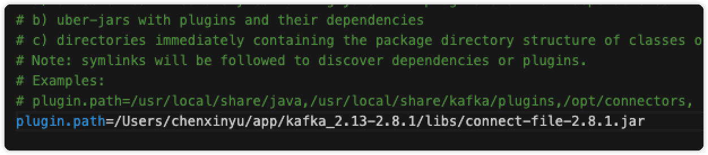

3. 创建一个文件进行测试读取

```shell
echo -e "foo\nbar" > test.txt
```

4. 以某个独立模式运行连接器，这表示将在单个本地专用进程中运行。
   - 参数1：Kafka Connect进程的配置
   - 其余配置文件每个都需要指定一个要创建的连接器

```shell
bin/connect-standalone.sh config/connect-standalone.properties config/connect-file-source.properties config/connect-file-sink.properties
```

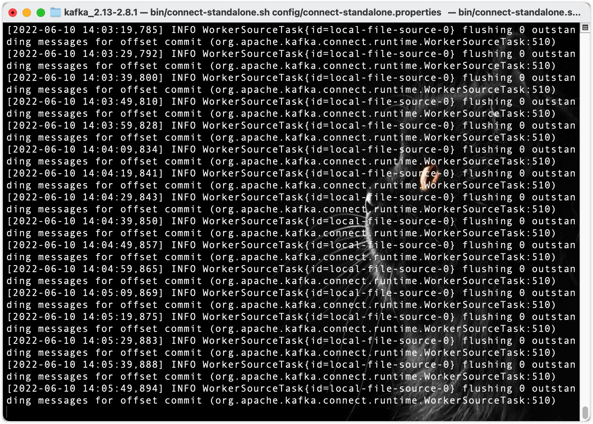

5. 一旦进程开始，源连接器应该开始从主题读取行，`test.txt`文件并将他们生成到主题`connect-test`，接收器可以从`connect-test`主题读取消息，并且当新数据写入时，可以从整个管道传递。

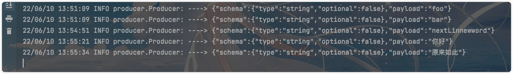

### 使用kafka streams 处理事件

java链接kafka

```xml
<dependency>
  <groupId>org.apache.kafka</groupId>
  <artifactId>kafka_2.13</artifactId>
  <version>2.8.1</version>
</dependency>
<dependency>
  <groupId>org.apache.kafka</groupId>
  <artifactId>kafka-clients</artifactId>
  <version>2.8.1</version>
</dependency>
```

**Producer**

```java
package com.cxy;

import org.apache.kafka.clients.producer.*;
import org.apache.kafka.common.serialization.StringSerializer;
import org.apache.log4j.Logger;

import java.util.Properties;

/************************************************************
 * @ProjectName   : kafka-study
 * @ClassName     : ProducerTest
 * @author        : chenxinyu
 * @createTime    : 2022/6/8
 ************************************************************/
public class ProducerTest {

    static Logger log = Logger.getLogger(Producer.class);

    private static final String TOPIC = "Hello-Kafka";
    private static final String BROKER_LIST = "localhost:9092";
    private static KafkaProducer<String,String> producer = null;

    /*
    初始化生产者
     */
    static {
        Properties configs = initConfig();
        producer = new KafkaProducer<String, String>(configs);
    }

    /*
    初始化配置
     */
    private static Properties initConfig(){
        Properties properties = new Properties();
        properties.put(ProducerConfig.BOOTSTRAP_SERVERS_CONFIG,BROKER_LIST);
        properties.put(ProducerConfig.KEY_SERIALIZER_CLASS_CONFIG, StringSerializer.class.getName());
        properties.put(ProducerConfig.VALUE_SERIALIZER_CLASS_CONFIG,StringSerializer.class.getName());
        return properties;
    }

    public static void main(String[] args) throws InterruptedException {
        //消息实体
        ProducerRecord<String , String> record = null;
        for (int i = 0; i < 1000; i++) {
            record = new ProducerRecord<String, String>(TOPIC, "value"+(int)(10*(Math.random())));
            //发送消息
            producer.send(record, (recordMetadata, e) -> {
                if (null != e){
                    log.info("send error" + e.getMessage());
                }else {
                    System.out.printf("offset:%s,partition:%s%n", recordMetadata.offset(), recordMetadata.partition());
                }
            });
        }
        producer.close();
    }
}
```

**Consumer**

```java
package com.cxy;

import org.apache.kafka.clients.consumer.*;
import org.apache.kafka.clients.producer.Producer;
import org.apache.log4j.Logger;
import java.util.Arrays;
import java.util.Properties;

/************************************************************
 * @ProjectName   : kafka-study
 * @ClassName     : ConsumerTest
 * @author        : chenxinyu
 * @createTime    : 2022/6/8
 ************************************************************/
public class ConsumerTest {
    static Logger log = Logger.getLogger(Producer.class);

    private static final String TOPIC = "Hello-Kafka";
    private static final String BROKER_LIST = "localhost:9092";
    private static KafkaConsumer<String,String> consumer = null;

    static {
        Properties configs = initConfig();
        consumer = new KafkaConsumer<String, String>(configs);
        consumer.subscribe(Arrays.asList(TOPIC,"connect-test"));
    }

    private static Properties initConfig(){
        Properties properties = new Properties();
        properties.put("bootstrap.servers",BROKER_LIST);
        properties.put("group.id","0");
        properties.put("key.deserializer", "org.apache.kafka.common.serialization.StringDeserializer");
        properties.put("value.deserializer", "org.apache.kafka.common.serialization.StringDeserializer");
        properties.setProperty("enable.auto.commit", "true");
        properties.setProperty("auto.offset.reset", "earliest");
        return properties;
    }


    public static void main(String[] args) {
        while (true) {
            ConsumerRecords<String, String> records = consumer.poll(10);
            for (ConsumerRecord<String, String> record : records) {
                log.info("----> " + record.value());
            }
        }
    }
}

```


## mysql消息实时更新到kafka

### 开启binlog日志

- 修改my.cnf配置

```shell
[mysqld]
log-bin=mysql-bin  # 开启binlog
binlog-format=ROW  # 设置Binary Log记录方式为Row
server_id=1 
```

- 重启Mysql

```shell
mysql.server restart
```

- 查看开启状态和监控模式

```mysql
mysql> show variables like 'log_bin';
+---------------+-------+
| Variable_name | Value |
+---------------+-------+
| log_bin       | ON    |
+---------------+-------+
1 row in set (0.00 sec)

mysql> show variables like 'binlog_format';
+---------------+-------+
| Variable_name | Value |
+---------------+-------+
| binlog_format | ROW   |
+---------------+-------+
1 row in set (0.00 sec)
```

### 编写binlog同步到Kafka代码

#### Springboot需要的Maven依赖

```xml
<!--springboot-->
<dependency>
  <groupId>org.springframework.boot</groupId>
  <artifactId>spring-boot-starter-web</artifactId>
</dependency>
<!--lombok-->
<dependency>
  <groupId>org.projectlombok</groupId>
  <artifactId>lombok</artifactId>
  <optional>true</optional>
</dependency>
<!--binlog-connector-->
<dependency>
  <groupId>com.github.shyiko</groupId>
  <artifactId>mysql-binlog-connector-java</artifactId>
  <version>0.21.0</version>
</dependency>
<!--fastjson-->
<dependency>
  <groupId>com.alibaba</groupId>
  <artifactId>fastjson</artifactId>
  <version>1.2.49</version>
</dependency>
<!--kafka-->
<dependency>
  <groupId>org.springframework.kafka</groupId>
  <artifactId>spring-kafka</artifactId>
</dependency>
<dependency>
  <groupId>org.apache.kafka</groupId>
  <artifactId>kafka-clients</artifactId>
  <version>2.8.1</version>
</dependency>
<!--log4j-->
<dependency>
  <groupId>log4j</groupId>
  <artifactId>log4j</artifactId>
  <version>1.2.17</version>
</dependency>
```

#### 配置

```properties
server.port=9876

# binlog配置
server.id=1
binlog.host=xxx.xxx.xxx.xxx
binlog.port=3306
binlog.user=xxxx
binlog.password=xxxx
# 指定监听的表格
binlog.database.table=cems.com_chat

# kafka
spring.kafka.bootstrap-servers=localhost:9092
kafka.topic=binlog
kafka.partNum=3
kafka.repeatNum=1
```

#### 实体类编写

**BinlogDto**

```java
package com.example.mysqlconnectkafka.pojo;

import lombok.AllArgsConstructor;
import lombok.Builder;
import lombok.Data;
import lombok.NoArgsConstructor;
import lombok.experimental.Accessors;

/************************************************************
 * @ProjectName   : mysql-connect-kafka
 * @ClassName     : BinlogDto
 * @author        : chenxinyu
 * @createTime    : 2022/6/10
 ************************************************************/
@Data
@Builder
@NoArgsConstructor
@AllArgsConstructor
@Accessors(chain = true)
public class BinlogDto {
    private String event;
    private Object value;
}
```

**Message**

```java
package com.example.mysqlconnectkafka.pojo;

import lombok.AllArgsConstructor;
import lombok.Builder;
import lombok.Data;
import lombok.NoArgsConstructor;
import lombok.experimental.Accessors;
import java.util.Date;

/************************************************************
 * @ProjectName   : mysql-connect-kafka
 * @ClassName     : Message
 * @author        : chenxinyu
 * @createTime    : 2022/6/10
 ************************************************************/
@Data
@NoArgsConstructor
@AllArgsConstructor
@Builder
@Accessors(chain = true)
public class Message {
    private Long id;
    private String msg;
    private Date sendTime;
}

```

#### 编写kafkaSender

```java
package com.example.mysqlconnectkafka.kafka;

import com.alibaba.fastjson.JSON;
import com.example.mysqlconnectkafka.pojo.Message;
import lombok.RequiredArgsConstructor;
import org.apache.kafka.clients.admin.AdminClient;
import org.apache.kafka.clients.admin.AdminClientConfig;
import org.apache.kafka.clients.admin.NewTopic;
import org.springframework.beans.factory.annotation.Autowired;
import org.springframework.kafka.core.KafkaTemplate;
import org.springframework.stereotype.Component;
import org.springframework.stereotype.Service;
import java.util.Arrays;
import java.util.Date;
import java.util.List;
import java.util.Properties;
import java.util.concurrent.TimeUnit;

/************************************************************
 * @ProjectName   : mysql-connect-kafka
 * @ClassName     : KafkaSender
 * @author        : chenxinyu
 * @createTime    : 2022/6/10
 ************************************************************/
@Service
@RequiredArgsConstructor
public class KafkaSender {

    private final KafkaTemplate kafkaTemplate;

    public void createTopic(String host, String topic, int partNum, short repeatNum) {
        Properties props = new Properties();
        props.setProperty(AdminClientConfig.BOOTSTRAP_SERVERS_CONFIG, host);
        NewTopic newTopic = new NewTopic(topic, partNum, repeatNum);
        AdminClient adminClient = AdminClient.create(props);
        List<NewTopic> topicList = Arrays.asList(newTopic);
        adminClient.createTopics(topicList);
        adminClient.close(10, TimeUnit.SECONDS);
    }

    public void send(String topic, String msg) {
        kafkaTemplate.send(topic, JSON.toJSONString(msg));
        kafkaTemplate.send(topic, msg);
    }
}

```

#### 编写Binlog检测类

```java
package com.example.mysqlconnectkafka.kafka;

import com.alibaba.fastjson.JSON;
import com.example.mysqlconnectkafka.pojo.BinlogDto;
import com.github.shyiko.mysql.binlog.BinaryLogClient;
import com.github.shyiko.mysql.binlog.event.*;
import lombok.RequiredArgsConstructor;
import org.springframework.beans.factory.annotation.Value;
import org.springframework.boot.CommandLineRunner;
import org.springframework.scheduling.annotation.Async;
import org.springframework.stereotype.Component;

import java.io.Serializable;
import java.util.Arrays;
import java.util.HashMap;
import java.util.List;
import java.util.Map;

/************************************************************
 * @ProjectName   : mysql-connect-kafka
 * @ClassName     : BinlogClientRunner
 * @author        : chenxinyu
 * @createTime    : 2022/6/10
 ************************************************************/
@Component
@RequiredArgsConstructor
public class BinlogClientRunner implements CommandLineRunner {

    @Value("${binlog.host}")
    private String host;

    @Value("${binlog.port}")
    private int port;

    @Value("${binlog.user}")
    private String user;

    @Value("${binlog.password}")
    private String password;

    // binlog server_id
    @Value("${server.id}")
    private long serverId;

    // kafka话题
    @Value("${kafka.topic}")
    private String topic;

    // kafka分区
    @Value("${kafka.partNum}")
    private int partNum;

    // Kafka备份数
    @Value("${kafka.repeatNum}")
    private short repeatNum;

    // kafka地址
    @Value("${spring.kafka.bootstrap-servers}")
    private String kafkaHost;

    // 指定监听的数据表
    @Value("${binlog.database.table}")
    private String database_table;

    private final KafkaSender kafkaSender;

    @Async
    @Override
    public void run(String... args) throws Exception {
        // 创建topic
        kafkaSender.createTopic(kafkaHost, topic, partNum, repeatNum);
        // 获取监听数据表数组
        List<String> databaseList = Arrays.asList(database_table.split(","));
        HashMap<Long, String> tableMap = new HashMap<>();
        // 创建binlog监听客户端
        BinaryLogClient client = new BinaryLogClient(host, port, user, password);
        client.setServerId(serverId);
        client.registerEventListener((event -> {
            // binlog事件
            EventData data = event.getData();
            if (data != null) {
                if (data instanceof TableMapEventData) {
                    TableMapEventData tableMapEventData = (TableMapEventData) data;
                    tableMap.put(tableMapEventData.getTableId(), tableMapEventData.getDatabase() + "." + tableMapEventData.getTable());
                }
                // update数据
                if (data instanceof UpdateRowsEventData) {
                    UpdateRowsEventData updateRowsEventData = (UpdateRowsEventData) data;
                    String tableName = tableMap.get(updateRowsEventData.getTableId());
                    if (tableName != null && databaseList.contains(tableName)) {
                        String eventKey = tableName + ".update";
                        for (Map.Entry<Serializable[], Serializable[]> row : updateRowsEventData.getRows()) {
                            String msg = JSON.toJSONString(BinlogDto.builder().event(eventKey).value(row).build());
                            kafkaSender.send(topic, msg);
                        }
                    }
                }
                // insert数据
                else if (data instanceof WriteRowsEventData) {
                    WriteRowsEventData writeRowsEventData = (WriteRowsEventData) data;
                    String tableName = tableMap.get(writeRowsEventData.getTableId());
                    if (tableName != null && databaseList.contains(tableName)) {
                        String eventKey = tableName + ".insert";
                        for (Serializable[] row : writeRowsEventData.getRows()) {
                            String msg = JSON.toJSONString(BinlogDto.builder().event(eventKey).value(row).build());
                            kafkaSender.send(topic, msg);
                        }
                    }
                }
                // delete数据
                else if (data instanceof DeleteRowsEventData) {
                    DeleteRowsEventData deleteRowsEventData = (DeleteRowsEventData) data;
                    String tableName = tableMap.get(deleteRowsEventData.getTableId());
                    if (tableName != null && databaseList.contains(tableName)) {
                        String eventKey = tableName + ".delete";
                        for (Serializable[] row : deleteRowsEventData.getRows()) {
                            String msg = JSON.toJSONString(BinlogDto.builder().event(eventKey).value(row).build());
                            kafkaSender.send(topic, msg);
                        }
                    }
                }
            }
        }));
        client.connect();
    }
}
```

#### 检查注解

```java
@EnableAsync #这个是异步方法需要的注解，直接配在启动类上
```

#### 启动

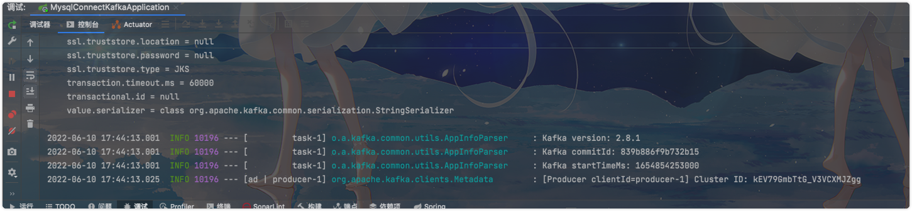

#### 修改检测表的数据

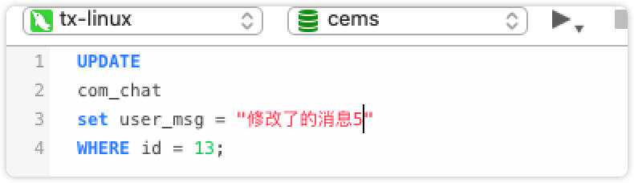

#### 查看kafak消息

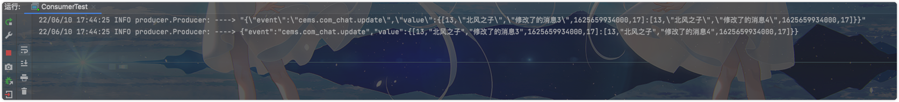
