[toc]

# Redis笔记

## noSQL数据库

NoSQL，指的是非关系型的数据库。NoSQL有时也称作Not Only SQL的缩写。

NoSQL用于超大规模数据的存储。（例如谷歌或Facebook每天为他们的用户收集万亿比特的数据）。这些类型的数据存储不需要固定的模式，无需多余操作就可以横向扩展。

### Redis

（Remote Dictionary Server )，即远程字典服务，是一个开源的使用ANSI [C语言](https://baike.baidu.com/item/C语言)编写、支持网络、可基于内存亦可持久化的日志型、Key-Value[数据库](https://baike.baidu.com/item/数据库/103728)，并提供多种语言的API。

> redis默认安装路径
>
> `usr/local/bin`

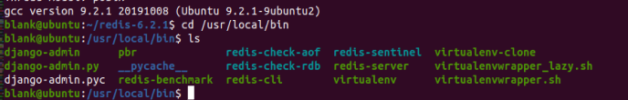

redis支持的数据类型:

> redis支持五种类型的数据结构String(字符串)、Hash(字典）、List(列表)、Set(集合)、Sorted Set(有序集合)。

redis对比mysql

> - mysql时关系型数据库,redis是非关系数据库
> - mysql存放在硬盘上,所以读取速度相对于redis慢,redis放在内存种,适合存放热数据 
> - mysql可以存储更大规模的数据库,redis只能存小型数据K-V数据库

## Redis常用命令

> - 登录 `redis-cli -p 5566 -a password`
> - 检查key是否存在 `EXISTS key`
> - 搜索某关键字 `KSYS *4`
> - 返回一个Key所影响的vsl的类型 `TYPE key`
> - 开启redis服务 redis-server 文件夹redis.conf

### string命令

>- 设置一个键的值 `SET key value`
>- 获取一个建的值 `GET key`
>- 删除键对 `DEL key`
>- 同时获取多个 `mget key1 key2`

### Hash命令

> - 设置一个hash HMSET key valueKey value --<key,<valueKey,value>>
> - 获取hash所有key&value HGETALL key
> - 获取hash所有key HKEYS key
> - 获取hash所有keu的vslue HVALS key
> - 获取hash内键值对的长度 HLEN key
> - 给一个hash的某个键值对赋值 HSET key valueKey value
> - 当hash中valueKey不存在时赋值 HSETNX key valueKey value

### List命令

> - 给list赋值 `LPUSH listName value`
> - 按照索引取值 `LINDEX listName 1`

## redis使用

### redis启动报错

> WARNING: The TCP backlog setting of 511 cannot be enforced because /proc/sys/net/core/somaxconn is set to the lower value of 128.
>
> 设置
>
> ```linux
> # 修改linux系统内核参数
> [redis-5.0.8]$ vim /etc/sysctl.conf
> ...
> # 添加内容
> net.core.somaxconn = 1024
> vm.overcommit_memory = 1
> # 添加完成后，刷新内核参数，立即生效
> [redis-5.0.8]$ /sbin/sysctl -p
> ```
>
> 无法刷新内核 -->
>
> 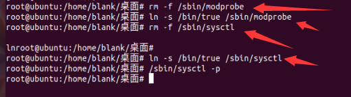

### 启动

copy配置文件到自己创建的问价夹种,保证安全性

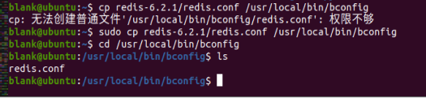

修改配置文件

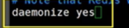

通过自定义配置文件启动redis服务

后台启动`根据说明，把daemonize设置为yes`

`redis-server /路径/redis.conf`

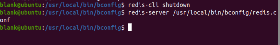

测试

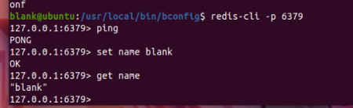

查看端口号 `ps -ef|grep redis`

### redis-benchmark

官方自带的压力测试工具

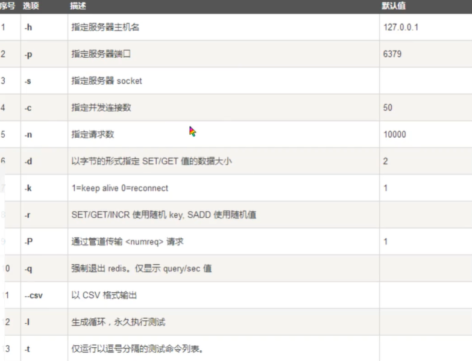

```sql
# 测试100个并发连接 每个连接100000个请求
redis-benchmark -h localhost -p 6379 -c 100 -n 10000
```

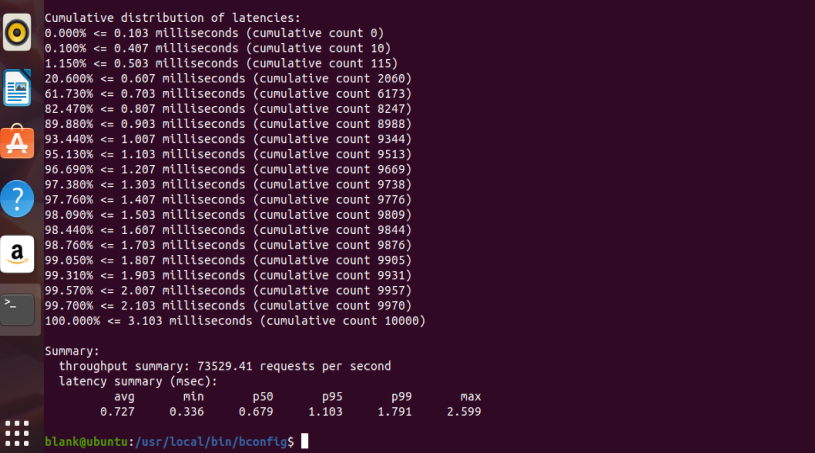

### redis入门知识

> redis默认数据库---16个(使用select切换数据库)

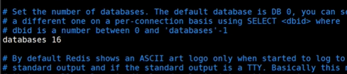

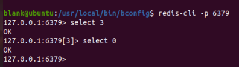

查看大小

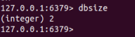

查看所有的key`get *`

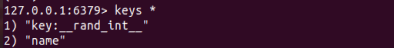

清空当前库 `flushdb`

清空全部`flushall`

> redis是单线程的 !

redis的速度基于内存操作,CPU不是redis的性能瓶颈,redis的瓶颈根据机器的内存和带宽,所以是用来单线程!

对于内存系统来说,没有上下文切换,效率就高,所以redis使用单线程

