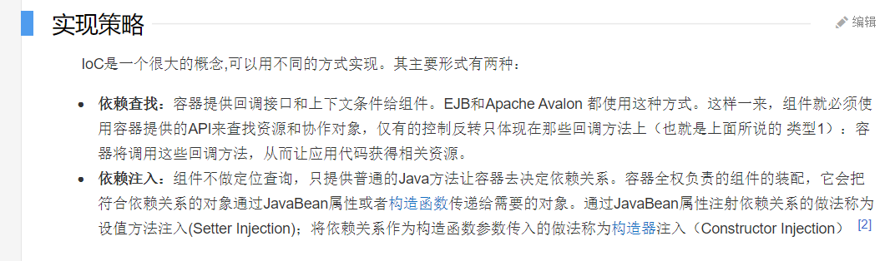

[toc]

# 1 Spring

****

spring 轻量级的控制反转(IOC) 和面向切面编程(AOP)

```xml
<!--spring maven仓库地址 -->
<dependency>
    <groupId>org.springframework</groupId>
    <artifactId>spring-webmvc</artifactId>
    <version>5.3.4</version>
</dependency>

<!--spring-jdbc maven仓库地址 -->
<dependency>
    <groupId>org.springframework</groupId>
    <artifactId>spring-jdbc</artifactId>
    <version>5.3.4</version>
</dependency>

<!--junit maven仓库地址 -->
<dependency>
  <groupId>junit</groupId>
  <artifactId>junit</artifactId>
  <version>4.12</version>
  <scope>test</scope>
</dependency>

<!--mybatis maven仓库地址 -->
<dependency>
  <groupId>org.mybatis</groupId>
  <artifactId>mybatis</artifactId>
  <version>3.5.2</version>
</dependency>

<!--mysql-connector-java maven仓库地址 -->
<dependency>
  <groupId>mysql</groupId>
  <artifactId>mysql-connector-java</artifactId>
  <version>8.0.21</version>
  <scope>provided</scope>
</dependency>

<!--jsp maven仓库地址 -->
<dependency>
  <groupId>javax.servlet.jsp</groupId>
  <artifactId>javax.servlet.jsp-api</artifactId>
  <version>2.3.3</version>
</dependency>

<!--servlet maven仓库地址 -->
<dependency>
  <groupId>javax.servlet</groupId>
  <artifactId>servlet-api</artifactId>
  <version>2.5</version>
</dependency>

<!--jstl maven仓库地址 -->
<dependency>
  <groupId>javax.servlet.jsp.jstl</groupId>
  <artifactId>jstl-api</artifactId>
  <version>1.2</version>
</dependency>

<!--taglibs maven仓库地址 -->
<dependency>
  <groupId>taglibs</groupId>
  <artifactId>standard</artifactId>
  <version>1.1.2</version>
</dependency>

```

## 1.1 spring组成


## 1.2 spring扩展


> spring Boot 
>
> >  可以快速开发单个微服务
>
> spring Cloud
>
> > 基于spring boot实现

## 1.3 IOC理论

>在原先的设计中, 一个需求在被更改的时候, 可能需要更改很多的原本业务内容
>
>```java
>接口1{
>   void get();
>}
>
>    实现1{
>        void get(){
>            //实现1
>        }
>      实现2{
>        void get(){
>            //实现2
>        }
>      实现3{
>          void get(){
>              //实现3
>          }
>        
>}
>          
>          
>给用户调用的方法 {
>    接口 a = new 实现1;
>   get(){
>       //业务
>   }
>}
>          
> 用户{
>     get()//调用方法
> }
>```
>
>用户如果更改需求,则需要将实现接口中的 代码更改
>
>```java
>给用户调用的方法 {
>    接口 a = new 实现2;
>   get(){
>       //业务
>   }
>}
>```
>
>程序员个人需要更改过多的业务代码
>
>但是如果用set去设置原本的接口
>
>```java
>给用户调用的方法 {
>    接口 a;
>    set接口(实现 参数名){
>        a = new 参数;
>    }
>   get(){
>       //业务
>   }
>}
>```
>
>那么就可以让用户自己去设置需要的业务

IOC**控制反转**（Inversion of Control，缩写为**IoC**）

是一种设计模式: 用来降低代码的耦合度



### 解除耦合


### spring控制反转

控制反转是一种通过某种描述(XML或者注解)去第三方获取特定对象的方式。在Spring中实现控制反转的是**IOC容器**,实现方式是依赖注入(Dependency Injection,DI)。

## 1.4 helloSpring

> 实现spring程序

```xml
spring配置
<dependency>
    <groupId>org.springframework</groupId>
    <artifactId>spring-webmvc</artifactId>
    <version>5.3.4</version>
</dependency>
```

> 配置bean.xml (纯净配置)

```xml
<?xml version="1.0" encoding="UTF-8"?>
<beans xmlns="http://www.springframework.org/schema/beans"
       xmlns:xsi="http://www.w3.org/2001/XMLSchema-instance"
       xsi:schemaLocation="http://www.springframework.org/schema/beans
        https://www.springframework.org/schema/beans/spring-beans.xsd">

        <!--自己的放里面-->
</beans>
```

> 配置
>
> ```xml
> <?xml version="1.0" encoding="UTF-8"?>
> <beans xmlns="http://www.springframework.org/schema/beans"
>        xmlns:xsi="http://www.w3.org/2001/XMLSchema-instance"
>        xsi:schemaLocation="http://www.springframework.org/schema/beans
>         https://www.springframework.org/schema/beans/spring-beans.xsd">
> 
>     <bean id="mysql" class="com.cxy.dao.MysqlSee" scope='singleton'/>
>     <bean id="oracle" class="com.cxy.dao.OracleSee"/>
>     <bean id="self" class="com.cxy.dao.MyClass"/>
> 
>     <bean id ="UserImpl" class="com.cxy.service.UserImpal">
>         <property name="userImpl" ref="self" />
>     </bean>
> <!---->
> </beans>
> ```

> 测试
>
> ```java
> import com.cxy.service.UserImpal;
> import org.junit.Test;
> import org.springframework.context.ApplicationContext;
> import org.springframework.context.support.ClassPathXmlApplicationContext;
> 
> public class MyTest {
> 
>     @Test
>     public void Test(){
>         //获取application
>         ApplicationContext context = new ClassPathXmlApplicationContext("bean.xml");
>         UserImpal userImpl = (UserImpal) context.getBean("UserImpl");
> 
>         userImpl.getUserImpl();
> 
>     }
> }
> ```

优点: **用户只需要更新xml中的配置就可以更改输出结果**

## 1.5 IOC容器创建对象

### 无参构造

```xml
<bean>
	<property name="name" value="java" />
</bean>
```

IOC默认通过无参构造创建bean对象,对象在被getBean()的时候,通过无参构造创建,如果没有无参构造,则会报错.

如果只有有参构造,可以使用

### 有参构造

方式1

```xml
<bean id = "user" class="com.cxy.pojo.User">
    <!--通过下标赋值-->
    <constructor-arg index="0" value ="java" />
</bean>
```

方式2

```xml
<!--通过type类型赋值-->
<bean>
	<constructor-arg type="java.lang.String" value ="java" />
</bean>
```

方式3

```xml
<bean>
	<constructor-arg name="name" value="java"/>
</bean>
```

### IOC容器

在配置文件加载的时候 , 实例对象已经被初始化了 , 无论是否使用,IOC容器都会把对象加入到IOC容器中,构造方法会被调用。

## 1.6 别名

```xml
<alias name="user" alias="userNew"/>
```

## 1.7 bean属性

```xml
<!--
id : bean 的唯一标识符
class : bean对象的全类名
name : 别名  比alias更高级 , 可以取多个别名
		分割符使用任何分割符号都可 空格 , ; 
-->
<bean id="user" class="com.cxy.pojo.User" name="User,u2,u77">

</bean>
```

## 1.8 import

import一般用于团队开发 , 可以把多个xml合成一个

```xml
<import resource="xml1"/>
<import resource="xml2"/>
<import resource="xml3"/>
```

# 2 依赖注入


## 2.1 构造器注入

上面的

## 2.2 Set方式注入

​		依赖：所有对象依赖与容器

​		注入：所有对象的属性，由容器赋值

### 2.2.1 普通注入

```xml
<property name="" value=""/>
```

### 2.2.2 Bean注入

```xml
<property name="" ref="bean"/>
```

### 2.2.3 数组注入

```xml
<property name="">
	<array>
    	<value>1</value>
        <value>2</value>
        <value>3</value>
    </array>
</property>
```

### 2.2.4 map

```xml
<property name="">
	<map>
    	<enty key="" value="" />
        <enty key="" value="" />
    </map>
</property>
```

### 2.2.5 Set

```xml
<property name="">
	<set>
        <value>1</value>
        <value>1</value>
        <value>1</value>
    </set>
</property>
```

### 2.2.6 空值

```xml
<property name="" >
    <null />
</property>
```

### 2.2.7 Properties

```xml
<property name="" >
    <props>
    	<prop key="">value</pro p>
    </props>
</property>
```


## 2.3 拓展方式注入


### 2.3.1 p命令空间注入

无参构造器

```xml
xmlns:p="http://www.springframework.org/schma/p"

<bean name="" class="com.cxy.pojo.User" p:name=""/>
```

### 2.3.2 c命名空间参数

有参构造器

```xml
xmlns:c="http://www.springframework.org/schma/c"

<bean name="" class="com.cxy.pojo.User" c:name="" />
```


## 2.4 bean作用域

### 默认为单例模式

可以通过scope='singleton'更改

```xml
 <bean id="mysql" class="com.cxy.dao.MysqlSee" scope='singleton'/>
```

### **更改** 原型模式

```xml
 <bean id="mysql" class="com.cxy.dao.MysqlSee" scope='prototype'/>
```

### 其余在web开发中使用

# 3 自动装配

spring对bean自动装配

> 1.xml中自动装配 
>
> 在java中显配置
>
> 隐式自动装配

## 3.1 ByName制动装配

```xml
<bean id= "people" class="com.cxy.pojo.People" autowire="byName">
	<property name="name" value="my"/>
</bean>
```

## 3.2 ByType

```xml
<!--保证装配的内容全集唯一-->
<bean class="com.cxy.pojo.cat" />
<bean class="com.cxy.pojo.dog" />

<bean id= "people" class="com.cxy.pojo.People" autowire="byType">
	<property name="name" value="my"/>
</bean>
```

> --1 .byname ,保证所有bean的id唯一,并且这个bean有需要自动注入属性
>
> --2. bytype , 保证所有bean的class唯一,并且这个bean和需要装配的属性类型匹配

## 3.3 注解

```xml
导入约束
context约束
配置注解支持
<?xml version="1.0" encoding="UTF-8"?>
<beans xmlns="http://www.springframework.org/schema/beans"
    xmlns:xsi="http://www.w3.org/2001/XMLSchema-instance"
    xmlns:context="http://www.springframework.org/schema/context"
    xsi:schemaLocation="http://www.springframework.org/schema/beans
        https://www.springframework.org/schema/beans/spring-beans.xsd
        http://www.springframework.org/schema/context
        https://www.springframework.org/schema/context/spring-context.xsd">

    <context:annotation-config/>

</beans>

```

配置基本bean

```xml
<bean id = "xxx" class="com.cxy.pojo.xxxx"/>
```

@ArutoWired

- 加在要导入的属性上,或者set上

- 加上注解以后甚至不需要set方法(通过反射实现的)

- **required = false**:

- 如果有这个属性,标记的对象可以为null

@Resource 先通过name,找不到再通过type

# 4 . 使用注解开发

## 4.1 注解扫描引入

```xml
<context:component-scan base-package="com.cxy.pojo"/>

配合
@Component注解使用
```

```java
package com.cxy.pojo;

import org.springframework.stereotype.Component;

import java.sql.Date;

@Component
public class User {
    public int cid;
    public String cname,cnum,cpw;
    public Date cdate;
    public User(){}
    public User(int cid, String cname, String cnum, String cpw, Date cdate) {
        this.cid = cid;
        this.cname = cname;
        this.cnum = cnum;
        this.cpw = cpw;
        this.cdate = cdate;
    }

    public int getCid() {
        return cid;
    }

    public void setCid(int cid) {
        this.cid = cid;
    }

    public String getCname() {
        return cname;
    }

    public void setCname(String cname) {
        this.cname = cname;
    }

    public String getCnum() {
        return cnum;
    }

    public void setCnum(String cnum) {
        this.cnum = cnum;
    }

    public String getCpw() {
        return cpw;
    }

    public void setCpw(String cpw) {
        this.cpw = cpw;
    }

    public Date getCdate() {
        return cdate;
    }

    public void setCdate(Date cdate) {
        this.cdate = cdate;
    }

    @Override
    public String toString() {
        return "\nUser{" +
                "cid=" + cid +
                ", cname='" + cname + '\'' +
                ", cnum='" + cnum + '\'' +
                ", cpw='" + cpw + '\'' +
                ", cdate=" + cdate +
                '}';
    }
}

```


> 测试类
>
> ```java
>  @Test
>     public void text1(){
>         ApplicationContext context = new ClassPathXmlApplicationContext("applicationContext.xml");
>         User user = context.getBean("user", User.class);
>         System.out.println(user);
>     }
> ```

- @Component衍生注解
  - dao  ---@Repository
  - service ---@Service
  - controller ---@Controller

# 4 使用java配置spring

## 注解配置替代xml

- @Configuration

  ```java
  package com.cxy.config;
  import com.cxy.pojo.User;
  import org.springframework.context.annotation.Bean;
  import org.springframework.context.annotation.Configuration;
  @Configuration
  public class CxyConfig {
      @Bean
      public User user(){
          return new User();
      }
  }
  ```

  

> 建立测试类
>
> ```java
> public class MyTest {
>     @Test
>     public void Text1(){
>         ApplicationContext context = new AnnotationConfigApplicationContext(CxyConfig.class);
>         User user = context.getBean("user", User.class);
>         System.out.println(user);
>     }
> }
> ```
>
> 


