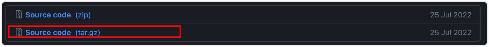

[toc]

# Apache Doris

## 简介

Apache Doris 是一个基于 MPP 架构的高性能实时分析数据库，以极快的速度和易用性着称。海量数据下返回查询结果仅需亚秒级响应时间，不仅可以支持高并发点查询场景，还可以支持高吞吐量的复杂分析场景。基于此，Apache Doris 可以更好地满足报表分析、即席查询、统一数据仓库、Data Lake 查询加速等场景。用户可以搭建**用户行为分析、AB 测试平台、日志检索分析、用户画像分析、订单分析**，以及在此之上的其他应用程序。

> **历史**
>
> Apache Doris 最初作为百度广告报道业务的 Palo 项目诞生，2017 年正式开源，2018 年 7 月由百度捐赠给 Apache 基金会进行孵化，由孵化器项目管理委员会成员指导孵化运营Apache 导师。目前，Apache Doris 社区已经聚集了来自不同行业近 100 家公司的 300 多名贡献者，每月活跃贡献者接近 100 人。Apache Doris 已成功从 Apache 孵化器毕业，并于 2022 年 6 月成为顶级项目。
>
> Apache Doris 现在在中国和全球拥有广泛的用户群，截至目前，Apache Doris 已在全球 700 多家公司的生产环境中使用。中国市值或估值排名前 50 的互联网公司中，超过 80% 长期使用 Apache Doris，包括百度、美团、小米、京东、字节跳动、腾讯、网易、快手、微博、客控股。它还广泛应用于金融、能源、制造、电信等一些传统行业。

### 使用场景

经过各种数据整合和处理后，数据源通常存储在实时数仓Doris和离线数据湖或数据仓库中


Apache Doris 广泛用于以下场景：

- 报告分析
  - 实时仪表板
  - 内部分析师和经理的报告
  - 面向用户或面向客户的高并发报表分析：如网站站长站点分析、广告主广告报表等场景，并发通常需要数千QPS，查询时延需要亚秒级响应。著名电商京东在广告报告中使用Doris，每天写入100亿行数据，并发查询QPS上万，99%查询延迟150ms。
- 即席查询。具有不规则查询模式和高吞吐量要求的面向分析师的自助式分析。小米基于Doris搭建了增长分析平台（Growth Analytics，GA），利用用户行为数据进行业务增长分析，平均查询延迟10秒，95%查询延迟30秒以内，上万每天的 SQL 查询数。
- 统一数据仓库建设。一个满足统一数据仓库建设需求，简化复杂数据软件栈的平台。海底捞基于Doris的统一数据仓库取代了`Apache Spark`、`Apache Hive`、`Apache Kudu`、`Apache HBase`、`Apache Phoenix`等旧架构，大大简化了架构。
- 数据湖查询。通过使用外部表联合位于 `Apache Hive`、`Apache Iceberg` 和 `Apache Hudi` 中的数据，在避免数据复制的同时大大提高了查询性能。

### 技术概述

Apache Doris的整体架构如下图所示。只有两种类型的进程。

- Forntend(FE):主要负责用户请求访问、查询解析与规划、元数据管理、节点管理
- Backend(BE):主要负责数据存储和查询计划执行

>两种类型的进程都可以横向扩展，单个集群最多可以支持数百台机器和数十PB的存储容量。而这两类流程通过一致性协议保证了服务的高可用和数据的高可靠性。这种高度集成的架构设计大大降低了分布式系统的运维成本


- Apache Doris 采用 MySQL 协议，高度兼容 MySQL 方言，支持标准 SQL。

- 在存储引擎方面

  - Doris采用列示存储

  - 支持排序复合键索引：最多可指定三列组成复合排序键。有了这个索引，可以对数据进行有效的剪枝，更好的支持高并发的报表场景。

  - Z-order index ：使用 Z-order indexing，您可以有效地对 schema 中的任何字段组合运行范围查询。

  - MIN/MAX 索引：有效过滤数字类型的等价和范围查询

  - Bloom Filter：对等价过滤和高基数列的剪枝非常有效

  - 反转索引：它可以快速搜索任何字段

- 在存储模型方面

  - 聚合键模型：通过预先聚合来合并具有相同键的值列，以显着提高性能。
  - 唯一密钥模型：密钥是唯一的。相同key的数据会被覆盖，实现行级数据更新。
  - Duplicate Key模型：详细的数据模型可以满足事实表的详细存储。

在查询引擎方面，Doris 采用 MPP 模型，节点间和节点内并行执行，还支持多张大表的分布式 shuffle join，可以更好地应对复杂的查询。


**Doris 查询引擎是向量化**的查询引擎，所有的内存结构能够按照列式布局，能够达到大幅减少虚函数调用、提升 Cache 命中率，高效利用 SIMD 指令的效果。在宽表聚合场景下性能是非向量化引擎的 5-10 倍。


**Doris 采用了 Adaptive Query Execution 技术，** 可以根据 Runtime Statistics 来动态调整执行计划，比如通过 Runtime Filter 技术能够在运行时生成生成 Filter 推到 Probe 侧，并且能够将 Filter 自动穿透到 Probe 侧最底层的 Scan 节点，从而大幅减少 Probe 的数据量，加速 Join 性能。Doris 的 Runtime Filter 支持 In/Min/Max/Bloom Filter。

在**优化器**方面 Doris 使用 CBO 和 RBO 结合的优化策略，RBO 支持常量折叠、子查询改写、谓词下推等，CBO 支持 Join Reorder。目前 CBO 还在持续优化中，主要集中在更加精准的统计信息收集和推导，更加精准的代价模型预估等方面

## 安装

### docker

1. 下载Docker镜像

```shell
docker pull apache/doris:build-env-ldb-toolchain-latest
```

检查镜像下载完成

```shell
docker images
```


2. 下载源码

[下载:https://github.com/apache/doris/releases](https://github.com/apache/doris/releases)

解压在本地



3. 挂载本地源码目录和m2目录

```shell
docker run -it -v /Users/chenxinyu/.m2:/root/.m2 -v /Users/chenxinyu/app/doris-1.1.1-rc03/:/Users/chenxinyu/app/doris-1.1.1-rc03/ apache/doris:build-env-ldb-toolchain-latest
```

4. 编译Doris

   1. 查看是否支持avx2指令集

   ```shell
   cat /proc/cpuinfo | grep avx2
   ```

   2. 编译

   ```shell
   # 不支持使用这个
   USE_AVX2=0  sh build.sh
   # 支持使用这个
   sh build.sh
   ```

   编译完成后，产出文件在 `output/` 目录中。


