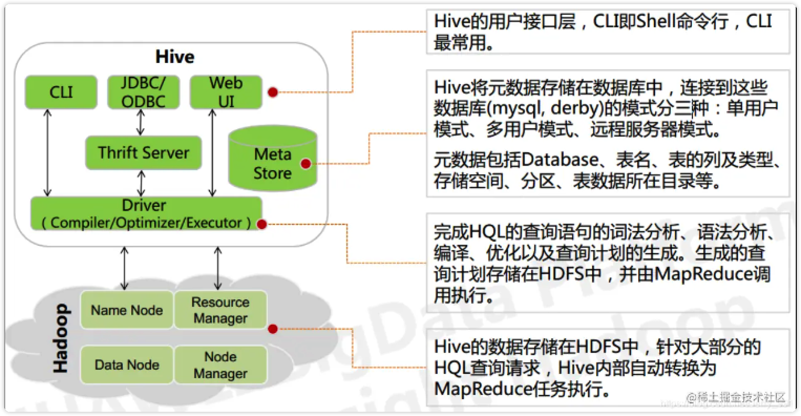

[toc]

# mac m1  安装hive

-   方式1`Homebrew`

```shell
➜  ~ brew install hive
```

>   我的m1 pro发生了如下错误
>
>   Error: openjdk@8: no bottle available!
>   You can try to install from source with:
>    brew install --build-from-source openjdk@8
>   Please note building from source is unsupported. You will encounter build
>   failures with some formulae. If you experience any issues please create pull
>   requests instead of asking for help on Homebrew's GitHub, Twitter or any other
>   official channels.
>
>   经过查找得知是m1芯片架构的homebrew问题，所以改用手动安装

-   方式2`手动`

    -   下载tar包

    ```shell
    # 解压
    ➜  ~ tar -zxvf xxxx.tar
    # 改个名字方便使用
    ➜  ~ mv apache-hive-3.1.2-bin hive
    ➜  ~ cd hive
    ```

    -   配置环境变量

    ```shell
    ➜  ~ vim ~/.bash_profile
    ➜  ~ export HIVE_HOME=/hive目录路径
    ➜  ~ export PATH=${PATH}:${HIVE_HOME}/bin
    # 刷新使其生效
    ➜  ~ source ~/.bash_profile
    ```

    -   修改配置文件

    ```shell
    ➜  ~ cd conf
    # 根据模板创建
    ➜  ~ cp hive-env.sh.template hive-env.sh
    # 修改HADOOP_HOME
    ➜  ~ vim hive-env.sh
    ➜  ~ HADOOP_HOME=你的HADOOP目录
    # 根据模板创建
    ➜  ~ cp hive-default.xml.template hive-site.xml
    # 修改为mysql配置好的元数据库
    ```

    -   hive-site

    ```xml
    <?xml version="1.0"?>
    <?xml-stylesheet type="text/xsl" href="configuration.xsl"?>
    
    <configuration>
            <property>
                    <name>javax.jdo.option.ConnectionURL</name>
                    <value>jdbc:mysql://***.***.***.***:3306/metastore?createDatabaseIfNotExist=true</value><!--MySQL地址metastore是元数据库的名称，需要在mysql中创建相同名字的数据库-->
            </property>
            <property>
                    <name>javax.jdo.option.ConnectionDriverName</name>
                    <value>com.mysql.cj.jdbc.Driver</value><!--MySQL驱动-->
            </property>
            <property>
                    <name>javax.jdo.option.ConnectionUserName</name>
                    <value>root</value><!--MySQL用户名-->
            </property>
            <property>
                    <name>javax.jdo.option.ConnectionPassword</name>
                    <value>******</value><!--MySQL密码-->
            </property>
            
            <property>
                    <name>hive.metastore.schema.verification</name>
                    <value>false</value>
            </property>
    
            <property>
                    <name>system:java.io.tmpdir</name>
                    <value>/tmp/hive/java</value>
            </property>
            <property>
                    <name>system:user.name</name>
                    <value>${user.name}</value>
            </property>
    
            <property>
                    <name>hive.server2.transport.mode</name>
                    <value>binary</value>
                    <description>
                            Expects one of [binary, http]. Transport mode of HiveServer2.
                    </description>
            </property>
    
            <property>
                    <name>hive.server2.thrift.port</name>
                    <value>10000</value>
                    <description>Port number of HiveServer2 Thrift interface when hive.server2.transport.mode is 'binary'.</description>
            </property>
    
            <property>
                    <name>hive.server2.webui.host</name>
                    <value>127.0.0.1</value>
            </property>
    
            <property>
                    <name>hive.server2.webui.port</name>
                    <value>10002</value>
            </property>
    
            <property>
                    <name>hive.server2.enable.doAs</name>
                    <value>false</value> 
            </property>
    
                    
    </configuration>
    ```
    
    -   初始化仓库
    
    ```shell
    # 初始化
    ➜  ~ schematool -initSchema -dbType mysql
    # 得到以下回复
    Initialization script completed
    schemaTool completed
    ```
    
    -   启动metastore服务
    
    ```shell
    ➜  bin ./hive --service metastore &
    [1] 61217
    
    ➜  bin 2022-05-18 16:54:06: Starting Hive Metastore Server
    SLF4J: Class path contains multiple SLF4J bindings.
    SLF4J: Found binding in [jar:file:/Users/chenxinyu/app/hive/lib/log4j-slf4j-impl-2.10.0.jar!/org/slf4j/impl/StaticLoggerBinder.class]
    SLF4J: Found binding in [jar:file:/opt/homebrew/Cellar/hadoop/3.3.2/libexec/share/hadoop/common/lib/slf4j-log4j12-1.7.30.jar!/org/slf4j/impl/StaticLoggerBinder.class]
    SLF4J: See http://www.slf4j.org/codes.html#multiple_bindings for an explanation.
    SLF4J: Actual binding is of type [org.apache.logging.slf4j.Log4jLoggerFactory]
    hive>
    ```
    


# Hive基础

>Hive 由 `Facebook` 实现并开源，是基于` Hadoop` 的一个数据仓库工具，可以将结构化的数据映射为一张数据库表，并提供 HQL(Hive SQL)查询功能，底层数据是存储在 `HDFS `上。Hive的本质是将 SQL 语句转换为 MapReduce 任务运行，使不熟悉 MapReduce 的用户很方便地利用 HQL 处理和计算 HDFS 上的结构化的数据，适用于离线的批量数据计算。
>
>Hive 依赖于 HDFS 存储数据，Hive 将 HQL 转换成 MapReduce 执行，所以说 Hive 是基于 Hadoop 的一个``数据仓库``工具，实质就是一款基于 HDFS 的 MapReduce计算框架，对存储在 HDFS 中的数据进行分析和管理。

## 简介

### 为什么要使用Hive

- 直接使用 MapReduce 所面临的问题：    
  - 人员学习成本太高   
  - 项目周期要求太短    
  - MapReduce 实现复杂查询逻辑开发难度太大
- 为什么要使用 Hive：    
  - 更友好的接口：操作接口采用类 SQL 的语法，提供快速开发的能力    
  - 更低的学习成本：避免了写 MapReduce，减少开发人员的学习成本    
  - 更好的扩展性：可自由扩展集群规模而无需重启服务，还支持用户自定义函数

### Hive的特点

- 优点
  - 可扩展性，横向扩展，Hive可以自由的扩展集群的规模，一般情况下不需要重启服务横向扩展：通过分担压力的方式扩展集群规模纵向扩展
  - 延展性，Hive支持自定义函数，用户可以根据自己的需求来实现自己的函数
  - 容错性，可以保障即使有节点出现问题，SQL语句仍可以完成执行
- 缺点
  - 不吃鸡记录级别的增删改操作，但是用户可以通过生成新表或者将查询结果导入到文件中
  - Hive查询时间很长，因为MapReduce Job的启动过程消耗很长时间，所以不能用在交互查询系统中
  - Hive不支持事务，主要用来做`OLAP(联机分析处理)`而不是`OLTP(联机事务处理)`

### 对比RDBMS

|    对比项    |          Hive          |         RDBMS          |
| :----------: | :--------------------: | :--------------------: |
|   查询语言   |          HQL           |          SQL           |
|   数据存储   |          HDFS          | Raw Device or Local FS |
|    执行器    |       Mapreduce        |        Executor        |
|   数据插入   | 支持批量导入和单条插入 |  支持单条或者批量导入  |
|   数据操作   |        覆盖追加        |      行级更新删除      |
| 处理数据规模 |           大           |           小           |
|   执行延时   |           高           |           低           |
|     分区     |          支持          |          支持          |
|     索引     |  0.8之后加入简单索引   |      支持复杂索引      |
|    扩展性    |        高（好）        |       有限（查）       |
| 数据加载模式 |     读时模式（快）     |     写时模式（慢）     |
|   应用场景   |      海量数据查询      |        实时查询        |

## Hive架构



## Hive特性

1.Hive 的存储结构包括数据库、表、视图、分区和表数据等。数据库，表，分区等等都对应 HDFS 上的一个目录。表数据对应 HDFS 对应目录下的文件。

2.Hive 中所有的数据都存储在 HDFS 中，没有专门的数据存储格式，因为 Hive 是读模式（Schema On Read），可支持 TextFile，SequenceFile，RCFile 或者自定义格式等

3.只需要在创建表的时候告诉 Hive 数据中的列分隔符和行分隔符，Hive 就可以解析数据    Hive 的默认列分隔符：控制符 Ctrl + A，\x01    Hive 的默认行分隔符：换行符 \n

4.Hive 中包含以下数据模型：

- database：在 HDFS 中表现为${hive.metastore.warehouse.dir}目录下一个文件夹   
- table：在 HDFS 中表现所属 database 目录下一个文件夹
- external table：与 table 类似，不过其数据存放位置可以指定任意 HDFS 目录路径
- partition：在 HDFS 中表现为 table 目录下的子目录
- bucket：在 HDFS 中表现为同一个表目录或者分区目录下根据某个字段的值进行 hash 散列之后的多个文件    
- view：与传统数据库类似，只读，基于基本表创建

5.Hive 的元数据存储在 RDBMS 中，除元数据外的其它所有数据都基于 HDFS 存储。默认情况下，Hive 元数据保存在内嵌的 Derby 数据库中，只能允许一个会话连接，只适合简单的测试。实际生产环境中不适用，为了支持多用户会话，则需要一个独立的元数据库，使用MySQL 作为元数据库，Hive 内部对 MySQL 提供了很好的支持。


# hive 语法

## **DDL**

### 创建数据库

```hive
create database [if not exists] <表名>
[comment <表的说明>]
[localtion <路径>]
[with dbproperties (<属性名> = <属性值>, ... )];
```

### 查询数据库

-   通配符匹配数据库

```hive
show database like 'defau*';
```

-   查看数据库详情

```hive
desc database [extended] <数据库名>;
```

-   使用数据库

```hive
use <数据库名>;
```

### 修改、删除数据库

-   修改

```hive
alter database <数据库名> set dbproperties("<属性名>" = "<值>");
-- 举例
alter database test set dbproperties("create_time" = "2019");
```

-   删除

```hive
drop database <数据库名> [cascade];
```

>   cascade：默认只能删除空数据库，加上这个以后可以删除非空数据库

### 创建表

```hive
create [external] table [if not exists] <表名>
[(列名 <数据类型> [comment <该列的备注>, ...]]
[comment <表的备注>]
[partitioned by (列名 <数据类型> [comment <列的备注>], ...)]
[clustered by (列名1, 列名2, ...) [sorted by (列名 [asc|desc], ...)] into <分桶数量> buckets]
[row format <字段切分格式> ...]
[stored as <文件格式>]
[location <HDFS中文件路径>]
[tblproperties (<属性名> = <值>, ...)]
[as <select_statement>] 
```

>-   if not exists : 判断表是否存在
>-   partitioned by … : 分区
>-   clustered by … : 分桶
>-   row format : 行的格式, 指定每个字段用什么分割, 例如指定字段之间用’,‘隔开, 集合之间用’_‘隔开, map之间用’:‘隔开, 行之间用’\n’隔开
>-   stored as <文件格式> : 指定这张表的存储类型
>-   location <HDFS中文件路径> : 表的位置
>-   tblproperties (<属性名> = <值>, …) : 表的属性的描述
>-   as <select_statement> : 把结果选成一张新的表

**例子**

```hive
create table if not exists student2(id int, name string)
row format delimited fields terminated by '\t'
stored as textfile
location '/user/hive/warehost/student2';
```

## **DML**

**从文件插入数据**

```hive
-- 从本地文件插入
load data local inpath'/本地文件路径' into table table_name;
-- 从hdfs插入
load data inpath'/hdfs文件路径' into table_name;
```


**hive 通常有三种方式对包含分区字段的表进行数据插入**

```hive
-- 静态插入数据
insert overwrite tablename （year='2017', month='03'） select a, b from tablename2;
-- 动静混合
insert overwrite tablename （year='2017', month） select a, b from tablename2;
-- 动态分区
insert overwrite tablename （year, month） select a, b from tablename2;
```

**insert into**

```hive
insert into table tablename1 select a, b, c from tablename2;
```

**insert overwrite**

```hive
insert overwrite table tablename1 select a, b, c from tablename2;
```
