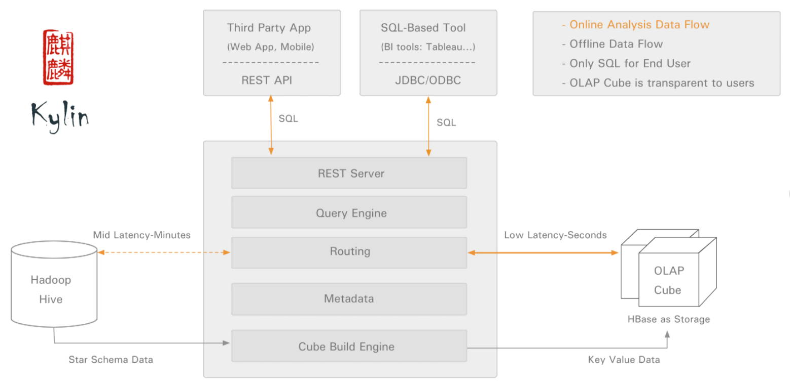

[toc]

# Apache Kylin

`Apache Kylin`是一个开源的分布式分析引擎，提供Hadoop之上的SQL查询接口及多维分析`（OLAP）`能力以支持超大规模数据，最初由`eBay Inc.`开发并贡献至开源社区。

## 前言

​		企业中的查询大致可分为即席查询和定制查询两种。之前出现的很多`OLAP`引擎，包括`Hive、Presto、SparkSQL`等，虽然在很大程度上降低了数据分析的难度，但它们都只适用于即席查询的场景。它们的优点是查询灵活，但是随着数据量和计算复杂度的增长，响应时间不能得到保证。而定制查询多数情况下是对用户的操作做出实时反应，Hive等查询引擎动辄数分钟甚至数十分钟的响应时间显然是不能满足需求的。在很长一段时间里，企业只能对数据仓库中的==数据进行提前计算==，再将算好后的==结果存储在MySQL等关系型数据库==中，再提供给用户进行查询。但是当业务复杂度和数据量逐渐升高后，使用这套方案的开发成本和维护成本都显著上升。因此，==如何对已经固化下来的查询进行亚秒级返回==一直是企业应用中的一个痛点。

​		在这种情况下，`Apache Kylin`应运而生。不同于“大规模并行处理”（Massive Parallel Processing，MPP）架构的Hive、Presto等，Apache Kylin采用“`预计算`”的模式，用户只需要提前定义好查询维度，Kylin将帮助我们进行计算，并将结果存储到`HBase`中，为海量数据的查询和分析提供==亚秒级==返回，是一种典型的==“空间换时间”==的解决方案。Apache Kylin的出现不仅很好地解决了==海量数据快速查询==的问题，也避免了手动开发和维护提前计算程序带来的一系列麻烦。

## 核心概念

### 数据仓库

​		`Data Warehouse`，简称DW，中文名数据仓库，是商业智能（BI）中的核心部分。主要是将不同数据源的数据整合到一起，通过多维分析等方式为企业提供决策支持和报表生成。那么它与我们熟悉的传统关系型数据库有什么不同呢？

​		简而言之，用途不同。==数据库面向事务，而数据仓库面向分析==。数据库一般存储==在线的业务数据==，需要对上层业务的改变做出实时反应，涉及到增删查改等操作，所以需要遵循三大范式，需要ACID。而数据仓库中存储的则主要是==历史数据==，主要目的是为企业决策提供支持，所以可能存在大量数据冗余，但利于多个维度查询，为决策者提供更多观察视角。

​		在传统BI领域中，==数据仓库的数据同样存储在Oracle、MySQL等数据库中==，而在大数据领域中最常用的数据仓库就是`Apache Hive`，==Hive也是Apache Kylin默认的数据源==。

### OLAP

`OLAP（Online Analytical Process）`，联机分析处理，以多维度的方式分析数据，一般带有主观的查询需求，多应用在数据仓库。与之对应的是`OLTP（Online Transaction Process）`，联机事务处理，侧重于数据库的增删查改等常用业务操作。了解了上面数据库与数据仓库的区别后，OLAP与OLTP的区别就不难理解了。

### 维度和度量

​		维度一般是离散的值，比如时间维度上的每一个独立的日期，或者设备维度上的每一个独立的设备。因此统计时可以把维度相同的记录聚合在一起，然后应用聚合函数做累加、均值、最大值、最小值等聚合计算。

​		度量就是被聚合的统计值，也就是聚合运算的结果，它一般是连续的值，如以上两个图中的温度值，或是其他测量点，比如湿度等等。通过对度量的比较和分析，我们就可以对数据做出评估，比如这个月设备运行是否稳定，某个设备的平均温度是否明显高于其他同类设备等等。

### Cube和Cuboid

​		可以将数据模型上的所有字段进行分类：它们要么是维度，要么是度量。根据定义好的维度和度量，我们就可以构建Cube了。

​		对于一个给定的数据模型，我们可以对其上的所有维度进行组合。对于N个维度来说，组合所有可能性共有2的N次方种。对于每一种维度的组合，将度量做聚合计算，然后将运算的结果保存为一个物化视图，称为`Cuboid`。所有维度组合的Cuboid作为一个整体，被称为`Cube`。

​		举个例子。假设有一个电商的销售数据集，其中维度包括==时间（Time）、商品（Item）、地点（Location）和供应商（Supplier）==，度量为==销售额（GMV）==。那么所有维度的组合就有2的4次方，即16种，比如一维度（1D）的组合有[Time]、[Item]、[Location]、[Supplier]4种；二维度（2D）的组合有[Time Item]、[Time Location]、[Time Supplier]、[Item Location]、[Item Supplier]、[Location Supplier]6种；三维度（3D）的组合也有4种；最后零维度（0D）和四维度（4D）的组合各有1种，总共16种。

​	计算Cubiod，即按维度来聚合销售额。如果用SQL语句来表达计算Cuboid [Time, Location]，那么SQL语句如下：

```sql
SELECT 
	Time,
	Location,
	Sum(GMV) as GMV_SUM
FROM 
	Sales
GROUP BY 
	Time,Location
```

### 事实表和维度表

​		事实表`Fact Table`是存储有事实记录的表，事实表是动态增长的，所以他的体积一般大于维度表。

>   如：系统日志、销售记录、XX数据等等

​		维度表`Dimension Table`也叫**维表**，也叫**查找表**，是与事实表相对应的表；只保存对应维度的属性值，一般用来和事实表做关联；下相当于对事实表重复属性的抽取规范出来的一张表。

>   日期表、地区表、XX类型表等等

### 星型模型

​		星型模型是==数据挖掘中常用的几种多维度数据模型之一==。他的特点是只有一张事实表，以及零到多个维度表，事实表和维度表通过主外键相互关联，维度表之间没有关联，就像**许多小行星围绕在一颗恒星周围**，所以叫做星型模型。

### 雪花模型

​		雪花模型是另一种常用模型。是将星型模型中的某些维表抽取成更细粒度的维表，然后让为表之间也进行关联，这种模型叫做雪花模型。

## Kylin技术架构

Kylin系统主要分为在线查询和离线构建两部分，具体架构图如下：


[^架构图]: 图片来源官方首页

​		首先来看离线构建部分。从图中可以看出，左侧为数据源，目前Kylin默认的数据源是`Apache Hive`，保存着待分析的用户数据。根据元数据的定义，构建引擎从数据源抽取数据，并构建`Cube`。==数据以关系表的形式输入==，并且必须符合**星形模型**。构建技术主要为`MapReduce`（Spark目前在beta版本）。构建后的Cube保存在右侧存储引擎中，目前Kylin默认的存储为`Apache HBase`。

​		完成离线构建后，用户可以从上方的查询系统发送SQL进行查询分析。Kylin提供了`RESTful API`、`JDBC/ODBC`接口供用户调用。无论从哪个接口进入，SQL最终都会来到REST服务层，再转交给查询引擎进行处理。查询引擎解析SQL，生成基于关系表的逻辑执行计划，然后将其转译为基于`Cube`的物理执行计划，最后查询预计算生成的Cube并产生结果。**整个过程不会访问原始数据源**。==如果用户提交的查询语句未在Kylin中预先定义，Kylin会返回一个错误。==

​		值得一提的是，Kylin对==数据源、执行引擎和Cube存储三个核心模块提取出了抽象层==，这意味着这三个模块可以被任意地扩展和替换。比如==可以使用Spark替代MapReduce作为Cube的构建引擎==，==使用Cassandra替代HBase作为Cube计算后数据的存储等==。良好的扩展性使得Kylin可以在这个技术发展日新月异的时代方便地使用更先进的技术替代现有技术，做到与时俱进，也使用户可以针对自己的业务特点对Kylin进行深度定制。

**特性**

-   SQL接口
    -   Kylin主要的对外接口是以SQL的形式提供的。SQL简单易用的特性极大的降低了Kylin的学习成本。
-   支持海量数据集
    -   不论是Hive、SparkSQL，还是Imoala、Presto，都改变不了一个事实：==查询时间随着数据量的增长而线性增长==。而Kylin使用的预计算技术打破了这一点。Kylin在数据集规模的局限性主要取决于维度的个数和基数，而不是数据集的大小，所以Kylin能更好的支持海量数据的查询。
-   压秒级响应
    -   同样受益于与计算技术，Kylin的查询熟读非常快，因为复杂的连接、聚合等操作都在Cube的构建过程中完成了。
-   水平扩展
    -   Kylin同样可以使用集群部署的方式进行水平扩展。但是部署多个节点只能提高Kylin处理查询的能力，不能提升他的预计算能力。
-   可视化集成
    -   Kylin提供了ODBC/JDBC接口和RESTful API，可以很方便的与Tableau等数据可视化工具集成。数据团队也可以在开放的API上进行二次开发。

## 安装与使用

-   下载tar包
-   

