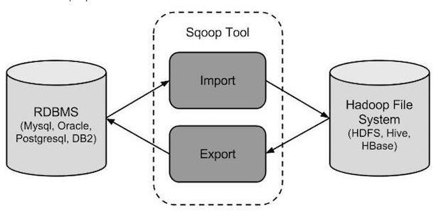

[toc]

# Sqoop

>​			Sqoop是Hadoop和关系数据库服务器之间传送数据的一种工具。它是用来从关系数据库如：[MySQL](http://www.yiibai.com/mysql/)，Oracle到Hadoop的HDFS，并从Hadoop的文件系统导出数据到关系数据库。
>   ​			传统的应用管理系统，也就是与关系型数据库的使用RDBMS应用程序的交互，是产生大数据的来源之一。这样大的数据，由关系数据库生成的，存储在关系数据库结构关系数据库服务器。
>  当大数据存储器和分析器，如MapReduce, Hive, HBase, Cassandra, Pig等，Hadoop的生态系统等应运而生图片，它们需要一个工具来用的导入和导出的大数据驻留在其中的关系型数据库服务器进行交互。在这里，Sqoop占据着Hadoop生态系统提供关系数据库服务器和Hadoop HDFS之间的可行的互动。
>  ​			Sqoop：“SQL 到 Hadoop 和 Hadoop 到SQL”
>  ​			Sqoop是Hadoop和关系数据库服务器之间传送数据的一种工具。它是用来从关系数据库如MySQL，Oracle到Hadoop的HDFS从Hadoop文件系统导出数据到关系数据库。它是由Apache软件基金会提供。

## 工作流程



### Sqoop导入

导入工具从RDBMS到HDFS导入到单个表。表中的每一行被视为HDFS的记录。所有的记录被存储到文本文件的数据中，或者在Avro和序列文件的二进制数据。

### Sqoop导出

导出工具从HDFS导出一组文件到一个RDBMS。作为输入到Sqoop文件包含记录，这被称为表中的行。那些被读取解析的一组记录和分割使用用户指定的分隔符。

## Sqoop导入

语法

```bash 
$ sqoop import (generic-args) (import-args)  
$ sqoop-import (generic-args) (import-args)
```

**表emp:**

| id   | name     | deg          | salary | dept |
| ---- | -------- | ------------ | ------ | ---- |
| 1201 | gopal    | manager      | 50,000 | TP   |
| 1202 | manisha  | Proof reader | 50,000 | TP   |
| 1203 | khalil   | php dev      | 30,000 | AC   |
| 1204 | prasanth | php dev      | 30,000 | AC   |
| 1204 | kranthi  | admin        | 20,000 | TP   |

**表emp_add:**

| id   | hno  | street   | city    |
| ---- | ---- | -------- | ------- |
| 1201 | 288A | vgiri    | jublee  |
| 1202 | 108I | aoc      | sec-bad |
| 1203 | 144Z | pgutta   | hyd     |
| 1204 | 78B  | old city | sec-bad |
| 1205 | 720X | hitec    | sec-bad |

**表emp_contact：**

| id   | phno    | email           |
| ---- | ------- | --------------- |
| 1201 | 2356742 | gopal@tp.com    |
| 1202 | 1661663 | manisha@tp.com  |
| 1203 | 8887776 | khalil@ac.com   |
| 1204 | 9988774 | prasanth@ac.com |
| 1205 | 1231231 | kranthi@tp.com  |

### 导入表

Sqoop工具import是用来从表中导入数据到Hadoop的

```bash
$ sqoop import \
--connect jdbc:mysql://localhost/userdb \
--username root \
--table emp --m 1
```

验证在HDFS导入的数据，使用命令

```bash
$ $HADOOP_HOME/bin/hadoop fs -cat /emp/part-m-*

1201, gopal,    manager, 50000, TP
1202, manisha,  preader, 50000, TP
1203, kalil,    php dev, 30000, AC
1204, prasanth, php dev, 30000, AC
1205, kranthi,  admin,   20000, TP
```

**例：**

```bash
# 导入emp_add表数据到‘/queryresult’目录
$ sqoop import \
--connect jdbc:mysql://localhost/userdb \
--username root \
--table emp_add \
--m 1 \
--target-dir /queryresult
# 验证目录中导入的数据形式
$ $HADOOP_HOME/bin/hadoop fs -cat /queryresult/part-m-*
1201, 288A, vgiri,   jublee
1202, 108I, aoc,     sec-bad
1203, 144Z, pgutta,  hyd
1204, 78B,  oldcity, sec-bad
1205, 720C, hitech,  sec-bad
# 通过导入工具导入where后的一个子集
# where语法 --where <condition>
$ sqoop import \
--connect jdbc:mysql://localhost/userdb \
--username root \
--table emp_add \
--m 1 \
--where “city =’sec-bad’” \
--target-dir /wherequery
# 验证目录中导入的数据形式
$ $HADOOP_HOME/bin/hadoop fs -cat /wherequery/part-m-*
1202, 108I, aoc,     sec-bad
1204, 78B,  oldcity, sec-bad
1205, 720C, hitech,  sec-bad
# 下面的命令用于在EMP表执行增量导入。
$ sqoop import \
--connect jdbc:mysql://localhost/userdb \
--username root \
--table emp \
--m 1 \
--incremental append \
--check-column id \
-last value 1205
# 以下命令用于从emp表导入HDFS emp/ 目录的数据验证。
$ $HADOOP_HOME/bin/hadoop fs -cat /emp/part-m-*
1201, gopal,    manager, 50000, TP
1202, manisha,  preader, 50000, TP
1203, kalil,    php dev, 30000, AC
1204, prasanth, php dev, 30000, AC
1205, kranthi,  admin,   20000, TP
1206, satish p, grp des, 20000, GR
```

