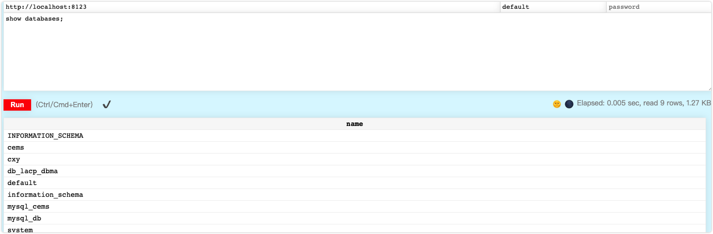
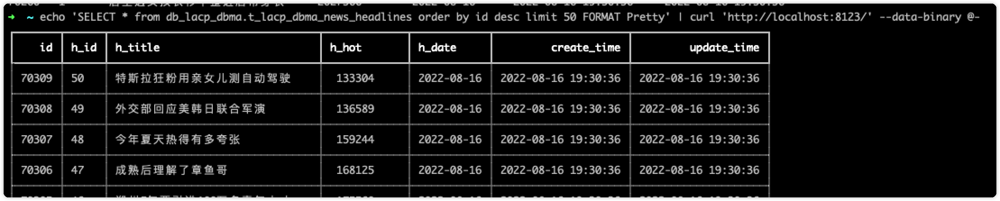
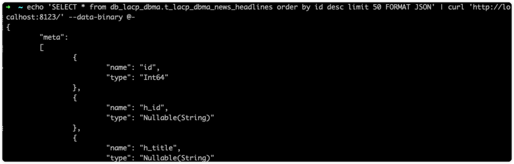
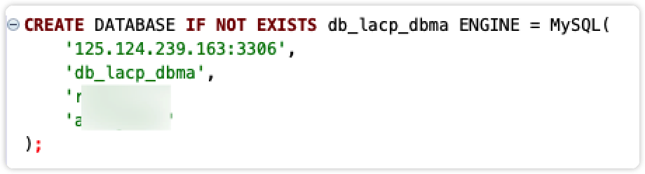
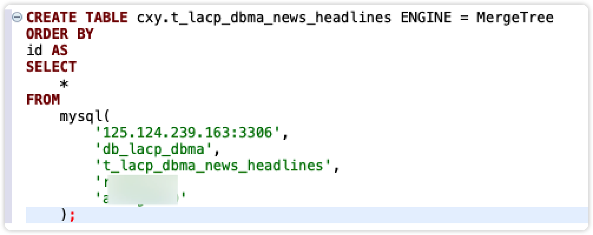
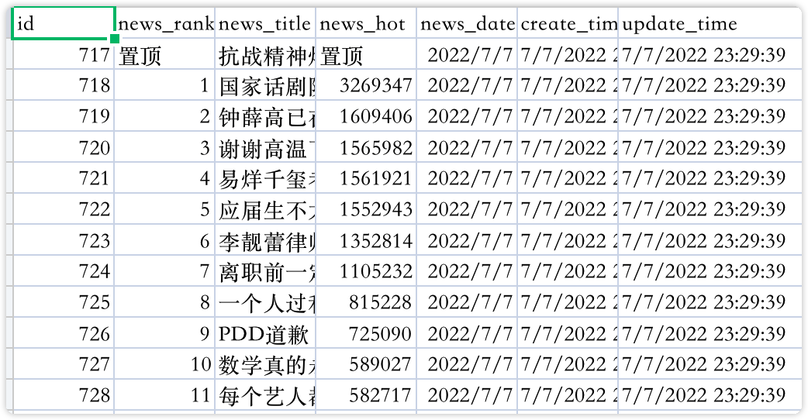
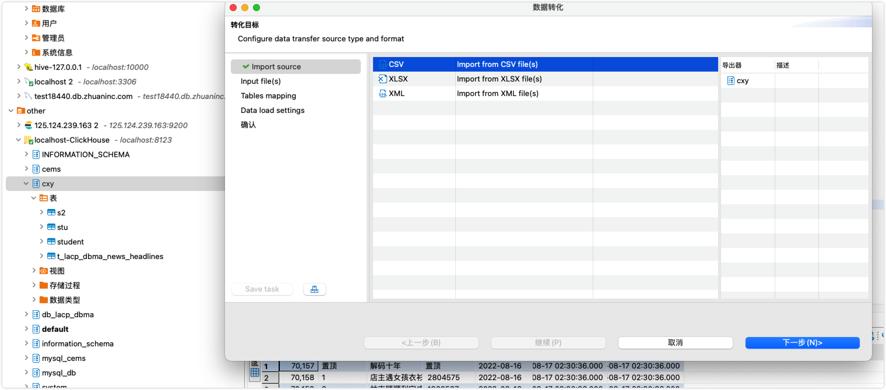

[toc]

## docker 部署clickhouse

### 下载docker镜像

```dockerfile
# 下载clickhouse服务端
docker pull yandex/clickhouse-server
# 下载连接服务端
docker pull yandex/clickhouse-client
```

### 启动服务端

#### 直接启动

```shell
➜  ~ docker run -it --rm --link some-clickhouse-server:clickhouse-server yandex/clickhouse-client --host clickhouse-server
```

#### 使用主机系统存储卷

```shell
# 创建目录
➜  ~ mkdir $HOME/some_clickhouse_database
# 启动服务器容器
➜  ~ docker run -d \
> --name clickserver \
> --ulimit nofile=262144:262144 \
> --volume=$HOME/clickhouse_database:/var/lib/clickhouse \
> -p 9000:9000 \
> -p 9004:9004 \
> yandex/clickhouse-server
```

### 启动客户端

```shell
➜  ~ docker run -it --rm --link some-clickhouse-server:clickhouse-server yandex/clickhouse-client --host clickhouse-server
```

**或者**

```shell
➜  ~ docker exec -it clickserver clickhouse-client
```

### 检测是否启动成功

- 查询1

```shell
➜  ~ docker exec -it clickserver clickhouse-client
<jemalloc>: MADV_DONTNEED does not work (memset will be used instead)
<jemalloc>: (This is the expected behaviour if you are running under QEMU)
ClickHouse client version 22.1.3.7 (official build).
Connecting to localhost:9000 as user default.
Connected to ClickHouse server version 22.1.3 revision 54455.

bb6c7a987c08 :) select 1

SELECT 1

Query id: 045897d4-e4da-40a8-a1a0-5d9136069e83

┌─ 1─┐
│  1  │
└───┘

1 rows in set. Elapsed: 0.028 sec. 

```

- 访问9000端口

```http
http://localhost:9000/

Port 9000 is for clickhouse-client program
You must use port 8123 for HTTP.

http://localhost:8123/
```


- 使用mysql客户端链接

```mysql
➜  ~ mysql --protocol tcp -u default -P 9004
Welcome to the MySQL monitor.  Commands end with ; or \g.
Your MySQL connection id is 0
Server version: 22.1.3.7-ClickHouse 

Copyright (c) 2000, 2021, Oracle and/or its affiliates.

Oracle is a registered trademark of Oracle Corporation and/or its
affiliates. Other names may be trademarks of their respective
owners.

Type 'help;' or '\h' for help. Type '\c' to clear the current input statement.

mysql> show databases;
+--------------------+
| name               |
+--------------------+
| INFORMATION_SCHEMA |
| default            |
| information_schema |
| system             |
+--------------------+
4 rows in set (0.05 sec)
Read 4 rows, 543.00 B in 0.034942083 sec., 114 rows/sec., 15.18 KiB/sec.

mysql> 
```

## 客户端

### 命令行客户端

客户端命令及其参数

```bash
➜  ~ clickhouse-client
# 参数
--host, -h -– 服务端的host名称, 默认是localhost。您可以选择使用host名称或者IPv4或IPv6地址。
--port – 连接的端口，默认值：9000。注意HTTP接口以及TCP原生接口使用的是不同端口。
--user, -u – 用户名。 默认值：default。
--password – 密码。 默认值：空字符串。
--query, -q – 使用非交互模式查询。
--database, -d – 默认当前操作的数据库. 默认值：服务端默认的配置（默认是default）。
--multiline, -m – 如果指定，允许多行语句查询（Enter仅代表换行，不代表查询语句完结）。
--multiquery, -n – 如果指定, 允许处理用;号分隔的多个查询，只在非交互模式下生效。
--format, -f – 使用指定的默认格式输出结果。
--vertical, -E – 如果指定，默认情况下使用垂直格式输出结果。这与–format=Vertical相同。在这种格式中，每个值都在单独的行上打印，这种方式对显示宽表很有帮助。
--time, -t – 如果指定，非交互模式下会打印查询执行的时间到stderr中。
--stacktrace – 如果指定，如果出现异常，会打印堆栈跟踪信息。
--config-file – 配置文件的名称。
--secure – 如果指定，将通过安全连接连接到服务器。
--history_file — 存放命令历史的文件的路径。
--param_<name> — 查询参数配置查询参数.
```

### Http客户端

使用Http请求可以方便的在任何语言中调用clickhouse

**不携带参数，会返回一个OK**

```bash
➜  ~ curl 'http://localhost:8123/'
Ok.
```

**通过Web UI访问clickhouse**

```http
http://localhost:8123/play
```



**通过Shell调用http请求**

`curl 调用`

```bash
➜  ~ echo 'SELECT * from db_lacp_dbma.t_lacp_dbma_news_headlines order by id desc limit 4' | curl 'http://localhost:8123/' --data-binary @-
70309	50	特斯拉狂粉用亲女儿测自动驾驶	 133304	2022-08-16	2022-08-16 19:30:36	2022-08-16 19:30:36
70308	49	外交部回应美韩日联合军演	 136589	2022-08-16	2022-08-16 19:30:36	2022-08-16 19:30:36
70307	48	今年夏天热得有多夸张	 159244	2022-08-16	2022-08-16 19:30:36	2022-08-16 19:30:36
70306	47	成熟后理解了章鱼哥	 168125	2022-08-16	2022-08-16 19:30:36	2022-08-16 19:30:36
```

`格式化展示`

**Pretty**



**JSON**



### MySQL客户端

配置文件启用

```xml
<mysql_port>9004</mysql_port>
```

使用MySQL客户端链接

```bash
mysql --protocol tcp -u default -P 9004
```


## 获取数据

### From MySQL

**创建数据库映射**

> 这样创建的数据库相当于MySQL数据库的一个映射，MySQL中数据变化后，这个映射也会发生变化

```sql
CREATE DATABASE [IF NOT EXISTS] db_name [ON CLUSTER cluster] ENGINE = MySQL('host:port','database','user','password')
-- 例
CREATE DATABASE IF NOT EXISTS db_lacp_dbma ENGINE = MySQL(
    '125.124.239.163:3306',
    'db_lacp_dbma',
    '*********',
    '*********'
);
```



**单次单表同步**

> 这样创建的数据将从MySQL中的某张表全量同步到clickhouse中，clickhouse中的数据不会随着MySQL数据变化而变化

```sql
CREATE TABLE tmp ENGINE = MergeTree ORDER BY id AS SELECT * FROM mysql('hostip:3306','db','table','user','passwd');
-- 例
CREATE TABLE cxy.t_lacp_dbma_news_headlines ENGINE = MergeTree
ORDER BY
id AS
SELECT
    *
FROM
    mysql(
        '125.124.239.163:3306',
        'db_lacp_dbma',
        't_lacp_dbma_news_headlines',
        '********',
        '********'
    );
```



**使用CSV文件导入**

1. 从MySQL导出数据到csv文件

```sql
-- MySQL导出
 -- 查询导出地址
show variables like '%secure'
 -- 导出数据
select * from t_com_chat into outfile '/Users/chenxinyu/Downloads/test.csv' 
fields terminated by ',' optionally enclosed by '"' escaped by '"'
lines terminated by '\r\n';
```

`数据展示`

```csv
id,news_rank,news_title,news_hot,news_date,create_time,update_time
717,置顶,抗战精神烛照复兴之路,置顶,2022/7/7,7/7/2022 23:29:39,7/7/2022 23:29:39
718,1,国家话剧院将做出统一回复,3269347,2022/7/7,7/7/2022 23:29:39,7/7/2022 23:29:39
719,2,钟薛高已在推线下单独冰柜,1609406,2022/7/7,7/7/2022 23:29:39,7/7/2022 23:29:39
720,3,谢谢高温下的坚守,1565982,2022/7/7,7/7/2022 23:29:39,7/7/2022 23:29:39
721,4,易烊千玺考编,1561921,2022/7/7,7/7/2022 23:29:39,7/7/2022 23:29:39
722,5,应届生不太适合来成都,1552943,2022/7/7,7/7/2022 23:29:39,7/7/2022 23:29:39
723,6,李靓蕾律师声明,1352814,2022/7/7,7/7/2022 23:29:39,7/7/2022 23:29:39
724,7,离职前一定要删除的文件,1105232,2022/7/7,7/7/2022 23:29:39,7/7/2022 23:29:39
725,8,一个人过和婚姻不幸哪个更伤身,815228,2022/7/7,7/7/2022 23:29:39,7/7/2022 23:29:39
726,9,PDD道歉,725090,2022/7/7,7/7/2022 23:29:39,7/7/2022 23:29:39
```



2. clickhouse导入csv文件

```bash
# 创建表
echo 'create table test(col1 colType, col2 colType ...) ENGINE = MergeTree;' | clickhouse-client

# 导入数据
cat test.csv | clickhouse_client --query='insert into test FORMAT CSV'
```

或者使用链接工具进行导入`*.csv`文件




