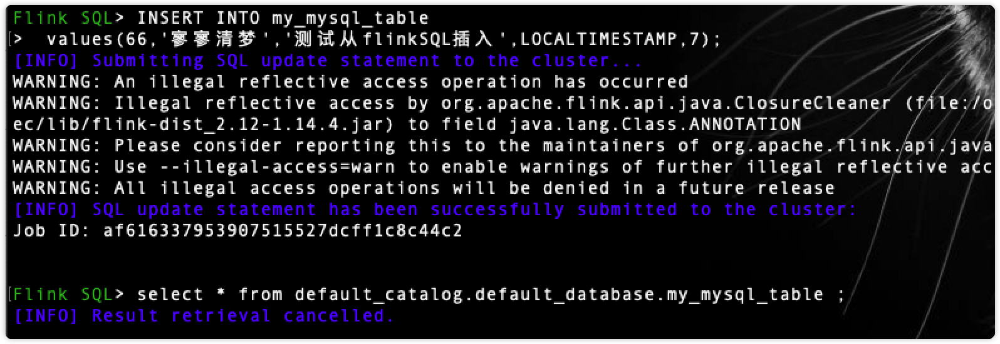

[toc]

# 安装

## 本地安装flink

### 前置环境

**java**

```shell
➜  java -version
java version "1.8.0_311"
Java(TM) SE Runtime Environment (build 1.8.0_311-b11)
Java HotSpot(TM) 64-Bit Server VM (build 25.311-b11, mixed mode)
```

### 安装

#### brew安装

```shell
➜  brew install apache-flink
*****************************************************
➜  app flink -v
Version: 1.14.4, Commit ID: 895c609
```

#### 	普通安装

地址：[下载链接](https://flink.apache.org/zh/downloads.html)

解压

```shell
➜  tar -xzf flink-1.16-SNAPSHOT-bin-scala_2.12.tgz
➜  cd flink-1.16-SNAPSHOT-bin-scala_2.12
```

### 启动集群

```shell
➜  cd /opt/homebrew/Cellar/apache-flink/1.14.4/libexec/bin
➜  bin git:(stable) ./start-cluster.sh
Starting cluster.
Starting standalonesession daemon on host chenxinyudeMacBook-Pro.local.
Starting taskexecutor daemon on host chenxinyudeMacBook-Pro.local.
```

> 打开：http://localhost:8081/#/overview 检测是否启动成功
>
> 

### 运行demo

```shell
➜  examples git:(stable) cd streaming 
➜  streaming git:(stable) ls
Iteration.jar             StateMachineExample.jar   WindowJoin.jar
SessionWindowing.jar      TopSpeedWindowing.jar     WordCount.jar
SocketWindowWordCount.jar Twitter.jar
➜  streaming git:(stable) flink run WordCount.jar 
# ***结果************
Executing WordCount example with default input data set.
Use --input to specify file input.
Printing result to stdout. Use --output to specify output path.
WARNING: An illegal reflective access operation has occurred
WARNING: Illegal reflective access by org.apache.flink.api.java.ClosureCleaner (file:/opt/homebrew/Cellar/apache-flink/1.14.4/libexec/lib/flink-dist_2.12-1.14.4.jar) to field java.lang.String.value
WARNING: Please consider reporting this to the maintainers of org.apache.flink.api.java.ClosureCleaner
WARNING: Use --illegal-access=warn to enable warnings of further illegal reflective access operations
WARNING: All illegal access operations will be denied in a future release
Job has been submitted with JobID 68db7fc6d9458763ad1c49977434ea77
Program execution finished
Job with JobID 68db7fc6d9458763ad1c49977434ea77 has finished.
Job Runtime: 284 ms
```


**查看日志**

```shell
➜  log git:(stable) tail flink-*-taskexecutor* 
==> flink-chenxinyu-taskexecutor-0-chenxinyudeMacBook-Pro.local.out <==
(nymph,1)
(in,3)
(thy,1)
(orisons,1)
(be,4)
(all,2)
(my,1)
(sins,1)
(remember,1)
(d,4)
```

# 学习笔记

## 有状态的流式处理

### 传统数据处理架构

#### 事务处理


传统架构模式中，企业的多个应用程序可能会访问同一个数据库，如上图架构模式。应用程序会远程读取数据库的状态，访问相同的数据库。


当应用需要扩展时，设计会导致一些问题。比如数据库字段不容易扩展。为了克服紧耦合的的应用程序，就产生了上述的微服务的设计模式。

#### 分析处理

不同的事务产生的数据存储在各种的数据库系统之中，这样就导致事务数据的汇总联合分析时出线难度，而且还需要转换为通用的格式。

所以，一般不会直接在事务数据库上运行分析查询，而是复制数据到数据仓库。数据仓库是数据进行分析和查询的专用数据存储。将数据复制到数据仓库的过程成为`extract-transform-load(ETL)`。ETL负责数据的提取和转换，可能包括验证、规范化、编码、去重、模式转换等，最后将其加载到分析数据库中。ETL过程可能会比较复杂，通常需要技术复杂的解决方案来满足性能要求。ETL过程需要定期运行以保持数据仓库中的数据同步。

数仓分析的类型一般可以分为定期报告查询和即席查询，定期报告用户计算与业务相关的统计信息，比如收入、用户增长或者输出的产量。用来统计评估业务的整体健康情况。即席查询旨在提供特定问题的答案并支持关键业务决策，例如：收集统计在投放商业广告上的花费，获取相应的收入，以评估某种决策的有效性。


### 有状态的流式处理

有状态的流处理程序，通常从事件日志中提取输入事件。事件日志就用来存储和分发事件流。事件被写入持久的会添加（append-only）日志，这意味着无法更改写入事件的顺序。写入事件中的流会被相同或者不同的消费者多次读取。由于日志的仅附加（append-only）属性，事件始终以完全相同的顺序发布给所有的消费者。现在已有的几种日志系统中，`Apache Kafka`是最受欢迎的。

在Flink的架构中，事件日志会按照顺序保留输入事件，并且可以按确定的顺序重播他们。如果发生故障，Flink将从先前的检查点（check point）回复其状态，并重置事件日志的读取位置，这样就可以恢复整个应用。应用程序将重放事件日志中的输入事件，直到他到达流的尾部。一般用于从故障中恢复，但也可以用于更新应用程序、修复bug。

所以，有状态的流处理是一种通用且灵活的设计架构，可以用于许多不同的场景。接下来要说的主要是三种应用程序（1）事件驱动应用程序（2）数据管道应用程序（3）数据分析应用程序。

实际应用中，往往会具有多种情况特征。

#### 事件驱动型应用程序

时间驱动的应用场景包括：

- 实时推荐
- 行为模式检查或复杂事件处理
- 异常检测

事件驱动型应用程序是微服务的演变。他们通过事件日志而不是REST调用进行通信，并将应用程序数据保存在本地状态，而不是将其写入外部数据存储区。如下图


上图中的应用之间通过事件日志链接。一个应用程序将其输出发送到事件日志通道`Kafka`，另外一个应用程序使用其他应用程序发出的事件。事件日志通道将发送者和接受者分离，并提供异步、非阻塞的事件传输。每个应用程序都是可以有状态的，并且可以将本地管理自己的状态而无需访问外部数据存储。应用程序也可以单独处理和存储。

对于微服务架构而言，事件驱动的应用程序具有多种优势。与远程数据库相比，本地状态的访问提供了非常好的性能。扩展性和容错性都由流处理器来进行保证，并且以事件日志作为输入源，应用程序的整个输入数据可以可靠存储，并且·准确的重放。此外，Flink可以将应用程序的状态重置为先前的保存点。可以不去丢失状态的进行更新或者重新扩展应用程序。

事件驱动的应用程序对他们的流处理器有着很高的要求，并不是所有的流处理器都适合运行事件驱动的应用程序。

#### 数据管道

使用较低的延迟来提取、转化和插入数据的应用程序叫做数据管道（`data pipeline`）。数据管道必须能够在短时间内处理大量的数据。还要有许多的源（`source`）和接收器（`sink`）的连接器，一边从各种存储系统中读取数据。Flink完成了所有的这些功能。

#### 流分析

流式分析是连续的提取事件流，并且通过纳入最新事件更新其计算结果，这个过程是低延迟的。这有些类似于数据库中的视图更新`views`技术。一般情况下，流式应用程序将其结果存储在支持更新的外部数据存储中，例如数据库或者键值对`key-value`流分析应用程序的实时更新结果可用于驱动监控仪表盘`dashboard`应用程序。


流分析的应用程序通常用于：

- 监控手机网络质量
- 移动应用中的用户行为
- 实时数据的即席分析

## 流处理基础

### 流处理编程简介

#### 数据流图

数据流程序描述了数据是如何在算子之间流动。数据流程序通常表示为有向图，其中节点称为算子，用来表示计算，表示数据之间的依赖性。数据流的基本功能单元是算子。一个数据流图必须至少有一个数据源和一个数据接收器。


上图中的数据流图叫做逻辑流图，因为他们表示了计算逻辑的高级视图。为了执行一个数据流程序，Flink会将逻辑流图转化为物理数据流图，详细说明程序的执行方式。每个算子在不同的物理机器之间可能会有几个并行的任务运行。如下图


#### 数据并行和任务并行

- 数据并行
  - 可以对输入数据进行分区，并且在数据子集上并行执行具有相同的算子结构的任务并行，这种并行性被称为数据并行性。它允许处理大量的数据，并将计算分散到不同的计算节点上。
- 任务并行
  - 可以对不同算子在相同或者不同的数据上并行执行。这种并行性称为任务并行性。

#### 数据交换策略


### 并行处理流数据

#### 延迟和吞吐量

流处理程序不同于批处理程序。在评估性能时，要求也有所不同。对于批处理程序，通常关心==一个作业的总的执行时间==，或我们的处理引擎读取输入所需的时间，执行计算，并回写结果。由于流处理程序是==连续运行==的，输入可能是**无界**的，所以数据流处理中没有总执行时间的概念。 相反，流处理程序必须尽可能快的提供输入数据的计算结果。我们使用**延迟**和**吞吐量**来表征流处理的性能要求。

#### 延迟

**延迟表示处理事件所需的时间。**

> 在数据流中，延迟是以时间为单位测量的，例如毫秒。根据应用程序，我们可能会关心平均延迟，最大延迟或百分位延迟。例如，平均延迟值为10ms意味着处理事件的平均时间在10毫秒内。或者，延迟值为95%，10ms表示95%的事件在10ms内处理完毕。平均值隐藏了处理延迟的真实分布，可能会让人难以发现问题。
>
> 确保低延迟对于许多流应用程序来说至关重要，例如欺诈检测，系统警报，网络监控和提供具有严格服务水平协议的服务。低延迟是流处理的关键特性，它实现了我们所谓的实时应用程序。像Apache Flink这样的现代流处理器可以提供低至几毫秒的延迟。相比之下，传统批处理程序延迟通常从几分钟到几个小时不等。在批处理中，首先需要收集事件批次，然后才能处理它们。因此，延迟是受每个批次中最后一个事件的到达时间的限制。所以自然而然取决于批的大小。真正的流处理不会引入这样的人为延迟，因此可以实现真正的低延迟。真的流模型，事件一进入系统就可以得到处理。延迟更密切地反映了在每个事件上必须进行的实际工作。

#### 吞吐量

**吞吐量是衡量系统处理能力的指标，也就是处理速率。**吞吐量告诉我们每个时间单位系统可以处理多少事件

> 吞吐量以每个时间单位系统所能处理的事件数量或操作数量来衡量。值得注意的是，事件处理速率取决于事件到达的速率，低吞吐量并不一定表示性能不佳。 在流式系统中，我们通常希望确保我们的系统可以处理最大的预期事件到达的速率。也就是说，我们主要的关注点在于确定的峰值吞吐量是多少，当系统处于最大负载时性能怎么样。为了更好地理解峰值吞吐量的概念，让我们考虑一个流处理 程序没有收到任何输入的数据，因此没有消耗任何系统资源。当第一个事件进来时，它会尽可能以最小延迟立即处理。

### 数据流上的操作

#### 数据摄入和数据吞吐量

**数据摄取**和**数据出口**操作允许流处理程序与外部系统通信。数据摄取是操作从外部源获取原始数据并将其转换为其他格式**(ETL)**。实现数据提取逻辑的运算符被称为**数据源**。数据源可以从==TCP Socket，文件，Kafka Topic或传感器数据接口==中提取数据。数据出口是以适合消费的形式产出到外部系统。执行数据出口的运算符称为**数据接收器**，包括==文件，数据库，消息队列和监控接口==。

#### 转换算子


转换算子是单遍处理算子，碰到一个事件处理一个事件。这些操作在使用后会消费一个事件，然后对事件数据做一些转换，产生一个新的输出流。

操作符可以接受多个输入流并产生多个输出流。他们还可以通过修改数据流图的结构要么将流分成多个流，要么将流合并为一条流。

#### 滚动聚合

滚动聚合是一种聚合，例如`sum`，`minimum`和`maximum`，为每个输入事件不断更新。 聚合操作是有状态的，并将当前状态与传入事件一起计算以产生更新的聚合值。请注意能够有效地将当前状态与事件相结合 产生单个值，聚合函数必须是关联的和可交换的。否则，操作符必须存储完整的流数据历史。下图显示了最小滚动 聚合。

操作符保持当前的最小值和相应地为每个传入的事件来更新最小值。


#### 窗口操作符

转换和滚动聚合一次处理一个事件产生输出事件并可能更新状态。但是，有些操作必须**收集并缓冲数据以计算其结果**。 例如，考虑不同流之间的连接或整体聚合这样的操作，例如**中值函数**。为了在无界流上高效运行这些操作符，我们需要限制这些操作维护的数据量。

>窗口还可以在语义上实现关于流的比较复杂的查询。我们已经看到了滚动聚合的方式，以聚合值编码整个流的历史数据来为每个事件提供低延迟的结果。 但如果我们只对最近的数据感兴趣的话会怎样？考虑给司机提供实时交通信息的应用程序。这个程序可以使他们避免拥挤的路线。在这种场景下，你想知道某个位置在最近几分钟内是否有事故发生。 另一方面，了解所有发生过的事故在这个应用场景下并没有什么卵用。更重要的是，通过将流历史缩减为单一聚合值，我们将丢失这段时间内数据的变化。例如，我们可能想知道每5分钟有多少车辆穿过 某个路口。
>
>窗口操作不断从==无限事件流中创建有限的事件集==，好让我们执行有限集的计算。通常会基于数据属性或基于时间的窗口来分配事件。 要正确定义窗口运算符语义，我们需要确定如何给窗口分配事件以及对窗口中的元素进行求值的频率是什么样的。 窗口的行为由一组策略定义。窗口策略决定何时创建新的窗口以及要分配的事件属于哪个窗口，以及何时对窗口中的元素进行求值。 而窗口的求值基于触发条件。一旦触发条件得到满足，窗口的内容将会被发送到求值函数，求值函数会将计算逻辑应用于窗口中的元素。 求值函数可以是sum或minimal或自定义的聚合函数。 求值策略可以根据时间或者数据属性计算(例如，在过去五秒内收到的事件或者最近的一百个事件等等)。 接下来，我们描述常见窗口类型的语义。

**窗口的类型**

1. `滚动窗口`（==每次达到窗口结尾的时候触发一次事件间隔==）


2. `滑动窗口`（事件可能属于多个桶，通过窗口长度和滑动距离来定义滑动窗口，下图为4个事件，3个滑动距离）


3. `会话窗口`（类似用户使用App，使用时间不是均匀的，而是每次使用了多久，中间可能会中断，那么一次使用期间就是一个会话窗口，会话窗口不会实现定义窗口的大小，使用间隙值来区分会话，不活动的时间即为间隙值）


4. `并行窗口`（在实际情况中，可能会将一条事件流分为多个逻辑流，自定义窗口。比如基于某一个属性进行区分，每个流有自己的窗口逻辑）


### 时间语义


### 状态和持久化模型


## Flink架构

### 系统架构

#### 运行组件

Flink在运行时包括四个不同的组件，他们会在运行流处理应用程序的时候协同工作：**作业管理器`JobManager`、资源管理器`ResourceManager`、任务管理器`TaskManager`、分发器`Dispatcher`**。Flink利用Java和Scala实现的，所以所有组件都会运行在Java虚拟机`JVMs`上。每个组件的职责如下：

- 作业管理器`JobManager`
  - 控制一个应用程序的主进程，也就是说，每个应用程序都会被一个不同的作业管理器所控制执行。作业管理器首先会接受到要执行的应用程序，包括：作业图`JobGraph`、逻辑数据流图`Logical dataflow graph`、打包了的所有类库和其他组员的jar包。作业管理器会把JobGraph转化成一个物理层面的数据流图，这个图被叫做`执行图<ExecutionGraph>`，包含了所有可以并发执行的任务。作业管理器会向资源管理器`ResourceManager`请求执行任务必要的资源，也就是任务管理器`TaskManager`上的插槽`slot`。一旦它获取到了足够的资源，就会将执行图分发到真正运行它们的`TaskManager`上。而在运行过程中，作业管理器会负责所有需要中央协调的操作，比如说检查点`checkpoints`的协调。
- 资源管理器`ResourceManager`
  - 管理任务管理器`TaskManager`的插槽`slot`，TaskManger插槽是Flink中定义的处理资源单元。Flink为不同的环境和资源管理工具提供了不同资源管理器`ResourceManager`，比如YARN、Mesos、K8s，以及standalone部署。当作业管理器申请插槽资源时，ResourceManager会将有空闲插槽的`TaskManager`分配给作业管理器。如果ResourceManager没有足够的插槽来满足作业管理器的请求，它还可以向资源提供平台发起会话，以提供启动`TaskManager`进程的容器。另外，ResourceManager还负责终止空闲的TaskManager，释放计算资源。	
- 任务管理器`TaskManager`
  - Flink中的工作进程。通常在Flink中会有多个`TaskManager`运行，每一个TaskManager都包含了一定数量的插槽`slots`。插槽的数量限制了TaskManager能够执行的任务数量。启动之后，TaskManager会向资源管理器注册它的插槽；收到资源管理器的指令后，TaskManager就会将一个或者多个插槽提供给作业管理器调用。作业管理器就可以向插槽分配任务`tasks`来执行了。在执行过程中，一个TaskManager可以跟其它运行同一应用程序的TaskManager交换数据。任务的执行和插槽的概念会在`任务执行`一节做具体讨论。
- 分发器`Dispatcher`
  - 可以跨作业运行，它为应用提交提供了`REST接口`。当一个应用被提交执行时，分发器就会启动并将应用移交给一个作业管理器。由于是REST接口，所以`Dispatcher`可以作为集群的一个`HTTP接入点`，这样就能够不受防火墙阻挡。Dispatcher也会启动一个`Web UI`，用来方便地展示和监控作业执行的信息。Dispatcher在架构中可能并不是必需的，这取决于应用提交运行的方式。


#### 应用部署

- 框架`Framework`
  - 在这个模式下，Flink应用被打包成一个`Jar文件`，并由客户端提交给一个`运行服务（running service）`。这个服务可以是一个Flink的Dispatcher，也可以是一个Flink的作业管理器，或是`Yarn`的ResourceManager。如果application被提交给一个作业管理器，则它会立即开始执行这个`application`。如果application被提交给了一个Dispatcher，或是Yarn ResourceManager，则它会启动一个作业管理器，然后将application交给它，再`由作业管理器开始执行`此应用。
- 库`Library`
  - 在这个模式下，Flink Application 会被打包在一个`容器（container） 镜像`里，例如一个`Docker `镜像。此镜像包含了运行作业管理器和ResourceManager的代码。**当一个容器从镜像启动后，它会自动启动ResourceManager和作业管理器，并提交打包好的应用**。另一种方法是：**将应用打包到镜像后，只用于部署TaskManager容器**。从镜像启动的容器会自动启动一个TaskManager，然后连接ResourceManager并注册它的slots。这些镜像的启动以及失败重启，通常都会由一个外部的资源管理器管理`（比如Kubernetes）`。

#### 任务执行


#### 高可用


# Flink DataStream API

## 概述

**什么可以被转化成流**

Java和Scala 的API可以将任何可序列化对象转化为流。

- 基本类型：String、Long、Integer、Boolean、Array
- 复合类型：Tuples、POJOs、Scala case classes

**Java tuples和POJOs**

- Tuples

在Java中，Flink自带Tuple0~25类型

```java
Tuple2<String,Integer> p = Tuple2.of("Fred",35);

// zero based index
String name = person.f0;
Integer age = person.f1;
```

- POJO
  - pojo是公有且独立的（没有非静态内部类）
  - pojo有公有的无参构造函数
  - 类（及父类）中所有的不被static、transient修饰的属性要么是共有的（不能被final修饰），要么包含公有的getter和setter方法，所有方法遵循Java bean命名规范。

```java
public class Person {
  public String name;
  public Integer age;
  public Person(String name, Integer age){
    ...
  }
}
```

**示例**

```java
public class Example {
    public static void main(String[] args) throws Exception {
        final StreamExecutionEnvironment env = StreamExecutionEnvironment.getExecutionEnvironment();

        DataStream<Student> ds = env.fromElements(
                new Student("chenxinyu", 21),
                new Student("blank", 1),
                new Student("Misaki", 2)
        );

        DataStream<Student> filterDs = ds.filter((FilterFunction<Student>) student -> student.getAge() > 18);

        filterDs.print();

        env.execute();
    }
}
```

过滤未成年人；


**Flink DataStream 操作概览**


**不同类型的 DataStream 子类型。不同的子类型支持不同的操作集合**


基本结构如下

- 设置运行环境
- 配置数据源读取
- 数据转化处理
- 配置输出数据源
- 执行

```java
//1、设置运行环境
StreamExecutionEnvironment env = StreamExecutionEnvironment.getExecutionEnvironment();
//2、配置数据源读取数据
DataStream<String> text = env.readTextFile ("input");
//3、进行一系列转换
DataStream<Tuple2<String, Integer>> counts = text.flatMap(new Tokenizer()).keyBy(0).sum(1);
//4、配置数据汇写出数据
counts.writeAsText("output");
//5、提交执行
env.execute("Streaming WordCount");
```

## flink连接Kafka

**maven依赖**

```xml
		<!--Lombok-->
		<dependency>
			<groupId>org.projectlombok</groupId>
			<artifactId>lombok</artifactId>
			<version>1.18.24</version>
		</dependency>
		<!-- Apache Flink dependencies -->
		<!-- These dependencies are provided, because they should not be packaged into the JAR file. -->
		<dependency>
			<groupId>org.apache.flink</groupId>
			<artifactId>flink-streaming-java</artifactId>
			<version>1.15.0</version>
		</dependency>
		<dependency>
			<groupId>org.apache.flink</groupId>
			<artifactId>flink-clients</artifactId>
			<version>1.15.0</version>
		</dependency>

		<dependency>
			<groupId>org.apache.flink</groupId>
			<artifactId>flink-connector-kafka</artifactId>
			<version>1.15.0</version>
		</dependency>
		<dependency>
			<groupId>org.apache.flink</groupId>
			<artifactId>flink-connector-base</artifactId>
			<version>1.15.0</version>
		</dependency>
```

**消费kafka消息**

```java
/************************************************************
 * @ProjectName   : flink
 * @ClassName     : Example
 * @author        : chenxinyu
 * @createTime    : 2022/6/13
 ************************************************************/
public class ReadKafka {
    public static void main(String[] args) throws Exception {
        final StreamExecutionEnvironment env = StreamExecutionEnvironment.getExecutionEnvironment();

        KafkaSource<String> source = KafkaSource.<String>builder()
                                                .setBootstrapServers("localhost:9092")
                                                .setTopics("binlog")
                                                .setGroupId("my-group")
                                                .setDeserializer(KafkaRecordDeserializationSchema.valueOnly(StringDeserializer.class))
                                                .build();

        DataStream<String> kafkaSource = env.fromSource(source, WatermarkStrategy.noWatermarks(), "Kafka Source");
        kafkaSource.print();

        env.execute();


    }
}
```

**效果图**


**示例**

```java
public class GroupedProcessingTimeWindowSample {
    private static class DataSource extends RichParallelSourceFunction<Tuple2<String, Integer>> {
        private volatile boolean isRunning = true;

        @Override
        public void run(SourceContext<Tuple2<String, Integer>> ctx) throws Exception {
            Random random = new Random();
            while (isRunning) {
                Thread.sleep((getRuntimeContext().getIndexOfThisSubtask() + 1) * 1000 * 5);
                String key = "类别" + (char) ('A' + random.nextInt(3));
                int value = random.nextInt(10) + 1;

                System.out.println(String.format("Emits\t(%s, %d)", key, value));
                ctx.collect(new Tuple2<>(key, value));
            }
        }

        @Override
        public void cancel() {
            isRunning = false;
        }
    }

    public static void main(String[] args) throws Exception {
        StreamExecutionEnvironment env = StreamExecutionEnvironment.getExecutionEnvironment();
        env.setParallelism(2);

        DataStream<Tuple2<String, Integer>> ds = env.addSource(new DataSource());
        KeyedStream<Tuple2<String, Integer>, Tuple> keyedStream = ds.keyBy(0);

        keyedStream.sum(1).keyBy(new KeySelector<Tuple2<String, Integer>, Object>() {
            @Override
            public Object getKey(Tuple2<String, Integer> stringIntegerTuple2) throws Exception {
                return "";
            }
        }).fold(new HashMap<String, Integer>(), new FoldFunction<Tuple2<String, Integer>, HashMap<String, Integer>>() {
            @Override
            public HashMap<String, Integer> fold(HashMap<String, Integer> accumulator, Tuple2<String, Integer> value) throws Exception {
                accumulator.put(value.f0, value.f1);
                return accumulator;
            }
        }).addSink(new SinkFunction<HashMap<String, Integer>>() {
            @Override
            public void invoke(HashMap<String, Integer> value, Context context) throws Exception {
                  // 每个类型的商品成交量
                  System.out.println(value);
                  // 商品成交总量                
                  System.out.println(value.values().stream().mapToInt(v -> v).sum());
            }
        });

        env.execute();
    }
}
```

# Flink 客户端操作

查看客户端

在flink的安装目录的bin目录下，可以看到，有flink，start-scala-shell.sh都是客户端


## Flink SQL

**启动**

```shell
➜  bin git:(stable) ./bin/sql-client.sh
```

**Select查询**

```sql
Flink SQL> SELECT 'HELLO WORLD';
```


Web里面显示这条SQL已经执行完毕


### Explain

查看SQL的执行计划

```sql
Flink SQL> explain SELECT 'Hello, MY Friend';

== Abstract Syntax Tree ==
LogicalProject(EXPR$0=[_UTF-16LE'Hello, MY Friend'])
+- LogicalValues(tuples=[[{ 0 }]])

== Optimized Physical Plan ==
Calc(select=[_UTF-16LE'Hello, MY Friend' AS EXPR$0])
+- Values(type=[RecordType(INTEGER ZERO)], tuples=[[{ 0 }]])

== Optimized Execution Plan ==
Calc(select=[_UTF-16LE'Hello, MY Friend' AS EXPR$0])
+- Values(tuples=[[{ 0 }]])
```

### 源表

Flink支持可以与表一起使用的不同的连接器和格式。以下是由CSV文件支持的源表示例

csv文件如下：

```shell
➜  ~ cat /tmp/input.csv
1,hello
2,world
3,hello world
1,ok
3,bye bye
4,yes
```

建表语句

```sql
Flink SQL> CREATE TABLE cxy_test_input(
> input_id INT,
> input_String VARCHAR
> ) WITH (
>   'connector' = 'filesystem',
>   'path' = '/tmp/input.csv',
>   'format' = 'csv'
> );
```

运行查询

```sql
select * from default_catalog.default_database.cxy_test_input ;
```

结果


### JDBC

### Data Type Mapping

|              MySQL type               |                       PostgreSQL type                        |            Flink SQL type            |
| :-----------------------------------: | :----------------------------------------------------------: | :----------------------------------: |
|               `TINYINT`               |                                                              |              `TINYINT`               |
|     `SMALLINT` `TINYINT UNSIGNED`     |          `SMALLINT` `INT2` `SMALLSERIAL` `SERIAL2`           |              `SMALLINT`              |
| `INT` `MEDIUMINT` `SMALLINT UNSIGNED` |                      `INTEGER` `SERIAL`                      |                `INT`                 |
|        `BIGINT` `INT UNSIGNED`        |                     `BIGINT` `BIGSERIAL`                     |               `BIGINT`               |
|           `BIGINT UNSIGNED`           |                                                              |           `DECIMAL(20, 0)`           |
|               `BIGINT`                |                           `BIGINT`                           |               `BIGINT`               |
|                `FLOAT`                |                       `REAL` `FLOAT4`                        |               `FLOAT`                |
|      `DOUBLE` `DOUBLE PRECISION`      |                 `FLOAT8` `DOUBLE PRECISION`                  |               `DOUBLE`               |
|    `NUMERIC(p, s)` `DECIMAL(p, s)`    |               `NUMERIC(p, s)` `DECIMAL(p, s)`                |           `DECIMAL(p, s)`            |
|        `BOOLEAN` `TINYINT(1)`         |                          `BOOLEAN`                           |              `BOOLEAN`               |
|                `DATE`                 |                            `DATE`                            |                `DATE`                |
|             `TIME [(p)]`              |               `TIME [(p)] [WITHOUT TIMEZONE]`                |   `TIME [(p)] [WITHOUT TIMEZONE]`    |
|           `DATETIME [(p)]`            |             `TIMESTAMP [(p)] [WITHOUT TIMEZONE]`             | `TIMESTAMP [(p)] [WITHOUT TIMEZONE]` |
|     `CHAR(n)` `VARCHAR(n)` `TEXT`     | `CHAR(n)` `CHARACTER(n)` `VARCHAR(n)` `CHARACTER VARYING(n)` `TEXT` |               `STRING`               |
|      `BINARY` `VARBINARY` `BLOB`      |                           `BYTEA`                            |               `BYTES`                |
|                                       |                           `ARRAY`                            |               `ARRAY`                |

### 实例

导入jar包，注意`flink-connector-jdbc`的版本


启动sqlclient

```shell
➜  libexec git:(stable) bin/sql-client.sh embedded \
--jar lib/flink-connector-jdbc_2.11-1.14.4.jar \
--jar lib/mysql-connector-java-8.0.29.jar
```

建表语句

```sql
CREATE TABLE my_mysql_table (
 id INT,
 user_name STRING,
 user_msg STRING,
 date_time TIMESTAMP,
 user_id INT,
 PRIMARY KEY (id) NOT ENFORCED
 ) WITH (
  'connector' = 'jdbc',
  'url' = 'jdbc:mysql://124.222.34.234:3306/cems',
  'driver' = 'com.mysql.cj.jdbc.Driver',
  'table-name' = 'com_chat',
  'username' = 'root',
  'password' = '6800'
);
```

结果


> flink SQL插入语句TIMESTAMP 类型读取当前时间可以使用 LOCALTIMESTAMP




