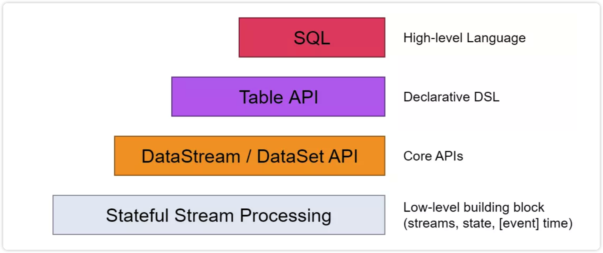

[toc]

# 安装

## 本地安装flink

### 前置环境

**java**

```shell
➜  java -version
java version "1.8.0_311"
Java(TM) SE Runtime Environment (build 1.8.0_311-b11)
Java HotSpot(TM) 64-Bit Server VM (build 25.311-b11, mixed mode)
```

### 安装

#### brew安装

```shell
➜  brew install apache-flink
*****************************************************
➜  app flink -v
Version: 1.14.4, Commit ID: 895c609
```

#### 	普通安装

地址：[下载链接](https://flink.apache.org/zh/downloads.html)

解压

```shell
➜  tar -xzf flink-1.16-SNAPSHOT-bin-scala_2.12.tgz
➜  cd flink-1.16-SNAPSHOT-bin-scala_2.12
```

### 启动集群

```shell
➜  cd /opt/homebrew/Cellar/apache-flink/1.14.4/libexec/bin
➜  bin git:(stable) ./start-cluster.sh
Starting cluster.
Starting standalonesession daemon on host chenxinyudeMacBook-Pro.local.
Starting taskexecutor daemon on host chenxinyudeMacBook-Pro.local.
```

> 打开：http://localhost:8081/#/overview 检测是否启动成功
>
> 

### 运行demo

```shell
➜  examples git:(stable) cd streaming 
➜  streaming git:(stable) ls
Iteration.jar             StateMachineExample.jar   WindowJoin.jar
SessionWindowing.jar      TopSpeedWindowing.jar     WordCount.jar
SocketWindowWordCount.jar Twitter.jar
➜  streaming git:(stable) flink run WordCount.jar 
# ***结果************
Executing WordCount example with default input data set.
Use --input to specify file input.
Printing result to stdout. Use --output to specify output path.
WARNING: An illegal reflective access operation has occurred
WARNING: Illegal reflective access by org.apache.flink.api.java.ClosureCleaner (file:/opt/homebrew/Cellar/apache-flink/1.14.4/libexec/lib/flink-dist_2.12-1.14.4.jar) to field java.lang.String.value
WARNING: Please consider reporting this to the maintainers of org.apache.flink.api.java.ClosureCleaner
WARNING: Use --illegal-access=warn to enable warnings of further illegal reflective access operations
WARNING: All illegal access operations will be denied in a future release
Job has been submitted with JobID 68db7fc6d9458763ad1c49977434ea77
Program execution finished
Job with JobID 68db7fc6d9458763ad1c49977434ea77 has finished.
Job Runtime: 284 ms
```


**查看日志**

```shell
➜  log git:(stable) tail flink-*-taskexecutor* 
==> flink-chenxinyu-taskexecutor-0-chenxinyudeMacBook-Pro.local.out <==
(nymph,1)
(in,3)
(thy,1)
(orisons,1)
(be,4)
(all,2)
(my,1)
(sins,1)
(remember,1)
(d,4)
```

# 学习笔记

## 有状态的流式处理

### 传统数据处理架构

#### 事务处理


传统架构模式中，企业的多个应用程序可能会访问同一个数据库，如上图架构模式。应用程序会远程读取数据库的状态，访问相同的数据库。


当应用需要扩展时，设计会导致一些问题。比如数据库字段不容易扩展。为了克服紧耦合的的应用程序，就产生了上述的微服务的设计模式。

#### 分析处理

不同的事务产生的数据存储在各种的数据库系统之中，这样就导致事务数据的汇总联合分析时出线难度，而且还需要转换为通用的格式。

所以，一般不会直接在事务数据库上运行分析查询，而是复制数据到数据仓库。数据仓库是数据进行分析和查询的专用数据存储。将数据复制到数据仓库的过程成为`extract-transform-load(ETL)`。ETL负责数据的提取和转换，可能包括验证、规范化、编码、去重、模式转换等，最后将其加载到分析数据库中。ETL过程可能会比较复杂，通常需要技术复杂的解决方案来满足性能要求。ETL过程需要定期运行以保持数据仓库中的数据同步。

数仓分析的类型一般可以分为定期报告查询和即席查询，定期报告用户计算与业务相关的统计信息，比如收入、用户增长或者输出的产量。用来统计评估业务的整体健康情况。即席查询旨在提供特定问题的答案并支持关键业务决策，例如：收集统计在投放商业广告上的花费，获取相应的收入，以评估某种决策的有效性。


### 有状态的流式处理

有状态的流处理程序，通常从事件日志中提取输入事件。事件日志就用来存储和分发事件流。事件被写入持久的会添加（append-only）日志，这意味着无法更改写入事件的顺序。写入事件中的流会被相同或者不同的消费者多次读取。由于日志的仅附加（append-only）属性，事件始终以完全相同的顺序发布给所有的消费者。现在已有的几种日志系统中，`Apache Kafka`是最受欢迎的。

在Flink的架构中，事件日志会按照顺序保留输入事件，并且可以按确定的顺序重播他们。如果发生故障，Flink将从先前的检查点（check point）回复其状态，并重置事件日志的读取位置，这样就可以恢复整个应用。应用程序将重放事件日志中的输入事件，直到他到达流的尾部。一般用于从故障中恢复，但也可以用于更新应用程序、修复bug。

所以，有状态的流处理是一种通用且灵活的设计架构，可以用于许多不同的场景。接下来要说的主要是三种应用程序（1）事件驱动应用程序（2）数据管道应用程序（3）数据分析应用程序。

实际应用中，往往会具有多种情况特征。

#### 事件驱动型应用程序

时间驱动的应用场景包括：

- 实时推荐
- 行为模式检查或复杂事件处理
- 异常检测

事件驱动型应用程序是微服务的演变。他们通过事件日志而不是REST调用进行通信，并将应用程序数据保存在本地状态，而不是将其写入外部数据存储区。如下图


上图中的应用之间通过事件日志链接。一个应用程序将其输出发送到事件日志通道`Kafka`，另外一个应用程序使用其他应用程序发出的事件。事件日志通道将发送者和接受者分离，并提供异步、非阻塞的事件传输。每个应用程序都是可以有状态的，并且可以将本地管理自己的状态而无需访问外部数据存储。应用程序也可以单独处理和存储。

对于微服务架构而言，事件驱动的应用程序具有多种优势。与远程数据库相比，本地状态的访问提供了非常好的性能。扩展性和容错性都由流处理器来进行保证，并且以事件日志作为输入源，应用程序的整个输入数据可以可靠存储，并且·准确的重放。此外，Flink可以将应用程序的状态重置为先前的保存点。可以不去丢失状态的进行更新或者重新扩展应用程序。

事件驱动的应用程序对他们的流处理器有着很高的要求，并不是所有的流处理器都适合运行事件驱动的应用程序。

#### 数据管道

使用较低的延迟来提取、转化和插入数据的应用程序叫做数据管道（`data pipeline`）。数据管道必须能够在短时间内处理大量的数据。还要有许多的源（`source`）和接收器（`sink`）的连接器，一边从各种存储系统中读取数据。Flink完成了所有的这些功能。

#### 流分析

流式分析是连续的提取事件流，并且通过纳入最新事件更新其计算结果，这个过程是低延迟的。这有些类似于数据库中的视图更新`views`技术。一般情况下，流式应用程序将其结果存储在支持更新的外部数据存储中，例如数据库或者键值对`key-value`流分析应用程序的实时更新结果可用于驱动监控仪表盘`dashboard`应用程序。


流分析的应用程序通常用于：

- 监控手机网络质量
- 移动应用中的用户行为
- 实时数据的即席分析

## 流处理基础

### 流处理编程简介

#### 数据流图

数据流程序描述了数据是如何在算子之间流动。数据流程序通常表示为有向图，其中节点称为算子，用来表示计算，表示数据之间的依赖性。数据流的基本功能单元是算子。一个数据流图必须至少有一个数据源和一个数据接收器。


上图中的数据流图叫做逻辑流图，因为他们表示了计算逻辑的高级视图。为了执行一个数据流程序，Flink会将逻辑流图转化为物理数据流图，详细说明程序的执行方式。每个算子在不同的物理机器之间可能会有几个并行的任务运行。如下图


#### 数据并行和任务并行

- 数据并行
  - 可以对输入数据进行分区，并且在数据子集上并行执行具有相同的算子结构的任务并行，这种并行性被称为数据并行性。它允许处理大量的数据，并将计算分散到不同的计算节点上。
- 任务并行
  - 可以对不同算子在相同或者不同的数据上并行执行。这种并行性称为任务并行性。

#### 数据交换策略


### 并行处理流数据

#### 延迟和吞吐量

流处理程序不同于批处理程序。在评估性能时，要求也有所不同。对于批处理程序，通常关心==一个作业的总的执行时间==，或我们的处理引擎读取输入所需的时间，执行计算，并回写结果。由于流处理程序是==连续运行==的，输入可能是**无界**的，所以数据流处理中没有总执行时间的概念。 相反，流处理程序必须尽可能快的提供输入数据的计算结果。我们使用**延迟**和**吞吐量**来表征流处理的性能要求。

#### 延迟

**延迟表示处理事件所需的时间。**

> 在数据流中，延迟是以时间为单位测量的，例如毫秒。根据应用程序，我们可能会关心平均延迟，最大延迟或百分位延迟。例如，平均延迟值为10ms意味着处理事件的平均时间在10毫秒内。或者，延迟值为95%，10ms表示95%的事件在10ms内处理完毕。平均值隐藏了处理延迟的真实分布，可能会让人难以发现问题。
>
> 确保低延迟对于许多流应用程序来说至关重要，例如欺诈检测，系统警报，网络监控和提供具有严格服务水平协议的服务。低延迟是流处理的关键特性，它实现了我们所谓的实时应用程序。像Apache Flink这样的现代流处理器可以提供低至几毫秒的延迟。相比之下，传统批处理程序延迟通常从几分钟到几个小时不等。在批处理中，首先需要收集事件批次，然后才能处理它们。因此，延迟是受每个批次中最后一个事件的到达时间的限制。所以自然而然取决于批的大小。真正的流处理不会引入这样的人为延迟，因此可以实现真正的低延迟。真的流模型，事件一进入系统就可以得到处理。延迟更密切地反映了在每个事件上必须进行的实际工作。

#### 吞吐量

**吞吐量是衡量系统处理能力的指标，也就是处理速率。**吞吐量告诉我们每个时间单位系统可以处理多少事件

> 吞吐量以每个时间单位系统所能处理的事件数量或操作数量来衡量。值得注意的是，事件处理速率取决于事件到达的速率，低吞吐量并不一定表示性能不佳。 在流式系统中，我们通常希望确保我们的系统可以处理最大的预期事件到达的速率。也就是说，我们主要的关注点在于确定的峰值吞吐量是多少，当系统处于最大负载时性能怎么样。为了更好地理解峰值吞吐量的概念，让我们考虑一个流处理 程序没有收到任何输入的数据，因此没有消耗任何系统资源。当第一个事件进来时，它会尽可能以最小延迟立即处理。

### 数据流上的操作

#### 数据摄入和数据吞吐量

**数据摄取**和**数据出口**操作允许流处理程序与外部系统通信。数据摄取是操作从外部源获取原始数据并将其转换为其他格式**(ETL)**。实现数据提取逻辑的运算符被称为**数据源**。数据源可以从==TCP Socket，文件，Kafka Topic或传感器数据接口==中提取数据。数据出口是以适合消费的形式产出到外部系统。执行数据出口的运算符称为**数据接收器**，包括==文件，数据库，消息队列和监控接口==。

#### 转换算子


转换算子是单遍处理算子，碰到一个事件处理一个事件。这些操作在使用后会消费一个事件，然后对事件数据做一些转换，产生一个新的输出流。

操作符可以接受多个输入流并产生多个输出流。他们还可以通过修改数据流图的结构要么将流分成多个流，要么将流合并为一条流。

#### 滚动聚合

滚动聚合是一种聚合，例如`sum`，`minimum`和`maximum`，为每个输入事件不断更新。 聚合操作是有状态的，并将当前状态与传入事件一起计算以产生更新的聚合值。请注意能够有效地将当前状态与事件相结合 产生单个值，聚合函数必须是关联的和可交换的。否则，操作符必须存储完整的流数据历史。下图显示了最小滚动 聚合。

操作符保持当前的最小值和相应地为每个传入的事件来更新最小值。


#### 窗口操作符

转换和滚动聚合一次处理一个事件产生输出事件并可能更新状态。但是，有些操作必须**收集并缓冲数据以计算其结果**。 例如，考虑不同流之间的连接或整体聚合这样的操作，例如**中值函数**。为了在无界流上高效运行这些操作符，我们需要限制这些操作维护的数据量。

>窗口还可以在语义上实现关于流的比较复杂的查询。我们已经看到了滚动聚合的方式，以聚合值编码整个流的历史数据来为每个事件提供低延迟的结果。 但如果我们只对最近的数据感兴趣的话会怎样？考虑给司机提供实时交通信息的应用程序。这个程序可以使他们避免拥挤的路线。在这种场景下，你想知道某个位置在最近几分钟内是否有事故发生。 另一方面，了解所有发生过的事故在这个应用场景下并没有什么卵用。更重要的是，通过将流历史缩减为单一聚合值，我们将丢失这段时间内数据的变化。例如，我们可能想知道每5分钟有多少车辆穿过 某个路口。
>
>窗口操作不断从==无限事件流中创建有限的事件集==，好让我们执行有限集的计算。通常会基于数据属性或基于时间的窗口来分配事件。 要正确定义窗口运算符语义，我们需要确定如何给窗口分配事件以及对窗口中的元素进行求值的频率是什么样的。 窗口的行为由一组策略定义。窗口策略决定何时创建新的窗口以及要分配的事件属于哪个窗口，以及何时对窗口中的元素进行求值。 而窗口的求值基于触发条件。一旦触发条件得到满足，窗口的内容将会被发送到求值函数，求值函数会将计算逻辑应用于窗口中的元素。 求值函数可以是sum或minimal或自定义的聚合函数。 求值策略可以根据时间或者数据属性计算(例如，在过去五秒内收到的事件或者最近的一百个事件等等)。 接下来，我们描述常见窗口类型的语义。

**窗口的类型**

1. `滚动窗口`（==每次达到窗口结尾的时候触发一次事件间隔==）


2. `滑动窗口`（事件可能属于多个桶，通过窗口长度和滑动距离来定义滑动窗口，下图为4个事件，3个滑动距离）


3. `会话窗口`（类似用户使用App，使用时间不是均匀的，而是每次使用了多久，中间可能会中断，那么一次使用期间就是一个会话窗口，会话窗口不会实现定义窗口的大小，使用间隙值来区分会话，不活动的时间即为间隙值）


4. `并行窗口`（在实际情况中，可能会将一条事件流分为多个逻辑流，自定义窗口。比如基于某一个属性进行区分，每个流有自己的窗口逻辑）


### 时间语义

> **在流处理中，一分钟代表什么？**
>
> 一分钟应该是事件实际发生的时间，而不是应用程序收到事件的时间。如果我们按照收到的时间来讲，就会因为网络原因等原因产生很多的问题，导致结果变化，一分钟之内的事件数量，应当是数据本身的时间。
>
> 例：假设有一个团队打地鼠游戏，游戏的胜负是看团队中所有人**1分钟内打地鼠数量**的综合，如果你有刚好在游戏开始时经过网络不好的地段（比如地铁），然后手机信号差导致，那么在离线状态下，你的1分钟内打地鼠数量应当是暂存在手机本地，当离开地铁时候，事件才被发送到处理程序，那么这时候，1分钟内数量应该包含离线那部分时间么？

#### 处理时间

处理时间是处理流应用程序的机器的本地时间。在上述例子中，处理时间的窗口将不会收集手机离线时产生的事件。

#### 事件时间

事件时间是流中事件实际发生的事件。事件时间基于流中事件本身的时间戳。通常情况下，在事件经过流处理应用程序之前，事件数据本身就已经包含了时间戳。

事件时间使得计算结果的过程不需要依赖处理数据的速度。基于事件时间的操作是可预测的，结果也是确定的。

可以利用事件时间解决事件本身时间乱序的问题。以来保证在事件乱序到达的情况下，我们也可以保证结果的正确性。当然由于时间戳的确定性，甚至可以快进过去。也就说可以重播某一条流，然后分析历史数据，以追上目前发生的事件。应用程序仍然是一个实时处理程序，而且业务逻辑不需要改变。

#### 水位线

> **水位线**是指全局进度的度量标准，系统可以以某一个时间节点为水位线，确定改水位线之前的事件均已经到达处理程序。本质上水位线提供了一个逻辑时钟。当一个运算符遇到含有时间T的水位线的时候，这个运算符会认为，早于时间T内发生的事件都已经全部到达了。对于事件时间窗口和乱序事件的处理，水位线的划分十分重要。
>
> 激进的水位线设置可以保证低延迟，但结果不够准确，在这种情况下，可能会有晚于水位线的迟到事件到达，可以编写一些代码来处理这些迟到的事件。如果水位线设置的过于宽松，计算结果的准确性会很高，但是可能会增加流处理应用程序不必要的延时。
>
> **某些情况下，系统可能会把迟到的事件丢弃**

### 状态和持久化模型

> 相关教程：[Flink状态和容错](https://www.ikeguang.com/article/1988)

在数据处理中**状态**是普遍存在的。任何稍微复杂一点的运算都涉及状态。为了产生计算结果，一个函数在一段时间内的一定数量的事件上累加状态。**有状态的运算符**使用输入的事件以及内部保存的状态来计算得到输出。

批处理系统来分析一个**无界数据集**时，会发现状态的重要性显而易见。在现代流处理器兴起之前，处理无界数据集的一个通常做法是**将输入的事件攒成微批**，然后交由批处理器来处理。当一个任务结束时，计算结果将被**持久化**，而所有的运算符状态就丢失了。==一旦一个任务在计算下一个微批次的数据时，这个任务是无法访问上一个任务的状态的（都丢掉了）==。这个问题通常使用将状态代理到外部系统（例如数据库）的方法来解决。相反，在一个连续不间断运行的流处理任务中，**事件的状态是一直存在的**，我们可以将状态暴露出来作为编程模型中的一等公民。当然，我们的确可以使用外部系统来管理流的状态，即使这个解决方案会带来**额外的延迟**。

> 由于流处理运算符默认处理的是**无界数据流**。所以我们必须要注意**不要让内部状态无限的增长**。为了限制状态的大小，运算符通常情况下会保存一些之前所观察到的事件流的总结或者概要。这个总结可能是一个计数值，一个累加和，或者事件流的采样，窗口的缓存操作，或者是一个自定义的数据结构，这个数据结构用来保存数据流中感兴趣的一些特性。

**支持状态的运算符可能碰到的一些问题**

- 状态管理
  - 系统需要高效的状态管理，并保证针对状态进行并发更新，不会产生竞争条件。
- 状态分区
  - 并行带来的复杂性。因为计算结果同时取决于已经保存的状态和输入的事件流。幸运的是，大多数情况下，我们可以使用key来对状态进行分区，然后独立管理每一个分区。例如当我们处理一组传感器的测量事件流时，可以使用分区的运算符状态来针对不同的传感器独立保存状态。
- 状态恢复
  - 有状态的运算符如何保证状态可以恢复，即使出现任务失败的情况，计算也是正确的。

#### 任务失败

流任务重运算符的状态是很宝贵的。如果任务失败的情况下，状态丢失的话，任务恢复以后的计算结果将会受到影响。流任务会连续不断的运行很长的时间，而状态可能已经收集了几天甚至更久，在失败的情况下，重新处理所有的输入并重新生成一个丢失的状态，将会很浪费时间，开销也很大。

> **什么是任务失败？**

一个处理任务分为以下的步骤：

1. 接收事件，并将时间存储在本地缓存中
2. 更新内部状态；
3. 产生输出记录

**以上的所有步骤都可能会失败**

但是系统必须在失败的场景下如何处理有清晰的定义。如果任务在第一步就失败了，事件会丢失嘛？如果如果当更新内部状态的时候任务失败了，那么内部状态会在任务恢复以后更新嘛？

在批处理场景下，所有的问题都不是问题。因为我们可以很方便的重新计算，所以不会有事件丢失，状态也可可以得到完全恢复。在流处理中，失败不是一个小问题。流系统在失败的情况下需要保证结果的准确性。

> 结果的保证

当我们讨论保证计算的结果时，我们的意思是流处理器的内部状态需要保证一致性。也就是说我们关心的是应用程序的代码在故障恢复以后看到的状态值是什么。要注意保证应用程序状态的一致性并不是保证应用程序的输出结果的一致性。一旦输出结果被持久化，结果的准确性就很难保证了。除非持久化系统支持事务。

==*AT-MOST-ONCE*==

当任务故障时，最简单的做法是什么都不干，既不恢复丢失的状态，也不重播丢失的事件。At-most-once语义的含义是最多处理一次事件。换句话说，事件可以被丢弃掉，也没有任何操作来保证结果的准确性。这种类型的保证也叫“没有保证”，因为一个丢弃掉所有事件的系统其实也提供了这样的保障。没有保障听起来是一个糟糕的主意，但如果我们能接受近似的结果，并且希望尽可能低的延迟，那么这样也挺好。

==*AT-LEAST-ONCE*==

在大多数的真实应用场景，我们希望不丢失事件。这种类型的保障成为at-least-once，意思是所有的事件都得到了处理，而且一些事件还可能被处理多次。如果结果的正确性仅仅依赖于数据的完整性，那么重复处理是可以接受的。例如，判断一个事件是否在流中出现过，at-least-once这样的保证完全可以正确的实现。在最坏的情况下，我们多次遇到了这个事件。而如果我们要对一个特定的事件进行计数，计算结果就可能是错误的了。

为了保证在at-least-once语义的保证下，计算结果也能正确。我们还需要另一套系统来从数据源或者缓存中重新播放数据。持久化的事件日志系统将会把所有的事件写入到持久化存储中。所以如果任务发生故障，这些数据可以重新播放。还有一种方法可以获得同等的效果，就是使用结果承认机制。这种方法将会把每一条数据都保存在缓存中，直到数据的处理等到所有的任务的承认。一旦得到所有任务的承认，数据将被丢弃。

==*EXACTLY-ONCE*==

恰好处理一次是最严格的保证，也是最难实现的。恰好处理一次语义不仅仅意味着没有事件丢失，还意味着针对每一个数据，内部状态仅仅更新一次。本质上，恰好处理一次语义意味着我们的应用程序可以提供准确的结果，就好像从未发生过故障。

提供恰好处理一次语义的保证必须有至少处理一次语义的保证才行，同时还需要数据重放机制。另外，流处理器还需要保证内部状态的一致性。也就是说，在故障恢复以后，流处理器应该知道一个事件有没有在状态中更新。事务更新是达到这个目标的一种方法，但可能引入很大的性能问题。Flink使用了一种轻量级快照机制来保证恰好处理一次语义。

==*端到端恰好处理一次*==


## Flink运行架构

### 系统架构

#### 运行组件

Flink在运行时包括四个不同的组件，他们会在运行流处理应用程序的时候协同工作：**作业管理器`JobManager`、资源管理器`ResourceManager`、任务管理器`TaskManager`、分发器`Dispatcher`**。Flink利用Java和Scala实现的，所以所有组件都会运行在Java虚拟机`JVMs`上。每个组件的职责如下：

- 作业管理器`JobManager`
  - 控制一个应用程序的主进程，也就是说，每个应用程序都会被一个不同的作业管理器所控制执行。作业管理器首先会接受到要执行的应用程序，包括：作业图`JobGraph`、逻辑数据流图`Logical dataflow graph`、打包了的所有类库和其他组员的jar包。作业管理器会把JobGraph转化成一个物理层面的数据流图，这个图被叫做`执行图<ExecutionGraph>`，包含了所有可以并发执行的任务。作业管理器会向资源管理器`ResourceManager`请求执行任务必要的资源，也就是任务管理器`TaskManager`上的插槽`slot`。一旦它获取到了足够的资源，就会将执行图分发到真正运行它们的`TaskManager`上。而在运行过程中，作业管理器会负责所有需要中央协调的操作，比如说检查点`checkpoints`的协调。
- 资源管理器`ResourceManager`
  - 管理任务管理器`TaskManager`的插槽`slot`，TaskManger插槽是Flink中定义的处理资源单元。Flink为不同的环境和资源管理工具提供了不同资源管理器`ResourceManager`，比如YARN、Mesos、K8s，以及standalone部署。当作业管理器申请插槽资源时，ResourceManager会将有空闲插槽的`TaskManager`分配给作业管理器。如果ResourceManager没有足够的插槽来满足作业管理器的请求，它还可以向资源提供平台发起会话，以提供启动`TaskManager`进程的容器。另外，ResourceManager还负责终止空闲的TaskManager，释放计算资源。	
- 任务管理器`TaskManager`
  - Flink中的工作进程。通常在Flink中会有多个`TaskManager`运行，每一个TaskManager都包含了一定数量的插槽`slots`。插槽的数量限制了TaskManager能够执行的任务数量。启动之后，TaskManager会向资源管理器注册它的插槽；收到资源管理器的指令后，TaskManager就会将一个或者多个插槽提供给作业管理器调用。作业管理器就可以向插槽分配任务`tasks`来执行了。在执行过程中，一个TaskManager可以跟其它运行同一应用程序的TaskManager交换数据。任务的执行和插槽的概念会在`任务执行`一节做具体讨论。
- 分发器`Dispatcher`
  - 可以跨作业运行，它为应用提交提供了`REST接口`。当一个应用被提交执行时，分发器就会启动并将应用移交给一个作业管理器。由于是REST接口，所以`Dispatcher`可以作为集群的一个`HTTP接入点`，这样就能够不受防火墙阻挡。Dispatcher也会启动一个`Web UI`，用来方便地展示和监控作业执行的信息。Dispatcher在架构中可能并不是必需的，这取决于应用提交运行的方式。


#### 应用部署

- 框架`Framework`
  - 在这个模式下，Flink应用被打包成一个`Jar文件`，并由客户端提交给一个`运行服务（running service）`。这个服务可以是一个Flink的Dispatcher，也可以是一个Flink的作业管理器，或是`Yarn`的ResourceManager。如果application被提交给一个作业管理器，则它会立即开始执行这个`application`。如果application被提交给了一个Dispatcher，或是Yarn ResourceManager，则它会启动一个作业管理器，然后将application交给它，再`由作业管理器开始执行`此应用。
- 库`Library`
  - 在这个模式下，Flink Application 会被打包在一个`容器（container） 镜像`里，例如一个`Docker `镜像。此镜像包含了运行作业管理器和ResourceManager的代码。**当一个容器从镜像启动后，它会自动启动ResourceManager和作业管理器，并提交打包好的应用**。另一种方法是：**将应用打包到镜像后，只用于部署TaskManager容器**。从镜像启动的容器会自动启动一个TaskManager，然后连接ResourceManager并注册它的slots。这些镜像的启动以及失败重启，通常都会由一个外部的资源管理器管理`（比如Kubernetes）`。

#### 任务执行

一个`TaskManager`可以同时执行多个任务**（tasks）**。这些任务可以是**同一个算子（operator）**的子任务**（数据并行）**，也可以是来自不同算子的**（任务并行）**，甚至可以是另一个不同应用程序的**（作业并行）**。`TaskManager`提供了一定数量的**处理插槽（processing slots）**，用于控制可以并行执行的任务数。一个slot可以执行应用的一个分片，也就是应用中每一个算子的一个并行任务。


>最左边是一个“作业图”（`JobGraph`），包含了5个算子——它是应用程序的非并行表示。其中算子A和C是数据源（`source`），E是输出端（`sink`）。C和E并行度为2，而其他的算子并行度为4。因为最高的并行度是4，所以应用需要至少四个slot来执行任务。现在有两个`TaskManager`，每个又各有两个`slot`，所以我们的需求是满足的。作业管理器将`JobGraph`转化为“执行图”（`ExecutionGraph`），并将任务分配到四个可用的`slot`上。对于有4个并行任务的算子，它的task会分配到每个slot上。而对于并行度为2的`operator` C和E，它们的任务被分配到slot 1.1、2.1 以及 slot 1.2、2.2。将tasks调度到slots上，可以让多个tasks跑在同一个`TaskManager`内，也就可以是的tasks之间的数据交换更高效。然而将太多任务调度到同一个`TaskManager`上会导致`TaskManager`**过载**，继而影响效率。
>
>TaskManager在同一个JVM中以多线程的方式执行任务。线程较进程会更轻量级，但是**线程之间并没有对任务进行严格隔离**。所以，==单个任务的异常行为有可能会导致整个TaskManager进程挂掉==，当然也同时包括运行在此进程上的所有任务。通过为每个TaskManager配置单独的slot，就可以将应用在TaskManager上相互隔离开来。**TaskManager内部有多线程并行的机制**，而且在一台主机上可以部署多个`TaskManager`，所以Flink在资源配置上非常灵活，在部署应用时可以充分权衡性能和资源的隔离。

#### 高可用

流式应用程序一般被设计为7 x 24小时运行。所以很重要的一点是：即使出现了进程挂掉的情况，应用仍需要继续保持运行。为了从故障恢复，系统首先需要重启进程、然后重启应用并恢复它的状态。接下来，我们就来了解Flink如何重启失败的进程。

*`TaskManager`故障*

如前所述，Flink需要足够数目的slot，来执行一个应用的所有任务。假设一个Flink环境有4个TaskManager，每个提供2个插槽，那么流应用程序执行的最高并行度为8。如果其中一个TaskManager挂掉了，那么可用的slots会降到6。在这种情况下，作业管理器会请求ResourceManager提供更多的slots。如果此请求无法满足——例如应用跑在一个独立集群——那么作业管理器在有足够的slots之前，无法重启应用。应用的重启策略决定了作业管理器的重启频率，以及两次重启尝试之间的时间间隔。

*`作业管理器`故障*

比TaskManager故障更严重的问题是作业管理器故障。作业管理器控制整个流应用程序的执行，并维护执行中的元数据——例如指向已完成检查点的指针。若是对应的作业管理器挂掉，则流程序无法继续运行。所以这就导致在Flink应用中，作业管理器是单点故障。为了解决这个问题，Flink提供了高可用模式。在原先的作业管理器挂掉后，可以将一个作业的状态和元数据迁移到另一个作业管理器，并继续执行。

Flink的高可用模式基于`Apache ZooKeeper`，我们知道，ZooKeeper是用来管理需要协调和共识的分布式服务的系统。Flink主要利用ZooKeeper来进行领导者（leader）的选举，并把它作为一个高可用和持久化的数据存储。当在高可用模式下运行时，作业管理器会将JobGraph以及所有需要的元数据（例如应用程序的jar文件），写入到一个远程的持久化存储系统中。而且，作业管理器会将指向存储位置的指针，写入到ZooKeeper的数据存储中。在执行一个应用的过程中，作业管理器会接收每个独立任务检查点的状态句柄（也就是存储位置）。当一个检查点完成时（所有任务已经成功地将它们的状态写入到远程存储）， 作业管理器把状态句柄写入远程存储，并将指向这个远程存储的指针写入ZooKeeper。这样，一个作业管理器挂掉之后再恢复，所需要的所有数据信息已经都保存在了远程存储，而ZooKeeper里存有指向此存储位置的指针。


### 数据传输

#### 基于信任度的流控制

通过网络连接来发送每条数据的效率都很低，会导致开销很大，为了充分利用网络连接的带宽，就需要进行缓冲。


…

### 事件时间处理

…

### 状态管理

…

### 检查点，保存点和状态恢复

…


# Flink DataStream API

## 概述

**什么可以被转化成流**

Java和Scala 的API可以将任何可序列化对象转化为流。

- 基本类型：String、Long、Integer、Boolean、Array
- 复合类型：Tuples、POJOs、Scala case classes

**Java tuples和POJOs**

- Tuples

在Java中，Flink自带Tuple0~25类型

```java
Tuple2<String,Integer> p = Tuple2.of("Fred",35);

// zero based index
String name = person.f0;
Integer age = person.f1;
```

- POJO
  - pojo是公有且独立的（没有非静态内部类）
  - pojo有公有的无参构造函数
  - 类（及父类）中所有的不被static、transient修饰的属性要么是共有的（不能被final修饰），要么包含公有的getter和setter方法，所有方法遵循Java bean命名规范。

```java
public class Person {
  public String name;
  public Integer age;
  public Person(String name, Integer age){
    ...
  }
}
```

**示例**

```java
public class Example {
    public static void main(String[] args) throws Exception {
        final StreamExecutionEnvironment env = StreamExecutionEnvironment.getExecutionEnvironment();

        DataStream<Student> ds = env.fromElements(
                new Student("chenxinyu", 21),
                new Student("blank", 1),
                new Student("Misaki", 2)
        );

        DataStream<Student> filterDs = ds.filter((FilterFunction<Student>) student -> student.getAge() > 18);

        filterDs.print();

        env.execute();
    }
}
```

过滤未成年人；


**Flink DataStream 操作概览**


**不同类型的 DataStream 子类型。不同的子类型支持不同的操作集合**


基本结构如下

- 设置运行环境
- 配置数据源读取
- 数据转化处理
- 配置输出数据源
- 执行

```java
//1、设置运行环境
StreamExecutionEnvironment env = StreamExecutionEnvironment.getExecutionEnvironment();
//2、配置数据源读取数据
DataStream<String> text = env.readTextFile ("input");
//3、进行一系列转换
DataStream<Tuple2<String, Integer>> counts = text.flatMap(new Tokenizer()).keyBy(0).sum(1);
//4、配置数据汇写出数据
counts.writeAsText("output");
//5、提交执行
env.execute("Streaming WordCount");
```

## flink连接Kafka

**maven依赖**

```xml
		<!--Lombok-->
		<dependency>
			<groupId>org.projectlombok</groupId>
			<artifactId>lombok</artifactId>
			<version>1.18.24</version>
		</dependency>
		<!-- Apache Flink dependencies -->
		<!-- These dependencies are provided, because they should not be packaged into the JAR file. -->
		<dependency>
			<groupId>org.apache.flink</groupId>
			<artifactId>flink-streaming-java</artifactId>
			<version>1.15.0</version>
		</dependency>
		<dependency>
			<groupId>org.apache.flink</groupId>
			<artifactId>flink-clients</artifactId>
			<version>1.15.0</version>
		</dependency>

		<dependency>
			<groupId>org.apache.flink</groupId>
			<artifactId>flink-connector-kafka</artifactId>
			<version>1.15.0</version>
		</dependency>
		<dependency>
			<groupId>org.apache.flink</groupId>
			<artifactId>flink-connector-base</artifactId>
			<version>1.15.0</version>
		</dependency>
```

**消费kafka消息**

```java
/************************************************************
 * @ProjectName   : flink
 * @ClassName     : Example
 * @author        : chenxinyu
 * @createTime    : 2022/6/13
 ************************************************************/
public class ReadKafka {
    public static void main(String[] args) throws Exception {
        final StreamExecutionEnvironment env = StreamExecutionEnvironment.getExecutionEnvironment();

        KafkaSource<String> source = KafkaSource.<String>builder()
                                                .setBootstrapServers("localhost:9092")
                                                .setTopics("binlog")
                                                .setGroupId("my-group")
                                                .setDeserializer(KafkaRecordDeserializationSchema.valueOnly(StringDeserializer.class))
                                                .build();

        DataStream<String> kafkaSource = env.fromSource(source, WatermarkStrategy.noWatermarks(), "Kafka Source");
        kafkaSource.print();

        env.execute();


    }
}
```

**效果图**


**示例**

```java
public class GroupedProcessingTimeWindowSample {
    private static class DataSource extends RichParallelSourceFunction<Tuple2<String, Integer>> {
        private volatile boolean isRunning = true;

        @Override
        public void run(SourceContext<Tuple2<String, Integer>> ctx) throws Exception {
            Random random = new Random();
            while (isRunning) {
                Thread.sleep((getRuntimeContext().getIndexOfThisSubtask() + 1) * 1000 * 5);
                String key = "类别" + (char) ('A' + random.nextInt(3));
                int value = random.nextInt(10) + 1;

                System.out.println(String.format("Emits\t(%s, %d)", key, value));
                ctx.collect(new Tuple2<>(key, value));
            }
        }

        @Override
        public void cancel() {
            isRunning = false;
        }
    }

    public static void main(String[] args) throws Exception {
        StreamExecutionEnvironment env = StreamExecutionEnvironment.getExecutionEnvironment();
        env.setParallelism(2);

        DataStream<Tuple2<String, Integer>> ds = env.addSource(new DataSource());
        KeyedStream<Tuple2<String, Integer>, Tuple> keyedStream = ds.keyBy(0);

        keyedStream.sum(1).keyBy(new KeySelector<Tuple2<String, Integer>, Object>() {
            @Override
            public Object getKey(Tuple2<String, Integer> stringIntegerTuple2) throws Exception {
                return "";
            }
        }).fold(new HashMap<String, Integer>(), new FoldFunction<Tuple2<String, Integer>, HashMap<String, Integer>>() {
            @Override
            public HashMap<String, Integer> fold(HashMap<String, Integer> accumulator, Tuple2<String, Integer> value) throws Exception {
                accumulator.put(value.f0, value.f1);
                return accumulator;
            }
        }).addSink(new SinkFunction<HashMap<String, Integer>>() {
            @Override
            public void invoke(HashMap<String, Integer> value, Context context) throws Exception {
                  // 每个类型的商品成交量
                  System.out.println(value);
                  // 商品成交总量                
                  System.out.println(value.values().stream().mapToInt(v -> v).sum());
            }
        });

        env.execute();
    }
}
```

# Flink Table API

> maven依赖如下

```xml
<dependency>
  <groupId>org.apache.flink</groupId>
  <artifactId>flink-table-api-java</artifactId>
  <version>${flink.version}</version>
</dependency>

<dependency>
  <groupId>org.apache.flink</groupId>
  <artifactId>flink-table-api-java-bridge</artifactId>
  <version>${flink.version}</version>
</dependency>

<dependency>
  <groupId>org.apache.flink</groupId>
  <artifactId>flink-table-planner_2.12</artifactId>
  <version>${flink.version}</version>
</dependency>

<dependency>
  <groupId>org.apache.flink</groupId>
  <artifactId>flink-table-common</artifactId>
  <version>${flink.version}</version>
</dependency>
```

## Table API和SQL程序的通用结构

```java
// tableAPI 环境
TableEnvironment tableEnv = TableEnvironment.create(/*…*/);

// 创建来源表
tableEnv.createTemporaryTable("SourceTable", TableDescriptor.forConnector("datagen")
    .schema(Schema.newBuilder()
      .column("f0", DataTypes.STRING())
      .build())
    .option(DataGenOptions.ROWS_PER_SECOND, 100)
    .build());

// 创建sink表（ddl语句）
tableEnv.executeSql("CREATE TEMPORARY TABLE SinkTable WITH ('connector' = 'blackhole') LIKE SourceTable");

// 创建表对象
Table table2 = tableEnv.from("SourceTable");

// 创建查询对象
Table table3 = tableEnv.sqlQuery("SELECT * FROM SourceTable");

// 将sourceTable插入sinkTable
TableResult tableResult = table2.insertInto("SinkTable").execute();
```

## 创建TableEnvironment

TableEnvironment职责

- 在内部的catalog中注册Table
- 注册外部的Catalog
- 加载可拔插模块
- 执行SQL查询
- 注册自定义函数
- DataStream和Table之间转换

> 不能在同一条查询中使用不同的TableEnvironment中的表。每个Env中的表是隔离的。

**TbaleEnvironment可以通过静态方法创建**

```java
EnvironmentSettings settings = EnvironmentSettings
    .newInstance()
    .inStreamingMode()
    .build();

TableEnvironment tEnv = TableEnvironment.create(settings);
```

**可以从现有的StreamExecutionEnvironment中创建一个StreamEnvironment与DataStream API互操作**

```java
StreamExecutionEnvironment env = StreamExecutionEnvironment.getExecutionEnvironment();
StreamTableEnvironment tEnv = StreamTableEnvironment.create(env);
```

## 在Catalog中创建表

TableEnvironment中维护者一个由标识符（identifiler）创建的表catalog的映射。标识符由三个部分组成：

- [catalog](https://nightlies.apache.org/flink/flink-docs-release-1.15/zh/docs/dev/table/catalogs/)名称
- 数据库名称
- 对象名称

如果catalog或者数据库没有指明，就会使用当前默认值。

Table可以是虚拟的（`视图Views`）也可以是常规的（`表Tables`）。Views可以从已经存在的Table中创建，一般是TableAPI 或者是SQL查询的结果。表Tables描述的是外部数据，例如（==文件、数据库表、消息队列==）

### 临时表和永久表

临时表-`Temporary Table`

永久表- `Permanent Table`

> 表可以是**临时**的，并与单个 Flink 会话（session）的生命周期相关，也可以是永久的，并且在多个 Flink 会话和群集（cluster）中可见。
>
> **永久表**需要 [catalog](https://nightlies.apache.org/flink/flink-docs-release-1.15/zh/docs/dev/table/catalogs/)（例如 `Hive Metastore`）以维护表的元数据。一旦永久表被创建，**它将对任何连接到 catalog 的 Flink 会话可见且持续存在，直至被明确删除**。
>
> **临时表**通常保存于内存中并且仅在创建它们的 Flink 会话持续期间存在。这些表对于其它会话是不可见的。它们不与任何 `catalog` 或者数据库绑定但可以在一个命名空间（`namespace`）中创建。**即使它们对应的数据库被删除，临时表也不会被删除**。

#### 屏蔽（Shadowing）

可以使用与已经存在的永久表去注册临时表。临时表会屏蔽永久表，并且只要临时表存在，永久表就无法访问。所有使用该标识符的查询都将作用与临时表

>这可能对实验（experimentation）有用。它允许先对一个临时表进行完全相同的查询，例如只有一个子集的数据，或者数据是不确定的。一旦验证了查询的正确性，就可以对实际的生产表进行查询。

### 创建表

#### 虚拟表

java Table API如下

```java
// 获取环境
TableEnvironment tableEnv = ...;

// table is the result of a simple projection query 
Table projTable = tableEnv.from("X").select(...);

// register the Table projTable as table "projectedTable"
tableEnv.createTemporaryView("projectedTable", projTable);
```

> **注意：** 从传统数据库系统的角度来看，`Table` 对象与 `VIEW` 视图非常像。也就是，定义了 `Table` 的查询是没有被优化的， 而且会被内嵌到另一个引用了这个注册了的 `Table`的查询中。如果多个查询都引用了同一个注册了的`Table`，那么它会被内嵌每个查询中并被执行多次， 也就是说注册了的`Table`的结果**不会**被共享。

#### Connector Tables

可以通过Connector声明。Connector描述了存储表数据的外部系统。存储系统例如Kafka或者常规的文件系统

```java
// Using table descriptors
final TableDescriptor sourceDescriptor = TableDescriptor.forConnector("datagen")
    .schema(Schema.newBuilder()
    .column("f0", DataTypes.STRING())
    .build())
    .option(DataGenOptions.ROWS_PER_SECOND, 100)
    .build();

tableEnv.createTable("SourceTableA", sourceDescriptor);
tableEnv.createTemporaryTable("SourceTableB", sourceDescriptor);

// Using SQL DDL
tableEnv.executeSql("CREATE [TEMPORARY] TABLE MyTable (...) WITH (...)");
```

### 扩展表标识符

表是通过三元标识符注册，包括catalog名、数据库名和表名。

用户可以指定一个catalog和数据库作为当前`catalog`和`当前数据库`。制定后前两个部门就会被省略。如果没有指定，会使用当前的catalog和当前数据库。用户也可以用过Table API或SQL切换当前的catalog和当前数据库。

```java
TableEnvironment tEnv = ...;
tEnv.useCatalog("custom_catalog");
tEnv.useDatabase("custom_database");

Table table = ...;

// 注册'exampleView'视图在'custom_catalog'这个catalog中
// 自动在数据库'custom_database'中 
tableEnv.createTemporaryView("exampleView", table);

// 注册'exampleView'视图在'custom_catalog'这个catalog中
// 指定数据库'other_database' 
tableEnv.createTemporaryView("other_database.exampleView", table);

// 注册'example.View'视图在'custom_catalog'这个catalog中
// 自动在数据库'custom_database' 
tableEnv.createTemporaryView("`example.View`", table);

// 注册'exampleView'视图在'other_catalog'这个指定catalog中
// 指定数据库'other_database' 
tableEnv.createTemporaryView("other_catalog.other_database.exampleView", table);
```

## 查询表

### Table API

```java
// get a TableEnvironment
TableEnvironment tableEnv = ...; // see "Create a TableEnvironment" section

// 注册‘Orders’源表

// 获取Orders表对象
Table orders = tableEnv.from("Orders");
// 计算来自`FRANCE`的所有顾客的`revenue`
Table revenue = orders
  .filter($("cCountry").isEqual("FRANCE"))
  .groupBy($("cID"), $("cName"))
  .select($("cID"), $("cName"), $("revenue").sum().as("revSum"));

// emit or convert Table
// execute query
```

### SQL

**查询操作**

```java
// get a TableEnvironment
TableEnvironment tableEnv = ...; // see "Create a TableEnvironment" section

// 注册‘Orders’源表

// SQL
Table revenue = tableEnv.sqlQuery(
    "SELECT cID, cName, SUM(revenue) AS revSum " +
    "FROM Orders " +
    "WHERE cCountry = '2' " +
    "GROUP BY cID, cName"
);

// emit or convert Table
// execute query
```

**插入**:将查询的结果插入到已注册的表中

```java
// 获取环境
TableEnvironment tableEnv = ...; // see "Create a TableEnvironment" section

// 注册‘Orders’源表
// 注册"RevenueFrance"输出表

// 执行SQL
tableEnv.executeSql(
    "INSERT INTO RevenueFrance " +
    "SELECT cID, cName, SUM(revenue) AS revSum " +
    "FROM Orders " +
    "WHERE cCountry = 'FRANCE' " +
    "GROUP BY cID, cName"
);
```

> Table API 和 SQL返回的都是Table对象，所以两个可以混用
>
> - 可以在SQL查询返回的table对象上定义TableAPI的查询
> - 在TableEnvironment中注册的结果表可以在SQL查询的FROM子句中引用，通过这种方法可以在Table API查询的结果集上定义SQL查询。

## 输出表

Table通过写入TableSink进行输出。`TableSink`是一个通用接口，用于多种文件格式(**CSV、Apache Parquet、Apache Avro**)、存储系统（**JDBC、Apache Hbase、Apache Cassandra、Elasticsearch**）、消息队列（**Kafka、RabbitMQ**）

批处理Table只能写入BatchTableSink，流处理Table需要制定写入AppendStreamTableSink，RetractStreamTableSink或者UpsertStreamTableSink。

> 请参考文档 [Table Sources & Sinks](https://nightlies.apache.org/flink/flink-docs-release-1.15/zh/docs/dev/table/sourcessinks/) 以获取更多关于可用 Sink 的信息以及如何自定义 `DynamicTableSink`。

方法 `Table.insertInto(String tableName)` 定义了一个完整的端到端管道将源表中的数据传输到一个被注册的输出表中。 该方法通过名称在 catalog 中查找输出表并确认 `Table schema` 和输出表 `schema` 一致。 可以通过方法 `TablePipeline.explain()` 和 `TablePipeline.execute()` 分别来解释和执行一个数据流管道。

```java
// 获取Table环境
TableEnvironment tableEnv = ...; // see "Create a TableEnvironment" section

// 创建输出表
final Schema schema = Schema.newBuilder()
    .column("a", DataTypes.INT())
    .column("b", DataTypes.STRING())
    .column("c", DataTypes.BIGINT())
    .build();

tableEnv.createTemporaryTable("CsvSinkTable", TableDescriptor.forConnector("filesystem")
    .schema(schema)
    .option("path", "/path/to/file")
    .format(FormatDescriptor.forFormat("csv")
        .option("field-delimiter", "|")
        .build())
    .build());

// 使用Table API 或 SQL获取结果表
Table result = ...;

// 写入数据管道
TablePipeline pipeline = result.insertInto("CsvSinkTable");

// 输出详情细节展示
pipeline.printExplain();

// 将结果表发送给注册了的输出表
pipeline.execute();
```

## 执行查询与翻译

不论输入数据源是流式的还是批式的，Table API 和 SQL查询都会被转换成DataStream程序。查询在内部表示为逻辑查询计划，并被翻译成两个阶段：

1. 优化逻辑执行计划
2. 翻译成DataStream程序

Table API或者SQL查询在下列情况下会被翻译

- 当`TableEnvironment.executeSql()`被调用的时候。该方法用来执行一个SQL语句，一旦该方法被调用，SQL语句立刻被翻译成DataStream
- 当`TablePipeline.execute()`被调用时。该方法是用来执行一个源表到输出表的数据流，一旦该方法被调用，Table API程序立刻被翻译成DataStream
- 当`Table.execute()`被调用。将一个表的内容收集到本地，一旦方法被调用，Table API立刻被翻译
- 当`StatementSet.execute()`被调用时。TablePipeline（通过StatementSet.add()输出给某个Sink）和insert语句会被先缓存到StatementSet中，StatementSet.execute()方法被调用的时候，所有的sink会被优化成一张有向无环图。
- 当`Table`被转化成DataStream时。转换完成后，他就成为一个普通的DataStream程序，并会在调用`StreamExecutionEnvironment.execute()`时被执行。

## 查询优化

Apache Flink使用并扩展了Calcite来执行复杂的查询优化。

- 基于 Apache Calcite 的子查询解相关
- 投影剪裁
- 分区剪裁
- 过滤器下推
- 子计划消除重复数据以避免重复计算
- 特殊子查询重写，包括两部分：
  - 将 IN 和 EXISTS 转换为 left semi-joins
  - 将 NOT IN 和 NOT EXISTS 转换为 left anti-join
- 可选 join 重新排序
  - 通过 `table.optimizer.join-reorder-enabled` 启用

>**注意：** 当前仅在子查询重写的结合条件下支持 `IN` / `EXISTS` / `NOT IN` / `NOT EXISTS`。
>
>优化器不仅基于计划，而且还基于可从数据源获得的丰富统计信息以及每个算子（例如 io，cpu，网络和内存）的细粒度成本来做出明智的决策。
>
>高级用户可以通过 `CalciteConfig` 对象提供自定义优化，可以通过调用 `TableEnvironment＃getConfig＃setPlannerConfig` 将其提供给 TableEnvironment。

## 解释表

Table API 提供了一种机制来解释计算 `Table` 的逻辑和优化查询计划。 这是通过 `Table.explain()` 方法或者 `StatementSet.explain()` 方法来完成的。`Table.explain()` 返回一个 Table 的计划。`StatementSet.explain()` 返回多 sink 计划的结果。它返回一个描述三种计划的字符串：

1. 关系查询的抽象语法树（the Abstract Syntax Tree），即未优化的逻辑查询计划，
2. 优化的逻辑查询计划，以及
3. 物理执行计划。

```java
StreamExecutionEnvironment env = StreamExecutionEnvironment.getExecutionEnvironment();
StreamTableEnvironment tEnv = StreamTableEnvironment.create(env);

DataStream<Tuple2<Integer, String>> stream1 = env.fromElements(new Tuple2<>(1, "hello"));
DataStream<Tuple2<Integer, String>> stream2 = env.fromElements(new Tuple2<>(1, "hello"));

// explain Table API
Table table1 = tEnv.fromDataStream(stream1, $("count"), $("word"));
Table table2 = tEnv.fromDataStream(stream2, $("count"), $("word"));
Table table = table1
  .where($("word").like("F%"))
  .unionAll(table2);

System.out.println(table.explain());
```


# Flink 客户端操作

查看客户端

在flink的安装目录的bin目录下，可以看到，有flink，start-scala-shell.sh都是客户端


## Flink SQL

**启动**

```shell
➜  bin git:(stable) ./bin/sql-client.sh
```

**Select查询**

```sql
Flink SQL> SELECT 'HELLO WORLD';
```


Web里面显示这条SQL已经执行完毕


### Explain

查看SQL的执行计划

```sql
Flink SQL> explain SELECT 'Hello, MY Friend';

== Abstract Syntax Tree ==
LogicalProject(EXPR$0=[_UTF-16LE'Hello, MY Friend'])
+- LogicalValues(tuples=[[{ 0 }]])

== Optimized Physical Plan ==
Calc(select=[_UTF-16LE'Hello, MY Friend' AS EXPR$0])
+- Values(type=[RecordType(INTEGER ZERO)], tuples=[[{ 0 }]])

== Optimized Execution Plan ==
Calc(select=[_UTF-16LE'Hello, MY Friend' AS EXPR$0])
+- Values(tuples=[[{ 0 }]])
```

### 源表

Flink支持可以与表一起使用的不同的连接器和格式。以下是由CSV文件支持的源表示例

csv文件如下：

```shell
➜  ~ cat /tmp/input.csv
1,hello
2,world
3,hello world
1,ok
3,bye bye
4,yes
```

建表语句

```sql
Flink SQL> CREATE TABLE cxy_test_input(
> input_id INT,
> input_String VARCHAR
> ) WITH (
>   'connector' = 'filesystem',
>   'path' = '/tmp/input.csv',
>   'format' = 'csv'
> );
```

运行查询

```sql
select * from default_catalog.default_database.cxy_test_input ;
```

结果


### JDBC

### Data Type Mapping

|              MySQL type               |                       PostgreSQL type                        |            Flink SQL type            |
| :-----------------------------------: | :----------------------------------------------------------: | :----------------------------------: |
|               `TINYINT`               |                                                              |              `TINYINT`               |
|     `SMALLINT` `TINYINT UNSIGNED`     |          `SMALLINT` `INT2` `SMALLSERIAL` `SERIAL2`           |              `SMALLINT`              |
| `INT` `MEDIUMINT` `SMALLINT UNSIGNED` |                      `INTEGER` `SERIAL`                      |                `INT`                 |
|        `BIGINT` `INT UNSIGNED`        |                     `BIGINT` `BIGSERIAL`                     |               `BIGINT`               |
|           `BIGINT UNSIGNED`           |                                                              |           `DECIMAL(20, 0)`           |
|               `BIGINT`                |                           `BIGINT`                           |               `BIGINT`               |
|                `FLOAT`                |                       `REAL` `FLOAT4`                        |               `FLOAT`                |
|      `DOUBLE` `DOUBLE PRECISION`      |                 `FLOAT8` `DOUBLE PRECISION`                  |               `DOUBLE`               |
|    `NUMERIC(p, s)` `DECIMAL(p, s)`    |               `NUMERIC(p, s)` `DECIMAL(p, s)`                |           `DECIMAL(p, s)`            |
|        `BOOLEAN` `TINYINT(1)`         |                          `BOOLEAN`                           |              `BOOLEAN`               |
|                `DATE`                 |                            `DATE`                            |                `DATE`                |
|             `TIME [(p)]`              |               `TIME [(p)] [WITHOUT TIMEZONE]`                |   `TIME [(p)] [WITHOUT TIMEZONE]`    |
|           `DATETIME [(p)]`            |             `TIMESTAMP [(p)] [WITHOUT TIMEZONE]`             | `TIMESTAMP [(p)] [WITHOUT TIMEZONE]` |
|     `CHAR(n)` `VARCHAR(n)` `TEXT`     | `CHAR(n)` `CHARACTER(n)` `VARCHAR(n)` `CHARACTER VARYING(n)` `TEXT` |               `STRING`               |
|      `BINARY` `VARBINARY` `BLOB`      |                           `BYTEA`                            |               `BYTES`                |
|                                       |                           `ARRAY`                            |               `ARRAY`                |

### 实例

导入jar包，注意`flink-connector-jdbc`的版本


启动sqlclient

```shell
➜  libexec git:(stable) bin/sql-client.sh embedded \
--jar lib/flink-connector-jdbc_2.11-1.14.4.jar \
--jar lib/mysql-connector-java-8.0.29.jar
```

建表语句

```sql
CREATE TABLE my_mysql_table (
 id INT,
 user_name STRING,
 user_msg STRING,
 date_time TIMESTAMP,
 user_id INT,
 PRIMARY KEY (id) NOT ENFORCED
 ) WITH (
  'connector' = 'jdbc',
  'url' = 'jdbc:mysql://124.222.34.234:3306/cems',
  'driver' = 'com.mysql.cj.jdbc.Driver',
  'table-name' = 'com_chat',
  'username' = 'root',
  'password' = '6800'
);
```

结果


> flink SQL插入语句TIMESTAMP 类型读取当前时间可以使用 LOCALTIMESTAMP


### 时区

**配置时区参数**

- 配置相同时区的参数

  可以通过配置作业的时区调整时间类型数据的输出结果。默认时区为东八区

  - 时区列表

  ```txt
  Africa/Abidjan
  Africa/Accra
  Africa/Addis_Ababa
  Africa/Algiers
  Africa/Asmara
  Africa/Asmera
  Africa/Bamako
  Africa/Bangui
  Africa/Banjul
  Africa/Bissau
  Africa/Blantyre
  Africa/Brazzaville
  Africa/Bujumbura
  Africa/Cairo
  Africa/Casablanca
  Africa/Ceuta
  Africa/Conakry
  Africa/Dakar
  Africa/Dar_es_Salaam
  Africa/Djibouti
  Africa/Douala
  Africa/El_Aaiun
  Africa/Freetown
  Africa/Gaborone
  Africa/Harare
  Africa/Johannesburg
  Africa/Juba
  Africa/Kampala
  Africa/Khartoum
  Africa/Kigali
  Africa/Kinshasa
  Africa/Lagos
  Africa/Libreville
  Africa/Lome
  Africa/Luanda
  Africa/Lubumbashi
  Africa/Lusaka
  Africa/Malabo
  Africa/Maputo
  Africa/Maseru
  Africa/Mbabane
  Africa/Mogadishu
  Africa/Monrovia
  Africa/Nairobi
  Africa/Ndjamena
  Africa/Niamey
  Africa/Nouakchott
  Africa/Ouagadougou
  Africa/Porto-Novo
  Africa/Sao_Tome
  Africa/Timbuktu
  Africa/Tripoli
  Africa/Tunis
  Africa/Windhoek
  America/Adak
  America/Anchorage
  America/Anguilla
  America/Antigua
  America/Araguaina
  America/Argentina/Buenos_Aires
  America/Argentina/Catamarca
  America/Argentina/ComodRivadavia
  America/Argentina/Cordoba
  America/Argentina/Jujuy
  America/Argentina/La_Rioja
  America/Argentina/Mendoza
  America/Argentina/Rio_Gallegos
  America/Argentina/Salta
  America/Argentina/San_Juan
  America/Argentina/San_Luis
  America/Argentina/Tucuman
  America/Argentina/Ushuaia
  America/Aruba
  America/Asuncion
  America/Atikokan
  America/Atka
  America/Bahia
  America/Bahia_Banderas
  America/Barbados
  America/Belem
  America/Belize
  America/Blanc-Sablon
  America/Boa_Vista
  America/Bogota
  America/Boise
  America/Buenos_Aires
  America/Cambridge_Bay
  America/Campo_Grande
  America/Cancun
  America/Caracas
  America/Catamarca
  America/Cayenne
  America/Cayman
  America/Chicago
  America/Chihuahua
  America/Coral_Harbour
  America/Cordoba
  America/Costa_Rica
  America/Creston
  America/Cuiaba
  America/Curacao
  America/Danmarkshavn
  America/Dawson
  America/Dawson_Creek
  America/Denver
  America/Detroit
  America/Dominica
  America/Edmonton
  America/Eirunepe
  America/El_Salvador
  America/Ensenada
  America/Fort_Nelson
  America/Fort_Wayne
  America/Fortaleza
  America/Glace_Bay
  America/Godthab
  America/Goose_Bay
  America/Grand_Turk
  America/Grenada
  America/Guadeloupe
  America/Guatemala
  America/Guayaquil
  America/Guyana
  America/Halifax
  America/Havana
  America/Hermosillo
  America/Indiana/Indianapolis
  America/Indiana/Knox
  America/Indiana/Marengo
  America/Indiana/Petersburg
  America/Indiana/Tell_City
  America/Indiana/Vevay
  America/Indiana/Vincennes
  America/Indiana/Winamac
  America/Indianapolis
  America/Inuvik
  America/Iqaluit
  America/Jamaica
  America/Jujuy
  America/Juneau
  America/Kentucky/Louisville
  America/Kentucky/Monticello
  America/Knox_IN
  America/Kralendijk
  America/La_Paz
  America/Lima
  America/Los_Angeles
  America/Louisville
  America/Lower_Princes
  America/Maceio
  America/Managua
  America/Manaus
  America/Marigot
  America/Martinique
  America/Matamoros
  America/Mazatlan
  America/Mendoza
  America/Menominee
  America/Merida
  America/Metlakatla
  America/Mexico_City
  America/Miquelon
  America/Moncton
  America/Monterrey
  America/Montevideo
  America/Montreal
  America/Montserrat
  America/Nassau
  America/New_York
  America/Nipigon
  America/Nome
  America/Noronha
  America/North_Dakota/Beulah
  America/North_Dakota/Center
  America/North_Dakota/New_Salem
  America/Ojinaga
  America/Panama
  America/Pangnirtung
  America/Paramaribo
  America/Phoenix
  America/Port-au-Prince
  America/Port_of_Spain
  America/Porto_Acre
  America/Porto_Velho
  America/Puerto_Rico
  America/Punta_Arenas
  America/Rainy_River
  America/Rankin_Inlet
  America/Recife
  America/Regina
  America/Resolute
  America/Rio_Branco
  America/Rosario
  America/Santa_Isabel
  America/Santarem
  America/Santiago
  America/Santo_Domingo
  America/Sao_Paulo
  America/Scoresbysund
  America/Shiprock
  America/Sitka
  America/St_Barthelemy
  America/St_Johns
  America/St_Kitts
  America/St_Lucia
  America/St_Thomas
  America/St_Vincent
  America/Swift_Current
  America/Tegucigalpa
  America/Thule
  America/Thunder_Bay
  America/Tijuana
  America/Toronto
  America/Tortola
  America/Vancouver
  America/Virgin
  America/Whitehorse
  America/Winnipeg
  America/Yakutat
  America/Yellowknife
  Antarctica/Casey
  Antarctica/Davis
  Antarctica/DumontDUrville
  Antarctica/Macquarie
  Antarctica/Mawson
  Antarctica/McMurdo
  Antarctica/Palmer
  Antarctica/Rothera
  Antarctica/South_Pole
  Antarctica/Syowa
  Antarctica/Troll
  Antarctica/Vostok
  Arctic/Longyearbyen
  Asia/Aden
  Asia/Almaty
  Asia/Amman
  Asia/Anadyr
  Asia/Aqtau
  Asia/Aqtobe
  Asia/Ashgabat
  Asia/Ashkhabad
  Asia/Atyrau
  Asia/Baghdad
  Asia/Bahrain
  Asia/Baku
  Asia/Bangkok
  Asia/Barnaul
  Asia/Beirut
  Asia/Bishkek
  Asia/Brunei
  Asia/Calcutta
  Asia/Chita
  Asia/Choibalsan
  Asia/Chongqing
  Asia/Chungking
  Asia/Colombo
  Asia/Dacca
  Asia/Damascus
  Asia/Dhaka
  Asia/Dili
  Asia/Dubai
  Asia/Dushanbe
  Asia/Famagusta
  Asia/Gaza
  Asia/Harbin
  Asia/Hebron
  Asia/Ho_Chi_Minh
  Asia/Hong_Kong
  Asia/Hovd
  Asia/Irkutsk
  Asia/Istanbul
  Asia/Jakarta
  Asia/Jayapura
  Asia/Jerusalem
  Asia/Kabul
  Asia/Kamchatka
  Asia/Karachi
  Asia/Kashgar
  Asia/Kathmandu
  Asia/Katmandu
  Asia/Khandyga
  Asia/Kolkata
  Asia/Krasnoyarsk
  Asia/Kuala_Lumpur
  Asia/Kuching
  Asia/Kuwait
  Asia/Macao
  Asia/Macau
  Asia/Magadan
  Asia/Makassar
  Asia/Manila
  Asia/Muscat
  Asia/Nicosia
  Asia/Novokuznetsk
  Asia/Novosibirsk
  Asia/Omsk
  Asia/Oral
  Asia/Phnom_Penh
  Asia/Pontianak
  Asia/Pyongyang
  Asia/Qatar
  Asia/Qyzylorda
  Asia/Rangoon
  Asia/Riyadh
  Asia/Saigon
  Asia/Sakhalin
  Asia/Samarkand
  Asia/Seoul
  Asia/Shanghai
  Asia/Singapore
  Asia/Srednekolymsk
  Asia/Taipei
  Asia/Tashkent
  Asia/Tbilisi
  Asia/Tehran
  Asia/Tel_Aviv
  Asia/Thimbu
  Asia/Thimphu
  Asia/Tokyo
  Asia/Tomsk
  Asia/Ujung_Pandang
  Asia/Ulaanbaatar
  Asia/Ulan_Bator
  Asia/Urumqi
  Asia/Ust-Nera
  Asia/Vientiane
  Asia/Vladivostok
  Asia/Yakutsk
  Asia/Yangon
  Asia/Yekaterinburg
  Asia/Yerevan
  Atlantic/Azores
  Atlantic/Bermuda
  Atlantic/Canary
  Atlantic/Cape_Verde
  Atlantic/Faeroe
  Atlantic/Faroe
  Atlantic/Jan_Mayen
  Atlantic/Madeira
  Atlantic/Reykjavik
  Atlantic/South_Georgia
  Atlantic/St_Helena
  Atlantic/Stanley
  Australia/ACT
  Australia/Adelaide
  Australia/Brisbane
  Australia/Broken_Hill
  Australia/Canberra
  Australia/Currie
  Australia/Darwin
  Australia/Eucla
  Australia/Hobart
  Australia/LHI
  Australia/Lindeman
  Australia/Lord_Howe
  Australia/Melbourne
  Australia/NSW
  Australia/North
  Australia/Perth
  Australia/Queensland
  Australia/South
  Australia/Sydney
  Australia/Tasmania
  Australia/Victoria
  Australia/West
  Australia/Yancowinna
  Brazil/Acre
  Brazil/DeNoronha
  Brazil/East
  Brazil/West
  CET
  CST6CDT
  Canada/Atlantic
  Canada/Central
  Canada/Eastern
  Canada/Mountain
  Canada/Newfoundland
  Canada/Pacific
  Canada/Saskatchewan
  Canada/Yukon
  Chile/Continental
  Chile/EasterIsland
  Cuba
  EET
  EST5EDT
  Egypt
  Eire
  Etc/GMT
  Etc/GMT+0
  Etc/GMT+1
  Etc/GMT+10
  Etc/GMT+11
  Etc/GMT+12
  Etc/GMT+2
  Etc/GMT+3
  Etc/GMT+4
  Etc/GMT+5
  Etc/GMT+6
  Etc/GMT+7
  Etc/GMT+8
  Etc/GMT+9
  Etc/GMT-0
  Etc/GMT-1
  Etc/GMT-10
  Etc/GMT-11
  Etc/GMT-12
  Etc/GMT-13
  Etc/GMT-14
  Etc/GMT-2
  Etc/GMT-3
  Etc/GMT-4
  Etc/GMT-5
  Etc/GMT-6
  Etc/GMT-7
  Etc/GMT-8
  Etc/GMT-9
  Etc/GMT0
  Etc/Greenwich
  Etc/UCT
  Etc/UTC
  Etc/Universal
  Etc/Zulu
  Europe/Amsterdam
  Europe/Andorra
  Europe/Astrakhan
  Europe/Athens
  Europe/Belfast
  Europe/Belgrade
  Europe/Berlin
  Europe/Bratislava
  Europe/Brussels
  Europe/Bucharest
  Europe/Budapest
  Europe/Busingen
  Europe/Chisinau
  Europe/Copenhagen
  Europe/Dublin
  Europe/Gibraltar
  Europe/Guernsey
  Europe/Helsinki
  Europe/Isle_of_Man
  Europe/Istanbul
  Europe/Jersey
  Europe/Kaliningrad
  Europe/Kiev
  Europe/Kirov
  Europe/Lisbon
  Europe/Ljubljana
  Europe/London
  Europe/Luxembourg
  Europe/Madrid
  Europe/Malta
  Europe/Mariehamn
  Europe/Minsk
  Europe/Monaco
  Europe/Moscow
  Europe/Nicosia
  Europe/Oslo
  Europe/Paris
  Europe/Podgorica
  Europe/Prague
  Europe/Riga
  Europe/Rome
  Europe/Samara
  Europe/San_Marino
  Europe/Sarajevo
  Europe/Saratov
  Europe/Simferopol
  Europe/Skopje
  Europe/Sofia
  Europe/Stockholm
  Europe/Tallinn
  Europe/Tirane
  Europe/Tiraspol
  Europe/Ulyanovsk
  Europe/Uzhgorod
  Europe/Vaduz
  Europe/Vatican
  Europe/Vienna
  Europe/Vilnius
  Europe/Volgograd
  Europe/Warsaw
  Europe/Zagreb
  Europe/Zaporozhye
  Europe/Zurich
  GB
  GB-Eire
  GMT
  GMT0
  Greenwich
  Hongkong
  Iceland
  Indian/Antananarivo
  Indian/Chagos
  Indian/Christmas
  Indian/Cocos
  Indian/Comoro
  Indian/Kerguelen
  Indian/Mahe
  Indian/Maldives
  Indian/Mauritius
  Indian/Mayotte
  Indian/Reunion
  Iran
  Israel
  Jamaica
  Japan
  Kwajalein
  Libya
  MET
  MST7MDT
  Mexico/BajaNorte
  Mexico/BajaSur
  Mexico/General
  NZ
  NZ-CHAT
  Navajo
  PRC
  PST8PDT
  Pacific/Apia
  Pacific/Auckland
  Pacific/Bougainville
  Pacific/Chatham
  Pacific/Chuuk
  Pacific/Easter
  Pacific/Efate
  Pacific/Enderbury
  Pacific/Fakaofo
  Pacific/Fiji
  Pacific/Funafuti
  Pacific/Galapagos
  Pacific/Gambier
  Pacific/Guadalcanal
  Pacific/Guam
  Pacific/Honolulu
  Pacific/Johnston
  Pacific/Kiritimati
  Pacific/Kosrae
  Pacific/Kwajalein
  Pacific/Majuro
  Pacific/Marquesas
  Pacific/Midway
  Pacific/Nauru
  Pacific/Niue
  Pacific/Norfolk
  Pacific/Noumea
  Pacific/Pago_Pago
  Pacific/Palau
  Pacific/Pitcairn
  Pacific/Pohnpei
  Pacific/Ponape
  Pacific/Port_Moresby
  Pacific/Rarotonga
  Pacific/Saipan
  Pacific/Samoa
  Pacific/Tahiti
  Pacific/Tarawa
  Pacific/Tongatapu
  Pacific/Truk
  Pacific/Wake
  Pacific/Wallis
  Pacific/Yap
  Poland
  Portugal
  ROK
  Singapore
  SystemV/AST4
  SystemV/AST4ADT
  SystemV/CST6
  SystemV/CST6CDT
  SystemV/EST5
  SystemV/EST5EDT
  SystemV/HST10
  SystemV/MST7
  SystemV/MST7MDT
  SystemV/PST8
  SystemV/PST8PDT
  SystemV/YST9
  SystemV/YST9YDT
  Turkey
  UCT
  US/Alaska
  US/Aleutian
  US/Arizona
  US/Central
  US/East-Indiana
  US/Eastern
  US/Hawaii
  US/Indiana-Starke
  US/Michigan
  US/Mountain
  US/Pacific
  US/Pacific-New
  US/Samoa
  UTC
  Universal
  W-SU
  WET
  Zulu
  ```

- 配置不同的时区

  为不同的源表配置不同的时区

  ```sql
  CREATE TABLE mysql_source_table (
  	-- ...
  ) WITH (
  	-- ...
    timeZone='Europe/Bratislava'
  )
  ```

- 字符串转时间类型

```sql
SELECT TO_TIMESTAMP('2022-08-24 10:55:55')
-- 输出 `2022-08-24 10:55:55`

SELECT TIMESTAMP '2022-08-24 10:55:55'
-- 输出 `2022-08-24 10:55:55`

SELECT UNIX_TIMESTAMP('2022-08-24 10:55:55')
-- 输出 `1661309755`
```

- 时间类型转字符串

```sql
SELECT FROM_UNIXTIME(1661309755000/1000) 
-- 输出： `2022-08-24 10:55:55`
```

- 当前时间函数

```sql
SELECT LOCALTIMESTAMP;
-- 输出： `2022-08-25 14:00:48.095`
SELECT CURRENT_TIMESTAMP;
-- 输出： `2022-08-25 14:00:48.095`
SELECT NOW();
-- 输出： `2022-08-25 14:02:11.175`
SELECT UNIX_TIMESTAMP();
-- 输出： `1661407348`
```

### 时间属性

# Flink sql流计算平台的运行原理

> 大多数流计算平台都支持，直接编写sql，当sql语句校验通过后，可以提交到集群上运行。那么这其中平台到底怎么做的？

1. Flink Sql解析器
2. Flink Planner 和 Blink Planner
3. Blink Sql提交流程

## 执行过程

### Flink Sql解析器

#### Calcite



为了用户更方便的使用`flink`流计算组件，社区设计了4中抽象，`Sql API	`属于Flink最上层的抽象，是Flink的一等公民，可以直接提交Sql来执行任务。

**`Flink Sql`在提交任务时，不是和`DataStream API`一样**

- **`DataStream API`会直接被转换为`StreamGraph`,经过优化后生成`JobGraph`提交到集群**

- **`Flink Sql`是对`Sql`语句直接进行解析、验证、优化等操作，在这些操作中，社区引入了一个强大的解析器`Calcite`**

> Calcite

属于Apache旗下的一个动态数据管理框架，具备很多数据库管理系统的功能，他可以对`SQL`进行<font color='#900055'>SQL解析、SQL校验、SQL查询优化、SQL生成</font>以及数据连接等炒作，他不存储元数据和基本数据，不包含处理数据的算法。而是作为一个中介角色，<font color='#900055'>将上层SQL和底层处理引擎打通</font>,将其`SQL`转化为底层处理引擎需要的数据格式。

它不受上层编程用语言的限制，前端可以使用SQL，Pig，Cascading等语言，只要通过Calcite提供的`SQL Api`，<font color='#900055'>将他们转换为关系代数的抽象语法树</font>，并根据一定的规则和成本对抽象语法树进行优化，最后推给各个数据处理引擎来执行。

Calcite不涉及物理规划层，他通过扩展适配器来链接多种后端的数据源和数据处理引擎，比如<font color='#900055'>Hive, Drill, Flink, Phoenix等</font>

##### Calcite执行步骤

主要设计5个部分<font color='#900055'>SQL解析、SQL校验、SQL查询优化、SQL生成、执行</font>


1. **SQL解析**：通过`JavaCC`实现，使用JavaCC编写SQL语法描述文件，将SQL解析成未经校验的`AST语法树。`
2. **SQL校验**：通过与元数据结合`验证SQL中的Schema、Field、Function是否存在`，输入输出类型是否匹配等
3. **SQL优化**：`对上个步骤进行输出（RelNode，逻辑计划树）进行优化`，使用<font color='#900055'>基于规则优化和基于代价优化</font>两种规则，得到优化后的物理执行计划。
4. **SQL生成**：`将物理执行计划生成为在特定平台|引擎可以执行的程序`，如生成符合MYSQL或Oracle等，不同平台规则的SQL查询语句。
5. **执行**：通过执行平台执行查询，得到结果

当Calcite与其他处理引擎结合时，到`SQL优化`阶段就已经结束，流程简化为如下：


### Flink Planner和Blink Planner

>在1.9.0版本以前，社区使用`Flink Planner`作为查询处理器，通过与`Calcite`进行连接，为`Table/SQL API`提供完整的解析、优化和执行环境，使其SQL被转为`DataStream API`的 `Transformation`，然后再经过`StreamJraph -> JobGraph -> ExecutionGraph`等一系列流程，最终被提交到集群。

在1.9.0版本，社区引入阿里巴巴的`Blink`，对`FIink TabIe & SQL`模块做了重大的重构，保留了 `Flink Planner`的同时，引入了 `Blink PIanner`，没引入以前，`Flink`没考虑流批作业统一，针对流批作业，底层实现两套代码，引入后，基于流批一体理念，重新设计算子，以流为核心，流作业和批作业最终都会被转为`transformation`。

#### Blink Planner和Calcite的关系

对接流程如下

1. Table/SQL编写完成后，<font color='#900055'>通过Calcite中的parse、validate、rel阶段，以及Blink额外添加的convert阶段，将其转为Operation</font>
2. 通过Blink Planner的`translateToRel`、`optimize`、`translateToExecNodeGraph`、`translateToPlan`四个阶段，<font color='#900055'>将Operation转化成DataStream API的Transformation</font>

3. 再经过StreamJraph -> JobGraph -> ExecutionGraph等一系列流程，SQL最终被提交到集群。


### Blink Sql执行流程

1. SQL语句到Operation过程，即Parse阶段；
2. Operation到Transformations过程，即Translate阶段

#### Parse阶段

在Parse阶段一共包含parse、validate、rel、convert部分


`Calcite的parse解析模块是基于javacc实现的`。javacc是一个<font color='#900055'>词法分析生成器和语法分析生成器</font>。词法分析器用于将输入字符流解析成一个一个的token，以下面这段SQL为例：

```sql
select id,CAST(score AS INT), 'hello' from T WHERE id < 10
```

在Pase阶段，上述SQL语句最后会被解析成如下的一组token：

```sql
select` `` `id` `,` `` `CAST``(` `score` `` `AS`` ` `INT` `)``,` `` `'``hello` `'` `` `from`` ` `T` `` `WHERE`` ` `id` `` `<`` ` `10
```

接下来**语法分析器**会以**词法分析器**解析出来的token序列作为输入来进行语法分析。分析过程使用**递归下降语法**解析，LL(k)。


