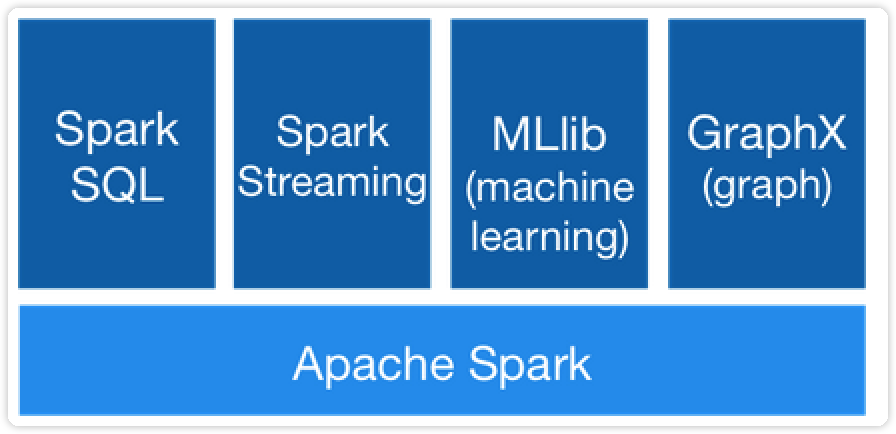
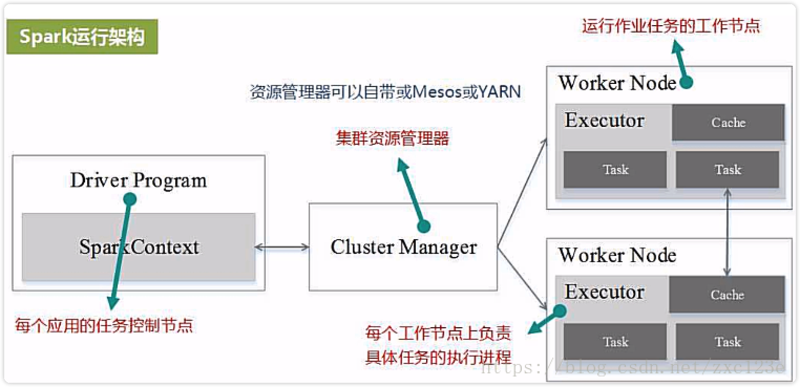
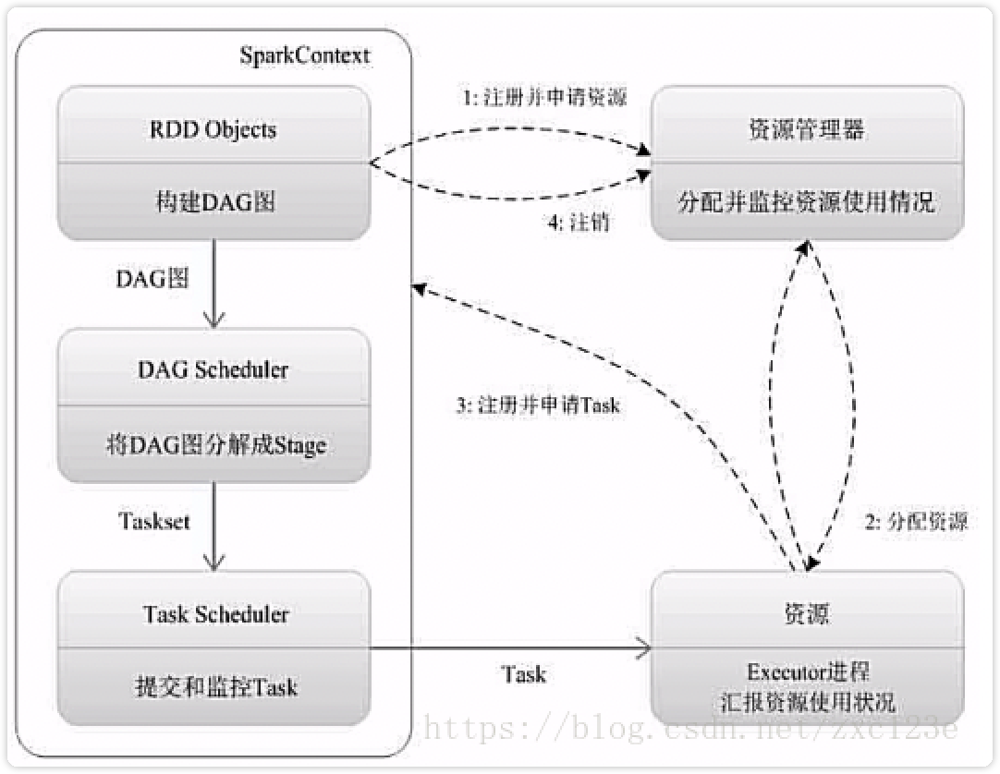
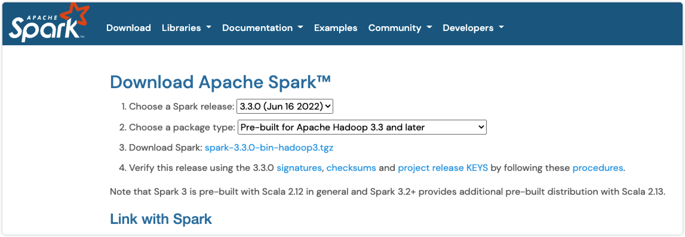
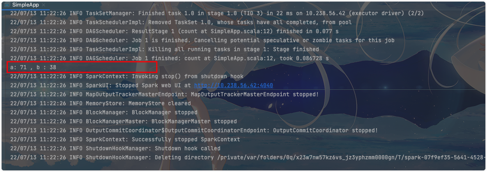
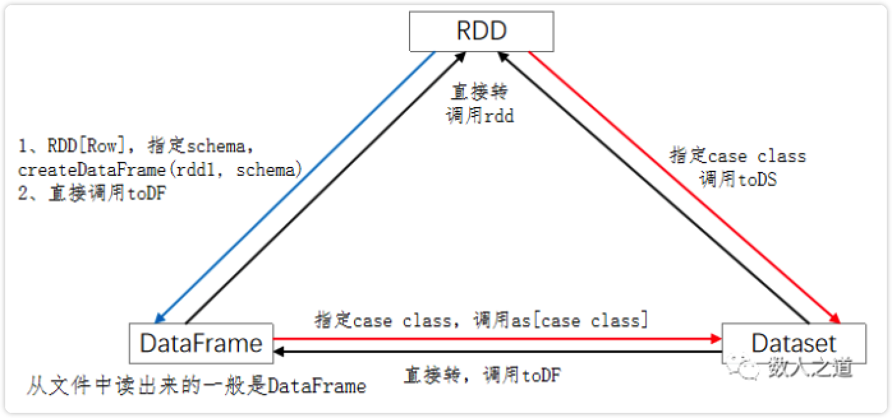

[toc]

# spark

## spark是什么

Spark是一种高效的多用途的集群计算平台。一种开源的、大规模数据处理引擎。它提供了一整套开发API，包括流计算、机器学习或者SQL。Spark支持批处理和流处理。

Spark集成了许多的大数据工具，例如Spark可以处理任何Hadoop数据源，也能在Hadoop集群上执行。Spark并不需要依赖于 Hadoop，它有自己的集群管理系统。更重要的是，同样数据量，同样集群配置，Spark 的数据处理速度要比 Hadoop MapReduce 快10倍左右。

Spark 的一个关键的特性是数据可以在内存中迭代计算，提高数据处理的速度。虽然Spark是用 Scala开发的，但是它对 Java、Scala、Python 和 R 等高级编程语言提供了开发接口。

## Spark演变历史

- 2009年，Spark 诞生于伯克利大学的AMPLab实验室。最初 Spark 只是一个实验性的项目，代码量非常少，属于轻量级的框架。

- 2010年，伯克利大学正式开源了 Spark 项目。

- 2013年，Spark 成为了 Apache 基金会下的项目，进入高速发展期。第三方开发者贡献了大量的代码，活跃度非常高。

- 2014年，Spark 以飞快的速度称为了 Apache 的顶级项目。

- 2015年至今，Spark 在国内IT行业变得愈发火爆，大量的公司开始重点部署或者使用 Spark 来替代MapReduce、Hive、Storm 等传统的大数据计算框架。

## 为什么使用Spark

Spark 诞生之前，在大数据处理领域，并没有一个通用的计算引擎。

> 离线批处理使用 Hadoop MapReduce
> 流处理需要使用 Apache Storm
> 即时查询使用 Impala 或者 Tez
> 执行图计算使用 Neo4j 或者 Apache Giraph
> 而Spark囊括了离线批处理、流处理、即时查询和图计算4大功能。

## Spark组件

Spark提供了6大组件：

- Spark Core
- Spark SQL
- Spark Streaming
- Spark MLlib
- Spark GraphX
- SparkR



### Spark Core

将分布式数据抽象为弹性分布式数据集（RDD），实现了应用任务调度、RPC、序列化和压缩，并为运行在其上的上层组件提供API。所有Spark的上层组件（如：Spark SQL、Spark Streaming、MLlib、GraphX）都建立在Spark Core的基础之上，它提供了内存计算的能力，因此，Spark Core是分布式处理大数据集的基础。

### Spark SQL

Spark Sql 是Spark来操作结构化数据的程序包，可以让我使用SQL语句的方式来查询数据，Spark支持 多种数据源，包含 Hive 表，parquest以及JSON等内容。

### Spark Streaming

除了处理动态数据流，Spark Streaming 还能开发出强大的交互和数据查询程序。事实上，在处理动态数据流时，流数据会被分割成微小的批处理，这些微小批处理将会在Spark Core上按时间一个一个执行，且速度非常快。

### Spark MLlib

Spark MLlib 封装了很多高效的机器学习算法。它是数据科学最热门的选择，因为它是在内存处理数据的，非常有效的提高数据迭代算法的性能。

### Spark GraphX

Spark GraphX一个建立在Spark之上大规模处理图数据的计算引擎。

### SparkR

SparkR 是一个 R 语言包，它提供了轻量级的方式使得可以在 R 语言中使用 Apache Spark。在Spark 1.4中，SparkR 实现了分布式的 data frame，支持类似查询、过滤以及聚合的操作（类似于R中的data frames：dplyr)，但是这个可以操作大规模的数据集。

# Spark 架构及运行原理

## Spark运行架构及流程



### 概念

#### Application

用户编写的Spark应用程序，包含了driver程序以及在集群上运行的程序代码，物理机器上涉及了driver，master，worker三个节点。

#### Driver

Spark中的Driver即运行Application的main函数并创建SparkContext，创建SparkContext的目的是为了准备Spark应用程序的运行环境，在Spark中由SparkContext负责与Cluster Manager通信，进行资源申请、任务的分配和监控等，当Executor部分运行完毕后，Driver同时负责将SparkContext关闭。

#### Worker

集群中任何一个可以运行spark应用代码的节点。Worker就是物理节点，可以在上面启动Executor进程。

#### Executor

在每个Worker上为某应用启动的一个进程，该进程负责运行Task，并且负责将数据存在内存或者磁盘上，每个任务都有各自独立的Executor。Executor是一个执行Task的容器。它的主要职责是：

- 初始化程序要执行的上下文SparkEnv，解决应用程序需要运行时的jar包的依赖，加载类。
- 向cluster manager汇报当前的任务状态。

Executor是一个应用程序运行的监控和执行容器。

#### RDD

**RDD（Resilient Distributed Dataset）叫做弹性分布式数据集**，是Spark中最基本的数据抽象，它代表一个不可变、可分区、里面的元素可并行计算的集合。RDD具有数据流模型的特点：自动容错、位置感知性调度和可伸缩性。RDD允许用户在执行多个查询时显式地将工作集缓存在内存中，后续的查询能够重用工作集，这极大地提升了查询速度。

##### RDD的属性

- **一组分片（Partition）**，即数据集的基本组成单位。对于RDD来说，每个分片都会被一个计算任务处理，并决定并行计算的粒度。用户可以在创建RDD时指定RDD的分片个数，如果没有指定，那么就会采用默认值。默认值就是程序所分配到的CPUCore的数目。
- **一个计算每个分区的函数**。Spark中RDD的计算是以分片为单位的，每个RDD都会实现compute函数以达到这个目的。compute函数会对迭代器进行复合，不需要保存每次计算的结果。
- RDD之间的依赖关系。RDD的每次转换都会生成一个新的RDD，所以RDD之间就会形成类似于流水线一样的前后依赖关系。在部分分区数据丢失时，Spark可以通过这个依赖关系重新计算丢失的分区数据，而不是对RDD的所有分区进行重新计算。
- **一个Partitioner，即RDD的分片函数**。当前Spark中实现了两种类型的分片函数，一个是基于哈希的HashPartitioner，另外一个是基于范围的RangePartitioner。只有对于于key-value的RDD，才会有Partitioner，非key-value的RDD的Parititioner的值是None。Partitioner函数不但决定了RDD本身的分片数量，也决定了parentRDDShuffle输出时的分片数量。
- **一个列表，存储存取每个Partition的优先位置（preferredlocation）**。对于一个HDFS文件来说，这个列表保存的就是每个Partition所在的块的位置。按照“移动数据不如移动计算”的理念，Spark在进行任务调度的时候，会尽可能地将计算任务分配到其所要处理数据块的存储位置。

#### DAG

有向无环图，反映RDD之间的依赖关系。

#### Task

被发送到executor上的工作单元。每个Task负责计算一个分区的数据。

在Spark中有两类task：

##### shuffleMapTask

输出是shuffle所需数据,stage的划分也以此为依据，shuffle之前的所有变换是一个stage，shuffle之后的操作是另一个stage。

##### resultTask

输出是计算结果，比如：
`rdd.parallize(1 to 10).foreach(println)`
这个操作没有shuffle，直接就输出了，那么只有它的task是resultTask，stage也只有一个。

`rdd.map(x=>(x,1)).reduceByKey(_+_).foreach(println)`
上面这个job因为有reduce，所以有一个shuffle过程，那么reduceByKey之前的是一个stage，执行shuffleMapTask，输出shuffle所需的数据，reduceByKey到最后是一个stage，直接就输出结果了。如果job中有多次shuffle，那么每个shuffle之前都是一个stage。

#### Job

一个Job包含多个RDD及作用于相应RDD上的各种操作，它包含很多task的并行计算，可以认为是SparkRDD里面的action，每个action的触发会生成一个job。用户提交的Job会提交给DAGScheduler，Job会被分解成Stage，Stage会被细化成Task，Task简单的说就是在一个数据partition上的单个数据处理流程。

#### Stage

是Job的基本调度单位，一个Job会分为多组Task，每组Task被称为一个Stage就像MapStage，ReduceStage，或者也被称为TaskSet，代表一组关联的，相互之间没有Shuffle依赖关系的任务组成的任务集。

#### Partition

Partition类似hadoop的Split，计算是以partition为单位进行的，当然partition的划分依据有很多，这是可以自己定义的，像HDFS文件，划分的方式就和MapReduce一样，以文件的block来划分不同的partition。总而言之，Spark的partition在概念上与hadoop中的split是相似的，提供了一种划分数据的方式。

#### Block与Partition之间区别

hdfs中的block是分布式存储的最小单元，类似于盛放文件的盒子，一个文件可能要占多个盒子，但一个盒子里的内容只可能来自同一份文件。假设block设置为128M，你的文件是250M，那么这份文件占3个block（128+128+2）。这样的设计虽然会有一部分磁盘空间的浪费，但是整齐的block大小，便于快速找到、读取对应的内容。

注意：考虑到hdfs冗余设计，默认三份拷贝，实际上3*3=9个block的物理空间。

spark中的partition是弹性分布式数据集RDD的最小单元，RDD是由分布在各个节点上的partition组成的。partition是指的spark在计算过程中，生成的数据在计算空间内最小单元，同一份数据（RDD）的partition大小不一，数量不定，是根据application里的算子和最初读入的数据分块数量决定的，这也是为什么叫“弹性分布式”数据集的原因之一。

block位于存储空间、partition位于计算空间，block的大小是固定的、partition大小是不固定的，block是有冗余的、不会轻易丢失，partition（RDD）没有冗余设计、丢失之后重新计算得到。

#### Cluter Manager

指的是在集群上获取资源的外部服务。目前有三种类型：

- Standalon : spark原生的资源管理，由Master负责资源的分配。
- Apache Mesos:与hadoop MR兼容性良好的一种资源调度框架。
- Hadoop Yarn: 主要是指Yarn中的Resource Manager。

在Yarn模式下，客户端程序会向Yarn申请计算我这个任务需要多少的memory，多少CPU等等。然后Cluster Manager会通过调度告诉客户端可以使用，客户端就可以把程序送到每个Worker上面去执行了。

一个Application由一个Driver和若干个Job构成，一个Job由多个Stage构成，一个Stage由多个没有Shuffle关系的Task组成。

当执行一个Application时，Driver会向集群管理器申请资源，启动Executor，并向Executor发送应用程序代码和文件，然后在Executor上执行Task，运行结束后，执行结果会返回给Driver，或者写到HDFS或者其它数据库中。

与Hadoop MapReduce计算框架相比，Spark所采用的Executor有两个优点：

- 利用多线程来执行具体的任务减少任务的启动开销。
- Executor中有一个BlockManager存储模块，会将内存和磁盘共同作为存储设备，有效减少IO开销。

### Spark运行基本流程



>1. 为应用构建起基本的运行环境，即由Driver创建一个SparkContext进行资源的申请、任务的分配和监控。
>2. 资源管理器为Executor分配资源，并启动Executor进程
>3. SparkContext根据RDD的依赖关系构建DAG图，DAG图提交给DAGScheduler解析成Stage，然后把一个个TaskSet提交给底层调度器TaskScheduler处理。
>4. Executor向SparkContext申请Task，TaskScheduler将Task发放给Executor运行并提供应用程序代码。
>5. Task在Executor上运行把执行结果反馈给TaskScheduler，然后反馈给DAGScheduler，运行完毕后写入数据并释放所有资源。

### Spark运行架构特点

1. 每个Application都有自己专属的Executor进程，并且该进程在Application运行期间一直驻留。Executor进程以多线程的方式运行Task。
2. Spark运行过程与资源管理器无关，只要能够获取Executor进程并保存通信即可。
3. Task采用数据本地性和推测执行等优化机制。

# 安装Spark（MAC本地）

- 下载免Hadoop版本

[Spark官网](https://spark.apache.org/)



- 移动Spark到想安装的目录

```shell
sudo mv spark-3.3.0-bin-hadoop3.3.tgz ~/app/
```

- 解压缩文件

```shell
sudo tar -zvxf spark-3.3.0-bin-hadoop3.3.tgz
```

- 配置环境变量

```shell
sudo vim ~/.bash_profile
```

- 添加环境变量并保存

```shell
export SPARK_HOME=/Users/chenxinyu/app/spark-3.3.0-bin-hadoop3.3
export PATH=$PATH:$SPARK_HOME/bin
export PYSPARK_PYTHON=python3
```

- 刷新配置文件

```shell
source ~/.bash_profile
```

- 安装pyspark

```py
pip3 install pyspark
```

# 快速开始

## Spark独立程序

基于`scala`创建一个简单的独立程序。

```scala
import org.apache.spark.SparkContext
import org.apache.spark.SparkContext._
import org.apache.spark.SparkConf

object SimpleApp {
	def main(args: Array[String]): Unit = {
		val logFile = "/Users/chenxinyu/app/spark-3.3.0-bin-hadoop3/README.md"
		val conf = new SparkConf().setAppName("simple Application").setMaster("local")
		val sc = new SparkContext(conf)
		val logData = sc.textFile(logFile, 2).cache()
		val numAs = logData.filter(line => line.contains("a")).count()
		val numBs = logData.filter(line => line.contains("b")).count()
		println("a: %s , b : %s".format(numAs,numBs))
	}
}
```

程序是计算目录下文件中的所有a和b的数量



## Spark Shell

### **在Spark的安装目录下运行**

```shell
bin/spark-shell 
22/07/13 11:30:09 WARN Utils: Your hostname, chenxinyudeMacBook-Pro.local resolves to a loopback address: 127.0.0.1; using 10.238.56.42 instead (on interface en0)
22/07/13 11:30:09 WARN Utils: Set SPARK_LOCAL_IP if you need to bind to another address
Setting default log level to "WARN".
To adjust logging level use sc.setLogLevel(newLevel). For SparkR, use setLogLevel(newLevel).
22/07/13 11:30:19 WARN NativeCodeLoader: Unable to load native-hadoop library for your platform... using builtin-java classes where applicable
Spark context Web UI available at http://10.238.56.42:4040
Spark context available as 'sc' (master = local[*], app id = local-1657683020477).
Spark session available as 'spark'.
Welcome to
      ____              __
     / __/__  ___ _____/ /__
    _\ \/ _ \/ _ `/ __/  '_/
   /___/ .__/\_,_/_/ /_/\_\   version 3.3.0
      /_/
         
Using Scala version 2.12.15 (Java HotSpot(TM) 64-Bit Server VM, Java 1.8.0_311)
Type in expressions to have them evaluated.
Type :help for more information.
```

### 基础

Spark最主要的抽象是叫做`Resilient Distributed Dataset(RDD)`。RDDs可以使用Hadoop InputFormats(例如HDFS文件创建)，也可以从其他的RDDs转换。让我们在Spark源代码目录从README文本文件中汇总创建一个新的RDD

```scala
scala> var txt = sc.textFile("README.md")
txt: org.apache.spark.rdd.RDD[String] = README.md MapPartitionsRDD[1] at textFile at <console>:23
```

统计数据条数 | 获取第一行数据

```scala
scala> txt.count()
res0: Long = 124 

scala> txt.first()
res1: String = # Apache Spark
```

使用`transformation`，返回一个新的RDD并返回的他的引用，统计带有Spark的行数

```scala
scala> val linesWithSpark = txt.filter(line => line.contains("Spark"))
linesWithSpark: org.apache.spark.rdd.RDD[String] = MapPartitionsRDD[2] at filter at <console>:23

scala> linesWithSpark.count()
res2: Long = 20
```

其他复杂的运算

```scala
scala> txt.map(line => line.split(" ").size).reduce((a,b) => if (a > b) a else b)
res4: Int = 16

scala> txt.map(line => line.split(" ").size).reduce((a,b) => Math.max(a,b))
res5: Int = 16

```

实现MapReduce模式的wordcount

```scala
scala> val wordCount = txt.flatMap(line => line.split(" ")).map(word => (word, 1)).reduceByKey((a, b) => a + b)
wordCount: org.apache.spark.rdd.RDD[(String, Int)] = ShuffledRDD[7] at reduceByKey at <console>:24

scala> wordCount.collect()
res6: Array[(String, Int)] = Array((package,1), (this,1), (integration,1), (Python,2), (cluster.,1), (its,1), ([run,1), (There,1), (general,2), (have,1), (pre-built,1), (Because,1), (YARN,,1), (locally,2), (changed,1), (locally.,1), (several,1), (only,1), (Configuration,1), (This,2), (basic,1), (first,1), (learning,,1), (documentation,3), (graph,1), (Hive,2), (info,1), (["Specifying,1), ("yarn",1), ([params]`.,1), ([project,1), (prefer,1), (SparkPi,2), (engine,2), (version,1), (file,1), (documentation,,1), (Action,1), (MASTER,1), (example,3), (are,1), (systems.,1), (params,1), (scala>,1), (DataFrames,,1), (provides,1), (refer,2), (configure,1), (Interactive,2), (R,,1), (can,6), (build,3), (when,1), (easiest,1), (Maven](https://maven.apache.org/).,1), (Apache,1)...
```

缓存一部分数据

```scala
scala> linesWithSpark.cache()
res11: linesWithSpark.type = MapPartitionsRDD[2] at filter at <console>:23

scala> linesWithSpark.count()
res12: Long = 20

scala> linesWithSpark.count()
res13: Long = 20
```

### Spark并行集合

spark的并行集合是在一个已有的集合`scala Seq`上调用SparkContext的`parallelize`方法实现的。集合中的元素被复制到一个可并行操作的分布式数据集中。

```scala
scala> val data = Array(1,2,3,4,5)
data: Array[Int] = Array(1, 2, 3, 4, 5)

scala> val disData = sc.parallelize(data)
disData: org.apache.spark.rdd.RDD[Int] = ParallelCollectionRDD[0] at parallelize at <console>:24
```

一旦创建完成，集合就可以被并行操作，例如，可以用`disData.reduce((a,b) => a + b)`将这个数组的元素相加。

并行集合一个很重要的参数是切片数(*slices*)，表示一个数据集切分的份数。Spark会在集群上为每一个切片运行一个任务。正常情况下，spark会自动的基于集群的状况自动设置切片的数目。也可以通过`parallelize`的第二个参数手动的设置（例如:`sc.parallelize(data,10)`）

```scala
scala> disData.collect()
res4: Array[Int] = Array(1, 2, 3, 4, 5)

scala> disData.reduce((a,b) => a + b)
res5: Int = 15
```

### 外部数据集

Spark可以从任何一个支持Hadoop存储源创建的分布式数据集，包括本地文件系统，HDFS，Cassandra，HBase，Amazon S3等。Spark支持文本文件`text file`,`SequenceFiles`,`Hadoop InputFormat`。

文本文件RDDs可以使用SparkContext的textFile方法创建。在这个方法里面传入文件的URI（机器上的本地路径或`hdfs://`,`s3n`），然后会将文件读取成一个行集合。

```scala
scala> val distFile = sc.textFile("data.txt")
distFile: org.apache.spark.rdd.RDD[String] = MappedRDD@1d4cee08
```

一旦创建完成，`disFile`就能做到数据集操作。

```scala
disFile.map(s => s.length).reduce((a,b) => a + b)
```

**Spark 读文件时**：

- 如果使用本地文件系统路径，文件必须能在 work 节点上用相同的路径访问到。要么复制文件到所有的 workers，要么使用网络的方式共享文件系统。
- 所有 Spark 的基于文件的方法，包括 `textFile`，能很好地支持文件目录，压缩过的文件和通配符。例如，你可以使用 `textFile("/my/文件目录")`，`textFile("/my/文件目录/*.txt")` 和 `textFile("/my/文件目录/*.gz")`。
- `textFile` 方法也可以选择第二个可选参数来控制切片(*slices*)的数目。默认情况下，Spark 为每一个文件块(HDFS 默认文件块大小是 64M)创建一个切片(*slice*)。但是你也可以通过一个更大的值来设置一个更高的切片数目。注意，你不能设置一个小于文件块数目的切片值。

**除了文本文件，Spark 的 Scala API 支持其他几种数据格式**：

- `SparkContext.sholeTextFiles` 让你读取一个包含多个小文本文件的文件目录并且返回每一个(filename, content)对。与 `textFile` 的差异是：它记录的是每个文件中的每一行。
- 对于 [SequenceFiles](http://hadoop.apache.org/docs/current/api/org/apache/hadoop/mapred/SequenceFileInputFormat.html)，可以使用 SparkContext 的 `sequenceFile[K, V]` 方法创建，K 和 V 分别对应的是 key 和 values 的类型。像 [IntWritable](http://hadoop.apache.org/docs/current/api/org/apache/hadoop/io/IntWritable.html) 与 [Text](http://hadoop.apache.org/docs/current/api/org/apache/hadoop/io/Text.html) 一样，它们必须是 Hadoop 的 [Writable](http://hadoop.apache.org/docs/current/api/org/apache/hadoop/io/Writable.html) 接口的子类。另外，对于几种通用的 Writables，Spark 允许你指定原声类型来替代。例如： `sequenceFile[Int, String]` 将会自动读取 IntWritables 和 Text。
- 对于其他的 Hadoop InputFormats，你可以使用 `SparkContext.hadoopRDD` 方法，它可以指定任意的 `JobConf`，输入格式(InputFormat)，key 类型，values 类型。你可以跟设置 Hadoop job 一样的方法设置输入源。你还可以在新的 MapReduce 接口(org.apache.hadoop.mapreduce)基础上使用 `SparkContext.newAPIHadoopRDD`(译者注：老的接口是 `SparkContext.newHadoopRDD`)。
- `RDD.saveAsObjectFile` 和 `SparkContext.objectFile` 支持保存一个RDD，保存格式是一个简单的 Java 对象序列化格式。这是一种效率不高的专有格式，如 Avro，它提供了简单的方法来保存任何一个 RDD。

### 从Mysql读取数据

```scala
import org.apache.spark.sql.{DataFrame, SparkSession}

import java.util.Properties

object SparkSQLTest {
	def main(args: Array[String]): Unit = {
		val spark = SparkSession
			.builder()
			.appName("Spark SQL basic example")
			.config("spark.some.config.option", "some-value")
			.master("local")
			.getOrCreate()
		
		val properties = new Properties();
		properties.setProperty("user", "root")
		properties.setProperty("password", "yourPassword")
		val person: DataFrame = spark.read.jdbc("jdbc:mysql://127.0.0.1:3306/cems", "tableName", properties)
		
		person.show()
	}
}
```

### Spark SQL

1. 使用Spark创建函数进行创建

`createDataset()`

```scala
scala> case class Person(name:String, age:Int, height:Int)
defined class Person

scala> val seq1 = Seq(Person("Michael",25,176),Person("Jack",15,180))
seq1: Seq[Person] = List(Person(Michael,25,176), Person(Jack,15,180))

scala> val ds1 = spark.createDataset(seq1)
ds1: org.apache.spark.sql.Dataset[Person] = [name: string, age: int ... 1 more field]

scala> ds1.show
+-------+---+------+
|   name|age|height|
+-------+---+------+
|Michael| 25|   176|
|   Jack| 15|   180|
+-------+---+------+
```

`createeDataFrame()`

```scala
scala> case class Person(name:String, age:Int, height:Int)
defined class Person

scala> val seq1 = Seq(Person("Michael",25,176),Person("Jack",15,180))
seq1: Seq[Person] = List(Person(Michael,25,176), Person(Jack,15,180))

scala> val ds2 = spark.createDataFrame(seq1)
ds2: org.apache.spark.sql.DataFrame = [name: string, age: int ... 1 more field]

scala> ds2.show
+-------+---+------+
|   name|age|height|
+-------+---+------+
|Michael| 25|   176|
|   Jack| 15|   180|
+-------+---+------+
```

2. 读取数据眼进行创建

Spark SQL 支持的数据源包括：**文件**、**数据库**、**Hive**

```scala
// 方式1
scala> val sc = spark.sparkContext
sc: org.apache.spark.SparkContext = org.apache.spark.SparkContext@51b75097

scala> val textRDD1 = sc.textFile("file:///Users/chenxinyu/app/spark-3.3.0-bin-hadoop3/examples/src/main/resources/people.json")
textRDD1: org.apache.spark.rdd.RDD[String] = file:///Users/chenxinyu/app/spark-3.3.0-bin-hadoop3/examples/src/main/resources/people.json MapPartitionsRDD[1] at textFile at <console>:25

scala> textRDD1.take(5)
res3: Array[String] = Array({"name":"Michael"}, {"name":"Andy", "age":30}, {"name":"Justin", "age":19})

// 方式2
scala> val textRDD2 = spark.read.text("file:///Users/chenxinyu/app/spark-3.3.0-bin-hadoop3/examples/src/main/resources/people.json")
textRDD2: org.apache.spark.sql.DataFrame = [value: string]

scala> textRDD2.take(5)
res7: Array[org.apache.spark.sql.Row] = Array([{"name":"Michael"}], [{"name":"Andy", "age":30}], [{"name":"Justin", "age":19}])

```

> 两种方法的区别在于返回的数据集类型不一样
>
> - `sc.textFile(path:String)`返回的数据集类型是：RDD[String]
> - `spark.read.text(path:String)`返回的数据集类型是：DataFrame(DataSet[Row])

3. 读取数据源数据

Spark SQL支持通过JDBC读取外部数据库的数据作为数据源

### RDD、DataFrame、DataSet的共性和转换

在Spark中，RDD、DataFrame、DataSet三种类型的数据集是有一定的共同特性的，因此他们三者之间可以进行相互的转换

#### RDD、DataFrame、DataSet的共性

1. RDD、DataFrame、DataSet都是Spark平台下的分布式弹性数据集，为了处理超大型的数据提供了便利；
2. 三者都有惰性计算机制，在进行创建、Transformation操作时，不会立即执行，只有在遇到Action操作的时候，才会遍历运算
3. 三者都有Partition概念，可以进行Cache（缓存）操作，也可以进行CheckPoine（检查点）的操作。
4. 三者都有许多相似的操作算子，如map、filter、groupByKey等
5. 在对DataFrame和Dataset进行操作的时，很多情况下需要`spark.implicits._`的支持

#### RDD、DataFrame、DataSet的转换



##### DataFrame/DataSet转RDD

```scala
val rdd1 = testDF.rdd
val rdd2 = testDS.rdd
```

##### RDD转DataFrame


