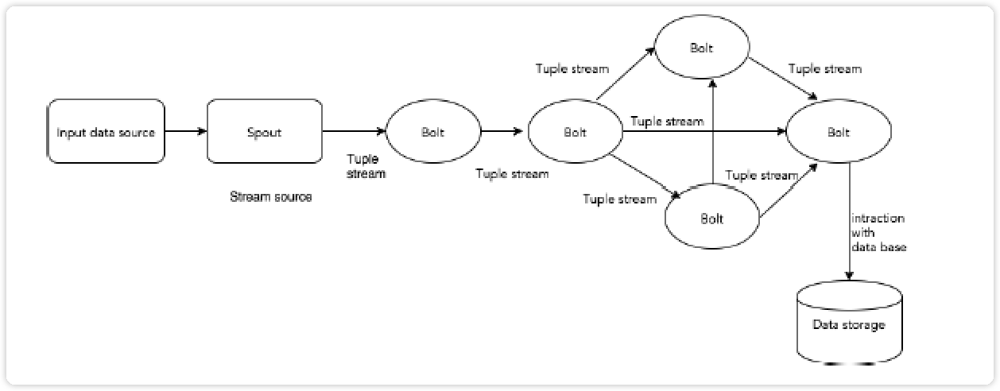
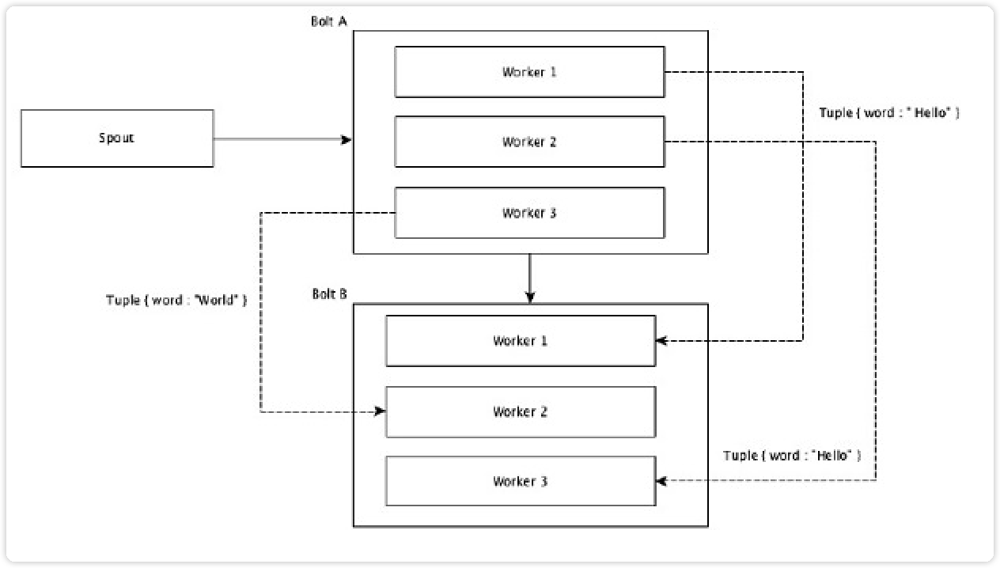
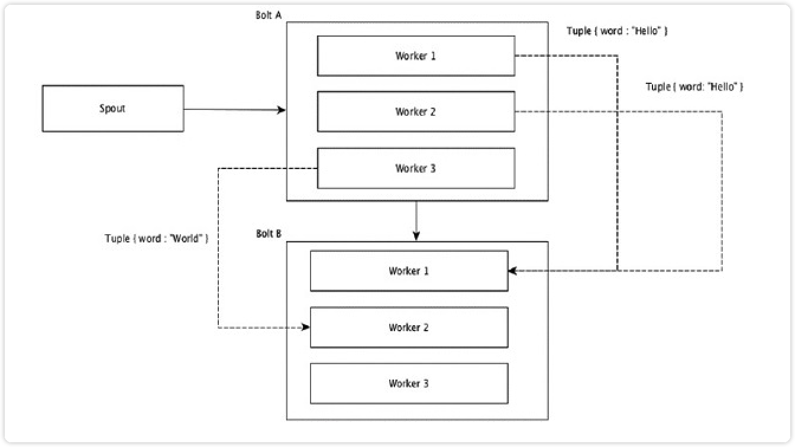

[toc]

# Storm

**Apache Storm是一个分布式实时大数据处理系统。Storm设计用于在容错和水平可扩展方法中处理大量数据。他是一个流数据框架，具有最高的摄取率。**

## 历史

> Storm最初由Nathan Marz和BackType的团队创建。BackType是一家社交分析公司。后来，Storm被收购，并通过Twitter开源。短时间内，Apache Storm成为分布式实时处理系统的标准，允许处理大量数据，类似于Hadoop。Storm是用Java和Clojure编写的。它仍然是实时分析的领导者。

## 简介

### 什么是Apache Storm？

Storm是一个分布式实时大数据处理系统。Storm设计用于在容错和水平可扩展方法中处理大量数据。他是一个流数据框架，具有最高的摄取率。Storm是无状态的，他通过Zookeeper管理分布式环境和集群状态。可以并行对实时数据执行各种操作。

Storm易于设置和操作，并且保证每个消息将通过拓扑至少处理一次。

### Apache Storm VS Hadoop

<table>
  <tr>
    <th>
Storm
</th>
    <th>
Hadoop
</th>
  </tr>
  <tr>
    <td>实时流处理</td>
    <td>批处理</td>
  </tr>
  <tr>
    <td>无状态</td>
    <td>有状态</td>
  </tr>
  <tr>
    <td>主/从架构与基于Zookeeper的协调。主节点称为nimbus，从属节点是主管。</td>
    <td>具有/不具有基于Zookeeper的协调的主从结构节点。主节点是作业跟踪器，从节点是任务跟踪器</td>
  </tr>
  <tr>
    <td>Storm流过程在集群是每秒处理几万条消息</td>
    <td>Hadoop使用MapReduce框架来处理大量数据，需要几分钟或者几小时</td>
  </tr>
  <tr>
    <td>Storm拓扑运行直到用户关闭或者意外的不可恢复故障</td>
    <td>MapReduce作业按照顺序执行并且最终完成</td>
  </tr>
  <tr>
    <td colspan="2" align=center>
<b>两者都是分布式和容错的</b>
</td>
  </tr>
  <tr>
    <td>如果nimbus/Supervisor死机，重新驱动使他们从停止的地方继续，因此没有什么影响</td>
    <td>如果JobTracker死机，所有正在运行的作业都会丢失。</td>
  </tr>
</table>

### Storm 例子

- Twitter 
  - twitter正在使用storm作为发布商分析产品。处理twitter平台中每个tweets和点击。Storm与Twitter基础架构深度集成。
- NaviSite
  - naviSite正在使用Storn进行事件日志监控/审计系统。系统中生成的每个日志都将通过Storm。根据匹配的正则表达式检查消息，如果存在匹配，那么该特定消息将保存到数据库。
- Wego
  - Wego是位于新加坡的旅行元搜索引擎。旅行相关数据来自世界各地许多来源，时间不同。Storm帮助Wego搜索实时数据，解决并发问题，并为用户找到最佳匹配。

### 优势

- 开源、强大、用户友好
- 容错、灵活、可靠的，支持任何编程语言
- 允许实时流处理
- 处理速度快，具有巨大的处理数据的力量
- 可以通过线性增加资源来保持性能，即使负载增加。高度可扩展
- 几秒钟或者几分钟内执行数据刷新和端到端传送响应取决于问题。它具有非常低的延迟
- 操作智能
- 具有保证的数据处理，即使集群中任何链接节点死或者消息丢失。

## 核心概念

Storm从一端读取实时数据的原始流，并将数据传递通过一系列小处理单元，并在另一端输出处理/有用的信息。

核心概念图如下：

| 组件   | 描述                                                         |
| :----- | :----------------------------------------------------------- |
| Tuple  | Tuple是Storm中的主要数据结构。它是有序元素的列表。默认情况下，Tuple支持所有数据类型。通常，它被建模为一组逗号分隔的值，并传递到Storm集群。 |
| Stream | 流是元组的无序序列。                                         |
| Spouts | 流的源。通常，Storm从原始数据源（如Twitter Streaming API，Apache Kafka队列，Kestrel队列等）接受输入数据。否则，您可以编写spouts以从数据源读取数据。“ISpout”是实现spouts的核心接口，一些特定的接口是IRichSpout，BaseRichSpout，KafkaSpout等。 |
| Bolts  | Bolts是逻辑处理单元。Spouts将数据传递到Bolts和Bolts过程，并产生新的输出流。Bolts可以执行过滤，聚合，加入，与数据源和数据库交互的操作。Bolts接收数据并发射到一个或多个Bolts。 “IBolt”是实现Bolts的核心接口。一些常见的接口是IRichBolt，IBasicBolt等。 |

### 拓扑

Spouts和Bolts链接在一起，形成拓扑结构。实时应用程序逻辑扎起Storm拓扑中指定。简单来说，拓扑是有向图，顶点是计算，边缘是数据流。

简单拓扑是从spouts开始。Spouts将数据发射到一个或多个Bolts。Bolt表示拓扑中具有最小处理逻辑的节点，并且Bolts的输出可以发射到另一个Bolts作为输入。

Storm保持拓扑始终运行，知道终止拓扑。Storm的主要工作是运行拓扑，并在给定时间运行任意数量的拓扑。

### 任务

拓扑的最小逻辑单元，使用单个Spout和Bolt阵列构建拓扑。应用特定的顺序正确的执行他们，用来使得拓扑成功运行。Storm执行的每个Spout和Bolt称为“任务”。简单来说，任务是Spouts或Bolts的执行。在给定时间，每个Spout和Bolt具有多个单独的螺纹中运行的多个实例。

### 进程

拓扑在多个工作节点上以分布式方式运行。Storm将所有工作节点上的任务均匀分布。工作节点的角色是监听作业，并在新作业到达时启动或停止进程。

### 流分组

数据流从Spouts流到Bolts，或从一个Bolts流到另一个Bolts。流分组控制元组在拓扑中的路由方式，并帮助我们了解拓扑中的元组流。有四个内置分组，如下所述。

### 随机分组

在随机分组中，相等数量的元组随机分布在执行Bolts的所有工人中。下图描述了结构。

### 字段分组

元组中具有相同值的字段组合在一起，其余的元组保存在外部。然后，具有相同字段值的元组被向前发送到执行Bolts的同一个进程；例如，如果流由“字”分组，则具有相同字符串“Hello”的元组将移动到相同的工作者。如下图

## Storm 工作流程

一个工作的Storm集群应该有一个Nimbus和一个或多个supervisors。另一个重要的节点是Apache ZooKeeper，它将用于nimbus和supervisors之间的协调。

- 最初，nimbus将等待“Storm拓扑”提交给它。
- 一旦提交拓扑，它将处理拓扑并收集要执行的所有任务和任务将被执行的顺序。
- 然后，nimbus将任务均匀分配给所有可用的supervisors。
- 在特定的时间间隔，所有supervisor将向nimbus发送心跳以通知它们仍然运行着。
- 当supervisor终止并且不向心跳发送心跳时，则nimbus将任务分配给另一个supervisor。
- 当nimbus本身终止时，supervisor将在没有任何问题的情况下对已经分配的任务进行工作。
- 一旦所有的任务都完成后，supervisor将等待新的任务进去。
- 同时，终止nimbus将由服务监控工具自动重新启动。
- 重新启动的网络将从停止的地方继续。同样，终止supervisor也可以自动重新启动。由于网络管理程序和supervisor都可以自动重新启动，并且两者将像以前一样继续，因此Storm保证至少处理所有任务一次。
- 一旦处理了所有拓扑，则网络管理器等待新的拓扑到达，并且类似地，管理器等待新的任务。

默认情况下，Storm集群中有两种模式：

- **本地模式** -此模式用于开发，测试和调试，因为它是查看所有拓扑组件协同工作的最简单方法。在这种模式下，我们可以调整参数，使我们能够看到我们的拓扑如何在不同的Storm配置环境中运行。在本地模式下，storm拓扑在本地机器上在单个JVM中运行。
- **生产模式** -在这种模式下，我们将拓扑提交到工作Storm集群，该集群由许多进程组成，通常运行在不同的机器上。如在storm的工作流中所讨论的，工作集群将无限地运行，直到它被关闭。

## Apache Storm安装

- 验证Java安装
- Zookeeper安装

