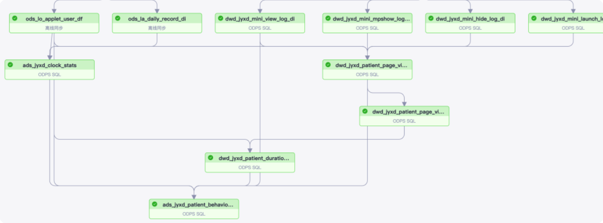

[toc]

# 数仓建模方法

1. **访问性能：**能够快速的查询所需要的数据，减少数据I/O
2. **数据成本：**减少不必要的数据冗余，实现计算结果数据复用，降低大数据系统中的存储成本和计算成本
3. **使用效率：**改善用户应用体验，提高使用数据的效率
4. **数据质量：**改善数据统计口径的不一致，减少数据计算错误的可能性，提供高质量的、一致的数据访问平台。

### 范式建模

…

### ER实体建模

…

### 维度建模

>维度建模源自数据集市，主要面向分析场景 **Ralph Kimball 推崇数据集市的集合为数据仓库**，同时也提出了对数据集市的维度建模，将数据仓库中的表划分为事实表、维度表两种类型。
>
>一般也称之为星型结构建模，有时也加入一些雪花模型在里面。**维度建模是一种面向用户需求的、容易理解的、访问效率高的建模方法**

#### 为什么使用维度建模

**1.适配大数据的处理方式**

维度模型的非强范式的，可以更好的利用大数据处理框架的处理能力，避免范式操作的过多关联操作，可以实现高度的并行化。

数据仓库大多数时候是比较适合使用星型模型构建底层数据Hive表，通过大量的冗余来提升查询效率，星型模型对OLAP的分析引擎支持比较友好，这一点在Kylin中比较能体现。

雪花模型在关系型数据库中如MySQL，Oracle中非常常见，尤其像电商的数据库表。

**2.自下而上的建设现状**

表已经存在，业务已经开发完毕，需求直接提过来了，这几乎是一个普遍现状，因为很少有公司会提前成立数据部门，让数据部门跟随着业务从头开始一直成长，都是当业务发展到一定的阶段了，想通过数据来提高公司的运营效果

**3.简单的模型 使用简单**

这个模型相对来说是比较简单的，简单主要体现在两个方面

1. 维度建模非常直观，紧紧围绕着业务模型，**可以直观的反映出业务模型中的业务问题**。不需要经过特别的抽象处理，即可以完成维度建模。这一点也是维度建模的优势。
2. 星型结构的实现不用考虑很多正规化的因素，设计与实现都比较简单。

#### 应用场景

维度建模**是面向分析场景而生**，针对分析场景构建数仓模型，重点关注快速、灵活的解决分析需求，同时能够提供大规模数据的快速响应性能。

针对性强，主要应用于数据仓库构建和OLAP引擎底层数据模型

**优点**

- 方便使用，模型简单
- 适合大数据下的处理操作(其实就是shuffle)
- 适合OLAP操作(上钻下钻)
- 维度建模非常直观，紧紧围绕着业务模型，可以直观的反映出业务模型中的业务问题。不需要经过特别的抽象处理，即可以完成维度建模。
- 可扩展，维度模型是可扩展的。由于维度模型允许数据冗余，因此当向一个维度表或事实表中添加字段时，不会像关系模型那样产生巨大的影响，带来的结果就是更容易容纳不可预料的新增数据。

**缺点**

- 数据冗余，维度补全后造成的数据浪费
- 灵活性差，维度变化造成的数据更新量大(例如刷数据的时候，需要刷大量的表)
- 与典型的范式理论差异很大，如数据不一致，比如用户发起购买行为的时候的数据，和我们维度表里面存放的数据不一致

# 数仓建模分层理论

## 分层的意义

#### 清晰数据结构体系

每一个数据分层都有它的作用域，这样在使用表的时候能更方便的定位和理解。

#### 数据血缘追踪

由于最终给业务呈现的是一个能直接使用的业务表，但是表的数据来源有很多，如果有一张来源表出问题了，我们希望能够**快速准确的定位到问题，并清楚它的影响范围，从而及时给到业务方反馈，从而将损失降到最低**。

#### 减少重复开发和资源浪费

- 规范数据分层，开发一些通用的中间层数据，能够减少极大的重复计算；
- 清晰明了的结构使得开发、维护的成本降低；
- 减少重复计算和存储的资源浪费；

#### 复杂问题简单化

将一个复杂的任务分解成多个步骤来完成，每一层只处理单一的步骤，比较简单和容易理解。而且便于维护数据的准确性，当数据出现问题之后，可以不用修复所有的数据，只需要从有问题的步骤开始修复。

> 在实际的建设过程中，由于业务使用数据非常紧急以及统一数仓层建设跟不上业务的需要，所以DIM和ADS层可能直接使用ODS层进行快速的业务响应，但是这种不规范的操作可能导致数据口径不一致，**所以待数仓建设完毕，要切换到统一数仓层和DIM层**。

#### 统一数据口径

过数据分层提供统一的数据出口，统一对外输出的数据口径，这往往就是我们说的数据应用层

## 数仓的分层

### ODS 操作数据层

ODS 全称是 OperationalDataStore，**操作数据层存储的是面向业务系统的数据**，也是最接近数据源中数据的一层，数据源中的数据，经过抽取、洗净、传输，也就说传说中的 ETL 之后，装入本层。

本层的数据，总体上大多是**按照源头业务系统的分类方式而分类的**，前面我们说到为什么在数仓主要用维度建模的情况下，我们依然要学习范式建模呢，因为我们的数据源是范式建模的，所以学习范式建模可以帮助我们更好的理解业务系统，理解业务数据，所以可以认为ODS 层其实就是用的范式建模。

> 但是，这一层面的数据却不等同于原始数据。在源数据装入这一层时，要进行诸如**去噪**(例如有一条数据中人的年龄是300岁，这种属于异常数据，就需要提前做一些处理)、去重(例如在个人资料表中，同一ID却有两条重复数据，在接入的时候需要做一步去重)、字段命名规范等一系列操作。

#### 设计原则

- ods 层**不做字段名归一和字段类型统一的操作，如果需要则使用兼容的数据类型；**
- 对于增量表，需要设计增量表和全量表,然后将增量表合并成全量表数据；
- 对于半结构化数据需要设计解析；
- 由于业务数据库（OLTP）基本按照维度模型建模，因此ODS层中的建模方式也是维度模型；

`ods` 的设计可以保证所有的数据按照统一的规范进行存储。

### DW 统一数仓层

DW是数据仓库的核心，从ODS层中获得的数据按照主题建立各种数据模型。DW又细分数据明细层DWD 和轻度汇总层DWS

这一层和维度建模会有比较深的联系，业务数据是按照**业务流程方便操作的角度**来组织数据的，而统一数仓层是**按照业务易理解的角度或者是业务分析的角度**进行数据组织的，定义了一致的指标、维度，各业务板块、数据域都是按照统一的规范来建设，从而形成统一规范的**标准业务数据体系**，它们通常都是基于Kimball的维度建模理论来构建的，**并通过一致性维度和数据总线来保证各个子主题的维度一致性**。

> 如果 ods 层的数据就非常规整，基本能满足我们绝大部分的需求，这当然是好的，这时候dwd层其实就简单了很多，但是现实中接触的情况是 ods 层的数据很难保证质量，毕竟数据的来源多种多样，推送方也会有自己的推送逻辑，在这种情况下，我们就需要通过额外的一层 dwd 来屏蔽一些底层的差异。有没有很像JVM。

#### 设计原则

##### 一致性维度规范

公共层的维度表中相同维度属性在不同物理表中的字段名称、数据类型、数据内容必须保持一致，因为这样可以降低我们在使用过程中犯错误的概率，例如使用了不正确的字段，或者因为数据类型的原因导致了一些奇怪的错误

##### 维度的组合与拆分

将维度所描述业务相关性强的字段在一个物理维表实现。相关性强是指经常需要一起查询或进行报表展现、两个维度属性间是否存在天然的关系等。例如，商品基本属性和所属品牌。

#### DWD 明细数据层

公告明细数据层，可以说是我们数仓建设的核心了。

DWD层要做的就是将**数据清理、整合、规范化、脏数据、垃圾数据、规范不一致的、状态定义不一致的、命名不规范的数据都会被处理**。然后加工成面向数仓的基础明细表，这个时候可以加工一些面向分析的大宽表。

DWD层应该是覆盖所有系统的、完整的、干净的、具有一致性的数据层。在DWD层会根据维度模型，设计事实表和维度表，也就是说DWD层是一个非常规范的、高质量的、可信的数据明细层。

#### DWS 轻度汇总层

DWS层为**公共汇总层**，这一层会进行轻度汇总，粒度比明细数据稍粗，**基于DWD层上的基础数据，整合汇总成分析某一个主题域的服务数据**，一般是也是面向分析宽表或者是面向某个注意的汇总表。DWS层应覆盖80%的应用场景，这样我们才能快速响应数据需求，否则的话，如果很多需求都要从ods开始做的话，那说明我们的数仓建设是不完善的。

例如按照业务划分，例如流量，订单，用户等，生成字段比较多的宽表，用于后续的业务查询，OLAP分析，数据分析等。

**一般采用维度模型方法作为理论基础，更多的采用一些维度退化手法，将维度退化至事实表中，减少维度表与事实表的关联，提高明细数据表的易用性；同时在汇总数据层要加强指标的维度退化，采用更多的宽表化手段构建公共指标数据层，提升公共指标的复用性，减少重复加工**。

### DIM 维度层

维表层，所以其实维度层就是大量维表构成的，为了统一管理这些维度表，所以我们就建设维度层，维度表本身也有很多类型，例如稳定维度维表，渐变维度维表。

**维度指的是观察事物的角度，提供某一业务过程事件涉及用什么过滤和分类的描述属性**，"谁、什么时候、什么地点、为什么、如何"干了什么，维度表示维度建模的基础和灵魂。

> 比如，"小王早上在小卖部花费5元钱购买了包子"，时间维度——早上，地点维度——小卖部，商品维度——包子  那么事实表呢？

所以可以看出，维度表包含了业务过程记录的业务过程度量的上下文和环境。维度表都包含单一的主键列，**维度表设计的核心是确定维度字段，维度字段是查询约束条件(where)、分组条件(group)、排序(order)，与报表标签的基本来源**。

维度表一般为**单一主键**，在ER模型中，实体为客观存在的事务，会带有自己的描述性属性，属性一般为文本性、描述性的，这些描述被称为维度。维度建模的核心是**数据可以抽象为事实和维度**，维度即观察事物的角度，事实某一粒度下的度量词，**维度一定是针对实体而言的**。

每个维度表都**包含单一的主键列**。维度表的主键可以作为与之关联的任何事实表的外键，当然，维度表行的描述环境应与事实表行完全对应。维度表通常比较宽，是扁平型非规范表，包含大量的低粒度的文本属性。例如customer（客户表）、goods(商品表)、d_time(时间表)这些都属于维度表，这些表都有一个唯一的主键，然后在表中存放了详细的数据信息。

#### 设计原则

维度表通常比较宽**，包含多个属性、是扁平的规范表**，实际应用中包含几十个或者上百个属性的维度并不少见，所以**维度表应该包括一些有意义的描述，方便下游使用**。

维度表的维度属性，应该尽可能的丰富，所以维度表中，经常出现一些反范式的设计，把其他维度属性并到主维度属性中，**达到易用少关联的效果。**

维度表的设计包括维度选择，主维表的确定，梳理关联维度，定义维度属性的过程。

维度的选择一般从报表需求和从业务人员的交谈中发现，主要用于过滤、分组、排序，主维度表一般从业务库直接同步，比如用户表，但是数仓的本身也会有自己的维度，这是因为数仓是面向分析的，所以会有很多从分析的角度出发的维度。

关联维度主要是不同业务系统或者同一业务系统的表之间存在关联性(范式建模)，根据对业务表的梳理，确定哪些表和主维度表之间存在关联关系，并选择其中的某些表用于生成维度属性。

### TDM 标签数据层

随着互联网的普及，获客成本越来越高，这也使得公司对用户运营提出了更高的要求，不仅需要精细化更需要个性化。解决这一问题的办法之一就是建立相对完备的标签系统，而数仓的标签层对于标签系统而言就像数据仓库对于数据系统一样，有着举足轻重的地位，这样的标签系统需要与业务进行紧密结合，**从业务中获取养分—用户标签，同时也要服务于业务—给用户提供更加精准和个性的服务**。

**底层的标签系统就像一个索引，层层展示大千世界，而用户就从这大千世界中不断选择一些东西表明自己的身份和喜好，也不断反哺，使得这个大千世界更加丰富多彩。**其实到最后用户就是一些标签的集合。

对跨业务板块、跨数据域的特定对象进行数据整合，通过统一的ID-Mapping 把各个业务板块，各个业务过程中**同一对象的数据打通**，形成对象的全域数据标签体系，方便深度分析、挖掘、应用。ID-Mapping 可以认为是通过对象的标识对不同数据体系下相同对象进行关联和识别。对象的标识可以标识一个对象，一般是对象的ID,比如手机号，身份证，登录账号

> 一个自然人他有身份证号码进行唯一标识，但是在医保的时候他使用的实医保账号，缴纳水电费的时候又是不同的账号，使用手机的时候又是设备账号，上网的时候是网商账号。在确认对象后，由于同一对象在不同的业务体系中的对象标识是不一样的，因此需要将同一对象上的不同ID  标识打通，以便所有的业务数据都能够在该对象上打通。这就是ID-Mapping。

完成对象的ID 打通需要给对象设置一个超级ID,需要根据对象当前业务体系的ID和获取得到或者计算得到超级ID,进而完成所有业务标识的ID打通一般来说ID打通是建设标签体系的前提，如果没有ID打通就无法收集到一个对象的全面信息，也就无法对这个对象进行全面的标签刻画。

传统的计算方法要有 ID-ID之间的两两关系，例如邮箱和手机号可以打通，手机号和身份证号可以打通，那么邮箱就和身份证号可以打通，但是当数据量非常大，且业务板块非常多的时候，例如有上一个对象，每个对象有数十种ID,这个时候打通就需要非常漫长的计算

那么什么是标签呢，利用原始数据，通过一定的逻辑加工产出直接能被业务所直接使用的、可阅读的，有价值的数据。标签类目，是标签的分类组织方式，是标签信息的一种结构化描述，目的是管理、查找，一般采用多级类目，一般当一个对象的标签个数超过50个的时候，业务人员查找标签就会变得非常麻烦，这个时候我们往往会通过标签类目进行组织管理

#### 标签的分类

标签按照产生和计算方式的不同可分为属性标签，统计标签，算法标签，关联标签。

##### 属性标签

对象本身的性质就是属性标签，例如用户画像的时候打到用户身上的标签。

##### 统计标签

对象在业务过程中产生的原子指标，通过不同的计算方法可以生成统计标签。

##### 算法标签

对象在多个业务过程中的特征规律通过一定的算法产出的标签。

##### 关联标签

对象在特定的业务过程会和其他对象关联，关联对象的标签也可以打在主对象上。

#### 设计原则

我们的标签一定是针对用户的，而不是一些虚假、高大上、无用的标签，一定要真实反映用户行为喜好的，所以我们不能只依赖人工智能算法的分析，来完成对一个用户标签的建立与定期维护，我们需要走出去和用户交互，引导用户使用，要抓住用户痛点，及时获取用户反馈，形成闭环。

如何引导使用呢？这个方式有很多我们就不再这里介绍了，后面我们会专门介绍这一层的建设细节。

### ADS 层

数据应用层ApplicationDataService面向业务定制的应用数据，主要提供给数据产品和数据分析使用的数据，一般会放在ES，MYSQL，Redis等系统供线上系统使用，也可以放在Hive中供数据分析和数据挖掘使用，或者使用一下其他的大数据工具进行存储和使用。

**数仓层，DIM 层，TDM 层是相对稳定的，所以无法满足灵活多变业务需求**，所以这和数仓层的规范和划分相矛盾，所以我们在此基础上建立了另外一个层，这就是ADS 层，解决了规划稳定和灵活多变之间的矛盾。其实到这里你也就慢慢的看明白了，分层和分类其实没多大差别，其实就是相似的放在一起，有点代码重构的意味啊。

数据应用层，按照业务的需要，然后从统一数仓层和DIM进行取数，并面向业务的特殊需求对数据进行加工,以满足业务和性能的需求。ADS 层因为面向的实众多的需求，所以这一层没有太多的规范，只需要按照命名规范来进行就可以了。

#### 设计原则

前面也说了，ADS 层因为面向的实众多的需求，所以这一层没有太多的规范，但是ADS 层的建设是强业务推动的，业务部门需要参与到ADS 的建设中来，至少我们得了解用户的痛点才能对症施药啊。

#### 实现流程

理清需求，了解业务方对数据内容、使用方式(怎么交互的，报表、接口、即席查询、在线查询、指标查询、搜索)、性能的要求。

盘点现有的数仓表是否可以支持，看以前有没有类似的需求，有没有可以复用的接口、报表什么的。

代码实现，选择合适的存储引擎和查询引擎，配置线上监控然后交付。

##### 使用场景与性能

- 针对业务方的使用场景，我们需要设计出高效，满足要求的ADS 层表；
- 如果是多维分析，为了减少连接，提升性能，我们一般采用大宽表设计，使用高性能引擎支撑；
- 如果是特定指标查询，一般采用KV的形式组织；
- 如果是搜索场景，一般采用搜索引擎；

### DM 数据集市层

主要是提供数据产品和数据分析的数据，一般会存放在ES、Mysql、也可能直接存储在hive中或者druid供数据分析和数据挖掘使用。主要**解决部门用户报表和分析需求**而建立数据库，数据集市就代表数据仓库的主题域。

DM 是面向单个主题的，所以它不会从全局考虑进行建设，只专注于自己的数据、往往是某个业务线，例如流量主题、社交主题、电商主题等等。

# 宽表的设计

宽表主要出现在dwd 层和报表层，当然有的人说dws 层也有，宽表，从字面意义上讲就是字段比较多的数据库表，通常情况下是将很多相关的数据包括维度表、实时、已有的指标或者是dws/dwd 表关联在一起形成的一张数据表。

由于把不同的内容都放在同一张表存储，宽表已经不符合范式设计的模型设计规范而且数仓里面也不强调范式设计，随之带来的就是数据的大量冗余，与之相对应的好处就是查询性能的提高与便捷。

### 为什么要建设宽表

维度模型是非强范式的，**可以更好的利用大数据处理框架的处理能力，避免范式操作的过多关联操作，可以实现高度的并行化**。数据仓库大多数时候是比较适合使用星型模型构建底层数据Hive表，通过大量的冗余来提升查询效率，星型模型对OLAP的分析引擎支持比较友好

- `可以更好的发挥大数据框架的能力`

数据数据冗余，可以避免很多的关联

- `可以提高开发效率`

直接从宽表里面取数据，避免了我们从头计算

- `可以提高数据质量`

宽表的准确性，一般都是经历了时间的检验的，逻辑错误的可能性很小，可以直接使用，要是让你从头开发，那这个过程中可能因为对业务理解不透彻或者是书写的逻辑不正确，导致有数据质量问题

- `可以统一指标口径`

- `宽表的不足`

  - `性能不高`

  宽表的数据输入是有大量依赖的，也就是说需要处理的数据量很大，在负载逻辑+大数据量的原因下，导致我们的宽表往往运行很慢，资源占用很多，尤其是重跑的时候

  - `稳定性不高`

  

  最后一张表就是一张宽表，我们知道一个系统的稳定性是取决于最差的一个环节的，这就是短板理论也叫木桶理论，我们的宽表的稳定性也是很差的，这个主要是因为我们的宽表依赖太多，每一个表的不稳定性都会传到到宽表。

  - `开发难度大`

  逻辑很复杂设计的业务逻辑繁多，所以给我们的开发就带来了挑战，而且由于业务逻辑的变更我们也需要去维护着复杂的逻辑，例如每次都让你在几千行的SQL 里面加逻辑

### 如何设计宽表

#### 主次分类

主次分离，其实我们经常听到的一句话就是做事情要搞清楚主次，我们看一下表设计的主次是什么，假设我们做的是一个会员域的宽表，但是会员域是还是一个比较大的概念，所以我们还要发掘出我们这个表的主题，例如我们做的是一张会员域下的会员基本信息宽表，那么我们专注的肯定就是基本信息，例如会员信息打通。当让因为事宽表你可能还会冗余的其他信息进来，但是当这样的信息越来越多的时候，我们这张表的主题就越来越弱，所以我们就需要做拆分。

拆分可以让我们更加聚焦表的主题，对于数仓开发人员而言可以更好的维护、对于使用方而言可以更加清楚的理解这张表的主题。

#### 冷热分离

除了前面的主次分离我们还可以做冷热分离，其实冷热分离这个词我相信你不是第一次听到，但是怎么看这个事情呢，你想一下你在数据存储的时候是怎么做冷热分离的，这里也是同样的理念。

假设我有一张宽表，里面有200个字段，有30张报表在使用它，但是我发现前面150个经常字段经常被使用，后面 50个字段只有一两张报表使用到了，那么我们就可以做一个冷热分离，将宽表拆分。

#### 稳定与不稳定分离

其实前面的主次分离、冷热分离都可以提高稳定性，但是前面我们不是为了稳定性分离的。

我们经常有这样的宽表，它依赖埋点数据，但是我们的埋点数据的特点就是量大，导致计算经常延迟，那么我们的宽表就会受影响，从而我们的报表就受影响，但是很多时候你发现报表根本没有用过埋点计算出来的指标，或者是只用了一两个。那我们可以将其拆分，如果报表没有使用到那就最好了，如果使用到了，那就后推，在报表层面上做关联，这样我们的埋点数据即使出不来，我们的报表数据还是可以看的。

# 指标体系

# 数仓-拉链表

`拉链表`是针对数据仓库设计中表存储数据的方式而定义的，顾名思义，所谓拉链，就是记录历史。**记录一个事物从开始，一直到当前状态的所有变化的信息。**

## 拉链表的使用场景

在数据仓库的数据模型设计过程中，经常会遇到下面这种表的设计：

1. 有一些表的数据量很大，比如一张用户表，大约10亿条记录，50个字段，这种表，即使使用ORC压缩，单张表的存储也会超过100G，在HDFS使用双备份或者三备份的话就更大一些。
2. 表中的部分字段会被update更新操作，如用户联系方式，产品的描述信息，订单的状态等等。
3. 需要查看某一个时间点或者时间段的历史快照信息，比如，查看某一个订单在历史某一个时间点的状态。
4. 表中的记录变化的比例和频率不是很大，比如，总共有10亿的用户，每天新增和发生变化的有200万左右，变化的比例占的很小。

对于这种表的设计？下面有几种方案可选：

- 方案一：每天只留最新的一份，比如我们每天用datax抽取最新的一份全量数据到Hive中。
- 方案二：每天保留一份全量的切片数据。
- 方案三：使用拉链表。

## 为什么使用拉链表

**方案一：每天只留最新的一份**

这种方案就不用多说了，实现起来很简单，每天drop掉前一天的数据，重新抽一份最新的。
优点很明显，节省空间，一些普通的使用也很方便，不用在选择表的时候加一个时间分区什么的。
缺点同样明显，没有历史数据，先翻翻旧账只能通过其它方式，比如从流水表里面抽。

**方案二：每天保留一份全量的切片数据**

每天一份全量的切片是一种比较稳妥的方案，而且历史数据也在。
缺点就是存储空间占用量太大太大了，如果对这边表每天都保留一份全量，那么每次全量中会保存很多不变的信息，对存储是极大的浪费。
当然我们也可以做一些取舍，比如只保留近一个月的数据？但是，需求是无耻的，数据的生命周期不是我们能完全左右的。

**方案三：拉链表**

拉链表在使用上基本兼顾了我们的需求。
首先它在空间上做了一个取舍，虽说不像方案一那样占用量那么小，但是它每日的增量可能只有方案二的千分之一甚至是万分之一。
其实它能满足方案二所能满足的需求，既能获取最新的数据，也能添加筛选条件也获取历史的数据。
所以我们还是很有必要来使用拉链表的。

## 拉链表的设计

> 例：在Mysql关系型数据库里的user表中信息变化

`2022-01-01`的数据为

| 注册日期   | 用户编号 | 手机号码 |
| ---------- | -------- | -------- |
| 2022-01-01 | 001      | 111111   |
| 2022-01-01 | 002      | 222222   |
| 2022-01-01 | 003      | 333333   |
| 2022-01-01 | 004      | 444444   |

在`2022-01-02`表中的数据是，用户`002`和`004`资料进行了修改，新增`005`用户

| 注册日期   | 用户编号 | 手机号码 | 备注                   |
| ---------- | -------- | -------- | ---------------------- |
| 2022-01-01 | 001      | 111111   |                        |
| 2022-01-01 | 002      | 233333   | （由222222变成233333） |
| 2022-01-01 | 003      | 333333   |                        |
| 2022-01-01 | 004      | 432432   | （由444444变成432432） |
| 2022-01-02 | 005      | 555555   | （2022-01-02新增）     |

在`2022-01-03`表中的数据是，用户`004`和`005`资料进行了修改，`006`是新增用户:

| 注册日期   | 用户编号 | 手机号码 | 备注                     |
| ---------- | -------- | -------- | ------------------------ |
| 2022-01-01 | 001      | 111111   |                          |
| 2022-01-01 | 002      | 233333   |                          |
| 2022-01-01 | 003      | 333333   |                          |
| 2022-01-01 | 004      | 654321   | （由432432 变成 654321） |
| 2022-01-02 | 005      | 115115   | （由555555 变成 115115） |
| 2022-01-03 | 006      | 115115   | （2022-01-03 新增）      |

> 如果设计成拉链表，则会有下面这样的表

| 注册日期   | 用户编号 | 手机号码 | t_start_date | t_end_date |
| ---------- | -------- | -------- | ------------ | ---------- |
| 2022-01-01 | 001      | 111111   | 2022-01-01   | 9999-12-31 |
| 2022-01-01 | 002      | 222222   | 2022-01-01   | 2022-01-01 |
| 2022-01-01 | 002      | 233333   | 2022-01-02   | 9999-12-31 |
| 2022-01-01 | 003      | 333333   | 2022-01-01   | 9999-12-31 |
| 2022-01-01 | 004      | 444444   | 2022-01-01   | 2022-01-01 |
| 2022-01-01 | 004      | 432432   | 2022-01-02   | 2022-01-02 |
| 2022-01-01 | 004      | 432432   | 2022-01-03   | 9999-12-31 |
| 2022-01-02 | 005      | 555555   | 2022-01-02   | 2022-01-02 |
| 2022-01-02 | 005      | 115115   | 2022-01-03   | 9999-12-31 |
| 2022-01-03 | 006      | 666666   | 2022-01-03   | 9999-12-31 |

- `t_start_date` 表示该条记录的生命周期开始时间，`t_end_date` 表示该条记录的生命周期结束时间；
- `t_end_date = '9999-12-31'`表示该条记录目前处于有效状态；
- 如果查询当前所有有效的记录，则`select * from user where t_end_date = '9999-12-31'`
- 如果查询`2022-01-01`的历史快照，则`select * from user where t_start_date <= ‘2022-01-01′ and end_date >= '2022-01-01'`。

