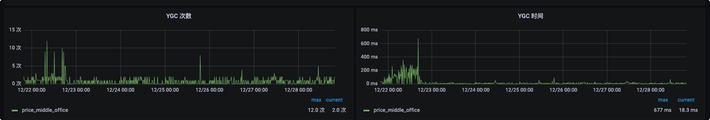
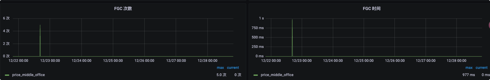

[toc]

> 大数据组个人周报（2023-11-27~2023-12-01）

**【本周主要工作内容】**

- **价格洞察系统**
  - **二手竞品价-1.4 `已上线`**
    - 工作内容：1、支持屏蔽某个链接。`-100%`。
  - **回收采集-兼容拍机堂数据 `-100% 已测试结束，等待数仓清洗链路完成后上线`**
    - 1、模板解析接口兼容修改 `-100%`
    - 2、任务生成+任务调度+任务重跑+任务诊断整体流程兼容修改 `-100%`
    - 3、联调整体功能正式调用爬虫接口 `-100%`
  - **价格洞察兼容转转精神用户登录。 `-100%`**
    - 工作内容：*与拍机堂需求合并上线。*

**【其他内容】**

- **云窗http-Server模式播报接口项目开发** `-100%`
  - 提供播报接口，直接写sql完成播报
  - 支持指标播报，阈值告警，负责人@，文件明细播报等播报模式
  - 文档已输出，部分播报已开始使用，目前反馈良好

**【思考】**

**【下周工作内容】**

- B端价-2.0

> 大数据组个人周报（2023-12-04~2023-12-08）

**【本周主要工作内容】**

- **价格洞察系统**
  - **回收采集-兼容拍机堂数据 `已上线`**
    - 需求内容：*1、模板解析接口兼容修改 。2、任务生成+任务调度+任务重跑+任务诊断整体流程兼容修改。3、联调整体功能正式调用爬虫接口。*
    - 补充内容：*1、新增标签表ID字段，端外机型ID字段，供数仓回收数据时补充选项使用。2、拍机堂任务量限制。*

  - **价格洞察兼容转转精神用户登录。 `已上线`**
    - 工作内容：*与拍机堂需求合并上线。*

  - **B端价-2.0 `已上线`**
    - 工作内容：*1、B端价配置页属性增加业务线区分。2、B端价列表查询页所有字典列表接口修改数据源。*

  - **二手竞品价-1.5 `联调中 90%`**
    - 工作内容：*1、竞品价列表筛选增加价格区间筛选 `-100%`。2、竞品价增加用户操作日志记录 `-100%`。3、图片增加名称前端分页筛选 `-100%`。*

**【其他内容】**

- **云窗http-Server模式播报接口**
  - 增加自定义模板播报，定义模板，写sql插空播报。`100%`

**【思考】**
  - 当前需求沟通评审时，暴露了许多的问题，开发文档并没有被各方重视起来，很多开发不明确在多方配合的需求开发下，自己需要负责哪些东西，导致频繁的改动、反复开发。后续应该拉齐各方明确的内容，按照内容进行并行开发，避免测试阶段不暴露问题，上线后作为bug又进行修复。

**【下周工作内容】**

- 二手竞品价-1.5
- 数据字典迭代筛选项


> 大数据组个人周报（2023-12-11~2023-12-15）

**【本周主要工作内容】**

- **价格洞察系统**
  - **二手竞品价-1.5 `已上线`**
    - 工作内容：*1、竞品价列表筛选增加价格区间筛选 `-100%`。2、竞品价增加用户操作日志记录 `-100%`。3、图片增加名称前端分页筛选 `-100%`。*
  
  - **二手竞品价-1.51 `已提测`**
    - 工作内容：*1、数据字典优化 `-100%`。2、二手价链接爬取功能优化 `-100%`*

**【其他内容】**

- **云窗http-Server模式播报接口**
  - 增加自定义循环模板播报，增加支持的markdown语法。增加图片播报。`100%`
- **退货退款4个播报迭代。 `100%`**

**【思考】**

**【下周工作内容】**
- 价格平台新需求


> 大数据组个人周报（2023-12-18~2023-12-22）

**【本周主要工作内容】**

- **价格洞察系统**
  
  - **二手竞品价-抖音二手价 `已上线`**
    - 工作内容：*1、抖音二手价前后端接口联调+假数据构造。3、二手价列表页导出功能优化。*
  - **二手竞品价-1.51 `已上线`**
    - 工作内容：*1、数据字典优化 `-100%`。2、二手价链接爬取功能优化 `-100%`*
  - **其他 `已上线`**
    - 1、修复了上线redis内存异常的问题。
    - 2、修复了异步模板添加接口模板为空的情况下的标签解析异常问题。
    - 3、修复了二手价偶尔失败和数据缺失问题。

**【其他内容】**
  - **搭售pop播报迭代。 `10%`**
  - **通过接口信息存hive表通用抽象脚本开发。日志+告警+监控`100%`**

**【思考】**

**【下周工作内容】**
- 价格平台新需求


> 大数据组个人周报（2023-12-25~2023-12-29）

**【本周主要工作内容】**

- **价格洞察系统**
  
  - **线上反馈问题修复 `已上线`**
    - 线上问题：
      - *1、在排查redis内存占用异常的过程中，发现之前redis数据结构设计、使用方面的一些不合理的点，导致一部分的异常情况排查起来没有起到辅助作用。*
      - *2、诊断功能接口响应时间长*
      - *3、采集任务模块的开放接口中，出现少量机型丢失，且异常日志未定位到的问题。*
      - *4、线上任务失败的情况中，出现消息通知丢失，未通知到用户的现象。*
      - *5、JVM GC效率低，对象回收不及时。堆内存占用高*
    - 工作内容：
      - *1、对redis存储的日志和模板信息进行了数据结构的重新选择，按日期+id重新设计查询方式等。`--100%`*
      - *2、优化诊断接口的诊断逻辑，辅助用户判断问题。`--100%`*
      - *3、优化了新增型号模板的接口逻辑，增加了一层异常日志。并且按天将前一天失败的模板告警到企微群。`--100%`*
      - *4、将原先的告警类型从普通消息改为markdown消息，架构侧普通消息仅支持512字节以内的消息。`--100%`*
      - *5、在耗时长、循环久、线程池方法等方法内添加辅助STW的JNI方法，帮助JVM更快的进行回收。从监控上看GC回收速度提升4倍以上。`--100%`*
    - 目前还存在的问题：
      - *告警消息能接收到拍机堂的错误原因反馈为`用户行为异常被限制功能`，但是平台查看和直接查数据库的原因均为看到该错误，而展示为`未知异常`，用户无法判定是否重跑，怀疑是任务回调平台接口时出现了重复回调的情况，已在平台后端加分布式锁处理，暂时先观察，后续协调爬虫侧排查。*

**【其他内容】**
  - **搭售pop播报迭代。 `100%`**
  - **C2B邮寄业务时效播报异常修复，播报逻辑更新。 `100%`**

**【思考】**

**【下周工作内容】**
- 价格平台新需求


# 一级标题

## 二级标题

### 三级标题

#### 四级标题

##### 五级标题

###### 六级标题

------

**加粗**

*斜体*

> 引用内容

```sql
代码块
多行
```

`单行代码`

------

- 列表一级
  - 列表二级
  - 列表二级
    - 列表三级
      - 列表四级

- 列表一级

------

| 表头1 | 表头2 | 表头3 |
| ----- | ----- | ----- |
| 11    | 21    | 31    |
| 12    | 22    | 32    |
| 13    | 23    | 33    |


> 在异步任务中添加用来辅助STW的JNI方法后，GC效率明显提升，FullGC数量也明显下降






