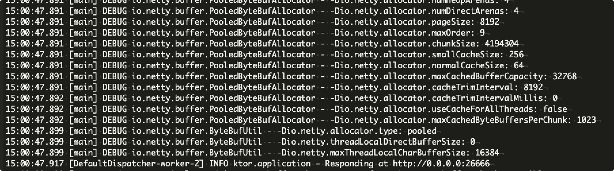
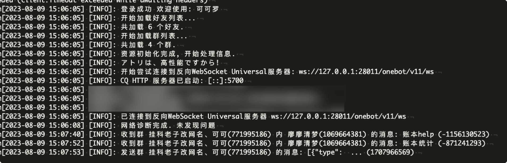

[toc]

## go-cqhttp 2023-07-23后腾讯封控问题解决

#### 配置签名服务器

> https://github.com/fuqiuluo/unidbg-fetch-qsign
>
> 根据wiki配置签名服务器

- 拉取最新版`Releases`

- 拉取版本为1.1.7

- 当前cq最新版为1.1.0，与当前签名服务器版本不一致

  - 方案1

    - 拉取1.1.0版本签名服务器releases

    - 拉取最新的apk文件

    - > - 注意：你需要手动从apk安装包的`lib/arm64-v8a`目录中提取出[libfekit.so](https://github.com/fuqiuluo/unidbg-fetch-qsign/wiki/txlib%2F8.9.63%2Flibfekit.so)、[libQSec.so](https://github.com/fuqiuluo/unidbg-fetch-qsign/wiki/txlib%2F8.9.63%2FlibQSec.so)文件并存放至一个文件夹，然后使用`--basePath`指定该文件夹的`绝对路径`，结构例如：
      >
      > > - your_dir
      > >   - libfekit.so
      > >   - libQSec.so
      > >   - config.json
      > >   - dtconfig.json

    - 配置config.json

    - > **注意key配置为空字符串**
      >
      > ```json
      > { // 复制这里的话，请把注释删除
      >   "server": {
      >     "host": "0.0.0.0",
      >     "port": 26666
      >   },
      >   // 注册实例的密钥
      >   "key": "",
      >   // 启用自动注册实例（需要1.1.4及以上版本才会生效）
      >   "auto_register": true,
      >   "protocol": {
      >     "qua": "V1_AND_SQ_8.9.68_4264_YYB_D",
      >     // version和code可以从qua中提取
      >     "version": "8.9.68", 
      >     "code": "4264"
      >   },
      >   "unidbg": {
      >     // 启用Dynarmic，它是一个开源的动态ARM指令集模拟器
      >     // 有时候会出现(crash) https://github.com/fuqiuluo/unidbg-fetch-qsign/issues/52
      >     "dynarmic": false,
      >     "unicorn": true,
      >     "debug": false
      >   },
      >   // 黑名单的uin，禁止以下uin注册实例，自qsign-1.1.6版本启用...
      >   "black_list": [
      >     1008611
      >   ]
      > }
      > ```

    - 启动对应apk版本的记录，从cq启动日志中捞

    - 

    - 启动命令`bash bin/unidbg-fetch-qsign --basePath=txlib/8.9.63`

    - 

  - 方案二：

    - cq-http使用dev分支，自行构建，请看下部分

#### CQ的配置文件`config.yml`中配置签名服务器

- 构建cqhttp
- 拉取最新版

```bash
# 拉取最新版并且切换到dev分支
git clone https://github.com/Mrs4s/go-cqhttp.git
# 切换分支
git checkout -b dev origin/dev
```

- 安装golang **版本 > 1.20**
- 设置代理源

```bash
go env -w GOPROXY=https://goproxy.cn,direct
```

- 从源码构建

```bash
go build -ldflags "-s -w -extldflags '-static'"
```

- 运行

```bash
# 选择 0-http通信 2-正向代理 3-反向代理 
./go-cqhttp
```

- 主要配置项目`account.sign-server`

```yml
# go-cqhttp 默认配置文件

account: # 账号相关
  uin: 32*******01 # QQ账号
  password: '***********' # 密码为空时使用扫码登录
  encrypt: false  # 是否开启密码加密
  status: 0      # 在线状态 请参考 https://docs.go-cqhttp.org/guide/config.html#在线状态
  relogin: # 重连设置
    delay: 3   # 首次重连延迟, 单位秒
    interval: 3   # 重连间隔
    max-times: 0  # 最大重连次数, 0为无限制

  # 是否使用服务器下发的新地址进行重连
  # 注意, 此设置可能导致在海外服务器上连接情况更差
  use-sso-address: true
  # 是否允许发送临时会话消息
  allow-temp-session: false

  # 数据包的签名服务器
  # 兼容 https://github.com/fuqiuluo/unidbg-fetch-qsign
  # 如果遇到 登录 45 错误, 或者发送信息风控的话需要填入一个服务器
  # 示例:
  # sign-server: 'http://127.0.0.1:8080' # 本地签名服务器
  # sign-server: 'https://signserver.example.com' # 线上签名服务器
  # 服务器可使用docker在本地搭建或者使用他人开放的服务
  sign-server: 'http://127.0.0.1:26666'

heartbeat:
  # 心跳频率, 单位秒
  # -1 为关闭心跳
  interval: 5

message:
  # 上报数据类型
  # 可选: string,array
  post-format: string
  # 是否忽略无效的CQ码, 如果为假将原样发送
  ignore-invalid-cqcode: false
  # 是否强制分片发送消息
  # 分片发送将会带来更快的速度
  # 但是兼容性会有些问题
  force-fragment: false
  # 是否将url分片发送
  fix-url: false
  # 下载图片等请求网络代理
  proxy-rewrite: ''
  # 是否上报自身消息
  report-self-message: false
  # 移除服务端的Reply附带的At
  remove-reply-at: false
  # 为Reply附加更多信息
  extra-reply-data: false
  # 跳过 Mime 扫描, 忽略错误数据
  skip-mime-scan: false
  # 是否自动转换 WebP 图片
  convert-webp-image: false
  # http超时时间
  http-timeout: 0

output:
  # 日志等级 trace,debug,info,warn,error
  log-level: warn
  # 日志时效 单位天. 超过这个时间之前的日志将会被自动删除. 设置为 0 表示永久保留.
  log-aging: 15
  # 是否在每次启动时强制创建全新的文件储存日志. 为 false 的情况下将会在上次启动时创建的日志文件续写
  log-force-new: true
  # 是否启用日志颜色
  log-colorful: true
  # 是否启用 DEBUG
  debug: false # 开启调试模式

# 默认中间件锚点
default-middlewares: &default
  # 访问密钥, 强烈推荐在公网的服务器设置
  access-token: ''
  # 事件过滤器文件目录
  filter: ''
  # API限速设置
  # 该设置为全局生效
  # 原 cqhttp 虽然启用了 rate_limit 后缀, 但是基本没插件适配
  # 目前该限速设置为令牌桶算法, 请参考:
  # https://baike.baidu.com/item/%E4%BB%A4%E7%89%8C%E6%A1%B6%E7%AE%97%E6%B3%95/6597000?fr=aladdin
  rate-limit:
    enabled: false # 是否启用限速
    frequency: 1  # 令牌回复频率, 单位秒
    bucket: 1     # 令牌桶大小

database: # 数据库相关设置
  leveldb:
    # 是否启用内置leveldb数据库
    # 启用将会增加10-20MB的内存占用和一定的磁盘空间
    # 关闭将无法使用 撤回 回复 get_msg 等上下文相关功能
    enable: true
  sqlite3:
    # 是否启用内置sqlite3数据库
    # 启用将会增加一定的内存占用和一定的磁盘空间
    # 关闭将无法使用 撤回 回复 get_msg 等上下文相关功能
    enable: false
    cachettl: 3600000000000 # 1h

# 连接服务列表
servers:
  # 添加方式，同一连接方式可添加多个，具体配置说明请查看文档
  #- http: # http 通信
  #- ws:   # 正向 Websocket
  #- ws-reverse: # 反向 Websocket
  #- pprof: #性能分析服务器

  - http: # HTTP 通信设置
      address: 0.0.0.0:5700 # HTTP监听地址
      version: 11     # OneBot协议版本, 支持 11/12
      timeout: 5      # 反向 HTTP 超时时间, 单位秒，<5 时将被忽略
      long-polling:   # 长轮询拓展
        enabled: false       # 是否开启
        max-queue-size: 2000 # 消息队列大小，0 表示不限制队列大小，谨慎使用
      middlewares:
        <<: *default # 引用默认中间件
      post:           # 反向HTTP POST地址列表
      #- url: ''                # 地址
      #  secret: ''             # 密钥
      #  max-retries: 3         # 最大重试，0 时禁用
      #  retries-interval: 1500 # 重试时间，单位毫秒，0 时立即
      #- url: http://127.0.0.1:5701/ # 地址
      #  secret: ''                  # 密钥
      #  max-retries: 10             # 最大重试，0 时禁用
      #  retries-interval: 1000      # 重试时间，单位毫秒，0 时立即

  - ws-reverse:
      # 反向WS Universal 地址
      # 注意 设置了此项地址后下面两项将会被忽略
      universal: ws://127.0.0.1:28011/onebot/v11/ws
       # 反向WS API 地址
      api: ws://your_websocket_api.server
      # 反向WS Event 地址
      event: ws://your_websocket_event.server
       # 重连间隔 单位毫秒
      reconnect-interval: 3000
      middlewares:
        <<: *default # 引用默认中间件

```




