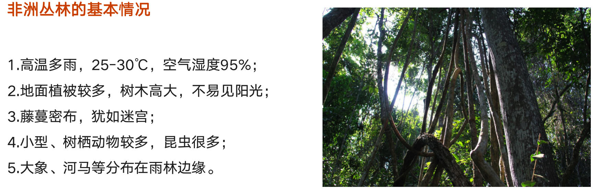
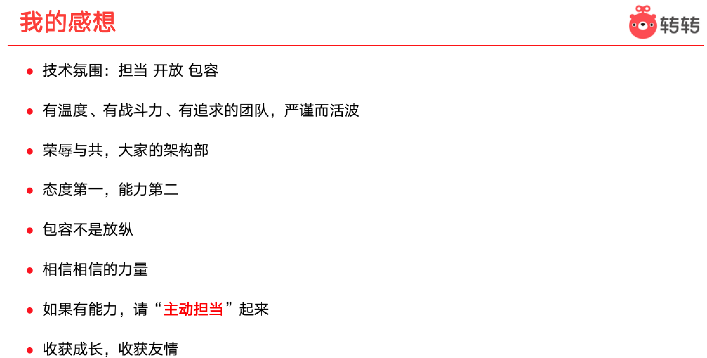
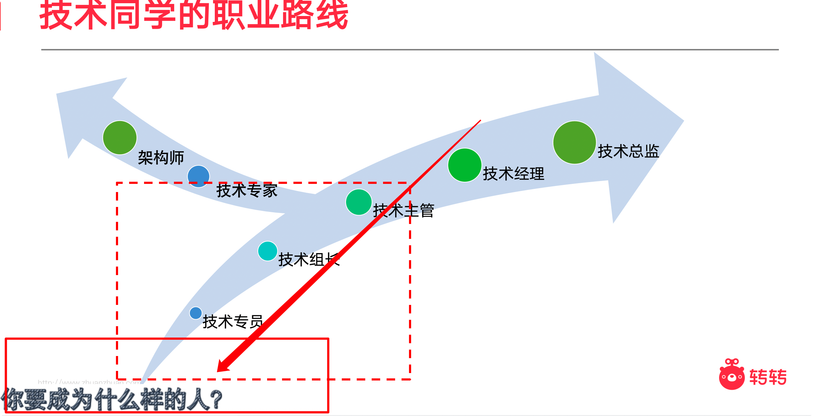

### 新人培训–职业力课程–沟通的三要素学习报告

沟通是连通人与人直接的一座桥梁，有效的沟通不仅可以提效还可以增进同事之间的感情和关系。今天的培训通过各种各样的样例让我们这些职场新人学习到了沟通的重要。比如开局的游戏活动中，三分钟时间内，我们并没有完成统计组内全部成员的三个问题，这就能够一定程度上体现出我们的沟通技巧并不是很完美。

对于今天的培训，主要学到的三要素就是：说明、倾听和确认三个要素。就好像我们开发的都了解的网络协议一样，沟通者和倾听者之间也需要“三次握手”。

在说明问题的方式上，要做到：注意说明的方式，和说话的内容。只有说的人表达情绪，思维细腻，才能让倾听者能够清晰的知道应该做什么，怎么做。就比如前段时间在项目中，和前端的前辈对接的时候，如果我表达不清楚，就很难让前段同学知道我想说明的意思到底是什么。在工作中也时常发生，比如我请教的业成一些问题时候，偶尔让被请教者不知道含义，这样就很难高效解决问题，所以，说明方式很重要。

其次就是倾听了。对于倾听而言，要注意：表达星期要点、把握情绪、说明含义和潜台词四点。还记得前段时间AB项目有一个需求，学军在给我说的时候，我就没有太听明白含义到底是什么，而是想通过，再看看文档试图理解问题，这就造成了解决问题不高效，理解问题不清晰的问题。而且如果仅仅是没理解，还可以再次询问，倘若发生理解偏差，造成了影响，问题就不简单了。听者要学会听含义和潜台词，并且从说者的情绪和语速上发现问题的重要度，才是一个合格的听者。

最后就是确认了。对于确认来说，表达方式有很多种，比如：点头、回应、复述、提问等等。我觉得复述就是一个很好的方式，虽然不够高效，但是复述是最清晰能让说者明白倾听者能否听懂的最简单的方式，这样可以及时发现理解上的不同点，从而尽快解决问题。

三要素总结起来就是，会说，会听，有礼貌。在今后的沟通中，我也会努力去学习这些，成长不仅仅是技术力的提升，还有其他个人因素等，努力做一个能听懂，会表达的人。

- 时间管理
  - 小游戏
    - 你现在多少岁
    - 想活到多少岁
    - 你想多少岁退休
    - 请问24小时你会如何分配
    - 我们的人生还有多少时间可以创造价值
- 

### 新人培训–职业力课程–时间管理

越优秀的人，时间管理越充分有效。时间管理无疑是对我们每个人都极为重要的一环，有的人轻松高效的完成工作，有的人忙前忙后累到想哭。有效的时间管理可以帮我们更好的去改善自己的工作、生活、感情。

这堂课通过多个流程让我们学习了时间管理的方法。对于自己的时间管理，我们一定要做到先分析，然后针对问题进行解决，课堂上提到的分析方法大致为以下的五点：

- 时间管理障碍
- 时间损失的分析
- 耗时因素的分析
- 怎么找到原因
- 坚持自我总结

结合一些我自己的思考，我觉得目前的我时间管理仍然不够高效。拿我的计划来讲，我当前每天的安排大致如下：

1. 工作任务

2. 业务流程学习

3. 公司代码学习
4. 其他技能了解学习

5. 锻炼健身
6. 用自己学到的技术实现自己的项目加深理解
7. 多向小师傅或者同事咨询不懂的问题
8. 人际交流
9. 坚持自己做饭

暂时虽然各方面的需求都有，但是看起来**杂乱无章**，比如我有部分的任务或者是一些事情耽误了，就会影响到其他计划的施行。结合今天的问题，我自己的思考了一下，**我能否说清每天都干了什么？是否碰到了难以解决的问题？事件安排处理是否足够妥当？是否做了实际上不需要做的事情？**

按照课题中提到了的方法和顺序：① 明确目标（`smart原则`）② 制定有序的计划（`ABC排序法`）③ 分清工作的轻重缓急（`四象限原则`）④ 运用`80/20原则`解决问题，并做好复盘

然后再来看我当前的计划，我把他们按照四象限原则规划如下：

**附：本周内计划安排**

### 新人培训–职业力课程–目标管理

本周的课程讲的是目标管理，这节课和时间管理很像，但也有不同。在教学中，不同于前几课的最大点就是把更多的时间放在了让我们从故事和游戏中取体会什么是目标管理。通过课程还学习了几个常用的工作效率工具，可以帮助我更好的制定自己的计划。

课堂中存在一个团队游戏，让我们从热带雨林中存活的逃出去。

游戏提供了若干的工具来帮助我们。最终用我们选择的工具排序和专家排序做对比，来观察我们是否有很好的完成目标。我们团队其实和最终的专家一键存在分歧，究其原因就是我们的目标设置存在方向上的问题。

我们的决策方向是：**工具分类** 一》**按分类优先级排序** 一》**决策**

看似没有问题，但是我们忽视了终究目标是：**活着走出雨林**。这个目标下可以拆分成两部分：

① 一定要先活着 ② 其次才是走出去 。

这个游戏就有很大的借鉴价值：

> **我们在工作中一定要注意我们的终极目标，过程是目标导向的，基于目标去决定自己的过程划分，才可以更快速和高效的完成目标，并且不会走弯路！！**如果我们仅仅考虑效率或者仅仅考虑过程，难免会走很多的弯路，也是我们小组晚于其他组完成决策的原因

#### 首先对于个人而言

- 目标管理可以帮我们快速的确定大方向
- 可以帮我我们更快的确定自己的问题和阻碍
- 有助于帮助团队成员对我们工作目标有依赖的工作确定方向和时间安排

#### 对于企业和团队而言

- 可以快速确定团队的的期望和要求
- 分目标帮我我们负起自己的责任
- 更好的确定团队目标的价值
- 为考核提供依据

#### 收获的方法和工具

- SMART管理与应用
- WEB工作分解结构
- 甘特图
- 6W3H计划

### 新人培训–职业力课程–如何成为优秀的工程师

今天的课程是由架构部杜云杰大佬从自身的工作习惯中，从工作、学习、生活三个方面，给我们梳理了很多的的个人好习惯，虽然说他人的经验不一定完全适合我们个人，但是可以从中学习到很多参考的东西。

**经过这次学习**，我先回答一下课程中的几个问题的理解

> 如何成为一个优秀的工程师？

我觉得要回答这个问题，首先要明确，我认为优秀的工程师应该是怎样的？

- 工作
  - 技术栈丰富，能够高效、高质量的完成所有需求
  - 能帮助别人解决技术难点，有责任、敢担当
  - 会运用自己的技术，给自己的工作**提效**
  - 善于反思总结。在工作中总结自己，自我升华
- 生活
  - 完美兼顾工作和生活
  - 能抵制各种诱惑，自律，健康
  - 随时保持高激情的状态，乐观、自信
- 学习
  - 会自己不断的学习新技术，并且用在工作中
  - 每天比昨天强一点
  - “杠精”

答案其实在上课阶段就已经很明确了，但是作为一个刚进入社会的毕业生，不足肯定还是很多的，大方向来看，我们肯定都想成为一个优秀的工程师，但是目标不够明确并不能很好的改变自己。

> 我对自己的看法

不足肯定还是很多的，尤其是在代码领域中，更应该专注，精益求精，一丝不苟。

- 不足
  - 在专注某一个功能点或者某一块逻辑的时候，容易忽视其他的要点
  - 不够仔细，比如修改了某个逻辑后，容易忽视对已经测试通过的接口的影响
  - 不知道如何自己给自己创造工作内容
  - 没有很好的把所有学会的东西运用在日常工作中（很多东西我都会，就是得别人提醒我才能想起来，这不好 -_-|||）
- 优点
  - 对技术有激情，喜欢钻研技术，学的越多越好
  - 会复盘，记笔记，有自己的博客，记录每天的学习，学的东西都一定要有我自己的应用才算我学会了。
  - 相当的乐观，你怎么骂，都OK

> 大佬对自己团队的感想很丰富

> 我对团队的感想

- 技术和成长：我来了以后接触到的面挺广的，比如大数据的Flink、Hadoop、spark，自学在自己服务器上搭建了Flink、ES、Kafka、Clickhouse等，Java代码风格得到提升、思维方式打开了，我也写了自己的定时同步mysql binlog的方法，学习搭建了自己的网站用来练习，也接触到了shell，自己写了一键部署脚本，一键上传脚本等等，了解的面打开了很多。反正我和我别的公司工作同学聊过，我认为我学到的东西要比他们丰富多彩，无论是技术还是态度，这还得感谢团队的大家。
- 团队氛围：老员工包容我们这些新人，教会我们很多东西（如志远、柏霖）。年龄相仿的员工乐观，有趣，玩得来，也教会了我很多不懂得点，总的来说，来到大数据是一个“意外”，但这个意外相当nice。每个人都有自己的特色，有自己精通的领域，在学到很多东西的同时，也能收获很不错的友谊。

## 心得体会—职业发展课程感想

来到转转到现在也已经6个多月了，对于这份工作来说我也是有很多感想，不论是对于技术、团队，还是对自己未来的发展和规划。

我个人是一个不太喜欢长篇大这种论长期规划的人，我喜欢用无数个短期规划去整体规划自己的长期发展。虽然说没有一个确切明确的长期规划，但是我明确的一个点就是虽然不指定硬性的长期规划，但是长期发展的大方向绝不能错。总体上更喜欢技术，周末也经常拉着以前的朋友讨论技术点，买服务器、搭自己的平台学习。

大学刚开始的时候我就在自己的计划中制定了走职业发展的决定，在朋友们还在决定自己是否考研的时候，我就想好了我的方向。大学期间学了一些东西，从小的爱玩电脑，喜欢钻研修改器的习惯导致我很喜欢技术强的东西，及其想要走技术路线。

来到转转以后学习的速度和在学校里面完全不同，用今天培训时候听到的话来说，就是“最好的检验自己的学习成功的地方，就是在工作中”。来到大数据团队，也从刚开始的忐忑，到适应，再到现在的兴奋。和其他公司的小伙伴聊过天，重复的工作让他们感到自己的成长是有限的。可是工作本就是大量重复的，关键在于自己是否会学习。我刚来时候跟着志远做平台开发，在这期间接触到了：Flink、Clickhouse、Spark、Hive等等技术点，还接触到了：埋点、数据管理、AB测试等等这些从未听过的东西。到现在，自己也可以熟练的完成工作。为了检验自己的学习成果，我在自己的云服务器上搭建了很多的平台、进一步学习了掌握的技术点。

昨天开始也接触到了数仓开发的需求，到现在掌握到了更多的东西，现在已经完成了分配的数仓开发的需求任务。在同事的积极帮助下，同事们总结的方法确实好用，也更加印证了“工作是进步最快的地方”。

然后我再回答下这个问题

> 我觉得我想成为技术专家这个方向的大佬。简单讲就是，我要做大佬。没准我以后也可以像杜云杰大佬一样，站在某公司或者某学校的分享会，讲自己的经历，分享自己的经验。

既然我不喜欢长期计划，那我就结合自己培训这些天学习的所有东西，浅浅做一个中短期计划完成度分析（√-完成度较好 ，？有进步空间，× 继续努力）：

| 沟通能力                                         | 时间管理                                                     | 目标管理                                                     |
| ------------------------------------------------ | ------------------------------------------------------------ | :----------------------------------------------------------- |
| √ 不耻“上”问，及时沟通，以免漏掉不清楚的疑问点   | √ 时间管理安排恰当                                           | √  有清晰的目标划分                                          |
| √ 积极做到：精准说明、认真倾听、反复确认三点要素 | √ 会利用各种学到的方法指定计划                               | × 能够快速判断出一个任务的关键点和需要注意的要点，能快速对目标进行决策 |
|                                                  | √ 多进行复盘学习，利用周末、节假日有精力的时间，把学会了的东西自己想一个应用例子再次学习 | ？SMART管理与应用  ？WEB工作分解结构 ？ 甘特图 ？6W3H计划    |
|                                                  | ？事情的先后顺序处理完善得当                                 |                                                              |

现在的计划：

- 熟练数仓任务的流程、争取迅速能够自己独立开发数仓需求
- 继续学习平台相关的技术，完成自己的Flink学习计划，把Flink应用在自己的练手平台中

### 大数据组个人周报（2023-01-03~2022-01-06）

**【本周主要工作内容】**

1. AB
   - 分流服务关联画像服务自测与部署
   - 联调测试问题排查与解决

**【思考与总结】**

无

**【下周工作内容】**

