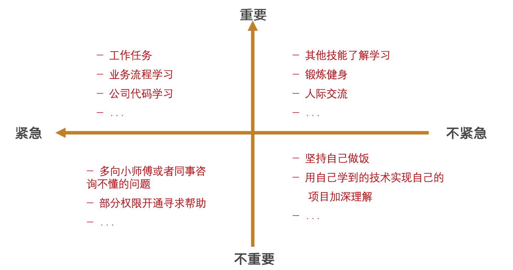
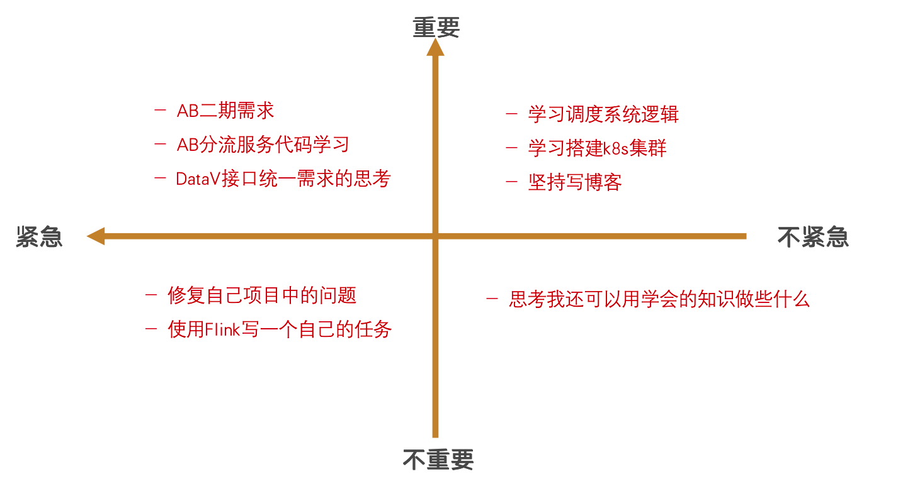

### 新人培训–职业力课程–沟通的三要素学习报告

沟通是连通人与人直接的一座桥梁，有效的沟通不仅可以提效还可以增进同事之间的感情和关系。今天的培训通过各种各样的样例让我们这些职场新人学习到了沟通的重要。比如开局的游戏活动中，三分钟时间内，我们并没有完成统计组内全部成员的三个问题，这就能够一定程度上体现出我们的沟通技巧并不是很完美。

对于今天的培训，主要学到的三要素就是：说明、倾听和确认三个要素。就好像我们开发的都了解的网络协议一样，沟通者和倾听者之间也需要“三次握手”。

在说明问题的方式上，要做到：注意说明的方式，和说话的内容。只有说的人表达情绪，思维细腻，才能让倾听者能够清晰的知道应该做什么，怎么做。就比如前段时间在项目中，和前端的前辈对接的时候，如果我表达不清楚，就很难让前段同学知道我想说明的意思到底是什么。在工作中也时常发生，比如我请教的业成一些问题时候，偶尔让被请教者不知道含义，这样就很难高效解决问题，所以，说明方式很重要。

其次就是倾听了。对于倾听而言，要注意：表达星期要点、把握情绪、说明含义和潜台词四点。还记得前段时间AB项目有一个需求，学军在给我说的时候，我就没有太听明白含义到底是什么，而是想通过，再看看文档试图理解问题，这就造成了解决问题不高效，理解问题不清晰的问题。而且如果仅仅是没理解，还可以再次询问，倘若发生理解偏差，造成了影响，问题就不简单了。听者要学会听含义和潜台词，并且从说者的情绪和语速上发现问题的重要度，才是一个合格的听者。

最后就是确认了。对于确认来说，表达方式有很多种，比如：点头、回应、复述、提问等等。我觉得复述就是一个很好的方式，虽然不够高效，但是复述是最清晰能让说者明白倾听者能否听懂的最简单的方式，这样可以及时发现理解上的不同点，从而尽快解决问题。

三要素总结起来就是，会说，会听，有礼貌。在今后的沟通中，我也会努力去学习这些，成长不仅仅是技术力的提升，还有其他个人因素等，努力做一个能听懂，会表达的人。

- 时间管理
  - 小游戏
    - 你现在多少岁
    - 想活到多少岁
    - 你想多少岁退休
    - 请问24小时你会如何分配
    - 我们的人生还有多少时间可以创造价值
- 

### 新人培训–职业力课程–时间管理

越优秀的人，时间管理越充分有效。时间管理无疑是对我们每个人都极为重要的一环，有的人轻松高效的完成工作，有的人忙前忙后累到想哭。有效的时间管理可以帮我们更好的去改善自己的工作、生活、感情。

这堂课通过多个流程让我们学习了时间管理的方法。对于自己的时间管理，我们一定要做到先分析，然后针对问题进行解决，课堂上提到的分析方法大致为以下的五点：

- 时间管理障碍
- 时间损失的分析
- 耗时因素的分析
- 怎么找到原因
- 坚持自我总结

结合一些我自己的思考，我觉得目前的我时间管理仍然不够高效。拿我的计划来讲，我当前每天的安排大致如下：

1. 工作任务

2. 业务流程学习

3. 公司代码学习
4. 其他技能了解学习

5. 锻炼健身
6. 用自己学到的技术实现自己的项目加深理解
7. 多向小师傅或者同事咨询不懂的问题
8. 人际交流
9. 坚持自己做饭

暂时虽然各方面的需求都有，但是看起来**杂乱无章**，比如我有部分的任务或者是一些事情耽误了，就会影响到其他计划的施行。结合今天的问题，我自己的思考了一下，**我能否说清每天都干了什么？是否碰到了难以解决的问题？事件安排处理是否足够妥当？是否做了实际上不需要做的事情？**

按照课题中提到了的方法和顺序：① 明确目标（`smart原则`）② 制定有序的计划（`ABC排序法`）③ 分清工作的轻重缓急（`四象限原则`）④ 运用`80/20原则`解决问题，并做好复盘

然后再来看我当前的计划，我把他们按照四象限原则规划如下：

**附：本周内计划安排**

