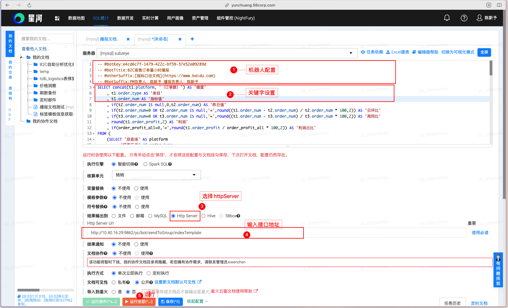
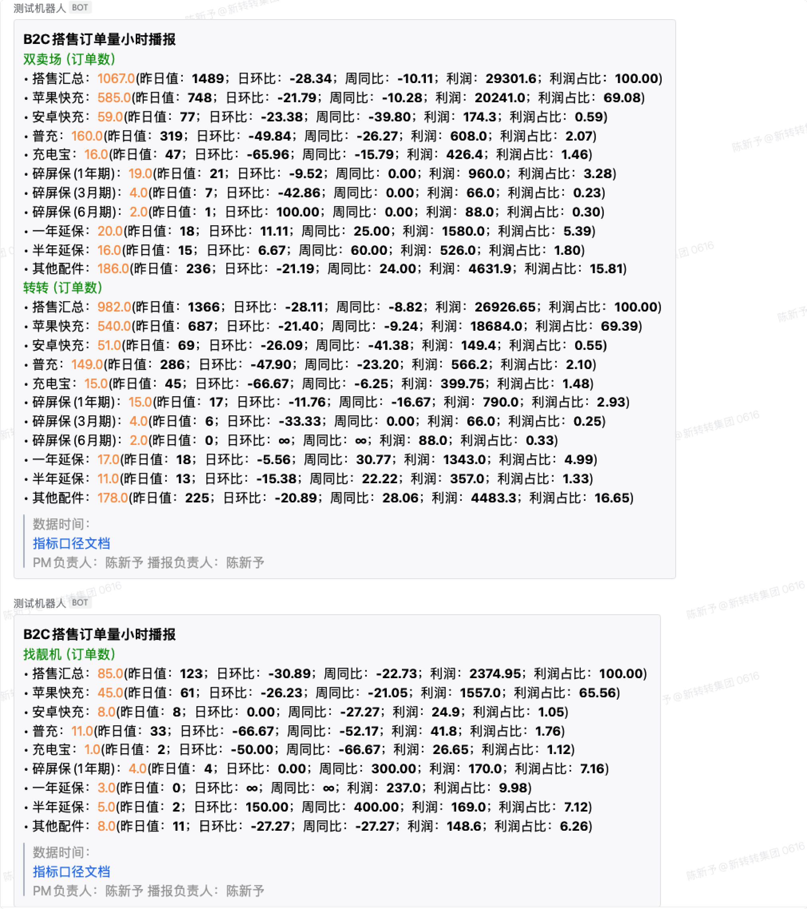
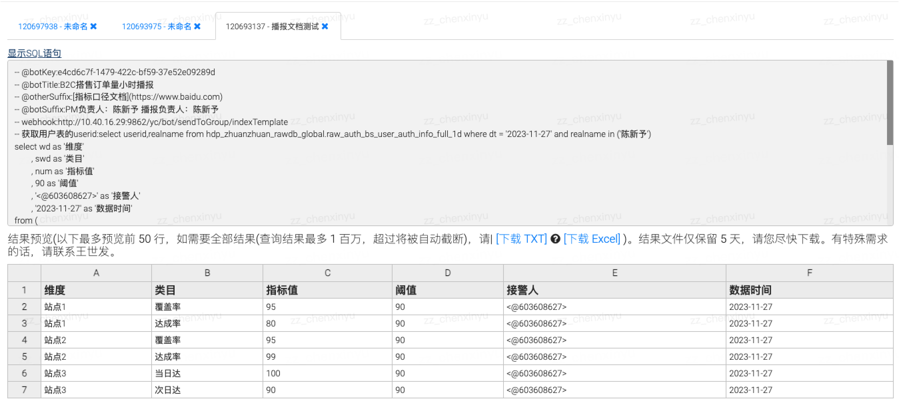
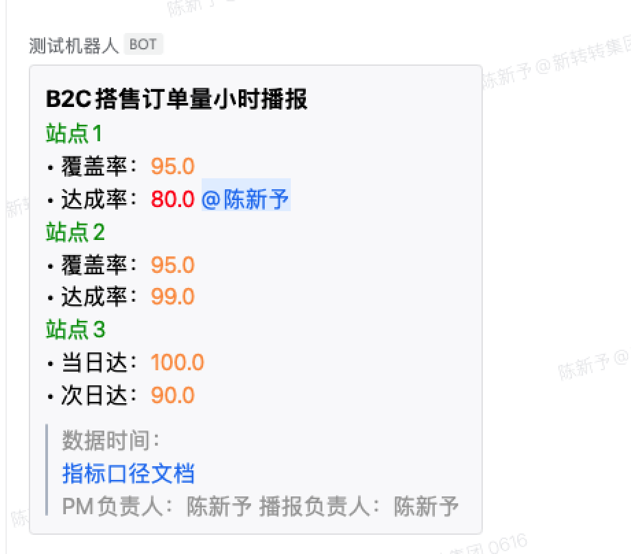
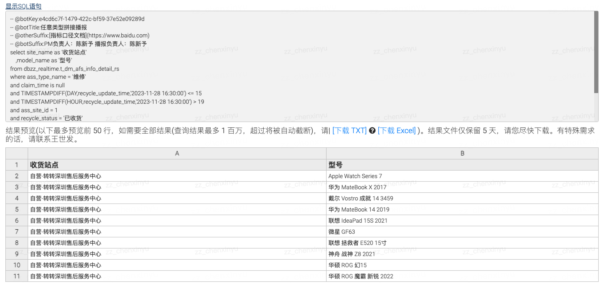
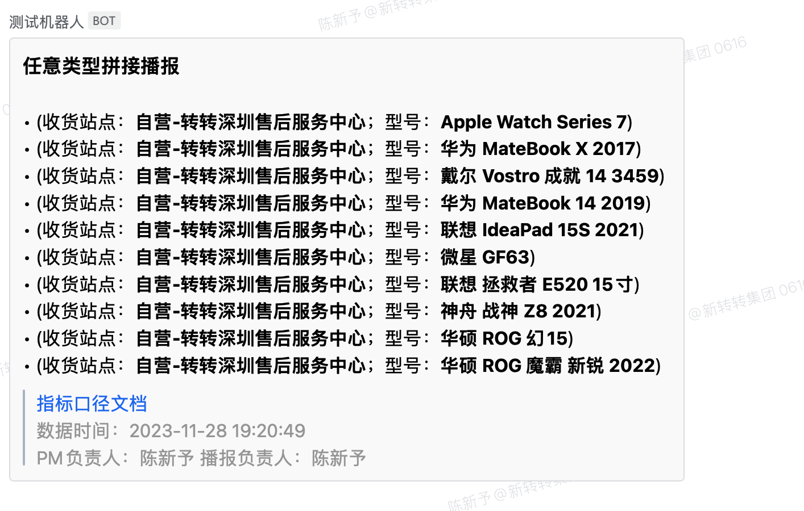

[toc]

## **云窗-httpServer播报开发文档**

> **功能**：将云窗sql执行结果输出到企业微信群机器人播报，可自行定时播送，有sql，就有播报。
>
> 当前webhook地址：http://10.40.16.29:9862/yc/bot/sendToGroup/indexTemplate –POST

#### 关键字

> 定义：维度、类目、指标值、阈值、接警人、数据时间
>
> 作用：帮助切割组装播报模板信息，如果没有关键字，播报也可正常使用，结果为数据行的拼接发送，可自行demo测试。

| **关键字** | **类型** | **是否必须** | **作用**                                                  | **备注** |
| ---------- | -------- | ------------ | --------------------------------------------------------- | -------- |
| 维度       | 字符     | 否           | 播报的聚合维度（如：站点名称）                            |          |
| 类目       | 字符     | 否           | 播报的指标类目（如：手机）                                |          |
| 指标值     | 浮点     | 否           | 指标内容（如：订单量）                                    |          |
| 阈值       | 浮点     | 否           | 订单量的阈值设置，小于此值会加重颜色，如有接警人会@接警人 |          |
| 接警人     | 字符     | 否           | 当前行指标需要@的负责人，如未设置阈值，则默认@接警人      |          |
| 数据时间   | 字符     | 否           | 播报的数据时间（如：云窗变量${outFileSuffix}）            |          |

#### 机器人配置

> 作用：企微的告警机器人的配置信息等。

| **配置名**   | **类型** | **是否必须** | **作用**                                               | **备注** |
| ------------ | -------- | ------------ | ------------------------------------------------------ | -------- |
| `@botKey`    | 字符     | 是           | 播报的机器人秘钥：参考企微机器人key获取方式            |          |
| `@botTitle`  | 字符     | 是           | 播报的标题（如：B2C订单量播报）                        |          |
| @otherSuffix | 字符     | 否           | 额外信息（如：指标口径文档等需要追加在播报尾部的文案） |          |
| `@botSuffix` | 字符     | 是           | 播报结尾（如：PM负责人：xxx  数据负责人：xxx）         |          |

## 配置过程

- 编写Sql

- 云窗配置-`将结果输出到-Http Server`
- url配置为：http://10.40.16.29:9862/yc/bot/sendToGroup/indexTemplate 
- 可以利用云窗进行：定时/依赖配置

### 样例1、标准指标类型分维度播报

基本内容为：`维度` + `类目` + `指标值` + 其他内容

#### 云窗配置：



```sql
-- @botKey:e4cd6c7f-1479-422c-bf59-37e52e09289d
-- @botTitle:B2C搭售订单量小时播报
-- @otherSuffix:[指标口径文档](https://www.baidu.com)
-- @botSuffix:PM负责人：陈新予 播报负责人：陈新予
select concat(t1.platform, '（订单数）') as '维度'
	, t1.order_type as '类目'
	, t1.order_num as '指标值'
	, if(t2.order_num is null,0,t2.order_num) as '昨日值'
	, if(t2.order_num=0 or t2.order_num is null,'∞',round((t1.order_num - t2.order_num) / t2.order_num * 100,2)) as '日环比'
	, if(t3.order_num=0 or t3.order_num is null,'∞',round((t1.order_num - t3.order_num) / t3.order_num * 100,2)) as '周同比'
	, round(t1.order_profit,2) as '利润'
	, if(order_profit_all=0,'∞',round(t1.order_profit / order_profit_all * 100,2)) as '利润占比'
from (
	(select '双卖场' as platform  
		, '搭售汇总' as order_type
		, count(DISTINCT order_server_id) as order_num
		, sum(total_amt) as order_profit
	from dbzz_zeye_offline_b2c.t_bb_b2c_bundling_data_full_1h 
	where Left(stat_date,13) = '2023-11-27 16' and data_flag = 1)
	union all
	(select '双卖场' as platform  
		, order_type
		, count(DISTINCT order_server_id) as order_num
		, sum(total_amt) as order_profit
	from dbzz_zeye_offline_b2c.t_bb_b2c_bundling_data_full_1h 
	where Left(stat_date,13) = '2023-11-27 16' and data_flag = 1
	group by order_type
	order by FIELD(order_type, '苹果快充', '安卓快充', '普充', '充电宝', '碎屏保(1年期)', '碎屏保(3月期)', '碎屏保(6月期)', '一年延保', '半年延保', '其他配件') limit 999999)
	union all 
	(select platform,order_type,order_num,order_profit
	from (select platform
			, '搭售汇总' order_type
			, count(DISTINCT order_server_id) as order_num
			, sum(total_amt) as order_profit
		from dbzz_zeye_offline_b2c.t_bb_b2c_bundling_data_full_1h 
		where Left(stat_date,13) = '2023-11-27 16' and data_flag = 1
		group by platform
		union all
		select platform
			, order_type
			, count(DISTINCT order_server_id) as order_num
			, sum(total_amt) as order_profit
		from dbzz_zeye_offline_b2c.t_bb_b2c_bundling_data_full_1h 
		where Left(stat_date,13) = '2023-11-27 16' and data_flag = 1
		group by order_type,platform) ttt
	order by FIELD(platform, '转转', '找靓机')
		, FIELD(order_type, '苹果快充', '安卓快充', '普充', '充电宝', '碎屏保(1年期)', '碎屏保(3月期)', '碎屏保(6月期)', '一年延保', '半年延保', '其他配件')
	limit 999999)
) t1 left join (
	(select '双卖场' as platform  
		, sum(total_amt) as order_profit_all
	from dbzz_zeye_offline_b2c.t_bb_b2c_bundling_data_full_1h 
	where Left(stat_date,13) = '2023-11-27 16' and data_flag = 1)
	union all 
	(select platform
		, sum(total_amt) as order_profit_all
	from dbzz_zeye_offline_b2c.t_bb_b2c_bundling_data_full_1h 
	where Left(stat_date,13) = '2023-11-27 16' and data_flag = 1
	group by platform)
) t1_all on t1.platform = t1_all.platform LEFT join (
	select '双卖场' as platform  
		, '搭售汇总' as order_type
		, count(DISTINCT order_server_id) as order_num
		, sum(total_amt) as order_profit
	from dbzz_zeye_offline_b2c.t_bb_b2c_bundling_data_full_1h 
	where Left(stat_date,13) = '2023-11-26 16' and data_flag = 1
	union all
	select '双卖场' as platform  
		, order_type
		, count(DISTINCT order_server_id) as order_num
		, sum(total_amt) as order_profit
	from dbzz_zeye_offline_b2c.t_bb_b2c_bundling_data_full_1h 
	where Left(stat_date,13) = '2023-11-26 16' and data_flag = 1
	group by order_type
	union all 
	select platform,order_type,order_num,order_profit
	from (select platform
			, '搭售汇总' order_type
			, count(DISTINCT order_server_id) as order_num
			, sum(total_amt) as order_profit
		from dbzz_zeye_offline_b2c.t_bb_b2c_bundling_data_full_1h 
		where Left(stat_date,13) = '2023-11-26 16' and data_flag = 1
		group by platform
		union all
		select platform
			, order_type
			, count(DISTINCT order_server_id) as order_num
			, sum(total_amt) as order_profit
		from dbzz_zeye_offline_b2c.t_bb_b2c_bundling_data_full_1h 
		where Left(stat_date,13) = '2023-11-26 16' and data_flag = 1
		group by order_type,platform
	 ) ttt
) t2 on t1.platform = t2.platform and t1.order_type = t2.order_type LEFT join (
	select '双卖场' as platform  
		, '搭售汇总' as order_type
		, count(DISTINCT order_server_id) as order_num
		, sum(total_amt) as order_profit
	from dbzz_zeye_offline_b2c.t_bb_b2c_bundling_data_full_1h 
	where Left(stat_date,13) = '2023-11-20 16' and data_flag = 1
	union all
	select '双卖场' as platform  
		, order_type
		, count(DISTINCT order_server_id) as order_num
		, sum(total_amt) as order_profit
	from dbzz_zeye_offline_b2c.t_bb_b2c_bundling_data_full_1h 
	where Left(stat_date,13) = '2023-11-20 16' and data_flag = 1
	group by order_type
	union all 
	select platform,order_type,order_num,order_profit
	from (select platform
			, '搭售汇总' order_type
			, count(DISTINCT order_server_id) as order_num
			, sum(total_amt) as order_profit
		from dbzz_zeye_offline_b2c.t_bb_b2c_bundling_data_full_1h 
		where Left(stat_date,13) = '2023-11-20 16' and data_flag = 1
		group by platform
		union all
		select platform
			, order_type
			, count(DISTINCT order_server_id) as order_num
			, sum(total_amt) as order_profit
		from dbzz_zeye_offline_b2c.t_bb_b2c_bundling_data_full_1h 
		where Left(stat_date,13) = '2023-11-20 16' and data_flag = 1
		group by order_type,platform
	 ) ttt
) t3 on t1.platform = t3.platform and t1.order_type = t3.order_type and  t3.platform = t2.platform and t3.order_type = t2.order_type
```

#### 播报效果：

> 当多个维度的组合内容超过企微限制大小时，会自动切分进行播报。只需关注sql即可



### 样例2、指标告警分维度播报

基本内容为：`维度` +` 类目` + `指标值` + `阈值` + 接警人 + 其他内容

#### 云窗配置：



```sql
-- @botKey:e4cd6c7f-1479-422c-bf59-37e52e09289d
-- @botTitle:B2C搭售订单量小时播报
-- @otherSuffix:[指标口径文档](https://www.baidu.com)
-- @botSuffix:PM负责人：陈新予 播报负责人：陈新予
-- webhook:http://10.40.16.29:9862/yc/bot/sendToGroup/indexTemplate
-- 获取用户表的userid:select userid,realname from hdp_zhuanzhuan_rawdb_global.raw_auth_bs_user_auth_info_full_1d where dt = '${outFileSuffix}' and realname in ('陈新予')
select wd as '维度'
	, swd as '类目'
	, num as '指标值'
	, 90 as '阈值'
	, '<@603608627>' as '接警人'
	, '${outFileSuffix}' as '数据时间'
from (
	select '站点1' as wd, '覆盖率' as swd , 95 as num
	union all
	select '站点1' as wd, '达成率' as swd , 80 as num
	union all
	select '站点2' as wd, '覆盖率' as swd , 95 as num
	union all 
	select '站点2' as wd, '达成率' as swd , 99 as num
	union all 
	select '站点3' as wd, '当日达' as swd , 100 as num
	union all 
	select '站点3' as wd, '次日达' as swd , 90 as num
) t 
```

#### 播报效果：



#### 接警人：

`markdown`格式的播报需要获取到负责用户的`企业微信ID`, 企微ID的获取使用中台权限系统的用户信息表获取：

```sql
select userid,realname 
from hdp_zhuanzhuan_rawdb_global.raw_auth_bs_user_auth_info_full_1d 
where dt = '${outFileSuffix}' and realname in ('陈新予')
```

### 样例3、普通拼接播报

#### 云窗配置：



```sql
-- @botKey:e4cd6c7f-1479-422c-bf59-37e52e09289d
-- @botTitle:任意类型拼接播报
-- @otherSuffix:[指标口径文档](https://www.baidu.com)
-- @botSuffix:PM负责人：陈新予 播报负责人：陈新予
select site_name as '收货站点'
    ,model_name as '型号'
from dbzz_realtime.t_dm_afs_info_detail_rs 
where ass_type_name = '维修'
and claim_time is null
and TIMESTAMPDIFF(DAY,recycle_update_time,'2023-11-28 16:30:00') <= 15
and TIMESTAMPDIFF(HOUR,recycle_update_time,'2023-11-28 16:30:00') > 19
and ass_site_id = 1
and recycle_status = '已收货' 
and (claim_person_id is null or claim_person_id = 0)
and business_line_id not like '904%'
and ass_order_state_name <> '完结'
limit 10
```

#### 播报效果：



