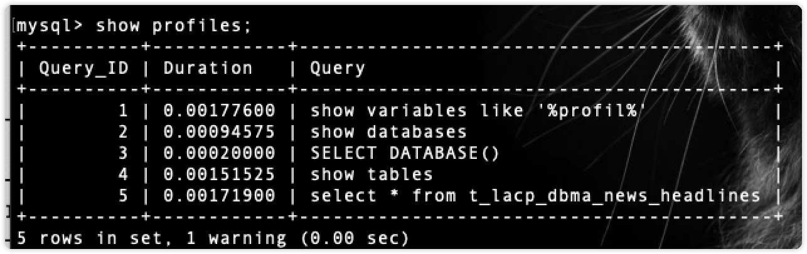

[toc]

## 服务器记录

### 2022-10-31 服务器挖矿病毒（solrd/genshin病毒）

【14:50】发现服务器Flink服务挂，手动重启失败

【14:55】top命令查看占用情况，发现CPU占用100%的进程‘solrd进程、genshin进程’

【14:55】尝试 `kill -9 pid` ，发现越杀越多

【15:00】尝试查看定时脚本：`crontab -l`,查找不到

####### 解决如下

- 登录华为云控制台，更改端口安全组为全部关闭，切换default安全组或手动关闭
- 使用 `top`命令，发现时不时出现 `solr.sh`脚本
- cd到根目录，使用 `tree |grep solr.sh`试图查找脚本位置
- cd 到脚本位置==/tmp/.solr/==
- rm -rf 所有病毒
- top查看挖矿脚本进程pid
- kill -9 手动杀死进程
- 暂时未出现重启，服务器恢复
- 手动重启Flink
- 服务恢复
- 开放端口安全组，关闭未使用端口


### 2022-11-01再次被挖矿病毒c3pool解决方案

- 查看进程pid尝试杀死进程

```bash
lsof -i
kill -9 +pid
```

- 无效，查看有无配置定时启动脚本

```bash
crontab -l # 查看定时脚本
ls /var/spool/cron   # 查看异常执行任务
rm -rf /var/spool/cron/* # 因为我没有配置过，所以直接删除全部
```

- 查看密码认证文件, 删除全部

```bash
ls /root/.ssh/* 
rm -rf /root/.ssh/*
```

- 修复SSH配置项

> 一般默认脚本中进行修改的 PermitRootLogin、RSAAuthentication、PubkeyAuthentication 为开启状态，需要修改的是密钥认证文件名，建议修改成默认值  AuthorizedKeysFile .ssh/authorized_keys 即可。修改完成后重启 sshd 服务，使配置生效即可。

```bash
vim /etc/ssh/sshd_config # 按照提示修改
/etc/init.d/ssh restart # 重启ssh服务
sudo systemctl restart ssh.service # 重启ssh服务，旧版可能没有该命令
```

- 修改服务器密码
- 重新配置ssh
- 查找异常开机脚本
- 查看开机启动脚本


- cd到 目录查看脚本


- 找到 `root/c3pool/xmrig`并删除所有
- 删除脚本

```bash
rm -rf /etc/systemd/system/c3pool_miner.service
rm -rf /root/c3pool
```

- 观察有没有异常进程是否重启
- CPU占用减小

## 学习记录

### 数据库

#### 小数点截取

```sql
select 0.99561;

-- 小数点后两位，四舍五入
select ROUND(0.99561,2);

-- 小数点后两位，向上取整
select CEIL(0.99561 * 100) / 100;

-- 小数点后两位，向下取整
select FLOOR(0.99561 * 100) / 100;

-- 小数点后两位，直接截断
SELECT TRUNCATE(0.99561, 2);

-- 四舍五入到小数点后两位，并把整数部分用逗号分割为3个一组
SELECT FORMAT(1234.99561,2);
```

#### MySQL查询当天、本周、本月、本季度、本年的数据

1.今天

```sql
SELECT * FROM 表名 WHERE TO_DAYS(时间字段名) = TO_DAYS(NOW());
```

2.昨天

```sql
SELECT * FROM 表名 WHERE TO_DAYS(NOW()) - TO_DAYS(时间字段名) <= 1;
```

3.本周

```sql
SELECT * FROM 表名 WHERE YEARWEEK(DATE_FORMAT(时间字段名,'%Y-%m-%d')) = YEARWEEK(NOW());
-- 查询数据显示的起始日期显示为星期日，所以可以指定起始日期
WHERE YEARWEEK(DATE_FORMAT(时间字段名,'%Y-%m-%d'),1) = YEARWEEK(NOW(),1);
```

4.上周

```sql
SELECT * FROM 表名 WHERE YEARWEEK(DATE_FORMAT(时间字段名,'%Y-%m-%d')) = YEARWEEK(NOW())-1;
```

5.近7天

```sql
SELECT * FROM 表名 WHERE DATE_SUB(CURDATE(), INTERVAL 7 DAY) <= DATE(时间字段名);
```

6.近30天

```sql
SELECT * FROM 表名 WHERE DATE_SUB(CURDATE(), INTERVAL 30 DAY) <= DATE(时间字段名);
```

7.本月

```sql
SELECT * FROM 表名 WHERE DATE_FORMAT(时间字段名,'%Y%m') = DATE_FORMAT(CURDATE(),'%Y%m');
```

8.上月

```sql
SELECT * FROM 表名 WHERE PERIOD_DIFF(DATE_FORMAT(NOW(),'%Y%m'),DATE_FORMAT(时间字段名,'%Y%m')) = 1;
```

```sql
SELECT * FROM 表名 WHERE DATE_FORMAT(时间字段名,'%Y%m') = DATE_FORMAT(CURDATE(),'%Y%m') ;
```

```sql
SELECT * FROM 表名 WHERE WEEKOFYEAR(FROM_UNIXTIME(时间字段名,'%y-%m-%d')) = WEEKOFYEAR(NOW());
```

```sql
SELECT * FROM 表名 WHERE MONTH(FROM_UNIXTIME(时间字段名,'%y-%m-%d')) = MONTH(NOW()); 
```

```sql
SELECT * FROM 表名 WHERE YEAR(FROM_UNIXTIME(时间字段名,'%y-%m-%d')) = YEAR(NOW()) AND MONTH(FROM_UNIXTIME(时间字段名,'%y-%m-%d')) = MONTH(NOW())；
```

9.近6个月

```sql
SELECT * FROM 表名 WHERE 时间字段名 BETWEEN DATE_SUB(NOW(),INTERVAL 6 MONTH) AND NOW();
```

10.本季度

```sql
SELECT * FROM 表名 WHERE QUARTER(时间字段名) = QUARTER(NOW());
```

11.上季度

```sql
SELECT * FROM 表名 WHERE QUARTER(时间字段名) = QUARTER(DATE_SUB(NOW(),INTERVAL 1 QUARTER));
```

12.本年

```sql
SELECT * FROM 表名 WHERE YEAR(时间字段名)=YEAR(NOW());
```

13.去年

```sql
SELECT * FROM 表名 WHERE YEAR(时间字段名) = YEAR(DATE_SUB(NOW(),INTERVAL 1 YEAR));
```

#### MySQL区别redolog和binlog

- `redolog`记录的是对于每个页的修改

  - 数据页地址、行地址、操作类型（I/D）、数据
  - e.g：一个update修改100行，至少产生200行redolog，所以DML产生的redolog可能很大
- `binlog`记录的是DML/DDL/DCL，不记录SELECT

  - 通过参数设计控制binlog的记录模式：

  > 语句模式：
  >
  > delete from t1 where id <=1000;
  >
  > 行模式：
  >
  > delete from t1 where id = 1;
  >
  > delete from t1 where id = 2;
  >
  > delete from t1 where id = 3;
  >
  > ……
  >
- 图解机制


- 表格对比
  |          | redolog          | binlog             |
  | -------- | ---------------- | ------------------ |
  | 日志作用 | 保护脏数据       | 数据库备份恢复使用 |
  | 引擎支持 | 只适合InnoDB引擎 | 所有引擎           |
  | 日志格式 | 物理日志         | 逻辑日志,SQL语句   |
  | 提交方式 | 快速提交         | 提交时一次性写入   |
  | 保存形式 | 会被循环覆盖     | 长期保存           |

#### MySQL binlog关注点

- 开启binlog

```mysql
# 查看是否开启
mysql> show variables like 'log_bin';
+---------------+-------+
| Variable_name | Value |
+---------------+-------+
| log_bin       | ON    |
+---------------+-------+
1 row in set (0.01 sec)

# 如果未开启
+---------------+-------+
| Variable_name | Value |
+---------------+-------+
| log_bin       | OFF   |
+---------------+-------+
1 row in set (0.01 sec)

# 使用命令开启
mysql> set @@global.log_bin=on;
```

**可能的错误**

```mysql
# 1238
ERROR 1238 (HY000): Variable 'log_bin' is a read only variable
-- 修改配置文件my.cnf,在[mysqld]下添加：
server-id=1
log-bin=mysql-bin
-- 重启mysql
```

- binlog的存放

```mysql
mysql> show variables like 'log_bin%';
+---------------------------------+------------------------------------+
| Variable_name                   | Value                              |
+---------------------------------+------------------------------------+
| log_bin                         | ON                                 |
| log_bin_basename                | /usr/local/mysql/data/binlog       |
| log_bin_index                   | /usr/local/mysql/data/binlog.index |
| log_bin_trust_function_creators | OFF                                |
| log_bin_use_v1_row_events       | OFF                                |
+---------------------------------+------------------------------------+
5 rows in set (0.00 sec)

```

`log_bin`:binlog是否开启

`log_bin_basename`:binlog文件，每次重启会生成一个新的文件

`log_bin_index`:二进制索引文件，记录使用的binlog文件名

`log_bin_trust_function_creators`:控制是否可以新人存储函数创建者，详见[官方文档](https://dev.mysql.com/doc/refman/5.6/en/replication-options-binary-log.html#sysvar_log_bin_trust_function_creators)

`log_bin_use_v1_row_events`:控制binlog中的Rows_log_event的格式，如果这个值开启，就用v1版本的格式，默认是关闭，采用v2版本格式，详见[官方文档](https://dev.mysql.com/doc/refman/5.6/en/replication-options-binary-log.html#sysvar_log_bin_use_v1_row_events)

- 手动切换binlog
  - 重启数据库，每次重启会新切换一个binlog
  - mysql>flush logs;
- 查看binlog日志文件

```shell

```

- 判断binlog_cache_size是否设置过小的依据，如果Binlog_cache_disk_use > 0,说明事务未提交， binlog在用户工作的空间存放不下，需要借用tmp目录

```mysql
mysql> show global status like 'Binlog_cache_disk_use';
+-----------------------+-------+
| Variable_name         | Value |
+-----------------------+-------+
| Binlog_cache_disk_use | 0     |
+-----------------------+-------+
1 row in set (0.03 sec)
```

- log_bin
  - ==—log-bin[=file_name]==:设置此参数表示启用binlog，并指定路径名称
  - ==sql_log_bin==:会话级别的binlog开关控制，默认是开启的，可以在当前会话级别动态修改临时关闭binlog（主从延迟优化），set session sql_log_bin=0;
- sync_binlog
  - 0：默认，提交同步到文件系统缓存
  - 1：commit，通过fsync方式，直接写入disk的binlog文件中，与redo的双一模式。
  - 1&lt;:在意外发生时，就表示会有N-1个dml没有被写入binlog中，有可能会发生主从数据不一致的问题。

> MySQL双1配置：
>
> `innodb_flush_log_at_trx_commit`是 `innodb`引擎配置，`sync_binlog`是MySQL引擎上层配置，都是控制磁盘写入策略
>
> `MySQL innoDB`引擎在commit之后：
>
> 1. binlog写内存
> 2. redolog写内存
> 3. 根据这两个配置绝对这两个日志是否刷盘
> 4. commit
>
> `innodb_flush_log_at_trx_commit`：redo log的刷盘策略，默认为1
>
> - 如果该值设置为0：`log buffer`将每一秒写入 `log file`	中，并且 `log file`中的flush（刷到磁盘）操作同时进行。该模式下，在实务提交时，**不会主动触发写入磁盘的操作**
> - 如果该值设置为1：每次事务提交的时候，mysql都会把 `log buffer`的数据写入 `log file`，**并且flush（刷到磁盘）中**
> - 如果该值设置为2：每次事务提交时候，Mysql都会把 `log buffer`的数据写入 `log file`，但是flush（刷到磁盘）的操作不会通知执行，**mysql每一秒执行一次flush**
>
> `sync_binlog`:binlog的刷盘策略，默认0
>
> - 如果该值为0：mysql不会同步到磁盘中去而是依赖操作系统判断刷新 `binary log`
> - 如果该值为n：mysql在**每写N次**二进制文件日志 `binary log`时，会使用 `fdatasync()`函数将他写入二进制日志 `binary log`同步到磁盘
>
> 双1模式中，开启 `innodb_support_xa`=1：分布式事务更加安全
>
> 1. 保证binlog里面存放的事务一定在redo log中
> 2. 保证binlog里的事务顺序和redo log事务顺序一致
> 3. commit，要么成功要么失败

- max_binlog_size

  - binlog文件大小，默认1G
  - 如果是row模式，需要增加binlog文件的大小，因为行模式产生的日志量相对较大。如果超过了该值，就会产生新的日志文件，后缀名+1，并且记录到.index文件里面去。
- Binlog_format

  - row、statement、mixed，设置binlog记录的模式：行模式、语句模式、mixed模式。动态参数，可以会话级别修改
- –binlog-do-db/–binlog-ingore-db

  - command-line format，表示需要写入或者忽略写入那些库的日志，默认为空，表示可以将所有库的日志写入到二进制文件中
- log-slave-updates

  - 启动从机服务器上的slave日志功能，使这台计算机可以用来构成一个镜像链(A->B->C)，可以让从库上面产生二进制日志文件，在从库上挂载一个从库。
- binlog_rows_query_log_events

  - 定位执行过的SQL语句
- expire_log_days

  - binlog过期清理时间，默认是0:不自动清除
  - binlog的删除策略，假设值为5，表示系统保留5天binlog

  > 1. 删除策略的风险：
  >
  >    1. 删除会导致过高的io，从而到账业务出现性能抖动
  >    2. 主从延迟
  > 2. 解决：手动删除binlog
  >
  >    PURGE BINARY LOGS #同时删除binlog文件和binlog索引文件记录，如此说来用rm删除binlog和vim修改对应的binlog索引文件记录，效果同purge
  >
  > ```mysql
  > Syntax:
  > 　　PURGE { BINARY | MASTER } LOGS
  > 　　{ TO 'log_name' | BEFORE datetime_expr }
  > mysql> PURGE BINARY LOGS TO 'mysql-bin.000003';　　#删到3，也就是删了1、2。
  > ```
  >

#### MySQL binlog_format有哪些

1. STATEMENT

   `<font color=#ffcaacf>`每一条会修改数据的SQL都会记录在binlog中`</font>`

   `<font color=red>`优点`</font>`：不需要记录每一行的变化，减少了binlog的日志量，节约了IO提高性能。只需要记录在master上所执行的语句的细节，以及上下文信息。

   `<font color=red>`缺点`</font>`：只是记录了执行语句，为了这些与局可以在slave上运行，还需要记录每条语句在执行的时候的一些相关信息，保证语句能在slave得到和master执行时候同样的结果。像一些特定的函数工嗯呢该，slave与master上保持一致会有很多的相关问题，如sleep函数rand函数等会出现相关问题warning
2. ROW

   `<font color=#ffcaacf>`不记录sql语句的上下文相关信息，仅保存那条记录被修改，也就是日志中会记录成每一行数据被修改的形式，然后再slave端对相同的数据修改`</font>`

   `<font color=red>`优点`</font>`：binlog中可以不记录执行sql语句的上下文信息，仅需要记录那一条记录被修改成什么了。所以row level的日志内容会非常清晰的记录每一行数据的修改细节。不会出现某些特定情况下的存储过程，或者function，以及trigger的调用和触发无法被正确复制的问题。

   `<font color=red>`缺点`</font>`：所有执行的语句当记录到日志中的时候，都将以每行记录的修改来记录，这样会产生大量日志
3. MIXED

   `<font color=#ffcaacf>`上面两种等级的混合模式`</font>`

   一般的语句修改使用statment格式保存binlog，如一些函数，statement无法完成主从复制操作，则采用row格式保存binlog，MySQL会根据执行的每一条具体的SQL语句来区分对待记录的日志形式，也就是Statement和row之间选一种。

新版本的mysql对row模式也做了优化，并不是所有的修改都会以row来记录，遇到表结构变更的时候会以statenment的模式来记录。其他修改还是记录所有行变更。

#### MySQL binglog的使用

1. 二进制日志的两个最重要的使用场景

   1. mysql replication在master端开启binlog，master把他的二进制日志传递给slaves来达到master-slave数据一致的目的，也就是主从备份
   2. 数据恢复，通过使用mysqlbinlog工具回复数据
2. 常用binlog日志操作命令

   1. 查看所有binlog日志列表

   ```mysql
   mysql> show master logs;
   ```

   2. 查看master状态，即最后一个binlog日志标号名称，和最后一个操作事件pos结束点（Position）值

   ```mysql
   mysql> show master status;
   ```

   3. 刷新log日志，此刻开始产生一个新的编号的binlog日志文件

   ```mysql
   mysql> flush logs;
   ```

   4. 清空所有binlog日志

   ```mysql
   mysql> reset master;
   ```
3. 查看binlog体质内容

   1. OS层查看

      ```shell
      ➜  ~ mysqlbinlog -vv myqsl-bin.000001
      ```
   2. 数据库层面

      ```mysql
      mysql> show binlog events [IN 'logname'] [FROM pos] [LIMIT[offset]row_count];
      ```

      *解析*

      1. log_name：指定要查询的binlog文件名
      2. from pos：指定从哪个pos起始点开始查起
      3. limit：偏移量
      4. row_count:：查询总条数

```mysql
mysql> show binlog events limit 1\G
*************************** 1. row ***************************
   Log_name: binlog.000001
        Pos: 4
 Event_type: Format_desc
  Server_id: 1
End_log_pos: 126
       Info: Server ver: 8.0.29, Binlog ver: 4
1 row in set (0.00 sec)
```

4. 从binlog日志恢复语法

```shell
~ mysqlbinlog [选项] mysql-bin.0000XX | mysql -u用户名 -p密码 数据库名

--start-position=953 起始点pos
--stop-position=1437 结束点pos
--start-datetime="2022-4-1 16:05:00" 起始时间点
--stop-datetime="2022-5-1 16:05:00" 结束时间点
--database=TEST 指定TEST数据库(一台主机上往往有多个数据库)
```

#### MySQL 查询性能分析

**explain查看执行计划**


**利用Profile配置**

**1.查看Profile配置**

```mysql
show variables like '%profil%'
```


> `have_profiling` 表示是否支持profile功能，YES表示支持
>
> `profiling` 表示是否开启profile功能，ON开启，OFF关闭，默认是关闭状态
>
> `profiling_history_size` 表示保存最近15条历史数据

**2.开启Profile功能**

```mysql
# 修改的配置只会在当前会话生效
set profiling=1;
```


**3.使用Profile**

执行一个时间长的数据

```mysql
select * from t_lacp_dbma_news_headlines;
```


所有执行过的语句会被记录到 `Profile`中，包括失败的SQL语句

可以使用 `show profiles`命令查看：

> Query_ID 表示自动分配的查询ID，顺序递增。
>
> Duration 表示SQL语句执行耗时
>
> Query 表示SQL语句内容

使用Query_ID进一步查询Profile中的情况

```mysql
show profile for query 5;
```


可以对该语句进行扩展，进一步分析CPU和Block io的使用情况

```mysql
show profile cpu,block io for query 5;
```


> 所有**Profile**的历史数据都被记录在 `information_schema.prodfiling`表中

```mysql
select * from information_schema.profiling where Query_ID=5;
```


> 每次执行一条SQL语句都会有一条 `warning`信息

```mysql
show warnings;
```


```sql
-- 'INFORMATION_SCHEMA.PROFILING' is deprecated and will be removed in a future release. Please use Performance Schema instead 
-- “INFORMATION_SCHEMA。已弃用“PROFILING”，并将在未来的版本中删除。请改用性能架构
```

意思是 `PROFILING`已弃用。


#### MySQL的索引潜水

**索引潜水 `Index dive`**

相关参数 `eq_range_index_dive_limit`

预估扫描行数如下图所示

> 这个值的意思是，当where语句in的条件中参数的个数小于这个值的时候，MySQL就采取**索引潜水（Index dive）**的形式扫描行数，非常准确；
>
> 当Where语句中in条件中的参数个数大于这个值的时候，MySQL会采取另一种方式统计**索引统计（index statistics）**预估扫描行数，误差较大


**当查询条件达到10个时，预估行数变得不准确。**


> 为什么不都使用**索引潜水（Index dive）** 的方式预估扫描行数，不好吗？
>
> —>基于成本的考虑，**索引潜水**估算成本较高，适合小数据量。**索引统计**估算成本较低，适合大数据量。
>
> 注：**MySQL5.7.3**之前的版本，这个值默认是10，之后的版本，这个值默认是200。

可以使用

```mysql
# 查看该配置值的大小
show variables like '%eq_range_index_dive_limit%'
# 手动更改指定的值
set eq_range_index_dive_limit=200;
```

#### MySQL Explain 详细说明

==以下内容来自于网络汇总，如有错误，立即更改╮(￣▽￣)╭==

`explain`可以用来分析SQL语句的执行计划；


explain出来的信息有10列，分别是id、select_type、table、type、possible_keys、key、key_len、ref、rows、Extra,下面对这些字段出现的可能进行解释：

一、 **id**

> **我的理解是SQL执行的顺序的标识,SQL从大到小的执行**

1. id相同时，执行顺序由上至下
2. 如果是子查询，id的序号会递增，id值越大优先级越高，越先被执行
3. id如果相同，可以认为是一组，从上往下顺序执行；在所有组中，id值越大，优先级越高，越先执行

**二、select_type**

> **表示示查询中每个select子句的类型**

(1) SIMPLE(简单SELECT,不使用UNION或子查询等)

(2) PRIMARY(查询中若包含任何复杂的子部分,最外层的select被标记为PRIMARY)

(3) UNION(UNION中的第二个或后面的SELECT语句)

(4) DEPENDENT UNION(UNION中的第二个或后面的SELECT语句，取决于外面的查询)

(5) UNION RESULT(UNION的结果)

(6) SUBQUERY(子查询中的第一个SELECT)

(7) DEPENDENT SUBQUERY(子查询中的第一个SELECT，取决于外面的查询)

(8) DERIVED(派生表的SELECT, FROM子句的子查询)

(9) UNCACHEABLE SUBQUERY(一个子查询的结果不能被缓存，必须重新评估外链接的第一行)

**三、table**

> 显示这一行的数据是关于哪张表的，有时不是真实的表名字,看到的是derivedx(x是个数字,我的理解是第几步执行的结果)

```
mysql> explain select * from (select * from ( select * from t1 where id=2602) a) b;
+----+-------------+------------+--------+-------------------+---------+---------+------+------+-------+
| id | select_type | table      | type   | possible_keys     | key     | key_len | ref  | rows | Extra |
+----+-------------+------------+--------+-------------------+---------+---------+------+------+-------+
|  1 | PRIMARY     | <derived2> | system | NULL              | NULL    | NULL    | NULL |    1 |       |
|  2 | DERIVED     | <derived3> | system | NULL              | NULL    | NULL    | NULL |    1 |       |
|  3 | DERIVED     | t1         | const  | PRIMARY,idx_t1_id | PRIMARY | 4       |      |    1 |       |
+----+-------------+------------+--------+-------------------+---------+---------+------+------+-------+
```

**四、type**

表示MySQL在表中找到所需行的方式，又称“访问类型”。

> 常用的类型有： **ALL, index, range, ref, eq_ref, const, system, NULL（从左到右，性能从差到好）**

ALL：Full Table Scan， MySQL将遍历全表以找到匹配的行

index: Full Index Scan，index与ALL区别为index类型只遍历索引树

range:只检索给定范围的行，使用一个索引来选择行

ref: 表示上述表的连接匹配条件，即哪些列或常量被用于查找索引列上的值

eq_ref: 类似ref，区别就在使用的索引是唯一索引，对于每个索引键值，表中只有一条记录匹配，简单来说，就是多表连接中使用primary key或者 unique key作为关联条件

const、system: 当MySQL对查询某部分进行优化，并转换为一个常量时，使用这些类型访问。如将主键置于where列表中，MySQL就能将该查询转换为一个常量,system是const类型的特例，当查询的表只有一行的情况下，使用system

NULL: MySQL在优化过程中分解语句，执行时甚至不用访问表或索引，例如从一个索引列里选取最小值可以通过单独索引查找完成。

**五、possible_keys**

> **指出MySQL能使用哪个索引在表中找到记录，查询涉及到的字段上若存在索引，则该索引将被列出，但不一定被查询使用**

该列完全独立于EXPLAIN输出所示的表的次序。这意味着在possible_keys中的某些键实际上不能按生成的表次序使用。
如果该列是NULL，则没有相关的索引。在这种情况下，可以通过检查WHERE子句看是否它引用某些列或适合索引的列来提高你的查询性能。如果是这样，创造一个适当的索引并且再次用EXPLAIN检查查询

**六、Key**

> **key列显示MySQL实际决定使用的键（索引）**

如果没有选择索引，键是NULL。要想强制MySQL使用或忽视possible_keys列中的索引，在查询中使用FORCE INDEX、USE INDEX或者IGNORE INDEX。

**七、key_len**

> **表示索引中使用的字节数，可通过该列计算查询中使用的索引的长度（key_len显示的值为索引字段的最大可能长度，并非实际使用长度，即key_len是根据表定义计算而得，不是通过表内检索出的）**

不损失精确性的情况下，长度越短越好

**八、ref**

> **表示上述表的连接匹配条件，即哪些列或常量被用于查找索引列上的值**

**九、rows**

> **表示MySQL根据表统计信息及索引选用情况，估算的找到所需的记录所需要读取的行数**

**十、Extra**

> **该列包含MySQL解决查询的详细信息,有以下几种情况：**

Using where:列数据是从仅仅使用了索引中的信息而没有读取实际的行动的表返回的，这发生在对表的全部的请求列都是同一个索引的部分的时候，表示mysql服务器将在存储引擎检索行后再进行过滤

Using temporary：表示MySQL需要使用临时表来存储结果集，常见于排序和分组查询

Using filesort：MySQL中无法利用索引完成的排序操作称为“文件排序”

Using join buffer：改值强调了在获取连接条件时没有使用索引，并且需要连接缓冲区来存储中间结果。如果出现了这个值，那应该注意，根据查询的具体情况可能需要添加索引来改进能。

Impossible where：这个值强调了where语句会导致没有符合条件的行。

Select tables optimized away：这个值意味着仅通过使用索引，优化器可能仅从聚合函数结果中返回一行

#### MySQL查询性能对比

**1.inner join 筛选顺序对比**

**第一组**


**第二组**


**SQL的执行顺序**

==来自于知乎，侵权删==


**网络查询到的说法**

对于等值链接 `inner join`ABC三张表都是通过笛卡尔积的形式关联，然后再进行筛选操作，但是对于大数据量来讲，全表进行笛卡尔积难道不会造成很大问题么

> 网络说法：**Mysql会优化SQL语句进行重新排列，对于一条数据来讲，会贯穿这条数据进行ABC三表，然后再返回，不是先笛卡尔积，再返回**

所以尽量选择驱动表数据量相对较少的列进行join

> 何谓驱动表，指多表关联查询时，第一个被处理的表，亦可称之为基表，然后再使用此表的记录去关联其他表。驱动表的选择遵循一个原则：在对最终结果集没影响的前提下，优先选择结果集最少的那张表作为驱动表。这个原则说的不好懂，结果集最少，这个也许我们能估出来，但对最终结果集不影响，这个就不好判断了，难归难，但还是有一定规律的

### Flink

#### 【Flink 1.15.1】设置kafka Consumer的offset自动提交


```java
setProperty("enable.auto.commit", "true")  // 自动周期性提交
setProperty("auto.commit.interval.ms", "1000") // 1秒
```

### 网络

#### 自己的设备是如何获得ip的？

**DHCP协议**（**D**ynamic **H**ost **C**onfiguration **P**rotocol，**动态主机配置协议**）

1. 设备链接网络，联网后会通过DHCP协议动态申请一个IP，同时获得子网掩码和路由器地址等信息
2. DHCP分四个阶段

   - Discover，Offer， Request和ACK
   - 如果是第一次链接则会完整走四个过程
   - 如果不是第一次连接，机器会记录曾经使用的IP，再次连接时用原来的IP去请求，因此不一定每次都会完整走四个流程
3. DHCP是应用层协议，需要支持广播功能，所以底层使用的是UDP协议，用TCP则太慢了
4. DHCP分配的IP是可能重复的，因为会有部分手动配置的IP
5. 在根据DHCP协议得到IP后，机器还会广播发送3次ARP通告，在确认没有冲突后，会使用该IP


### Hive

#### 允许用户在创建表时指定多字符字符串作为字段分隔符。

> 参考文献：[MultiDelimitSerDe](https://cwiki.apache.org/confluence/display/Hive/MultiDelimitSerDe)

`org.apache.hadoop.hive.contrib.serde2.multidelimitserde` 是 Hive 中的一个 SerDe（Serializer/Deserializer），用于处理多分隔符的数据。

在 Hive 中，数据通常以结构化的表格形式存储在 HDFS 上，但有些数据可能不是以固定分隔符分隔的。例如，一些日志文件可能使用多个分隔符进行分割。在这种情况下，可以使用 `multidelimitserde` SerDe 来处理此类数据。

`multidelimitserde` SerDe 可以处理多个分隔符，并将每行数据解析成一个数组。您可以指定多个分隔符，并使用 Hive 中的 `ROW FORMAT SERDE` 子句将 SerDe 应用于表格的特定列。示例代码如下：

```sql
CREATE TABLE example_table (
  column1 STRING,
  column2 ARRAY<STRING>
)
ROW FORMAT SERDE 'org.apache.hadoop.hive.contrib.serde2.multidelimitserde'
WITH SERDEPROPERTIES (
  "input.delimiter" = "|~|",
  "output.format.string" = "%1$s %2$s"
)
STORED AS TEXTFILE;
```

在这个示例中，我们创建了一个名为 `example_table` 的 Hive 表格，其中包含两列：`column1` 和 `column2`。`column1` 是一个字符串类型的列，而 `column2` 是一个字符串数组类型的列。我们使用 `multidelimitserde` SerDe 处理 `column2` 列，同时指定了分隔符为 `|~|`。`SERDEPROPERTIES` 子句用于指定 SerDe 的属性。在本例中，我们指定了输入分隔符和输出格式字符串。


### Java

#### JDK 17新增密封类

已知的限制java类被集成的方法有

1. `final`修饰类，这样类就无法被继承了
2. `package-private`类（非public类），可以控制只能被同一个包下的类继承

**粒度不够细，不能控制到具体的哪个类无法继承**

新增的控制方法关键字如下：

- `sealed`：修饰类/接口，用来描述这个类/接口为密封类/接口
- `non-sealed`：修饰类/接口，用来描述这个类/接口为非密封类/接口
- `permits`：用在`extends`和`implements`之后，指定可以继承或实现的类

> 举例如下：
>
> 如，类之间有如下关系：
>
> `Hero`–`TankHero`–`Alistar`
>
> 而我们不想让类（`Hero`）被其他二级类继承，单需要被类（`TankHero`）继承，可以使用如下：
> ```java
> public sealed class Hero permits TankHero {
> 
> }
> ```
>
> 继承的类需要选择是否沿用这个密封关系，类（`TankHero`）可以在后续迭代增加，则需要非密封，定义如下：
> ```java
> public non-sealed class TankHero extends Hero {
> 
> }
> ```
>
> 对于更加细化的类（`Alistar`），已经是最终实现了，就使用`final`关键字
>
> ```java
> public final class Ezreal extends AttackHero {
> 
> }
> ```


#### Java 正则表达式 appendReplacement() 和 appendTail() 的用法

> - matcher.appendReplacement(sb, replaceContent);
> - matcher.appendTail(sb);
>
> `appendReplacement()` sb是一个StringBuffer，replaceContent是需要替换成的字符串，这个方法会把matcher匹配到的内容替换成replaceContent，并且吧不同次替换之间的字符串内容也拿到，然后，加上这次替换的结果一起追加到sb中。
>
> `appendTail()` sb是一个StringBuffer，这个方法会把matcher最后一次匹配到内容之后的字符串追加到sb中

**两个方法配合使用，就可以完成==替换所有==或者==替换某些个==这种功能**

```java
// 替换所有满足匹配条件字符
while(matcher.find()) {
		matcher.appendReplacement(sb,replaceContext);
}
matcher.appendTail(sb);

// 替换前三次满足条件的字符
for (int i = 0; i < 3; i++) {
  	if (matcher.find()) {
      	matcher.appendReplacement(sb,replaceContext);
    }
}
matcher.appendTail(sb);
```

**举例：**

```java
import java.util.regex.Matcher;
import java.util.regex.Pattern;

public class Main {
    private static String REGEX = "a*b";
    private static String INPUT = "aabfooaabfooabfoobbkkk";
    private static String REPLACE = "-";

    public static void main(String[] args) {
        Pattern p = Pattern.compile(REGEX);
        // 获取Pattern对象
        Matcher m = p.matcher(INPUT);
        StringBuffer sb = new StringBuffer();
        while(m.find()) {
            m.appendReplacement(sb,REPLACE);
            System.out.println("执行了一次替换==>"+sb.toString());
        }
        m.appendTail(sb);
        System.out.println("最后结果==>"+sb.toString());
        System.out.println("原始字符串==>"+INPUT);
    }
}
```

#### 读取Excel文件转化成json格式字符串

> 引入线程池优化多sheet下的读取，`MemorySafeLinkedBlockingQueue`为自建的内存安全的阻塞队列，可以使用普通的阻塞队列

```java
/**
 * @ClassName ExcelUtil
 * @Author 陈新予
 * @Date 2022/11/21 14:53
 * @Version 1.0
 */
public class ExcelUtil {

    /**
     * excel格式文件转换成json字符串，多sheet下支持并发写入
     * @param fileLink 文件路径
     * @param sheetSize shell大小,默认1
     * @param minReadRow 最小读取行数，为null则读取全部
     * @return json字符串
     */
    @SuppressWarnings("all")
    public static String excel2Json(String fileLink, Integer sheetSize, Integer minReadRow) {
        if (sheetSize == null) {
            sheetSize = 1;
        }
        long start = System.currentTimeMillis();
        // 构造一个线程池，最大并行5个sheet
        ThreadPoolExecutor threadPoolExecutor = new ThreadPoolExecutor(
                5,
                Integer.MAX_VALUE,
                10000,
                TimeUnit.SECONDS,
                new MemorySafeLinkedBlockingQueue<>() // 使用自建的内存安全的阻塞队列
        );
        // 返回一个map类型的返回值json
        ConcurrentHashMap<Integer,List<HashMap<String,String>>> resSheet = new ConcurrentHashMap<>();
        XSSFWorkbook workbook;
        try {
            InputStream targetXlsx = new FileInputStream(fileLink);
            workbook = new XSSFWorkbook(targetXlsx);
            for(int sheetNum = 0; sheetNum < sheetSize; sheetNum++) {
                int finalSheetNum = sheetNum;
                // 开一个线程池多线程跑多个sheet的情况
                threadPoolExecutor.submit(() -> {
                    // 保存列名称
                    ArrayList<String> rowNameList = new ArrayList<>();
                    // 保存map节点
                    List<HashMap<String,String>> rowList = new ArrayList<>();
                    XSSFSheet sheet = workbook.getSheetAt(finalSheetNum);
                    XSSFRow rowName = sheet.getRow(0);
                    short lastCellNum = rowName.getLastCellNum();
                    // 读取第一行的列名称
                    for(int i = 0; i < lastCellNum; i++) {
                        rowNameList.add(String.valueOf(rowName.getCell(i)));
                    }
                    int lastRowNum;
                    if (minReadRow == null) { // 设置最小读取
                        lastRowNum = sheet.getLastRowNum();
                    } else {
                        // 剩余的行数
                        lastRowNum = minReadRow;
                    }
                    // 读取剩余的行，并拼接到map中;
                    for(int i = 1; i < lastRowNum; i++) {
                        // 用一个map保存
                        HashMap<String,String> resNode = new HashMap<>();
                        // 读取行数据
                        XSSFRow row = sheet.getRow(i);
                        for(int j = 0; j < row.getLastCellNum(); j++) {
                            resNode.put(rowNameList.get(j), String.valueOf(row.getCell(j)));
                        }
                        // 加入列表中
                        rowList.add(resNode);
                    }
                    resSheet.put(finalSheetNum, rowList);
                });
            }
            while (resSheet.size() < sheetSize) {}
            threadPoolExecutor.shutdown();
            System.err.println("总耗时：" + (System.currentTimeMillis() - start));
            return JsonUtil.getJackson().writeValueAsString(resSheet);
        } catch (IOException e) {
            e.printStackTrace();
            return null;
        }
    }
}
```

#### 可数循环造成的GC问题

> 在jdk8中，这个问题还存在。而其他版本例如11和17中，这个问题已经被JVM优化过了。

样例代码：

```java
public class MainTest {

    public static AtomicInteger num = new AtomicInteger(0);

    public static void main(String[] args) throws InterruptedException {
        Runnable runnable=()->{
            for (int i = 0; i < 1000000000; i++) {
                num.getAndAdd(1);
            }
            System.out.println(Thread.currentThread().getName()+"执行结束!");
        };

        Thread t1 = new Thread(runnable);
        Thread t2 = new Thread(runnable);
        t1.start();
        t2.start();
        Thread.sleep(1000);
        System.out.println("num = " + num);
    }
}
```

从上述代码分析，想要的应该是应该在主线程 `sleep(1000)`后就应该输出 `num`的值，但是实际的运行结果却是主线程在等待t1和t2执行结束后才输出了num的值：

```java
JNI global references: 319

Heap
 PSYoungGen      total 76288K, used 15236K [0x000000076ab00000, 0x0000000770000000, 0x00000007c0000000)
  eden space 65536K, 23% used [0x000000076ab00000,0x000000076b9e1378,0x000000076eb00000)
  from space 10752K, 0% used [0x000000076f580000,0x000000076f580000,0x0000000770000000)
  to   space 10752K, 0% used [0x000000076eb00000,0x000000076eb00000,0x000000076f580000)
 ParOldGen       total 175104K, used 0K [0x00000006c0000000, 0x00000006cab00000, 0x000000076ab00000)
  object space 175104K, 0% used [0x00000006c0000000,0x00000006c0000000,0x00000006cab00000)
 Metaspace       used 4187K, capacity 4718K, committed 4992K, reserved 1056768K
  class space    used 466K, capacity 533K, committed 640K, reserved 1048576K

Thread-1执行结束!
Thread-0执行结束!
num    =    2000000000
```

造成这样问题的原因就是因为可数循环（Counted Loop）

**上述代码中 `for(int i....;...;....)`就是一个可数循环**

> JVM在 `Safepoint`的放置上基本上是通过**是否让程序长时间执行的特征**为标准制定的。但是虽然上述的循环数特别大，但是JVM却是通过值类型去判断的，`int`或更小的类型产生的循环就会被判断为**可数循环**，默认不会放置安全点 `safepoint`

对于 `safepoint`，JVM解释如下


解决方案：

1. 选用大类型的变量：`long`
2. 手动放置安全点

第一个方法比较简单只需要将int改为long

```java
public static AtomicInteger num = new AtomicInteger(0);

public static void main(String[] args) throws InterruptedException {
  Runnable runnable = () -> {
    for (long i = 0; i < 1000000000; i++) {
      num.getAndAdd(1);
    }
    System.out.println(Thread.currentThread().getName() + "执行结束!");
  };

  Thread t1 = new Thread(runnable);
  Thread t2 = new Thread(runnable);
  t1.start();
  t2.start();
  Thread.sleep(1000);
  System.out.println("num = " + num);
}

// 运行结果
num = 47191826 // 1000ms后输出了num
Thread-1执行结束!
Thread-0执行结束!
```

对于第二个方法，网上有如下的解释


简单理解就是，一个线程在运行**本地Native方法**后，返回java线程后，必须进行一次safepoint检测

所以：正在执行native的函数进程可以看做是**已经进入了safepoint**，或者是叫做**在saferegion里**

那么解决还可以这样：

```java
public static AtomicInteger num = new AtomicInteger(0);

public static void main(String[] args) throws InterruptedException {
  Runnable runnable = () -> {
    for (int i = 0; i < 1000000000; i++) {
      num.getAndAdd(1);
      // prevent gc
      if (i % 1000 == 0) {
        try {
          Thread.sleep(0);
        } catch (InterruptedException e) {
          e.printStackTrace();
        }
      }
    }
    System.out.println(Thread.currentThread().getName() + "执行结束!");
  };

  Thread t1 = new Thread(runnable);
  Thread t2 = new Thread(runnable);
  t1.start();
  t2.start();
  Thread.sleep(1000);
  System.out.println("num = " + num);
  
  // 结果
num = 42007955 // 1000ms后输出了num
Thread-1执行结束!
Thread-0执行结束!
```

**同样达到了结果**

## Bug记录

### 使用httpclient请求get请求时参数包含 `>`号报错

> 特殊字符诸如+?%#&=/等都会被当做转义字符处理，这样的话请求路径的参数就不对了

**解决方案1**

去掉特殊报错的字符

**解决方案2**

使用转义字符

```te
空格 用%20代替
" 用%22代替
# 用%23代替
% 用%25代替
& 用%26代替
( 用%28代替
) 用%29代替
+ 用%2B代替
, 用%2C代替
/ 用%2F代替
: 用%3A代替
; 用%3B代替
< 用%3C代替
= 用%3D代替
> 用%3E代替
? 用%3F代替
@ 用%40代替
\ 用%5C代替
| 用%7C代替
```

### MySQL使用 `union all `合并SQL语句时导致 `order by`排序不生效的问题

> **原因：**union all的执行比order by优先级高，在直接使用时候，order by会被MySQL的优化器干掉

```sql
(
  select 
  		a.col as v1
  from 
  		db.table as a
  where 
  		a.col like '1'
  order by a.id desc
)
union all
(
  select 
  		a.col as v1
  from 
  		db.table as a
  where 
  		a.col = '2'
)
```

**解决方式1**

`通过Limit加在order by后面，使得优化器不会优化order by `

```sql
-- 修改为
(
  select 
  		a.col as v1
  from 
  		db.table as a
  where 
  		a.col like '1'
  order by a.id desc
  limit 99999
)
union all
(
  select 
  		a.col as v1
  from 
  		db.table as a
  where 
  		a.col = '2'
)
```

**解决方式2**

先查询后排序

union两个表的顺序加入一个od字段来保证, 然后再按照原本的逻辑进行排序

```sql
-- 修改为
SELECT * FROM (
   (
   select 
   		a.col as v1,
   		0 as od
   from 
      db.table as a
   where 
      a.col like '1'
   ) t1
union all
   (
   select 
   		a.col as v1,
   		1 as od
   from 
      db.table as a
   where 
      a.col = '2'
   ) t2
) t3 ORDER BY od, t1.id;
```

## 操作类/设置类/软件版本

### macos更新系统后出现IDEA崩溃无法打开git无法使用

`IDEA`

- 方法一：报错信息有idea.vmoptions报错路径的，到改路径下创建文件，并删除其他配置文件中的idea.vmoptions

```url
可能路径1：
/Users/{用户名}/Library/Application Support/JetBrains/IntelliJIdea2022.3
可能路径2：
/Users/chenxinyu/Library/Caches/JetBrains/IntelliJIdea2022.3
```

- 方式二：卸载重装

`Git`

报错如下：


尝试重装Xcode command line

```bash
xcode-select --install
```

如果失败去Apple官网手动下载


### IDEA中Maven无法添加原型

> **描述**：在创建Flink项目时，想使用原型archetype (flink-quickstart-java/flink-quickstart-scala)，但是发现archetype列表中没有这两项。然后想通过Add Archetype自行添加。但是，当点击Add Archetype，并输入所有参数后，并没有出现新添加的archetype项。
>
> **原因**：版本IDEA的一个小bug。它将在2021.3版本更新中修复（不靠谱，网上很多人反映2021.3 EAP版本依旧无法添加新的Maven原型，其他版本不清楚了）。

**解决方式1**

使用Maven命令生成

```shell
$ mvn archetype:generate \
  -DarchetypeGroupId=org.apache.flink \
  -DarchetypeArtifactId=flink-quickstart-java \
  -DarchetypeVersion=1.16-SNAPSHOT
  
# 按需求输入GroupId，artifactId，package名字
```

**解决方式2**

1. 选择【File】 > 【Settings】 > 【Build, Execution, Deployment】 > 【Build Tools】 > 【Maven】 > 【Repositories】；
2. 选中每个url，点击【update】按钮。如下图所示：


3. 解决：更新完毕后，再重新创建Maven项目，可以看到Flink的archetype原型列表了


### 远程访问数据库，出现中文乱码情况

查看远程数据库解码方式

```mysql
show variables like '%character%';
```

```zsh
+--------------------------+-----------------------------------------------------------------+
| Variable_name            | Value                                                           |
+--------------------------+-----------------------------------------------------------------+
| character_set_client     | latin1                                                          |
| character_set_connection | latin1                                                          |
| character_set_database   | latin1                                                          |
| character_set_filesystem | binary                                                          |
| character_set_results    | latin1                                                          |
| character_set_server     | latin1                                                          |
| character_set_system     | utf8                                                            |
| character_sets_dir       | /usr/local/zlj/mysql-5.6.44-linux-glibc2.12-x86_64/share/charsets/
+--------------------------+-----------------------------------------------------------------+
8 rows in set (0.00 sec)
```

> 解决方案：
>
> 从my.ini下手（标签下没有的添加，有的修改）
>
> [client]
>
> default-character-set=utf8
>
> [mysql]
>
> default-character-set=utf8
>
> [mysqld]
>
> default-character-set=utf8
>
> 以上3个section都要加default-character-set=utf8，平时我们可能只加了mysqld一项。
>
> 然后重启mysql，执行

### IDEA断点技巧

[https://juejin.cn/post/7110899661170294815](https://juejin.cn/post/7110899661170294815)
