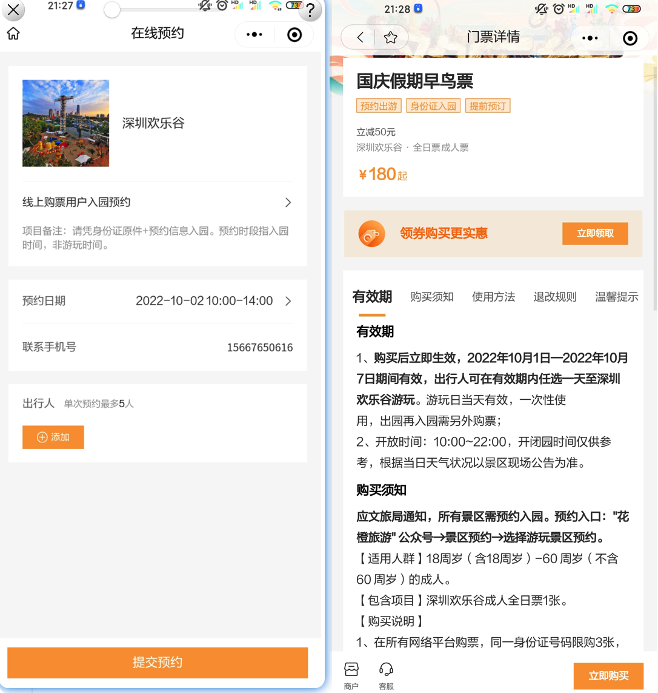
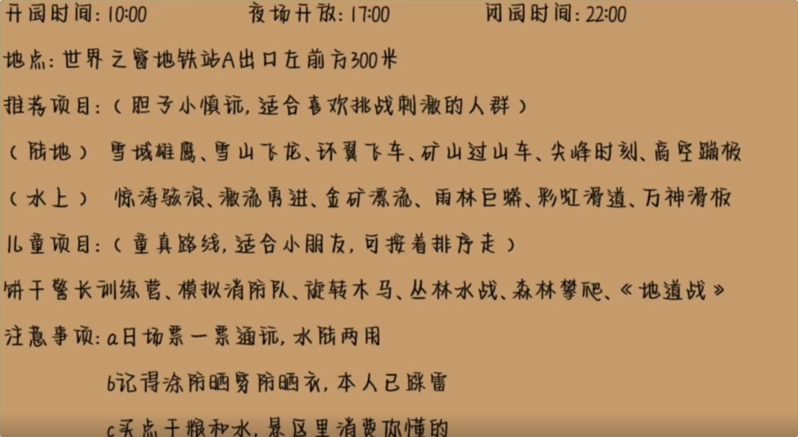
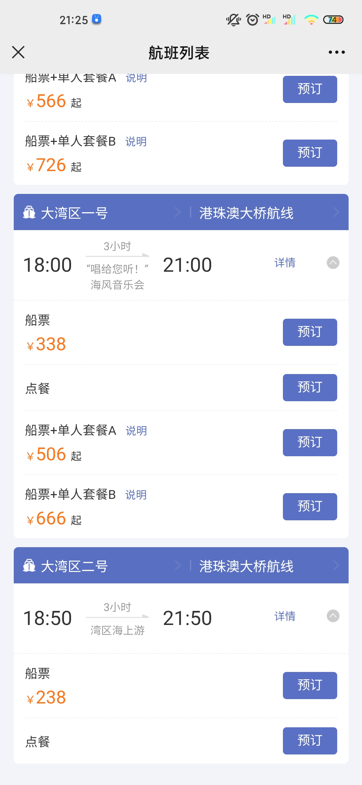

- 欢乐谷（任选一天-全天）

​	成人票 180/人

- 大湾区游轮（半天3小时左右—选择时间为下午的票）

成人票–338/人

- 深圳野生动物园（全天-任选一天）

成人票-200/人

- 玫瑰海岸（半天—建议下午游玩）

成人票 30/人

- 世界之窗

成人票 – 200/人

免费景点–

- 深圳湾(晚上，看海，免费，散步)

- `东门老街`（小吃街，购物中心，老街站下即可）
- 南澳第一沙滩（无门票）
- 大梅沙（人多）
- 华侨城文化创意园（免费-文艺，散心）
- CBD

大餐—

- 大鱼铁板烧
- 浅锅
- 八合里
- 十五年亚克西
- 大汗碳烤羊腿

