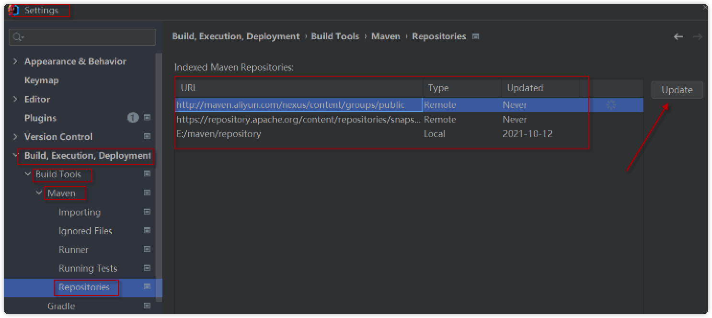
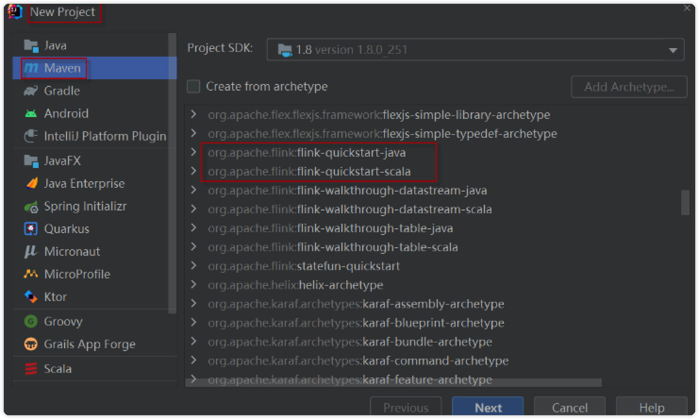

[toc]

## 概念性

### MySQL区别redolog和binlog

- `redolog`记录的是对于每个页的修改

  - 数据页地址、行地址、操作类型（I/D）、数据
  - e.g：一个update修改100行，至少产生200行redolog，所以DML产生的redolog可能很大

- `binlog`记录的是DML/DDL/DCL，不记录SELECT

  - 通过参数设计控制binlog的记录模式：

  > 语句模式：
  >
  > delete from t1 where id <=1000;
  >
  > 行模式：
  >
  > delete from t1 where id = 1;
  >
  > delete from t1 where id = 2;
  >
  > delete from t1 where id = 3;
  >
  > ……

- 图解机制


- 表格对比

  |          | redolog          | binlog             |
  | -------- | ---------------- | ------------------ |
  | 日志作用 | 保护脏数据       | 数据库备份恢复使用 |
  | 引擎支持 | 只适合InnoDB引擎 | 所有引擎           |
  | 日志格式 | 物理日志         | 逻辑日志,SQL语句   |
  | 提交方式 | 快速提交         | 提交时一次性写入   |
  | 保存形式 | 会被循环覆盖     | 长期保存           |

### MySQL binlog关注点

- 开启binlog

```mysql
# 查看是否开启
mysql> show variables like 'log_bin';
+---------------+-------+
| Variable_name | Value |
+---------------+-------+
| log_bin       | ON    |
+---------------+-------+
1 row in set (0.01 sec)

# 如果未开启
+---------------+-------+
| Variable_name | Value |
+---------------+-------+
| log_bin       | OFF   |
+---------------+-------+
1 row in set (0.01 sec)

# 使用命令开启
mysql> set @@global.log_bin=on;
```

**可能的错误**

```mysql
# 1238
ERROR 1238 (HY000): Variable 'log_bin' is a read only variable
-- 修改配置文件my.cnf,在[mysqld]下添加：
server-id=1
log-bin=mysql-bin
-- 重启mysql
```

- binlog的存放

```mysql
mysql> show variables like 'log_bin%';
+---------------------------------+------------------------------------+
| Variable_name                   | Value                              |
+---------------------------------+------------------------------------+
| log_bin                         | ON                                 |
| log_bin_basename                | /usr/local/mysql/data/binlog       |
| log_bin_index                   | /usr/local/mysql/data/binlog.index |
| log_bin_trust_function_creators | OFF                                |
| log_bin_use_v1_row_events       | OFF                                |
+---------------------------------+------------------------------------+
5 rows in set (0.00 sec)

```

`log_bin`:binlog是否开启

`log_bin_basename`:binlog文件，每次重启会生成一个新的文件

`log_bin_index`:二进制索引文件，记录使用的binlog文件名

`log_bin_trust_function_creators`:控制是否可以新人存储函数创建者，详见[官方文档](https://dev.mysql.com/doc/refman/5.6/en/replication-options-binary-log.html#sysvar_log_bin_trust_function_creators)

`log_bin_use_v1_row_events`:控制binlog中的Rows_log_event的格式，如果这个值开启，就用v1版本的格式，默认是关闭，采用v2版本格式，详见[官方文档](https://dev.mysql.com/doc/refman/5.6/en/replication-options-binary-log.html#sysvar_log_bin_use_v1_row_events)

- 手动切换binlog
  - 重启数据库，每次重启会新切换一个binlog
  - mysql>flush logs;
- 查看binlog日志文件

```shell
```

- 判断binlog_cache_size是否设置过小的依据，如果Binlog_cache_disk_use > 0,说明事务未提交， binlog在用户工作的空间存放不下，需要借用tmp目录

```mysql
mysql> show global status like 'Binlog_cache_disk_use';
+-----------------------+-------+
| Variable_name         | Value |
+-----------------------+-------+
| Binlog_cache_disk_use | 0     |
+-----------------------+-------+
1 row in set (0.03 sec)
```

- log_bin
  - ==—log-bin[=file_name]==:设置此参数表示启用binlog，并指定路径名称
  - ==sql_log_bin==:会话级别的binlog开关控制，默认是开启的，可以在当前会话级别动态修改临时关闭binlog（主从延迟优化），set session sql_log_bin=0;
- sync_binlog
  - 0：默认，提交同步到文件系统缓存
  - 1：commit，通过fsync方式，直接写入disk的binlog文件中，与redo的双一模式。
  - 1&lt;:在意外发生时，就表示会有N-1个dml没有被写入binlog中，有可能会发生主从数据不一致的问题。

> MySQL双1配置：
>
> `innodb_flush_log_at_trx_commit`是`innodb`引擎配置，`sync_binlog`是MySQL引擎上层配置，都是控制磁盘写入策略
>
> `MySQL innoDB`引擎在commit之后：
>
> 1. binlog写内存
> 2. redolog写内存
> 3. 根据这两个配置绝对这两个日志是否刷盘
> 4. commit
>
> `innodb_flush_log_at_trx_commit`：redo log的刷盘策略，默认为1
>
> - 如果该值设置为0：`log buffer`将每一秒写入`log file`	中，并且`log file`中的flush（刷到磁盘）操作同时进行。该模式下，在实务提交时，**不会主动触发写入磁盘的操作**
> - 如果该值设置为1：每次事务提交的时候，mysql都会把`log buffer`的数据写入`log file`，**并且flush（刷到磁盘）中**
> - 如果该值设置为2：每次事务提交时候，Mysql都会把`log buffer`的数据写入`log file`，但是flush（刷到磁盘）的操作不会通知执行，**mysql每一秒执行一次flush**
>
> `sync_binlog`:binlog的刷盘策略，默认0
>
> - 如果该值为0：mysql不会同步到磁盘中去而是依赖操作系统判断刷新`binary log`
> - 如果该值为n：mysql在**每写N次**二进制文件日志`binary log`时，会使用`fdatasync()`函数将他写入二进制日志`binary log`同步到磁盘
>
> 双1模式中，开启`innodb_support_xa`=1：分布式事务更加安全
>
> 1. 保证binlog里面存放的事务一定在redo log中
> 2. 保证binlog里的事务顺序和redo log事务顺序一致
> 3. commit，要么成功要么失败

- max_binlog_size

  - binlog文件大小，默认1G
  - 如果是row模式，需要增加binlog文件的大小，因为行模式产生的日志量相对较大。如果超过了该值，就会产生新的日志文件，后缀名+1，并且记录到.index文件里面去。

- Binlog_format

  - row、statement、mixed，设置binlog记录的模式：行模式、语句模式、mixed模式。动态参数，可以会话级别修改

- –binlog-do-db/–binlog-ingore-db

  - command-line format，表示需要写入或者忽略写入那些库的日志，默认为空，表示可以将所有库的日志写入到二进制文件中

- log-slave-updates

  - 启动从机服务器上的slave日志功能，使这台计算机可以用来构成一个镜像链(A->B->C)，可以让从库上面产生二进制日志文件，在从库上挂载一个从库。

- binlog_rows_query_log_events

  - 定位执行过的SQL语句

- expire_log_days

  - binlog过期清理时间，默认是0:不自动清除
  - binlog的删除策略，假设值为5，表示系统保留5天binlog

  > 1. 删除策略的风险：
  >
  >    1. 删除会导致过高的io，从而到账业务出现性能抖动
  >    2. 主从延迟
  >
  > 2. 解决：手动删除binlog
  >
  >    PURGE BINARY LOGS #同时删除binlog文件和binlog索引文件记录，如此说来用rm删除binlog和vim修改对应的binlog索引文件记录，效果同purge
  >
  > ```mysql
  > Syntax:
  > 　　PURGE { BINARY | MASTER } LOGS
  > 　　{ TO 'log_name' | BEFORE datetime_expr }
  > mysql> PURGE BINARY LOGS TO 'mysql-bin.000003';　　#删到3，也就是删了1、2。
  > ```

### MySQL binlog_format有哪些

1. STATEMENT

   <font color=#ffcaacf>每一条会修改数据的SQL都会记录在binlog中</font>

   <font color=red>优点</font>：不需要记录每一行的变化，减少了binlog的日志量，节约了IO提高性能。只需要记录在master上所执行的语句的细节，以及上下文信息。

   <font color=red>缺点</font>：只是记录了执行语句，为了这些与局可以在slave上运行，还需要记录每条语句在执行的时候的一些相关信息，保证语句能在slave得到和master执行时候同样的结果。像一些特定的函数工嗯呢该，slave与master上保持一致会有很多的相关问题，如sleep函数rand函数等会出现相关问题warning

2. ROW

   <font color=#ffcaacf>不记录sql语句的上下文相关信息，仅保存那条记录被修改，也就是日志中会记录成每一行数据被修改的形式，然后再slave端对相同的数据修改</font>

   <font color=red>优点</font>：binlog中可以不记录执行sql语句的上下文信息，仅需要记录那一条记录被修改成什么了。所以row level的日志内容会非常清晰的记录每一行数据的修改细节。不会出现某些特定情况下的存储过程，或者function，以及trigger的调用和触发无法被正确复制的问题。

   <font color=red>缺点</font>：所有执行的语句当记录到日志中的时候，都将以每行记录的修改来记录，这样会产生大量日志

3. MIXED

   <font color=#ffcaacf>上面两种等级的混合模式</font>

   一般的语句修改使用statment格式保存binlog，如一些函数，statement无法完成主从复制操作，则采用row格式保存binlog，MySQL会根据执行的每一条具体的SQL语句来区分对待记录的日志形式，也就是Statement和row之间选一种。

新版本的mysql对row模式也做了优化，并不是所有的修改都会以row来记录，遇到表结构变更的时候会以statenment的模式来记录。其他修改还是记录所有行变更。

### MySQL binglog的使用

1. 二进制日志的两个最重要的使用场景

   1. mysql replication在master端开启binlog，master把他的二进制日志传递给slaves来达到master-slave数据一致的目的，也就是主从备份
   2. 数据恢复，通过使用mysqlbinlog工具回复数据

2. 常用binlog日志操作命令

   1. 查看所有binlog日志列表

   ```mysql
   mysql> show master logs;
   ```

   2. 查看master状态，即最后一个binlog日志标号名称，和最后一个操作事件pos结束点（Position）值

   ```mysql
   mysql> show master status;
   ```

   3. 刷新log日志，此刻开始产生一个新的编号的binlog日志文件

   ```mysql
   mysql> flush logs;
   ```

   4. 清空所有binlog日志

   ```mysql
   mysql> reset master;
   ```

3. 查看binlog体质内容

   1. OS层查看

      ```shell
      ➜  ~ mysqlbinlog -vv myqsl-bin.000001
      ```

   2. 数据库层面

      ```mysql
      mysql> show binlog events [IN 'logname'] [FROM pos] [LIMIT[offset]row_count];
      ```

      *解析*

      1. log_name：指定要查询的binlog文件名
      2. from pos：指定从哪个pos起始点开始查起
      3. limit：偏移量
      4. row_count:：查询总条数

```mysql
mysql> show binlog events limit 1\G
*************************** 1. row ***************************
   Log_name: binlog.000001
        Pos: 4
 Event_type: Format_desc
  Server_id: 1
End_log_pos: 126
       Info: Server ver: 8.0.29, Binlog ver: 4
1 row in set (0.00 sec)
```

4. 从binlog日志恢复语法

```shell
~ mysqlbinlog [选项] mysql-bin.0000XX | mysql -u用户名 -p密码 数据库名

--start-position=953 起始点pos
--stop-position=1437 结束点pos
--start-datetime="2022-4-1 16:05:00" 起始时间点
--stop-datetime="2022-5-1 16:05:00" 结束时间点
--database=TEST 指定TEST数据库(一台主机上往往有多个数据库)
```


## Bug记录

### 使用httpclient请求get请求时参数包含`>`号报错

> 特殊字符诸如+?%#&=/等都会被当做转义字符处理，这样的话请求路径的参数就不对了

**解决方案1**

去掉特殊报错的字符

**解决方案2**

使用转义字符

```te
空格 用%20代替
" 用%22代替
# 用%23代替
% 用%25代替
& 用%26代替
( 用%28代替
) 用%29代替
+ 用%2B代替
, 用%2C代替
/ 用%2F代替
: 用%3A代替
; 用%3B代替
< 用%3C代替
= 用%3D代替
> 用%3E代替
? 用%3F代替
@ 用%40代替
\ 用%5C代替
| 用%7C代替
```

### MySQL使用`union all `合并SQL语句时导致`order by`排序不生效的问题

>**原因：**union all的执行比order by优先级高，在直接使用时候，order by会被MySQL的优化器干掉

```sql
(
  select 
  		a.col as v1
  from 
  		db.table as a
  where 
  		a.col like '1'
  order by a.id desc
)
union all
(
  select 
  		a.col as v1
  from 
  		db.table as a
  where 
  		a.col = '2'
)
```

**解决方式1**

`通过Limit加在order by后面，使得优化器不会优化order by `

```sql
-- 修改为
(
  select 
  		a.col as v1
  from 
  		db.table as a
  where 
  		a.col like '1'
  order by a.id desc
  limit 99999
)
union all
(
  select 
  		a.col as v1
  from 
  		db.table as a
  where 
  		a.col = '2'
)
```

**解决方式2**

先查询后排序

union两个表的顺序加入一个od字段来保证, 然后再按照原本的逻辑进行排序

```sql
-- 修改为
SELECT * FROM (
   (
   select 
   		a.col as v1,
   		0 as od
   from 
      db.table as a
   where 
      a.col like '1'
   ) t1
union all
   (
   select 
   		a.col as v1,
   		1 as od
   from 
      db.table as a
   where 
      a.col = '2'
   ) t2
) t3 ORDER BY od, t1.id;
```

## 操作类/设置类/软件版本

### IDEA中Maven无法添加原型

> **描述**：在创建Flink项目时，想使用原型archetype (flink-quickstart-java/flink-quickstart-scala)，但是发现archetype列表中没有这两项。然后想通过Add Archetype自行添加。但是，当点击Add Archetype，并输入所有参数后，并没有出现新添加的archetype项。
>
> **原因**：版本IDEA的一个小bug。它将在2021.3版本更新中修复（不靠谱，网上很多人反映2021.3 EAP版本依旧无法添加新的Maven原型，其他版本不清楚了）。

**解决方式1**

使用Maven命令生成

```shell
$ mvn archetype:generate \
  -DarchetypeGroupId=org.apache.flink \
  -DarchetypeArtifactId=flink-quickstart-java \
  -DarchetypeVersion=1.16-SNAPSHOT
  
# 按需求输入GroupId，artifactId，package名字
```

**解决方式2**

1. 选择【File】 > 【Settings】 > 【Build, Execution, Deployment】 > 【Build Tools】 > 【Maven】 > 【Repositories】；

2. 选中每个url，点击【update】按钮。如下图所示：



3. 解决：更新完毕后，再重新创建Maven项目，可以看到Flink的archetype原型列表了




### 远程访问数据库，出现中文乱码情况

查看远程数据库解码方式

```mysql
show variables like '%character%';
```

```zsh
+--------------------------+-----------------------------------------------------------------+
| Variable_name            | Value                                                           |
+--------------------------+-----------------------------------------------------------------+
| character_set_client     | latin1                                                          |
| character_set_connection | latin1                                                          |
| character_set_database   | latin1                                                          |
| character_set_filesystem | binary                                                          |
| character_set_results    | latin1                                                          |
| character_set_server     | latin1                                                          |
| character_set_system     | utf8                                                            |
| character_sets_dir       | /usr/local/zlj/mysql-5.6.44-linux-glibc2.12-x86_64/share/charsets/
+--------------------------+-----------------------------------------------------------------+
8 rows in set (0.00 sec)
```

>解决方案：
>
>从my.ini下手（标签下没有的添加，有的修改）
>
>[client]
>
>default-character-set=utf8
>
>[mysql]
>
>default-character-set=utf8
>
>[mysqld]
>
>default-character-set=utf8
>
>以上3个section都要加default-character-set=utf8，平时我们可能只加了mysqld一项。
>
>然后重启mysql，执行


