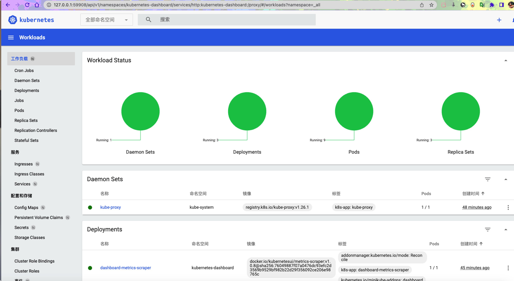

[toc]

# Kubernetes

## k8s解决了什么问题

> 物理机 ~ 虚拟机 ~ docker

Docker： 将软件程序和运行的基础环境分开。开发人员编码完成后将程序整合环境通过 DockerFile 打包到一个容器镜像中，从根本上解决了环境不一致的问题

Docker 由镜像、镜像仓库、容器三个部分组成：
镜像: 跨平台、可移植的程序+环境包
镜像仓库: 镜像的存储位置，有云端仓库和本地仓库之分，官方镜像仓库地址
容器: 进行了资源隔离的镜像运行时环境

> **Docker ~ K8S**

Docker为容器化的应用程序提供了开放标准，但随着容器越来越多出现了一系列新问题：

- 单机不足以支持更多的容器
- 分布式环境下容器如何通信？
- 如何协调和调度这些容器？
- 如何在升级应用程序时不会中断服务？
- 如何监视应用程序的运行状况？
- 如何批量重新启动容器里的程序？

...

> Kubernetes（简称 K8s，其中8代指中间的8个字符），是一个全新的基于容器技术的分布式架构方案，这个方案虽然还很新，但却是 Google 十几年来大规模应用容器技术的经验积累和升华的重要成果，确切的说是 Google 一个久负盛名的内部使用的大规模集群管理系统——Borg的开源版本，其目的是实现资源管理的自动化以及跨数据中心的资源利用率最大化。
>
> Kubernetes具有**完备的集群管理能力**，包括多层次的安全防护和准入机制、多租户应用支撑能力、透明的服务注册和服务发现机制、内建的智能负载均衡器、强大的故障发现和自我修复能力、服务滚动升级和在线扩容能力、可扩展的资源自动调度机制，以及多力度的资源配额管理能力。
>
> 同时，Kubernetes 提供了**完善的管理工具**，这些工具涵盖了包括开发、部署测试、[运维监控](https://www.zhihu.com/search?q=运维监控&search_source=Entity&hybrid_search_source=Entity&hybrid_search_extra={)在内的各个环节，**不仅是一个全新的基于[容器技术](https://www.zhihu.com/search?q=容器技术&search_source=Entity&hybrid_search_source=Entity&hybrid_search_extra={)的分布式架构解决方案，还是一个一站式的完备分布式系统开发和支撑平台。**

## 单机学习 QuickStart ( Mac Apple芯片 )

- 安装 `kubectl` 让你可以对 Kubernetes 集群运行命令
- 安装 `minikube` 让你在本地运行 Kubernetes

### Kubectl 安装

- 下载最新发行版

```shell
curl -LO "https://dl.k8s.io/release/$(curl -L -s https://dl.k8s.io/release/stable.txt)/bin/darwin/arm64/kubectl"
```

- 验证可执行文件

下载验证工具包

```shell
curl -LO "https://dl.k8s.io/release/$(curl -L -s https://dl.k8s.io/release/stable.txt)/bin/darwin/arm64/kubectl.sha256"
```

验证

```shell
echo "$(cat kubectl.sha256)  kubectl" | shasum -a 256 --check
```

验证通过时输出如下：

```shell
kubectl: OK
```

- 设置kubectl为可执行文件

```shell
chmod +x ./kubectl
```

- 设置环境变量

```shell
vim 你的环境变量配置文件
# 将某个文件路径添加到PATH环境变量下
...
# 将文件移动到PATH可达的路径下
sudo mv ./kubectl /usr/local/bin/kubectl
sudo chown root: /usr/local/bin/kubectl
```

- 验证版本号

```shell
kubectl version --client
# 或
kubectl version --client --output=yaml
```

- 安装完成后清理掉安装文件

```shell
rm kubectl kubectl.sha256
```

### minikube安装

==请确保你机器上成功安装了Docker==

参考–》[Docker-安装](cxy/其他/Docker/docker安装.md)

- 下载镜像文件

```shell
curl -Lo minikube https://storage.googleapis.com/minikube/releases/latest/minikube-linux-amd64
```

- 授予可执行权限

```shell
chmod +x minikube && sudo mv minikube /usr/local/bin/
```

- 使用国内镜像启动minikube

```shell
minikube start --image-repository=registry.cn-hangzhou.aliyuncs.com/google_containers --image-mirror-country=cn
```

- 验证一下获取全部pod

```shell
➜  ~ kubectl get pod -A
NAMESPACE              NAME                                        READY   STATUS    RESTARTS   AGE
kube-system            coredns-787d4945fb-72bnp                    1/1     Running   0          37m
kube-system            etcd-minikube                               1/1     Running   0          37m
kube-system            kube-apiserver-minikube                     1/1     Running   0          37m
kube-system            kube-controller-manager-minikube            1/1     Running   0          37m
kube-system            kube-proxy-slr6l                            1/1     Running   0          37m
kube-system            kube-scheduler-minikube                     1/1     Running   0          37m
kube-system            storage-provisioner                         1/1     Running   0          37m
kubernetes-dashboard   dashboard-metrics-scraper-5c6664855-rq4r4   1/1     Running   0          34m
kubernetes-dashboard   kubernetes-dashboard-55c4cbbc7c-bfg98       1/1     Running   0          34m
```

### 验证kubectl配置

为了让 kubectl 能发现并访问 Kubernetes 集群，你需要一个 [kubeconfig 文件](https://kubernetes.io/zh-cn/docs/concepts/configuration/organize-cluster-access-kubeconfig/)， 该文件在 [kube-up.sh](https://github.com/kubernetes/kubernetes/blob/master/cluster/kube-up.sh) 创建集群时，或成功部署一个 Minikube 集群时，均会自动生成。 通常，kubectl 的配置信息存放于文件 `~/.kube/config` 中。

通过获取集群状态的方法，检查是否已恰当地配置了 kubectl：

```shell
➜  ~ kubectl cluster-info
# 成功情况下回复如下内容
Kubernetes control plane is running at https://127.0.0.1:53093
CoreDNS is running at https://127.0.0.1:53093/api/v1/namespaces/kube-system/services/kube-dns:dns/proxy
# 失败如下
The connection to the server <server-name:port> was refused - did you specify the right host or port?
（访问 <server-name:port> 被拒绝 - 你指定的主机和端口是否有误？）
# 如果还不能访问，使用下面的命令查看详细情况
kubectl cluster-info dump
```

### 启动minikube

```shell
minikube dashboard
# 如果你不想打开 Web 浏览器，请使用 --url 标志运行显示板命令以得到 URL：
minikube dashboard --url
```

Kubernetes [**Pod**](https://kubernetes.io/zh-cn/docs/concepts/workloads/pods/) 是由一个或多个为了管理和联网而绑定在一起的容器构成的组。本教程中的 Pod 只有一个容器。 Kubernetes [**Deployment**](https://kubernetes.io/zh-cn/docs/concepts/workloads/controllers/deployment/) 检查 Pod 的健康状况，并在 Pod 中的容器终止的情况下重新启动新的容器。 Deployment 是管理 Pod 创建和扩展的推荐方法。

- 使用 `kubectl create` 命令创建管理 Pod 的 Deployment。该 Pod 根据提供的 Docker 镜像运行容器

```shell
kubectl create deployment hello-node --image=registry.k8s.io/e2e-test-images/agnhost:2.39 -- /agnhost netexec --http-port=8080
```

- 查看 Deployment

```shell
kubectl get deployments
```

回复大致如下

```shell
NAME         READY   UP-TO-DATE   AVAILABLE   AGE
hello-node   1/1     1            1           1m
```

- 查看 Pod

```shell
kubectl get pods
```

回复大致如下

```shell
NAME                          READY     STATUS    RESTARTS   AGE
hello-node-5f76cf6ccf-br9b5   1/1       Running   0          1m
```

- 查看集群事件

```shell
kubectl get events
```

- 查看 `kubectl` 配置

```shell
kubectl config view
```

### 创建Service

- 使用命令将pod暴露给公网访问

```shell
# --type=LoadBalancer
kubectl expose deployment hello-node --type=LoadBalancer --port=8080
```

- 查看创建的Service

```shell
kubectl get services

NAME         TYPE           CLUSTER-IP      EXTERNAL-IP   PORT(S)          AGE
hello-node   LoadBalancer   10.108.144.78   <pending>     8080:30369/TCP   21s
kubernetes   ClusterIP      10.96.0.1       <none>        443/TCP          23m
```

- 使用下面的命令运行service

```shell
minikube service hello-node
```

将打开一个网页用于显示你的集群状态


