[toc]

# MySQL表设计

`学习交流平台（Learning and communication platform）`

> 所有建表操作需要使用平台操作：http://124.222.34.234/#/db
>
> 测试阶段建表尽量将表建立在test库中，需要稳定时在创建数据库-建表（后续会上线一键迁移数据功能）
>
> 不需要手动添加：id，create_time,update_time字段，上述字段会自动生成
>
> 建表时满足：
>
> - 库名-lacp_xxxx的规范(示例：sso模块库名为：lacp_sso)
> - 表名-t_lacp_xxxx_aaaa_bbbb_….（示例：sso模块的用户表：t_lacp_sso_basic_user）
> - 字段
>   - 尽量满足（表xx_ffff）(示例：sso模块用户表字段：user_name,user_role,user_age,user_state)
>   - 某些字段可以单独出现，自行判断，如：uv
>   - 见名知意（不允许出现拼音、缩写、不完整单词等**你能理解，其他开发无法理解**）
> - 不允许出现外键，主键使用自增ID，类型为Int、数据流可能大的表使用bigint
> - 禁止使用TEXT和BLOG类型

## 统一认证用户模块表设计

为了方便后期扩展迭代，按照 `微信的用户信息`设计表，至少保证字段数大于等于下列的需要用到的资料信息。


**尽量详细，所有数据都要有**

# 方案

### 统一认证SSO

责任人：陈新予、屈星波

> 需求：
>
> - 统一sso认证  ✔️
> - 登录、注册  ✔️
> - 密码加密（已有账号迁移或兼容已有账号）
> - 用户个人中心
>   - 完善信息
>   - 修改信息
>   - 申请权限
> - 管理员创建用户功能（一键创建用户，规避注册流程的正则，规避密码检测）
> - 消息模块（1-系统消息  2-人工消息）
>   - 普通用户-消息通知（查看消息 ）
>   - 管理员- 消息配置
>     - 配置消息
>     - 支持群发
>     - 选择用户发送，多选发送
>     - 当通知对象是管理员时，选择是否发送到QQ群消息
>     - 失败重发（网络问题，或者用户退群的问题）
>   - 对外接口
>     - 接受message类型的消息对象，新增一个消息
>
> ```java
> class Message{
>
>     private String mTitle; // 标题
>
>     private String mData;  // 内容
>
>     private boolean mType; // 消息类型
>
>     private boolean isRead; // 是否已读
>
>     private String createUser; // 创建人
>
>     private String toUser; // 接受人
>
>     private boolean isSendQQ; // 是否发送qq消息
>
>     private boolean isSendWx; // 是否发送wx消息
>
>     // 还有一些属性需要，上面的的必须参数，下面的参数可能是数据库会用的
>     private boolean mState; // 是否发送成功
>     private LocalDataTime createTime; // 创建时间
>     private LocalDataTime updateTime; // 修改时间 修改时间可以作为用户已读时间展示
>
> }
>
> ```

单个springboot接口使用下面提到的工具类和监视器实现自动同步用户信息。

#### 逻辑

统一认证中心的接口需要提供user详细信息的json数据，根据id


统一认证不是模块中不包含登录逻辑，是 `各自的模块按照需要保存一些统一用户信息到自己本地库`，这部分逻辑对用户不感知，但是开发上是感知的，比如数据模块，就按照需要取一部分我需要的用户信息，保存在模块业务库中，需要的时候直接使用，而不是不存在用户逻辑。以下是逻辑设置。


这张表也是存在的，命名规范 t_lacp_xxxx_basic_user    xxxx为项目模块简写。

#### 监听过滤器

```java
@Component
public class LoginInterceptor implements HandlerInterceptor {

    @Override
    public boolean preHandle(HttpServletRequest request, HttpServletResponse response, Object handler) throws Exception {
        // TODO 获取用户信息
        SSOBean userInfo = (SSOBean) request.getSession().getAttribute("user_info");

        if (userInfo == null || userInfo.getUserId() == null) {
            SSOBean ssoUserInfo = SsoUtil.getSsoUserInfo(request);
            if (ssoUserInfo == null || ssoUserInfo.getUserId() == null) {
                throw CommonException.SESSION_INVALID;
            }
            request.getSession().setAttribute("user_info", ssoUserInfo);
        }
        return true;
    }
}
```

#### SSOBean对象

- 按照自己的模块需求保存对象

```java
@Data
@NoArgsConstructor
@AllArgsConstructor
@Builder
@ApiModel("SSO用户模型")
@Accessors(chain = true)
public class SSOBean {

    @ApiModelProperty(value = "用户id")
    private String userId;

    @ApiModelProperty(value = "姓名")
    private String name;

    @ApiModelProperty(value = "昵称")
    private String pname;

    @ApiModelProperty(value = "微信ID")
    private String wxId;

    @ApiModelProperty(value = "是否管理员 1-是 0-不是")
    private String isAdmin;

}
```

#### SSO认证工具类

- 模块中也需要自行编写userMapper，替换下面的逻辑
- TODO代码块中json数据模拟请求统一认证中心，统一中心编写好以后，替换逻辑

```java
package com.lacp.databasemanagement.util;

import com.lacp.databasemanagement.bean.SSOBean;
import com.lacp.databasemanagement.bean.dto.BasicUserDTO;
import com.lacp.databasemanagement.dao.BasicUserMapper;
import com.lacp.databasemanagement.exception.CommonException;
import lombok.RequiredArgsConstructor;
import lombok.extern.log4j.Log4j2;
import org.springframework.stereotype.Component;

import javax.annotation.PostConstruct;
import javax.servlet.http.HttpServletRequest;
import java.text.ParseException;
import java.text.SimpleDateFormat;
import java.util.Date;

/************************************************************
 * @ProjectName   : databaseManagement
 * @ClassName     : SsoUtil
 * @author        : chenxinyu
 * @createTime    : 2022/6/20
 ************************************************************/
@Component
@Log4j2
@RequiredArgsConstructor
public class SsoUtil {

    private final BasicUserMapper mapper;

    private static BasicUserMapper userMapper;

    @PostConstruct
    public void init() {
        userMapper = this.mapper;
    }

    public static SSOBean getSsoUserInfo(HttpServletRequest request) {
        final SSOBean user = new SSOBean();
        String uid = "";
        // token = "sso_uid=10086;lastTime=2022/07/05 22:30:32"
        String lastTime;
        try {
            String token = request.getHeader("token");
            // 获取uid
            String ssoId = token.split(";")[0].split("=")[1];
            // 获取token过期时间
            lastTime = token.split(";")[1].split("=")[1];
            if (ssoId != null && !"".equals(ssoId)) {
                uid = ssoId;
            }
        } catch (Exception e) {
            throw CommonException.SESSION_INVALID;
        }
        // 判断是否过期
        SimpleDateFormat sdf=new SimpleDateFormat("yyyy/MM/dd HH:mm:ss");
        try {
            Date lastTimeParse = sdf.parse(lastTime);
            Date nowTimeParse=new Date();
            if (lastTimeParse.before(nowTimeParse)){
                // throw CommonException.SESSION_INVALID; // 两种方式都可以，前端会自己捕捉
                return user;
            }
        } catch (ParseException e) {
            throw CommonException.TIME_CONVERSION_FAILED;
        }

        if (!"".equals(uid)) {
            BasicUserDTO basicUserDTO = userMapper.descUser(uid);
            BasicUserDTO basicUser;
            if (basicUserDTO == null) {
                /*
                 *{
                      "id": 1,
                      "email": "***********",
                      "mobile": "***********",
                      "ssoId": "71a896ae***************bb058bee8",
                      "userName": "陈新予",
                      "userPname": "寥寥清梦",
                      "userSex": "男",
                      "province": "陕西",
                      "city": "延安",
                      "country": "CN",
                      "headimgurl": "null",
                      "userQq": "1******381",
                      "createTime": "2022-07-12 17:02:37",
                      "updateTime": "2022-07-12 19:56:07"
                    }
                 */
                String userJson = HttpUtil.get("http://124.222.34.234:27313/api/user/sso/" + uid);
                // 设置需要的信息
                if (userJson == null || "".equals(userJson)) {
                    return new SSOBean();
                }
                 basicUser = BasicUserDTO
                        .builder()
                        .userWxid(JsonUtil.getParamForJson(userJson, "ssoId"))
                        .userName(JsonUtil.getParamForJson(userJson, "userName"))
                        .userPname(JsonUtil.getParamForJson(userJson, "userPname"))
                        .userQQ(JsonUtil.getParamForJson(userJson, "userQq"))
                        .build();
                try {
                    // 逻辑兜底，防止重复对象读脏数据
                    BasicUserDTO SSO = userMapper.descUser(basicUser.getUserWxid());
                    if (SSO != null) {
                        return new SSOBean();
                    }
                    // 存储对象
                    userMapper.saveUser(basicUser);
                } catch (Exception e) {
                    // 处理多线程冲突
                    return new SSOBean();
                }
            } else {
                basicUser = basicUserDTO;
            }
            user.setUserId(String.valueOf(basicUser.getId()))
                .setWxId(basicUser.getUserWxid()).setUserQQ(basicUser.getUserQQ())
                .setName(basicUser.getUserName()).setPname(basicUser.getUserPname())
                .setIsAdmin(String.valueOf(basicUser.getUserRole()));
        }
        return user;
    }

}

```

#### 其他

如果Controller或者Service中需要读取用户信息等可以这样设置

`需要被集成的类使用@Autowired`


### 基础数据平台

责任人：陈新予

已上线

> - 数据库管理    ✔️
> - 数据表管理      ✔️
> - 权限判断，二次鉴权     ✔️
> - 添加对MySQL的binlog的监控    ✔️
> - 同步binlog变化到ES    ✔️
> - 搭建ELK集群（单机搭建完成）    ✔️
> - 添加java编译器和sql编译器    ✔️
> - 添加机器人播报    ✔️
> - 增加最高权限检测    ✔️

平台地址:[需要管理员才可以访问](http://124.222.34.234)联系QQ:1069664381申请权限

展示：

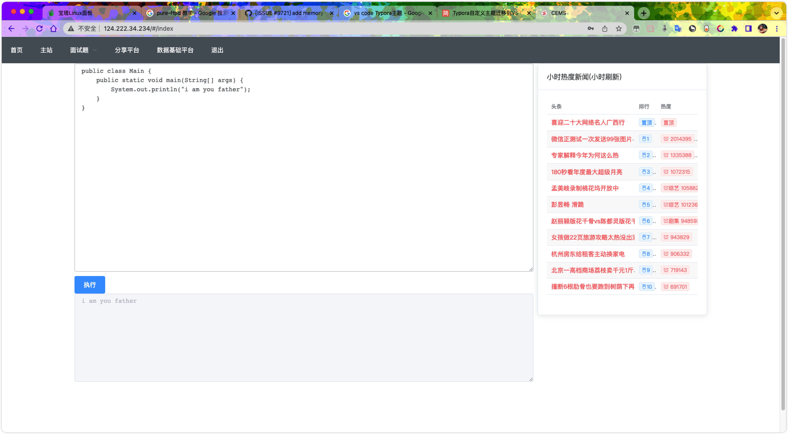

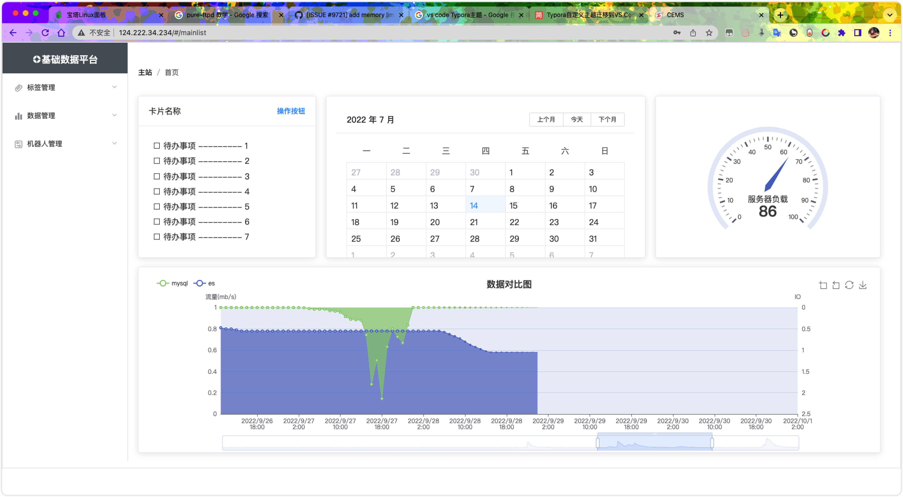

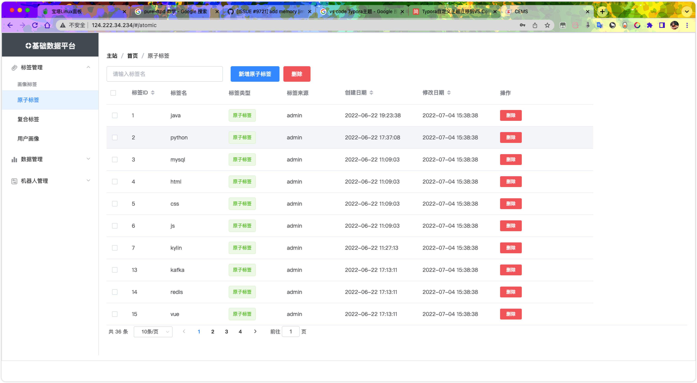

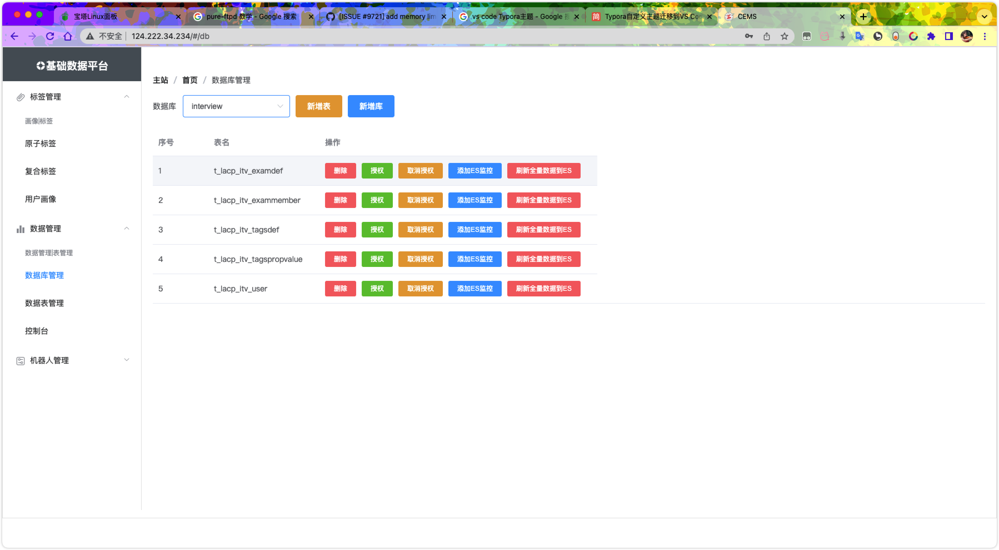

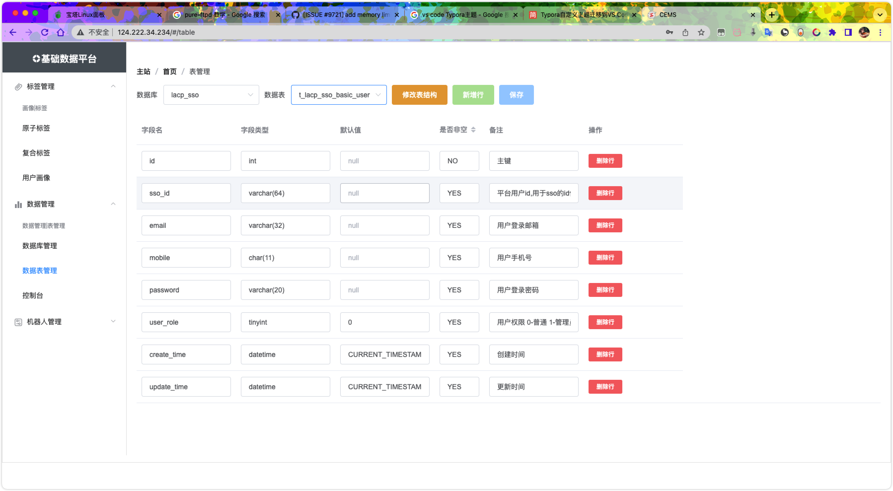

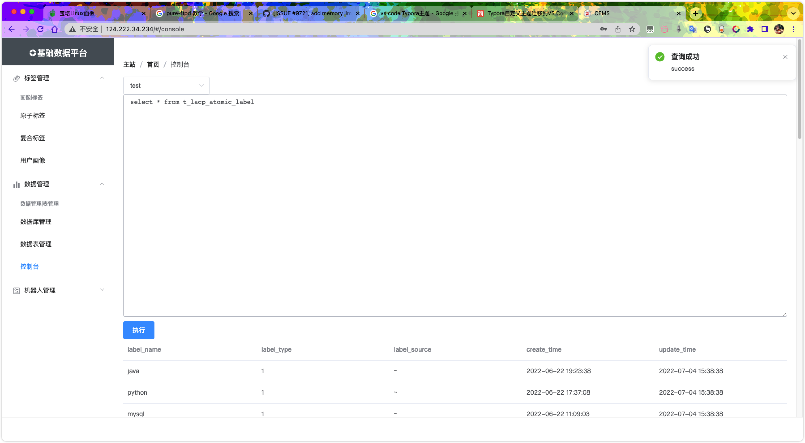

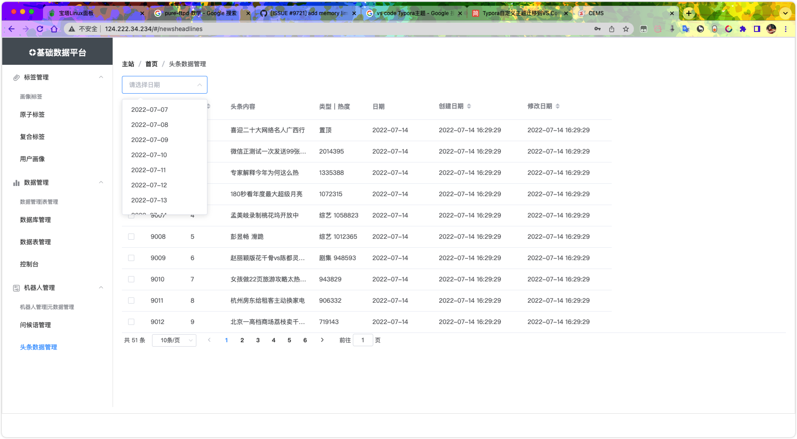

### 调度平台方案

策划中

> **起因：**宝塔的调度功能过于简单，不能实现复杂场景和自定义配置，所以，需要一个自己的调度系统进行**文件管理**和**任务调度**
>
> **方案：**
>
> [Java JSch 远程执行Shell命令](https://bbs.huaweicloud.com/blogs/298630)
>
> [cron表达式](https://help.aliyun.com/document_detail/64769.html)

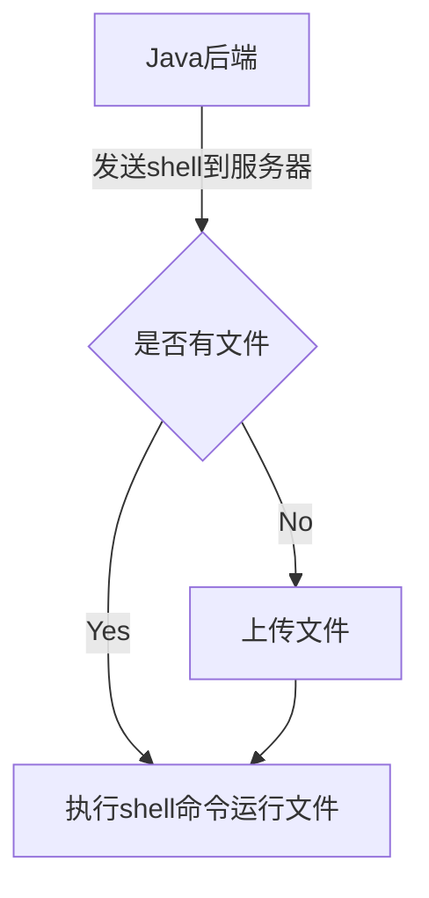

### 面试平台

责任人：叶天宇

> 需求：
>
> - 面试题管理    ✔️
> - 面试题发布，回答，纠错，热门
> - 面试题关联数据平台标签    ✔️
> - 面试题同步ES查询

### 博客平台

责任人: 屈星波

> 需求：
>
> - 博客的发布与编辑
> - 博客界面设计美观
> - 权限设计
> - 评论和打分功能
> - 同步关联数据平台的标签

### QQ机器人

责任人：陈新予

已上线

> `go-cqhttp` [官方文档](https://docs.go-cqhttp.org/api/#%E5%9F%BA%E7%A1%80%E4%BC%A0%E8%BE%93)

cq服务器地址：http://124.222.34.234:5700/

效果:

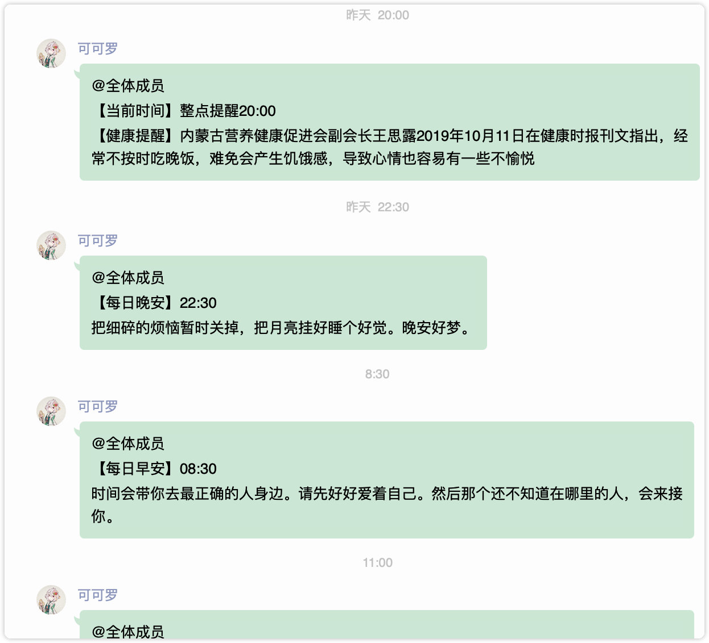


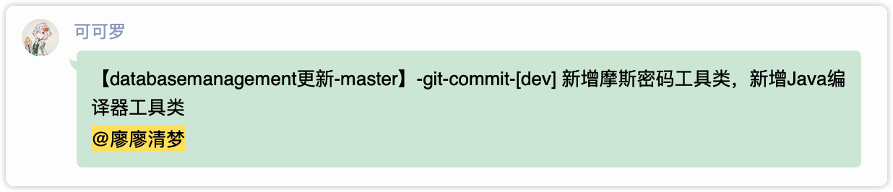

### 微信机器人

策划中

> 图灵机器人+微信pc端
>
> `图灵机器人`[地址](http://www.tuling123.com/)
>
> `API文档`[接入微信](https://www.kancloud.cn/turing/www-tuling123-com/718229)

### 并发方案和使用

责任人：陈新予

已测试

> **场景：**比如需要批量的新增或删除某个数据库中的元素，或者对大批量的用户进行群发消息，这样使用普通的方法进行发送就响应很慢，体验不好
>
> **方案：**

1. 异步消息

   首先在需要异步的类，或者直接在springboot的启动类上添加注解 `@EnableAsync` ,然后再异步方法上添加 `@Async`注解


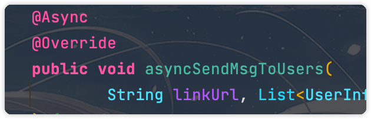

> **1. 异步方法和调用方不能放在同一个类中，否则异步会失效，通过注入异步类**
>
> 
>
> 
>
> **2. 使用@Async注解要注意 `循环依赖问题`**
>
> Spring虽然已经解决了循环依赖问题，但是也存在个例，比如AService的某个方法添加了 `@Async`注解，然后引用了BService，但是Bservice又引用了AService的方法，这个时候就会发生循环依赖问题，具体原因是因为 `@Async注解`是通过动态代理实现的，实现的方式又不同于 `@Transactional注解`又或者是 `自定义的AOP切面`,Spring的循环依赖是通过三级缓存来解决的，但是 `@Async注解`中的实现方式导致创建的Bean和早期暴露出去的Bean不是同一个对象，所以循环依赖就产生了。
>
> 解决：在循环依赖的注入字段上添加 `@Lazy`注解

2. 线程池

可以在BaseService中加入线程池

```java
ThreadPoolExecutor threadPoolExecutor = new ThreadPoolExecutor(
  	5,
  	Integer.MAX_VALUE,
  	1000,
  	TimeUnit.SECONDS,
  	new MemorySafeLinkedBlockingQueue<>()
);
```

然后调用方通过 `excute`方法执行

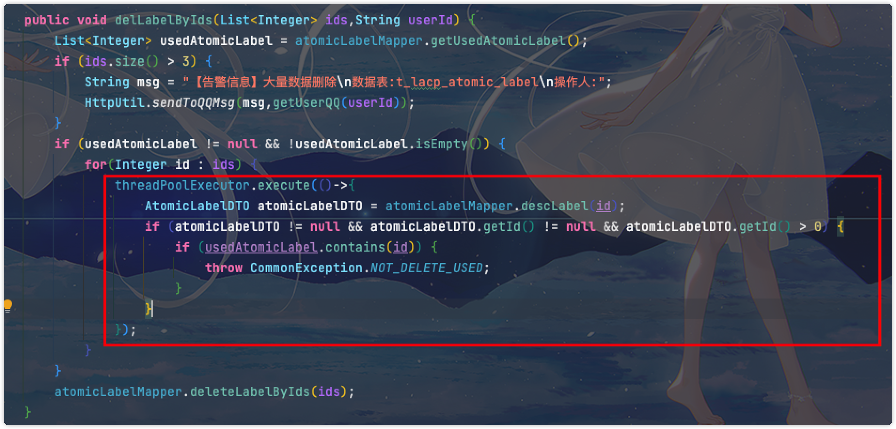

> 前提：**不关注异步方法是否成功。只能自行在方法中发送某个回调，或者告警**

为了防止OOM，所以使用了GitHub上的内存安全的阻塞队列

为什么安全可以去看这个文章：[MemorySafeLinkedBlockingQueue](https://juejin.cn/post/7105968458851942414#heading-0)

```java
package com.lacp.databasemanagement.util.lbq;


import java.util.concurrent.Executors;
import java.util.concurrent.ScheduledExecutorService;
import java.util.concurrent.TimeUnit;

public class MemoryLimitCalculator {

    private static volatile long maxAvailable;

    private static final ScheduledExecutorService SCHEDULER = Executors.newSingleThreadScheduledExecutor();

    static {
        refresh();
        SCHEDULER.scheduleWithFixedDelay(MemoryLimitCalculator::refresh, 50, 50, TimeUnit.MILLISECONDS);
        Runtime.getRuntime().addShutdownHook(new Thread(SCHEDULER::shutdown));
    }

    private static void refresh() {
        maxAvailable = Runtime.getRuntime().freeMemory();
    }

    /**
     * 获取当前JVM的最大可用内存.
     *
     * @return 最大可用内存
     */
    public static long maxAvailable() {
        return maxAvailable;
    }

    /**
     * 以当前JVM的最大可用内存占结果的百分比作为限制。
     *
     * @param percentage 百分比
     * @return 有效内存
     */
    public static long calculate(final float percentage) {
        if (percentage <= 0 || percentage > 1) {
            throw new IllegalArgumentException();
        }
        return (long) (maxAvailable() * percentage);
    }

    /**
     * 默认情况下，它占用当前 JVM 最大可用内存的 80%.
     *
     * @return 有效内存
     */
    public static long defaultLimit() {
        return (long) (maxAvailable() * 0.8);
    }
}
```

```java
package com.lacp.databasemanagement.util.lbq;

import java.util.Collection;
import java.util.concurrent.LinkedBlockingQueue;
import java.util.concurrent.TimeUnit;

public class MemorySafeLinkedBlockingQueue<E> extends LinkedBlockingQueue<E> {

    private static final long serialVersionUID = 8032578371739960142L;

    public static int THE_256_MB = 256 * 1024 * 1024;

    private int maxFreeMemory;

    public MemorySafeLinkedBlockingQueue() {
        this(THE_256_MB);
    }

    public MemorySafeLinkedBlockingQueue(final int maxFreeMemory) {
        super(Integer.MAX_VALUE);
        this.maxFreeMemory = maxFreeMemory;
    }

    public MemorySafeLinkedBlockingQueue(final Collection<? extends E> c,
                                         final int maxFreeMemory) {
        super(c);
        this.maxFreeMemory = maxFreeMemory;
    }

    /**
     * 设置最大可用内存.
     *
     * @param maxFreeMemory 最大可用内存
     */
    public void setMaxFreeMemory(final int maxFreeMemory) {
        this.maxFreeMemory = maxFreeMemory;
    }

    /**
     * 获得最大可用内存.
     *
     * @return 最大可用内存限制
     */
    public int getMaxFreeMemory() {
        return maxFreeMemory;
    }

    /**
     * 确定是否还有剩余的空闲内存.
     *
     * @return 如果有空闲内存则为true
     */
    public boolean hasRemainedMemory() {
        return MemoryLimitCalculator.maxAvailable() > maxFreeMemory;
    }

    @Override
    public void put(final E e) throws InterruptedException {
        if (hasRemainedMemory()) {
            super.put(e);
        }
    }

    @Override
    public boolean offer(final E e, final long timeout, final TimeUnit unit) throws InterruptedException {
        return hasRemainedMemory() && super.offer(e, timeout, unit);
    }

    @Override
    public boolean offer(final E e) {
        return hasRemainedMemory() && super.offer(e);
    }
}
```

# 端口

3306— mysql
6379—redis
9200—elastic
2181—zookeeper
80/443—http/https
9092—kafka

5601—kibana

8080~8089—前端
27310~27319—后端

# 问题发现

## Bug类

### 1. 发送qq消息监控出现重复发送历史消息的问题

> *待解决*
>
> **问题描述**：已经发送过的消息，出现不明原因的自动调用发送

**14:30 手动调用换行消息和13:42手动调用私人消息**


**20:40 和凌晨5:54出现重复发送现象**


> **问题解决**：初步判断是go-cqhttp的消息队列出现并发阻塞问题，导致同一个消息消费了两次

### 2. 使用httpclient请求get请求时参数包含 `>`号报错

> *已解决*
>
> 特殊字符诸如+?%#&=/等都会被当做转义字符处理，这样的话请求路径的参数就不对了
>
> **补充**：可以采用解码方法转化需要转化的字符[转化网站](https://www.w3schools.com/jsref/tryit.asp?filename=tryjsref_encodeuricomponent)，后续把这个方法做在网站中，制作一个广范围解码的模块（URI解码，URL解码，Unicode解码，utf8解码，ASCII解码等）
>
> 

**解决方案1**

去掉特殊报错的字符

**解决方案2**

使用转义字符

```te
空格 用%20代替
" 用%22代替
# 用%23代替
% 用%25代替
& 用%26代替
( 用%28代替
) 用%29代替
+ 用%2B代替
, 用%2C代替
/ 用%2F代替
: 用%3A代替
; 用%3B代替
< 用%3C代替
= 用%3D代替
> 用%3E代替
? 用%3F代替
@ 用%40代替
\ 用%5C代替
| 用%7C代替
```

### 3. 项目运行正常，Maven打包后出现找不到Mapper的错误

> **场景：** 项目运行一切正常，但是打包后的jar包运行，所有接口报错
>
> `invalid bound statement (not found)`
>
> **状态：***已解决*

```txt
如题，使用mybatis时，maven打包后出现invalid bound statement (not found)异常

原因一：**Mapper.xml文件放在了src/main/java目录下

原因二：未正确指定mybatis的mapper.xml文件路径

原因三：mybatis的xml文件配置有问题，如namespace等

原因四：如果**Mapper.xml是放在了src/main/resources目录下，需要注意所在的父文件夹名称不能有大写。
```

`<font color=#0000fd>`*感谢屈星波同学将mapper文件夹首字母大写，导致我线上一直报错* `</font>`

### 4. @Async注解引起的循环依赖问题

**复现**

```java
Exception in thread "main" org.springframework.beans.factory.BeanCurrentlyInCreationException: Error creating bean with name 'AsyncService': Bean with name 'AsyncService' has been injected into other beans [BService] in its raw version as part of a circular reference, but has eventually been wrapped. This means that said other beans do not use the final version of the bean. This is often the result of over-eager type matching - consider using 'getBeanNamesOfType' with the 'allowEagerInit' flag turned off, for example.
 at org.springframework.beans.factory.support.AbstractAutowireCapableBeanFactory.doCreateBean(AbstractAutowireCapableBeanFactory.java:602)
 at org.springframework.beans.factory.support.AbstractAutowireCapableBeanFactory.createBean(AbstractAutowireCapableBeanFactory.java:495)
 at org.springframework.beans.factory.support.AbstractBeanFactory.lambda$doGetBean$0(AbstractBeanFactory.java:317)
 at org.springframework.beans.factory.support.DefaultSingletonBeanRegistry.getSingleton(DefaultSingletonBeanRegistry.java:222)


```

> - 经过排查发现是由于**@Async注解产生的循环依赖问题**，去掉注解后正常运行。为什么三级缓存无法解决@Async带来的循环依赖问题
> - Spring虽然已经解决了循环依赖问题，但是也存在个例，比如AService的某个方法添加了 `@Async`注解，然后引用了BService，但是Bservice又引用了AService的方法，这个时候就会发生循环依赖问题，具体原因是因为 `@Async注解`是通过动态代理实现的，实现的方式又不同于 `@Transactional注解`又或者是 `自定义的AOP切面`,Spring的循环依赖是通过三级缓存来解决的，但是 `@Async注解`中的实现方式导致创建的Bean和早期暴露出去的Bean不是同一个对象，所以循环依赖就产生了。

但是肯定不能这样解决。该异步就得异步

1. 线程池实现异步
2. `@Lazy`注解加在循环依赖的字段上,如下解决：

```java
@Component
public class AService {
    @Resource
    @Lazy
    private BService bService;

    @Async
    public void save() {...}
}

@Component
public class BService {
    @Resource
    private AService aService;
}
```

### 5. SQL语句出现拼接了两遍表名的问题

> 状态：已解决
>
> **线上复现：**如下图，前端输入sql为：
>
> ```sql
> -- 正常情况
> select *
> from 
>  t_lacp_atomic_label
> where label_type = 1
> -- 失败情况
> select *
> from 
>  test.t_lacp_atomic_label
> where label_type = 1
> ```
>
> **初步判断：**由于已经精准指定表名的sql中会发生多拼接表名的情况
>
> **线上测试：**SQL语句如下
>
> ```sql
> select *
> from 
>  test.t_lacp_atomic_label a
>      inner join test.t_lacp_atomic_label b
>          on a.id = b.id
> where a.label_type = 1
> ```
>
> **测试结果：**运行正常。
>
> 那就不对劲了多表时表名拼接正常，单表出现问题，进行提测，展示如下图：

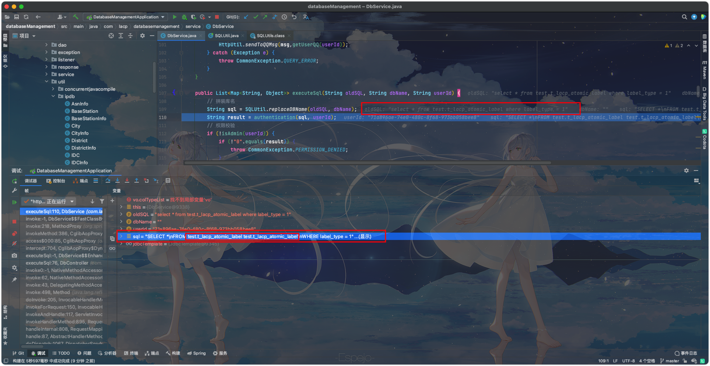

**问题：**初选了单表语句拼接了两次表名的情况

**代码定位：**

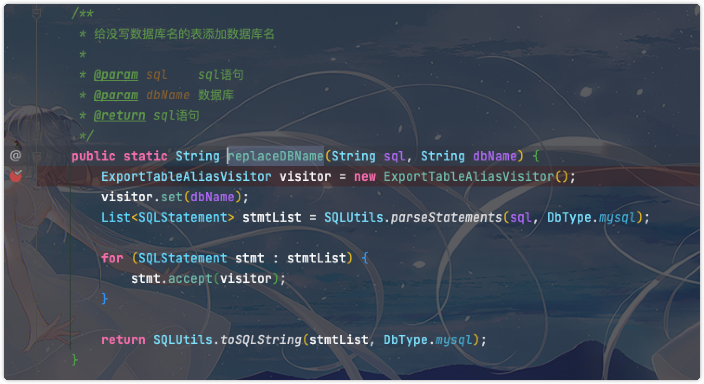

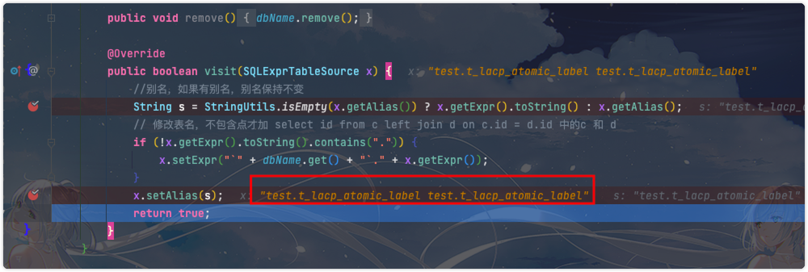

**问题排查：**应该是把表名当做别名又拼接了一边，但是传入数据似乎就包含别名

**修改别名添加规则:**将为空时的添加改写成字符串的空串

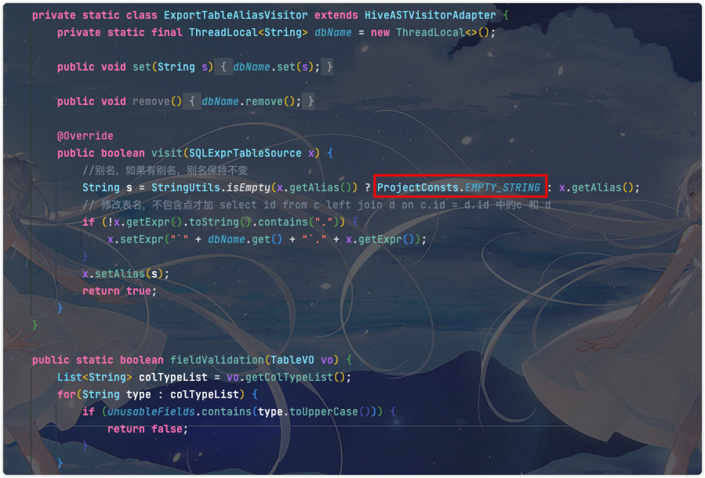

结果：解决✔️

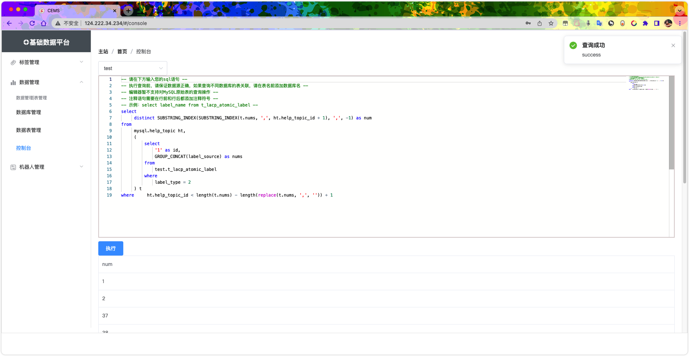

## 脚本问题（bash）

> 问题复现

本地Windows创建脚本并写好后copy进服务器，执行定时任务会出现以下提示：

```shell
 /bin/bash^M: bad interpreter: No such file or directory
```

> 原因剖析

- 操作系统的区别导致!

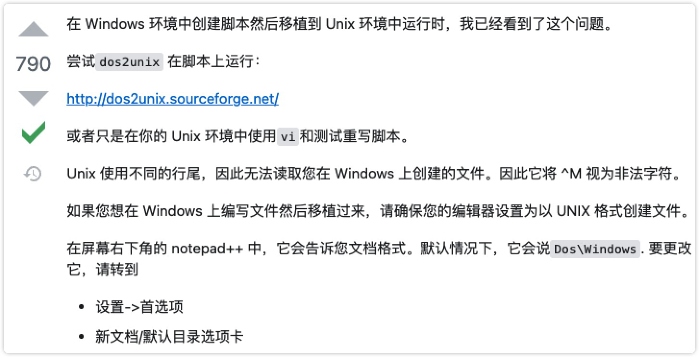
