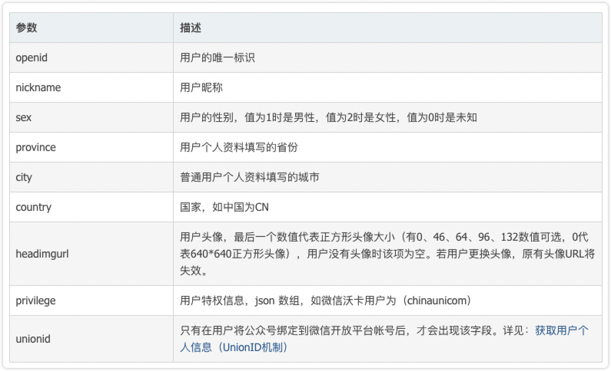
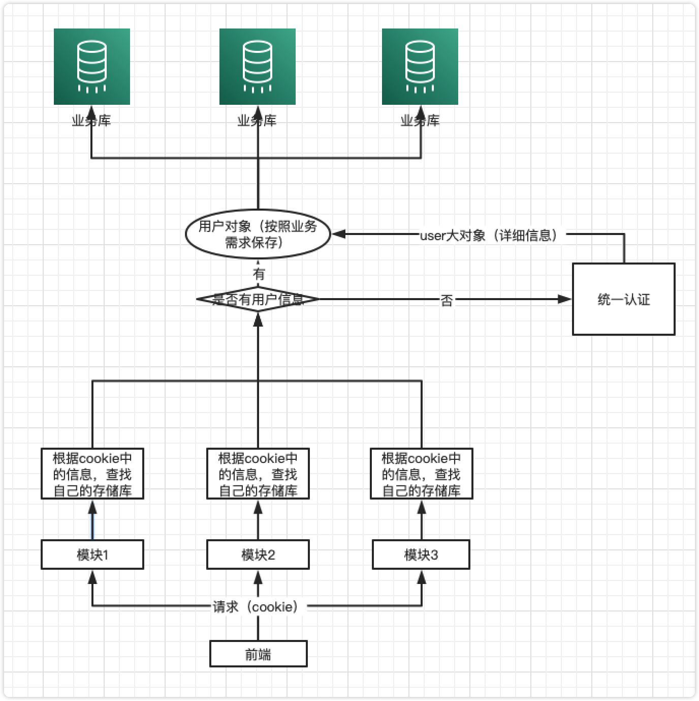
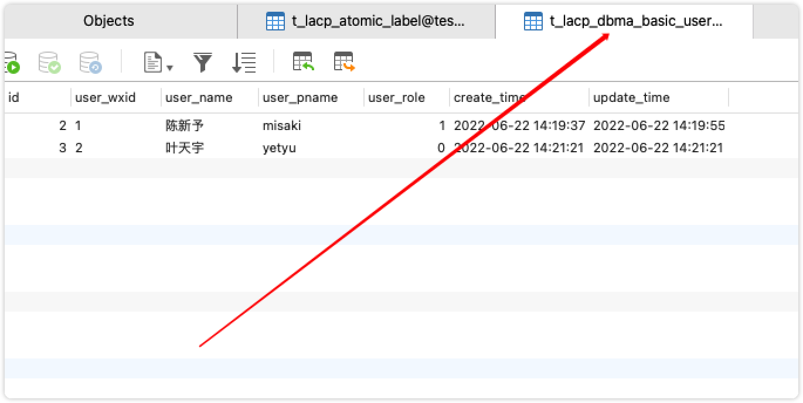
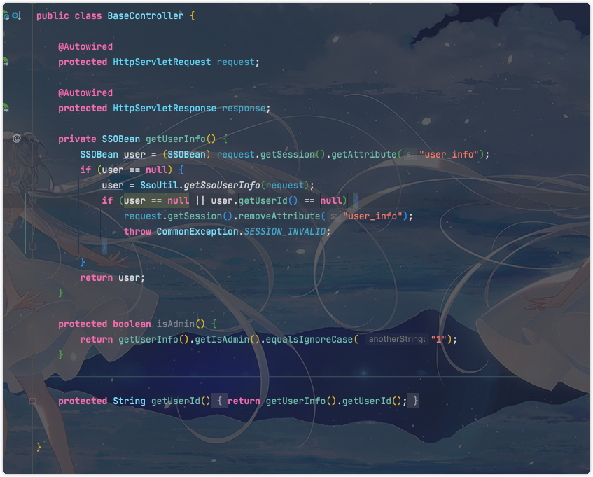
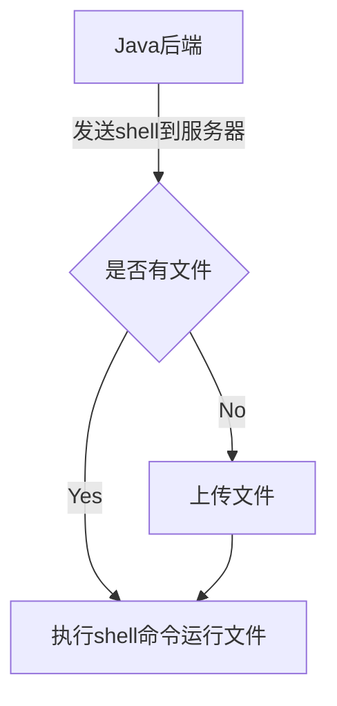
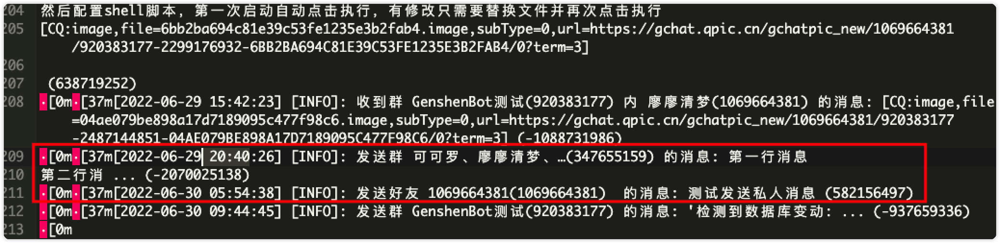
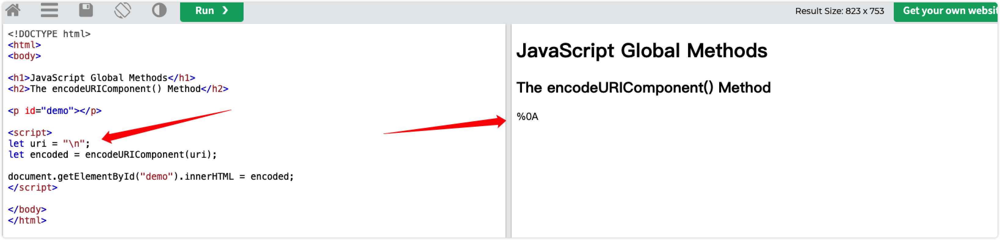

[toc]

# MySQL表设计

`学习交流平台（Learning and communication platform）`

> 所有建表操作需要使用平台操作：http://124.222.34.234/#/db
>
> 测试阶段建表尽量将表建立在test库中，需要稳定时在创建数据库-建表（后续会上线一键迁移数据功能）
>
> 不需要手动添加：id，create_time,update_time字段，上述字段会自动生成
>
> 建表时满足：
>
> - 库名-lacp_xxxx的规范(示例：sso模块库名为：lacp_sso)
> - 表名-t_lacp_xxxx_aaaa_bbbb_….（示例：sso模块的用户表：t_lacp_sso_basic_user）
> - 字段
>   - 尽量满足（表xx_ffff）(示例：sso模块用户表字段：user_name,user_role,user_age,user_state)
>   - 某些字段可以单独出现，自行判断，如：uv
>   - 见名知意（不允许出现拼音、缩写、不完整单词等**你能理解，其他开发无法理解**）
> - 不允许出现外键，主键使用自增ID，类型为Int、数据流可能大的表使用bigint
> - 禁止使用TEXT和BLOG类型

## 统一认证用户模块表设计

1. 用户登录表`t_lacp_sso_basic_user`


1. 用户信息表`t_lacp_sso_user_info`

为了方便后期扩展迭代，按照`微信的用户信息`设计表，至少保证字段数大于等于下列的需要用到的资料信息。



**尽量详细，所有数据都要有**


# 统一认证SSO逻辑

统一认证中心的接口需要提供user详细信息的json数据，根据id



统一认证不是模块中不包含登录逻辑，是`各自的模块按照需要保存一些统一用户信息到自己本地库`，这部分逻辑对用户不感知，但是开发上是感知的，比如数据模块，就按照需要取一部分我需要的用户信息，保存在模块业务库中，需要的时候直接使用，而不是不存在用户逻辑。以下是逻辑设置。



这张表也是存在的，命名规范 t_lacp_xxxx_basic_user    xxxx为项目模块简写。

### 监听过滤器

```java
@Component
public class LoginInterceptor implements HandlerInterceptor {

    @Override
    public boolean preHandle(HttpServletRequest request, HttpServletResponse response, Object handler) throws Exception {
        // TODO 获取用户信息
        SSOBean userInfo = (SSOBean) request.getSession().getAttribute("user_info");

        if (userInfo == null || userInfo.getUserId() == null) {
            SSOBean ssoUserInfo = SsoUtil.getSsoUserInfo(request);
            if (ssoUserInfo == null || ssoUserInfo.getUserId() == null) {
                throw CommonException.SESSION_INVALID;
            }
            request.getSession().setAttribute("user_info", ssoUserInfo);
        }
        return true;
    }
}
```

### SSOBean对象

- 按照自己的模块需求保存对象

```java
@Data
@NoArgsConstructor
@AllArgsConstructor
@Builder
@ApiModel("SSO用户模型")
@Accessors(chain = true)
public class SSOBean {

    @ApiModelProperty(value = "用户id")
    private String userId;

    @ApiModelProperty(value = "姓名")
    private String name;

    @ApiModelProperty(value = "昵称")
    private String pname;

    @ApiModelProperty(value = "微信ID")
    private String wxId;

    @ApiModelProperty(value = "是否管理员 1-是 0-不是")
    private String isAdmin;

}
```

### SSO认证工具类

- 模块中也需要自行编写userMapper，替换下面的逻辑
- TODO代码块中json数据模拟请求统一认证中心，统一中心编写好以后，替换逻辑

```java
@Component
@Log4j2
@RequiredArgsConstructor
public class SsoUtil {

    private final BasicUserMapper mapper;

    private static BasicUserMapper userMapper;

    @PostConstruct
    public void init() {
        userMapper = this.mapper;
    }

    public static SSOBean getSsoUserInfo(HttpServletRequest request) {
        final SSOBean user = new SSOBean();
        String uid = "";
        Cookie[] cookies = request.getCookies();
        if (cookies != null && cookies.length > 0) {
            for (Cookie cookie : cookies) {
                if ("sso_uid".equalsIgnoreCase(cookie.getName())) {
                    uid = cookie.getValue();
                }
            }
        }
        if (!"".equals(uid)) {
            BasicUserDTO basicUserDTO = userMapper.descUser(Integer.valueOf(uid));
            if (basicUserDTO == null) {
                // TODO 请求登录模块url获取用户信息, 下面模拟请求到的json数据
                String userJson = "{\n" +
                        "    \"id\": \"2\",\n" +
                        "    \"userName\": \"叶天宇\",\n" +
                        "    \"pname\": \"yetyu\" \n" +
                        "}";
                // 设置需要的信息
                BasicUserDTO basicUser = BasicUserDTO
                        .builder()
                        .userWxid(JsonUtil.getParamForJson(userJson, "id"))
                        .userName(JsonUtil.getParamForJson(userJson, "userName"))
                        .userPname(JsonUtil.getParamForJson(userJson, "pname"))
                        .build();
                try {
                    userMapper.saveUser(basicUser);
                    user.setUserId(String.valueOf(basicUser.getId()))
                        .setWxId(basicUser.getUserWxid())
                        .setName(basicUser.getUserName()).setPname(basicUser.getUserPname())
                        .setIsAdmin(String.valueOf(basicUser.getUserRole()));
                } catch (Exception e) {
                    // 处理多线程冲突
                    return new SSOBean();
                }
            } else {
                user.setUserId(String.valueOf(basicUserDTO.getId()))
                    .setWxId(basicUserDTO.getUserWxid())
                    .setName(basicUserDTO.getUserName()).setPname(basicUserDTO.getUserPname())
                    .setIsAdmin(String.valueOf(basicUserDTO.getUserRole()));
            }
            request.getSession().setAttribute("user_info", user);
            return user;
        }
        return user;
    }

}
```

### 其他

如果Controller或者Service中需要读取用户信息等可以这样设置

`需要被集成的类使用@Autowired`



# 方案

### 调度平台方案

> **起因：**宝塔的调度功能过于简单，不能实现复杂场景和自定义配置，所以，需要一个自己的调度系统进行**文件管理**和**任务调度**
>
> **方案：**
>
> [Java JSch 远程执行Shell命令](https://bbs.huaweicloud.com/blogs/298630)
>
> [cron表达式](https://help.aliyun.com/document_detail/64769.html)



### QQ机器人

> `go-cqhttp` [官方文档](https://docs.go-cqhttp.org/api/#%E5%9F%BA%E7%A1%80%E4%BC%A0%E8%BE%93)

cq服务器地址：http://124.222.34.234:5700/

### 微信机器人

> 图灵机器人+微信pc端
>
> `图灵机器人`[地址](http://www.tuling123.com/)
>
> `API文档`[接入微信](https://www.kancloud.cn/turing/www-tuling123-com/718229)

# 端口

3306— mysql
6379—redis
9200—elastic 
2181—zookeeper
80/443—http/https
9092—kafka

5601—kibana

8080~8089—前端
27310~27319—后端

# 问题发现

## Bug类

### 1. 发送qq消息监控出现重复发送历史消息的问题

> <font color=#dd0000>*待解决*</font>
>
> **问题描述**：已经发送过的消息，出现不明原因的自动调用发送

**14:30 手动调用换行消息和13:42手动调用私人消息**


**20:40 和凌晨5:54出现重复发送现象**



> **问题解决**：初步判断是go-cqhttp的消息队列出现并发阻塞问题，导致同一个消息消费了两次

### 2. 使用httpclient请求get请求时参数包含`>`号报错

> <font color=#0000fd>*已解决*</font>
>
> 特殊字符诸如+?%#&=/等都会被当做转义字符处理，这样的话请求路径的参数就不对了
>
> **补充**：可以采用解码方法转化需要转化的字符[转化网站](https://www.w3schools.com/jsref/tryit.asp?filename=tryjsref_encodeuricomponent)，后续把这个方法做在网站中，制作一个广范围解码的模块（URI解码，URL解码，Unicode解码，utf8解码，ASCII解码等）
>
> 

**解决方案1**

去掉特殊报错的字符

**解决方案2**

使用转义字符

```te
空格 用%20代替
" 用%22代替
# 用%23代替
% 用%25代替
& 用%26代替
( 用%28代替
) 用%29代替
+ 用%2B代替
, 用%2C代替
/ 用%2F代替
: 用%3A代替
; 用%3B代替
< 用%3C代替
= 用%3D代替
> 用%3E代替
? 用%3F代替
@ 用%40代替
\ 用%5C代替
| 用%7C代替
```


