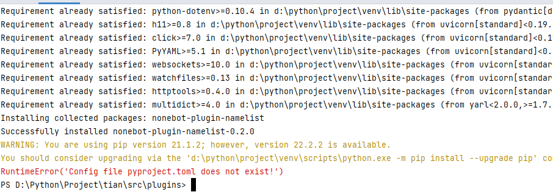
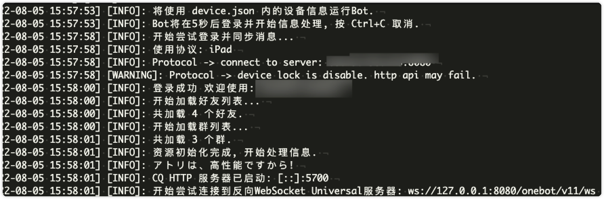
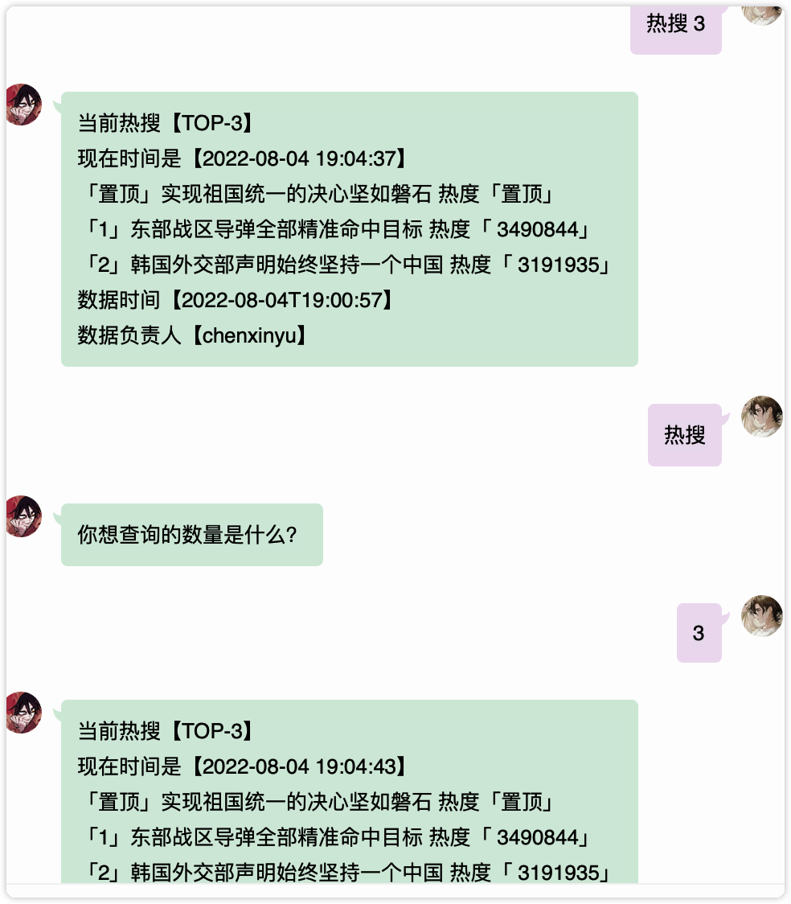
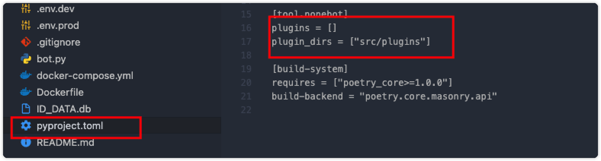
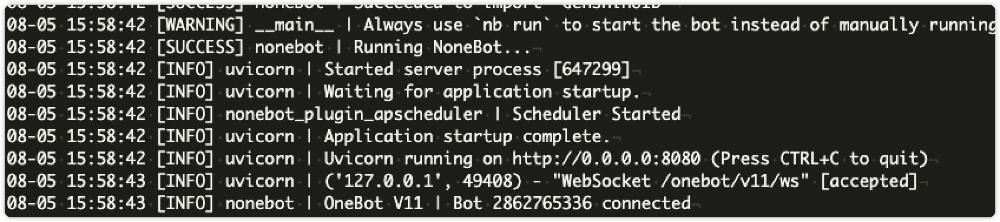

[toc]

## NoneBot2搭建QQ机器人

### 前置条件

- Python环境3.7.3+
- 会看文档
- 一台服务器（如果部署的话）
- 正常的大脑

### 准备

对于nonebot和go-cqhttp

> nb文档: [https://v2.nonebot.dev](https://v2.nonebot.dev/)
> gocq文档: https://docs.go-cqhttp.org/

### 开始

#### NoneBot 2

##### 安装脚手架

官网推荐使用脚手架nb_cli，这里选择脚手架, 安装脚手架时会自动安装nb

```shell
pip3 install nb-cli
```

**可能的问题**

> - pip版本不够
>
>   - 
>
>   ```shell
>   python3 -m pip install --upgrade pip
>   ```
>
> - 下载速度慢
>
>   - 使用其他源
>
>   ```shell
>   # 清华 https://pypi.tuna.tsinghua.edu.cn/simple/
>   # 中科大 https://pypi.mirrors.ustc.edu.cn/simple/
>   # 阿里云 https://mirrors.aliyun.com/pypi/simple/
>   # 豆瓣 http://pypi.douban.com/simple/
>   pip3 install `包名` -i https://pypi.tuna.tsinghua.edu.cn/simple/
>   ```
>
> - 缺少Microsoft Visual C++ 环境
>
>   - 百度
>
> - …其他
>
>   - 未遇到，自行百度

##### 安装适配器

```bash
pip install nonebot-adapter-onebot
```

#### 安装go-cqhttp

- 前往[ Release](https://github.com/Mrs4s/go-cqhttp)下载最新版，注意与你的操作系统匹配
- 上传到服务器（也可以本地）
- 解压`tar -zxvf 包名`

- 然后开始第一次运行cq

```bash
# 到cq文件夹下
cd cq
# 首次运行
./go-cqhttp
# 选择需要的服务器
# 这里主要使用反向websocket，也可以都选
1,2,3,4
```

- 此时会生成一个配置文件
- 修改`config.yml`

```yml
# go-cqhttp 默认配置文件

account: # 账号相关
  uin: 12345678 # QQ账号
  password: '123456' # 密码为空时使用扫码登录
  encrypt: false  # 是否开启密码加密
  status: 0      # 在线状态 请参考 https://docs.go-cqhttp.org/guide/config.html#在线状态
  relogin: # 重连设置
    delay: 3   # 首次重连延迟, 单位秒
    interval: 3   # 重连间隔
    max-times: 0  # 最大重连次数, 0为无限制

  # 是否使用服务器下发的新地址进行重连
  # 注意, 此设置可能导致在海外服务器上连接情况更差
  use-sso-address: true
  # 是否允许发送临时会话消息
  allow-temp-session: false

heartbeat:
  # 心跳频率, 单位秒
  # -1 为关闭心跳
  interval: 5

message:
  # 上报数据类型
  # 可选: string,array
  post-format: string
  # 是否忽略无效的CQ码, 如果为假将原样发送
  ignore-invalid-cqcode: false
  # 是否强制分片发送消息
  # 分片发送将会带来更快的速度
  # 但是兼容性会有些问题
  force-fragment: false
  # 是否将url分片发送
  fix-url: false
  # 下载图片等请求网络代理
  proxy-rewrite: ''
  # 是否上报自身消息
  report-self-message: false
  # 移除服务端的Reply附带的At
  remove-reply-at: false
  # 为Reply附加更多信息
  extra-reply-data: false
  # 跳过 Mime 扫描, 忽略错误数据
  skip-mime-scan: false

output:
  # 日志等级 trace,debug,info,warn,error
  log-level: warn
  # 日志时效 单位天. 超过这个时间之前的日志将会被自动删除. 设置为 0 表示永久保留.
  log-aging: 15
  # 是否在每次启动时强制创建全新的文件储存日志. 为 false 的情况下将会在上次启动时创建的日志文件续写
  log-force-new: true
  # 是否启用日志颜色
  log-colorful: true
  # 是否启用 DEBUG
  debug: false # 开启调试模式

# 默认中间件锚点
default-middlewares: &default
  # 访问密钥, 强烈推荐在公网的服务器设置
  access-token: ''
  # 事件过滤器文件目录
  filter: ''
  # API限速设置
  # 该设置为全局生效
  # 原 cqhttp 虽然启用了 rate_limit 后缀, 但是基本没插件适配
  # 目前该限速设置为令牌桶算法, 请参考:
  # https://baike.baidu.com/item/%E4%BB%A4%E7%89%8C%E6%A1%B6%E7%AE%97%E6%B3%95/6597000?fr=aladdin
  rate-limit:
    enabled: false # 是否启用限速
    frequency: 1  # 令牌回复频率, 单位秒
    bucket: 1     # 令牌桶大小

database: # 数据库相关设置
  leveldb:
    # 是否启用内置leveldb数据库
    # 启用将会增加10-20MB的内存占用和一定的磁盘空间
    # 关闭将无法使用 撤回 回复 get_msg 等上下文相关功能
    enable: true

  # 媒体文件缓存， 删除此项则使用缓存文件(旧版行为)
  cache:
    image: data/image.db
    video: data/video.db

# 连接服务列表
servers:
  # 添加方式，同一连接方式可添加多个，具体配置说明请查看文档
  #- http: # http 通信
  #- ws:   # 正向 Websocket
  #- ws-reverse: # 反向 Websocket
  #- pprof: #性能分析服务器

  - http: # HTTP 通信设置
      address: 0.0.0.0:5700 # HTTP监听地址
      timeout: 5      # 反向 HTTP 超时时间, 单位秒，<5 时将被忽略
      long-polling:   # 长轮询拓展
        enabled: false       # 是否开启
        max-queue-size: 2000 # 消息队列大小，0 表示不限制队列大小，谨慎使用
      middlewares:
        <<: *default # 引用默认中间件
      post:           # 反向HTTP POST地址列表
      #- url: ''                # 地址
      #  secret: ''             # 密钥
      #  max-retries: 3         # 最大重试，0 时禁用
      #  retries-interval: 1500 # 重试时间，单位毫秒，0 时立即
      #- url: http://127.0.0.1:5701/ # 地址
      #  secret: ''                  # 密钥
      #  max-retries: 10             # 最大重试，0 时禁用
      #  retries-interval: 1000      # 重试时间，单位毫秒，0 时立即
  # 反向WS设置
  - ws-reverse:
      # 反向WS Universal 地址
      # 注意 设置了此项地址后下面两项将会被忽略
      universal: ws://127.0.0.1:8080/onebot/v11/ws
      # # 反向WS API 地址
      # api: ws://your_websocket_api.server
      # # 反向WS Event 地址
      # event: ws://your_websocket_event.server
      # 重连间隔 单位毫秒
      reconnect-interval: 3000
      middlewares:
        <<: *default # 引用默认中间件

```

- 主要修改的是反向代理地址`universal: ws://127.0.0.1:8080/onebot/v11/ws`
- 运行cq

```bash
./go-cqhttp
```



**出现上述情况说明已经登录成功了**

**可能的问题**

> 1. 登录不上
>    - 腾讯本身不允许其他机器人协议和插件运行，所以需要关闭安全登录验证，但是账号仍有可能被风控，所以建议小号登录。
>    - 本地连接同一个局域网，在本地登录，然后将session文件复制到服务器。
> 2. ….

#### 创建机器人项目

##### 脚手架新建项目

```bash
nb create
# 如果没有nb说明配的不太对，也可以用一下命令
python3 -m nb_cli create
```

此时按照如下步骤创建项目

- 输入`项目名称` 我这里输入了ysbot
- 使用 `↓` 选择`src`文件夹
- 选择一款预置插件，按下「空格」选择echo，回车
- 按下「空格」选择`noebot v11`回车
  (很多人这里不注意空格)

##### 启动项目

那么现在在robot下打开终端,输入以下命令运行nonebot2:

```bash
nb run
# 或直接启动bot.py
python3 bot.py
```

##### 验证运行情况


#### 添加插件

这里不自己开发插件了，当然也可以走自己的一些API比如我这种微博热搜的。



##### 安装插件

这里选择原神的一个插件示范

- 克隆仓库

```bash
git clone -b nonebot2-beta1 git@github.com:KimigaiiWuyi/GenshinUID.git
```

- 安装依赖

```bash
# cd 到插件目录下
cd src/plgins/GenshinUID
# 根据项目的requirements下载
pip3 install -r requirements.txt
# 过慢可以换源
pip3 install -r requirements.txt -i https://pypi.tuna.tsinghua.edu.cn/simple/
```

- 配置插件地址



- 启动机器人

```bash
python3 bot.py
```



以下信息说明链接go-cqhttp成功

### 部署

#### 部署前准备

在生产环境中，为确保机器人能够正常运行，你需要固定你的依赖库版本。下面提供了几种常见的文件格式与生成方式：

- `poetry.lock`

  [poetry](https://python-poetry.org/) 依赖管理工具使用的 lock 文件，通常会在安装依赖时自动生成，或者使用 `poetry lock` 来生成。

- `pdm.lock`

  [pdm](https://pdm.fming.dev/) 依赖管理工具使用的 lock 文件，通常会在安装依赖时自动生成，或者使用 `pdm lock` 来生成。

- `Pipfile.lock`

  [Pipenv](https://pipenv.pypa.io/en/latest/) 依赖管理工具使用的 lock 文件，通常会在安装依赖时自动生成，或者使用 `pipenv lock` 来生成。

- `requirements.txt`

  如果你未使用任何依赖管理工具，你可以使用 `pip freeze` 来生成这个文件。

#### 使用 Docker 部署（推荐)

请自行参考 [Docker 官方文档](https://docs.docker.com/engine/install/) 安装 Docker。

在生产环境安装 [docker-compose](https://docs.docker.com/compose/) 工具以便部署机器人。

#### 编译镜像与部署配置

在项目目录下添加以下两个文件（以 poetry 和 FastAPI 驱动器为例）：

`Dockerfile`

```dockerfile
FROM python:3.9 as requirements-stage

WORKDIR /tmp

COPY ./pyproject.toml ./poetry.lock* /tmp/

RUN curl -sSL https://install.python-poetry.org -o install-poetry.py

RUN python install-poetry.py --yes

ENV PATH="${PATH}:/root/.local/bin"

RUN poetry export -f requirements.txt --output requirements.txt --without-hashes

FROM tiangolo/uvicorn-gunicorn-fastapi:python3.9

WORKDIR /app

COPY --from=requirements-stage /tmp/requirements.txt /app/requirements.txt

RUN pip install --no-cache-dir --upgrade -r requirements.txt

RUN rm requirements.txt

COPY ./ /app/
```

```yaml
version: "3"
services:
  nonebot:
    build: .
    ports:
      - "8080:8080" # 映射端口到宿主机 宿主机端口:容器端口
    env_file:
      - ".env.prod" # fastapi 使用的环境变量文件
    environment:
      - ENVIRONMENT=prod
      - APP_MODULE=bot:app
      - MAX_WORKERS=1
    network_mode: bridge
```

配置完成后即可使用 `docker-compose up -d` 命令来启动机器人并在后台运行。


