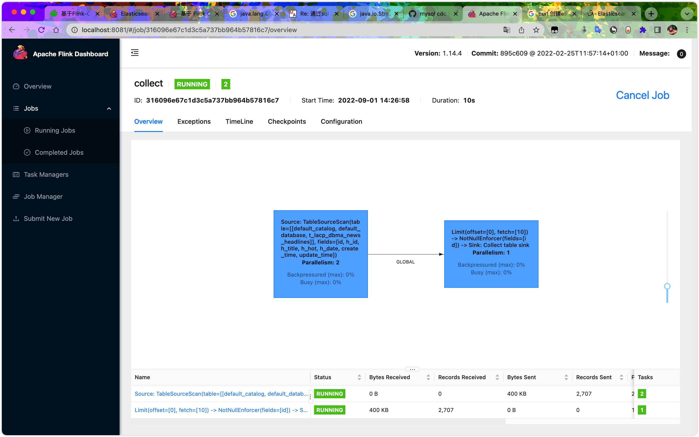
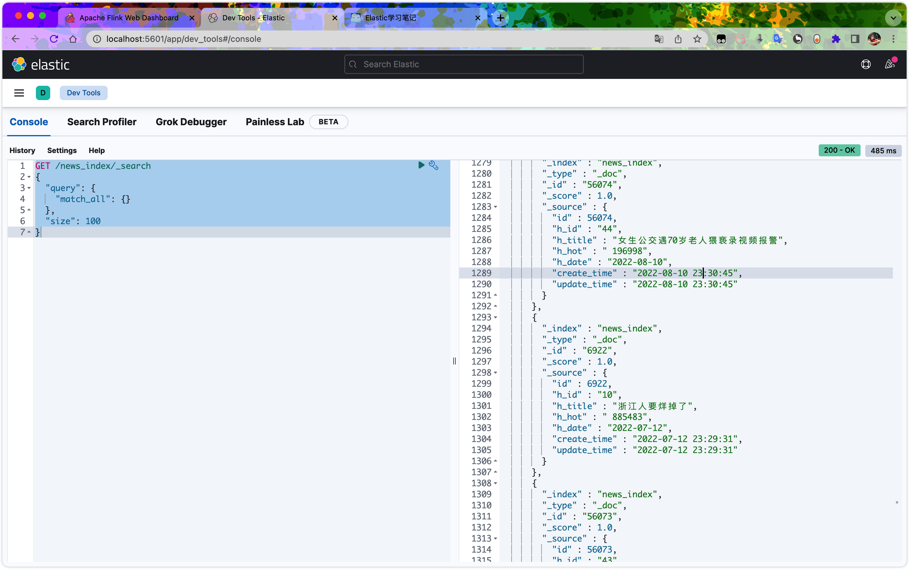
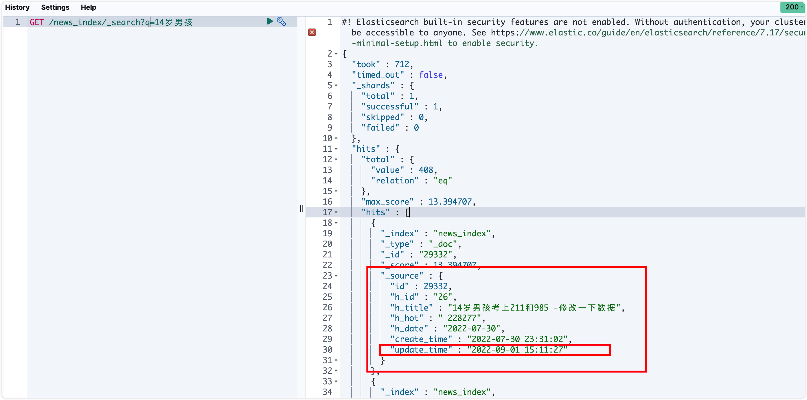

[toc]

# 问题记录

## 2022-09-01 Flink-sql-connect-mysql-CDC 报错

```sql
Flink SQL> CREATE TABLE t_lacp_dbma_news_headlines (
>    `id` BIGINT,
>    `h_id` STRING,
>    `h_title` STRING,
>    `h_hot` STRING,
>    `h_date` STRING,
>    `create_time` TIMESTAMP,
>    `update_time` TIMESTAMP,
>    PRIMARY KEY (`id`) NOT ENFORCED
> ) WITH (
>    'connector' = 'mysql-cdc',
>    'hostname' = '125.124.239.163',
>    'port' = '3306',
>    'username' = '********',
>    'password' = '********',
>    'database-name' = 'db_lacp_dbma',
>    'table-name' = 't_lacp_dbma_news_headlines'
> );
[INFO] Execute statement succeed.

Flink SQL> select * from default_catalog.default_database.t_lacp_dbma_news_headlines limit 10;
[ERROR] Could not execute SQL statement. Reason:
java.io.StreamCorruptedException: unexpected block data
```

**报错如下**：

```txt
[ERROR] Could not execute SQL statement. Reason:
java.io.StreamCorruptedException: unexpected block data
```

**资料查找解决**

> Github: 类加载顺序问题，flink默认是child-first，在flink的flink-conf.yaml文件中添加`classloader.resolve-order: parent-first` 改成parent-first，重启集群即可。



**任务正常同步到ES**

```sql
-- 开启checkpoint，3秒一次
SET execution.checkpointing.interval = 3s;

-- Flink MySQL CDC 
CREATE TABLE t_lacp_dbma_news_headlines (
   `id` BIGINT,
   `h_id` STRING,
   `h_title` STRING,
   `h_hot` STRING,
   `h_date` STRING,
   `create_time` TIMESTAMP,
   `update_time` TIMESTAMP,
   PRIMARY KEY (`id`) NOT ENFORCED
) WITH (
   'connector' = 'mysql-cdc',
   'hostname' = '125.124.239.163',
   'port' = '3306',
   'username' = '********',
   'password' = '********',
   'database-name' = 'db_lacp_dbma',
   'table-name' = 't_lacp_dbma_news_headlines'
);

-- Flink ES
CREATE TABLE news_index (
   `id` BIGINT,
   `h_id` STRING,
   `h_title` STRING,
   `h_hot` STRING,
   `h_date` STRING,
   `create_time` TIMESTAMP,
   `update_time` TIMESTAMP,
   PRIMARY KEY (`id`) NOT ENFORCED
) WITH (
   'connector' = 'elasticsearch-7',
   'hosts' = 'http://localhost:9200',
   'index' = 'news_index'
);

-- sink
INSERT INTO news_index
select * from t_lacp_dbma_news_headlines;
```



**向mysql中插入一条数据**




## Docker快速搭建hadoop、hive、redis、es、hbase等

- build_all.sh 可以构建需要用到的所有镜像, 运行的时候, 根据自己的需要选择需要构建的镜像,最后会创建 3 个容器 hadoop162, hadoop163, hadoop164
- 容器构建后, 直接可用的环境包括
  1. hadoop集群
  2. zookeeper集群
  3. kafka集群
  4. hbase集群
  5. es集群
  6. redis
  7. hive
  8. spark
  9. Phoenix

#### 容器启动说明

- contains.sh start 启动集群容器
- 启动的时候会自动根据当前宿主机的 ip 进行配置, 3 个容器的 ip 分别是 xxx.162, xxx.163, xxx.164, xxx 是根据当前宿主的 ip 自动获取的
- 内置了root和atguigu用户, 密码均为aaaaaa
- 容器第一次启动已经完成的事情
  1. 虚拟机与容器之间免密登录
  2. 容器与容器之间免密登录
  3. 格式化hdfs
  4. 给mysql的root用户设置密码为aaaaaa

#### 特别说明

- 容器一旦创建成功之后, 以后使用的时候启动即可
- 启动 hadoop: hadoop.sh start
- 启动 kafka: kafka.sh start
- 启动 zookeeper: zk start
- 启动 hbase: start-hbase.sh

